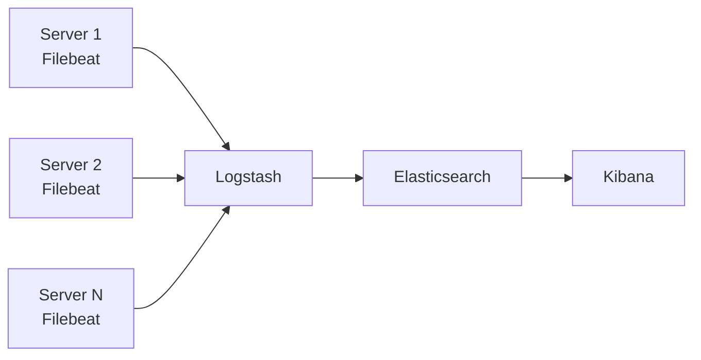

# How to Use Ansible to Set Up a Centralized Logging Stack

Author: [nawazdhandala](https://www.github.com/nawazdhandala)

Tags: Ansible, ELK, Logging, Elasticsearch, Kibana

Description: Deploy a complete ELK centralized logging stack with Elasticsearch, Logstash, Kibana, and Filebeat using Ansible for log aggregation and analysis.

---

When your infrastructure grows beyond a handful of servers, grepping through individual log files stops being a viable troubleshooting strategy. You need a centralized logging stack that collects, indexes, and lets you search logs from all your systems in one place. The ELK stack (Elasticsearch, Logstash, Kibana) is the most popular open-source solution for this, and Ansible is the right tool to deploy and manage it consistently.

This guide covers deploying a complete centralized logging stack with Ansible. We will set up Elasticsearch for storage and search, Logstash for log processing, Kibana for visualization, and Filebeat on all servers as the log shipper.

## Architecture Overview



## Role Defaults

```yaml
# roles/elk/defaults/main.yml - ELK stack configuration
elk_version: "8.11"
elasticsearch_heap_size: "1g"
elasticsearch_cluster_name: logging
elasticsearch_data_dir: /var/lib/elasticsearch
elasticsearch_http_port: 9200
elasticsearch_transport_port: 9300

logstash_heap_size: "512m"
logstash_beats_port: 5044

kibana_port: 5601
kibana_server_name: kibana.example.internal

# Retention policy
elasticsearch_index_retention_days: 30
```

## Elasticsearch Tasks

```yaml
# roles/elk/tasks/elasticsearch.yml - Deploy Elasticsearch
---
- name: Add Elastic GPG key
  apt_key:
    url: https://artifacts.elastic.co/GPG-KEY-elasticsearch
    state: present

- name: Add Elastic repository
  apt_repository:
    repo: "deb https://artifacts.elastic.co/packages/{{ elk_version }}/apt stable main"
    state: present
    filename: elastic

- name: Install Elasticsearch
  apt:
    name: elasticsearch
    state: present
    update_cache: yes

- name: Configure Elasticsearch
  template:
    src: elasticsearch.yml.j2
    dest: /etc/elasticsearch/elasticsearch.yml
    owner: root
    group: elasticsearch
    mode: '0660'
  notify: restart elasticsearch

- name: Configure Elasticsearch JVM heap size
  template:
    src: jvm.options.j2
    dest: /etc/elasticsearch/jvm.options.d/heap.options
    owner: root
    group: elasticsearch
    mode: '0660'
  notify: restart elasticsearch

- name: Ensure Elasticsearch data directory exists
  file:
    path: "{{ elasticsearch_data_dir }}"
    state: directory
    owner: elasticsearch
    group: elasticsearch
    mode: '0755'

- name: Start and enable Elasticsearch
  systemd:
    name: elasticsearch
    state: started
    enabled: yes
    daemon_reload: yes

- name: Wait for Elasticsearch to be ready
  uri:
    url: "http://localhost:{{ elasticsearch_http_port }}/_cluster/health"
    method: GET
    status_code: 200
  register: es_health
  until: es_health.status == 200
  retries: 30
  delay: 10
```

## Elasticsearch Configuration Template

```yaml
# roles/elk/templates/elasticsearch.yml.j2
cluster.name: {{ elasticsearch_cluster_name }}
node.name: {{ ansible_hostname }}
path.data: {{ elasticsearch_data_dir }}
path.logs: /var/log/elasticsearch
network.host: 0.0.0.0
http.port: {{ elasticsearch_http_port }}
transport.port: {{ elasticsearch_transport_port }}
discovery.type: single-node
xpack.security.enabled: false
xpack.ml.enabled: false

# Index lifecycle management
action.auto_create_index: true
```

## Logstash Tasks

```yaml
# roles/elk/tasks/logstash.yml - Deploy Logstash
---
- name: Install Logstash
  apt:
    name: logstash
    state: present

- name: Configure Logstash pipeline
  template:
    src: logstash-pipeline.conf.j2
    dest: /etc/logstash/conf.d/01-beats-input.conf
    mode: '0644'
  notify: restart logstash

- name: Configure Logstash JVM heap
  copy:
    content: |
      -Xms{{ logstash_heap_size }}
      -Xmx{{ logstash_heap_size }}
    dest: /etc/logstash/jvm.options.d/heap.options
    mode: '0644'
  notify: restart logstash

- name: Start and enable Logstash
  systemd:
    name: logstash
    state: started
    enabled: yes
```

## Logstash Pipeline Template

```
# roles/elk/templates/logstash-pipeline.conf.j2 - Log processing pipeline
input {
  beats {
    port => {{ logstash_beats_port }}
  }
}

filter {
  # Parse syslog messages
  if [fields][log_type] == "syslog" {
    grok {
      match => { "message" => "%{SYSLOGTIMESTAMP:syslog_timestamp} %{SYSLOGHOST:syslog_hostname} %{DATA:syslog_program}(?:\[%{POSINT:syslog_pid}\])?: %{GREEDYDATA:syslog_message}" }
    }
    date {
      match => [ "syslog_timestamp", "MMM  d HH:mm:ss", "MMM dd HH:mm:ss" ]
    }
  }

  # Parse nginx access logs
  if [fields][log_type] == "nginx_access" {
    grok {
      match => { "message" => '%{IPORHOST:remote_addr} - %{DATA:remote_user} \[%{HTTPDATE:time_local}\] "%{WORD:method} %{DATA:request} HTTP/%{NUMBER:http_version}" %{NUMBER:status} %{NUMBER:body_bytes_sent} "%{DATA:http_referer}" "%{DATA:http_user_agent}"' }
    }
    mutate {
      convert => { "status" => "integer" }
      convert => { "body_bytes_sent" => "integer" }
    }
  }

  # Add GeoIP data for remote addresses
  if [remote_addr] {
    geoip {
      source => "remote_addr"
    }
  }
}

output {
  elasticsearch {
    hosts => ["http://localhost:{{ elasticsearch_http_port }}"]
    index => "logs-%{[fields][log_type]}-%{+YYYY.MM.dd}"
  }
}
```

## Kibana Tasks

```yaml
# roles/elk/tasks/kibana.yml - Deploy Kibana
---
- name: Install Kibana
  apt:
    name: kibana
    state: present

- name: Configure Kibana
  template:
    src: kibana.yml.j2
    dest: /etc/kibana/kibana.yml
    owner: root
    group: kibana
    mode: '0660'
  notify: restart kibana

- name: Start and enable Kibana
  systemd:
    name: kibana
    state: started
    enabled: yes

- name: Wait for Kibana to be ready
  uri:
    url: "http://localhost:{{ kibana_port }}/api/status"
    status_code: 200
  register: kibana_status
  until: kibana_status.status == 200
  retries: 30
  delay: 10
```

## Filebeat Client Tasks

```yaml
# roles/filebeat/tasks/main.yml - Deploy Filebeat on all servers
---
- name: Add Elastic repository
  apt_repository:
    repo: "deb https://artifacts.elastic.co/packages/{{ elk_version }}/apt stable main"
    state: present
    filename: elastic

- name: Install Filebeat
  apt:
    name: filebeat
    state: present
    update_cache: yes

- name: Configure Filebeat
  template:
    src: filebeat.yml.j2
    dest: /etc/filebeat/filebeat.yml
    owner: root
    group: root
    mode: '0600'
  notify: restart filebeat

- name: Enable Filebeat system module
  command: filebeat modules enable system
  args:
    creates: /etc/filebeat/modules.d/system.yml

- name: Start and enable Filebeat
  systemd:
    name: filebeat
    state: started
    enabled: yes
```

## Filebeat Configuration Template

```yaml
# roles/filebeat/templates/filebeat.yml.j2 - Filebeat shipper config
filebeat.inputs:
  - type: log
    enabled: true
    paths:
      - /var/log/syslog
      - /var/log/auth.log
    fields:
      log_type: syslog

  - type: log
    enabled: true
    paths:
      - /var/log/nginx/access.log
    fields:
      log_type: nginx_access

  - type: log
    enabled: true
    paths:
      - /var/log/nginx/error.log
    fields:
      log_type: nginx_error

output.logstash:
  hosts: ["{{ logstash_server }}:{{ logstash_beats_port }}"]

processors:
  - add_host_metadata: ~
  - add_cloud_metadata: ~
```

## Handlers

```yaml
# roles/elk/handlers/main.yml
---
- name: restart elasticsearch
  systemd:
    name: elasticsearch
    state: restarted

- name: restart logstash
  systemd:
    name: logstash
    state: restarted

- name: restart kibana
  systemd:
    name: kibana
    state: restarted

- name: restart filebeat
  systemd:
    name: filebeat
    state: restarted
```

## Index Lifecycle Management

```yaml
# Task to configure automatic index cleanup
- name: Create ILM policy for log retention
  uri:
    url: "http://localhost:{{ elasticsearch_http_port }}/_ilm/policy/logs-retention"
    method: PUT
    body_format: json
    body:
      policy:
        phases:
          hot:
            actions:
              rollover:
                max_size: "10gb"
                max_age: "1d"
          delete:
            min_age: "{{ elasticsearch_index_retention_days }}d"
            actions:
              delete: {}
    status_code: [200, 201]
```

## Running the Playbook

```bash
# Deploy the complete logging stack
ansible-playbook -i inventory/hosts.ini playbook.yml
```

## Summary

This Ansible-managed ELK stack gives you a production-ready centralized logging solution. Elasticsearch stores and indexes the logs, Logstash processes and enriches them, Kibana provides visualization and search, and Filebeat ships logs from every server in your fleet. The entire stack is defined in code, meaning you can replicate it across environments, roll back configuration changes, and scale individual components as your log volume grows.
