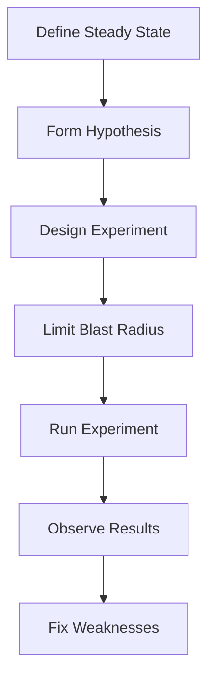

# How to Use Ansible for Chaos Engineering Experiments

Author: [nawazdhandala](https://www.github.com/nawazdhandala)

Tags: Ansible, Chaos Engineering, Reliability, DevOps

Description: Design and execute chaos engineering experiments with Ansible to test your system resilience by injecting failures in a controlled and repeatable way.

---

Chaos engineering is about deliberately introducing failures into your systems to discover weaknesses before they cause real outages. Ansible is a natural fit for this because it can reach any server in your infrastructure and execute precise failure injection scenarios. Unlike dedicated chaos tools, Ansible gives you full control over what breaks, where, and for how long.

This post covers how to build chaos engineering experiments as Ansible playbooks.

## Chaos Engineering Principles

Before injecting failures, establish some ground rules:



Always start with a hypothesis. "If we kill one web server, the load balancer should route traffic to the remaining servers with less than 500ms impact on response time."

## Experiment: Kill a Service Process

The simplest chaos experiment is killing a service process:

```yaml
# chaos/kill-service.yml
# Chaos experiment: Kill a service and verify recovery
---
- name: "CHAOS: Kill service process"
  hosts: "{{ target_host }}"
  become: true
  vars:
    service_name: "{{ target_service }}"
    observation_time: 60

  tasks:
    - name: Record steady state metrics
      ansible.builtin.uri:
        url: "http://{{ monitoring_endpoint }}/api/v1/query"
        method: POST
        body_format: form-urlencoded
        body:
          query: "rate(http_requests_total{instance='{{ inventory_hostname }}'}[5m])"
      register: steady_state
      delegate_to: localhost

    - name: Display pre-chaos state
      ansible.builtin.debug:
        msg: "Steady state request rate: {{ steady_state.json.data.result[0].value[1] | default('N/A') }}"

    - name: Kill the service process
      ansible.builtin.command:
        cmd: "kill -9 $(pidof {{ service_name }})"
      changed_when: true

    - name: Wait for observation period
      ansible.builtin.pause:
        seconds: "{{ observation_time }}"
        prompt: "Observing system behavior for {{ observation_time }} seconds..."

    - name: Check if service auto-recovered
      ansible.builtin.systemd:
        name: "{{ service_name }}"
      register: service_status

    - name: Record post-chaos metrics
      ansible.builtin.uri:
        url: "http://{{ monitoring_endpoint }}/api/v1/query"
        method: POST
        body_format: form-urlencoded
        body:
          query: "rate(http_requests_total{instance='{{ inventory_hostname }}'}[5m])"
      register: post_chaos
      delegate_to: localhost

    - name: Evaluate hypothesis
      ansible.builtin.assert:
        that:
          - service_status.status.ActiveState == 'active'
        fail_msg: "FINDING: Service {{ service_name }} did not auto-recover after process kill"
        success_msg: "Service recovered automatically as expected"

    - name: Force recovery if needed
      ansible.builtin.systemd:
        name: "{{ service_name }}"
        state: started
      when: service_status.status.ActiveState != 'active'
```

## Experiment: Network Latency Injection

Simulate network problems between services:

```yaml
# chaos/network-latency.yml
# Chaos experiment: Add network latency to test timeout handling
---
- name: "CHAOS: Inject network latency"
  hosts: "{{ target_host }}"
  become: true
  vars:
    latency_ms: 500
    jitter_ms: 100
    duration_seconds: 120
    target_port: 5432

  tasks:
    - name: Install traffic control dependencies
      ansible.builtin.apt:
        name: iproute2
        state: present

    - name: Record baseline latency
      ansible.builtin.command:
        cmd: "ping -c 5 {{ db_host }}"
      register: baseline_ping
      changed_when: false

    - name: Inject latency on outgoing traffic to database port
      ansible.builtin.command:
        cmd: >
          tc qdisc add dev {{ ansible_default_ipv4.interface }} root netem
          delay {{ latency_ms }}ms {{ jitter_ms }}ms distribution normal
      changed_when: true

    - name: "Wait for experiment duration ({{ duration_seconds }}s)"
      ansible.builtin.pause:
        seconds: "{{ duration_seconds }}"
        prompt: "Network latency injected. Monitoring application behavior..."

    - name: Check application health during chaos
      ansible.builtin.uri:
        url: "http://localhost:{{ app_port }}/health"
        status_code: [200, 503]
        timeout: 10
      register: health_during_chaos

    - name: Remove latency injection
      ansible.builtin.command:
        cmd: "tc qdisc del dev {{ ansible_default_ipv4.interface }} root netem"
      changed_when: true

    - name: Verify latency is restored
      ansible.builtin.command:
        cmd: "ping -c 5 {{ db_host }}"
      register: restored_ping
      changed_when: false

    - name: Report results
      ansible.builtin.debug:
        msg: |
          Experiment: Network latency injection
          Injected latency: {{ latency_ms }}ms +/- {{ jitter_ms }}ms
          Duration: {{ duration_seconds }}s
          App health during chaos: {{ health_during_chaos.status }}
          Baseline ping: {{ baseline_ping.stdout_lines[-1] }}
          Restored ping: {{ restored_ping.stdout_lines[-1] }}
```

## Experiment: Disk I/O Stress

Test how your application handles slow disk I/O:

```yaml
# chaos/disk-stress.yml
# Chaos experiment: Stress disk I/O
---
- name: "CHAOS: Disk I/O stress"
  hosts: "{{ target_host }}"
  become: true
  vars:
    stress_duration: 60
    io_workers: 4

  tasks:
    - name: Install stress-ng
      ansible.builtin.apt:
        name: stress-ng
        state: present

    - name: Record baseline disk performance
      ansible.builtin.command:
        cmd: "dd if=/dev/zero of=/tmp/chaos_test bs=1M count=100 oflag=direct"
      register: baseline_disk
      changed_when: false

    - name: Start disk I/O stress
      ansible.builtin.command:
        cmd: "stress-ng --io {{ io_workers }} --hdd {{ io_workers }} --timeout {{ stress_duration }}s --metrics-brief"
      async: "{{ stress_duration + 30 }}"
      poll: 0
      register: stress_job

    - name: Monitor application during stress
      ansible.builtin.uri:
        url: "http://localhost:{{ app_port }}/health"
        timeout: 10
      register: health_check
      retries: "{{ (stress_duration / 10) | int }}"
      delay: 10
      until: false
      ignore_errors: true

    - name: Wait for stress to complete
      ansible.builtin.async_status:
        jid: "{{ stress_job.ansible_job_id }}"
      register: stress_result
      until: stress_result.finished
      retries: "{{ ((stress_duration + 30) / 10) | int }}"
      delay: 10

    - name: Clean up test file
      ansible.builtin.file:
        path: /tmp/chaos_test
        state: absent

    - name: Verify application recovered
      ansible.builtin.uri:
        url: "http://localhost:{{ app_port }}/health"
        status_code: 200
      retries: 10
      delay: 5
```

## Experiment: Memory Pressure

```yaml
# chaos/memory-pressure.yml
# Chaos experiment: Fill memory to test OOM handling
---
- name: "CHAOS: Memory pressure"
  hosts: "{{ target_host }}"
  become: true
  vars:
    memory_percentage: 80
    duration_seconds: 60

  tasks:
    - name: Get total memory
      ansible.builtin.set_fact:
        total_mem_mb: "{{ ansible_memtotal_mb }}"
        target_mem_mb: "{{ (ansible_memtotal_mb * (memory_percentage / 100)) | int }}"

    - name: Display experiment parameters
      ansible.builtin.debug:
        msg: "Allocating {{ target_mem_mb }}MB of {{ total_mem_mb }}MB total memory"

    - name: Start memory stress
      ansible.builtin.command:
        cmd: "stress-ng --vm 1 --vm-bytes {{ target_mem_mb }}M --timeout {{ duration_seconds }}s"
      async: "{{ duration_seconds + 30 }}"
      poll: 0
      register: mem_stress

    - name: Check if application stays responsive
      ansible.builtin.uri:
        url: "http://localhost:{{ app_port }}/health"
        timeout: 10
        status_code: [200, 503]
      register: health_during_stress
      retries: "{{ (duration_seconds / 15) | int }}"
      delay: 15
      ignore_errors: true

    - name: Wait for stress to complete
      ansible.builtin.async_status:
        jid: "{{ mem_stress.ansible_job_id }}"
      register: mem_result
      until: mem_result.finished
      retries: 30
      delay: 10

    - name: Verify application health after stress
      ansible.builtin.uri:
        url: "http://localhost:{{ app_port }}/health"
        status_code: 200
      retries: 10
      delay: 5
```

## Experiment Catalog and Reporting

Track all experiments and their results:

```yaml
# chaos/run-experiment.yml
# Wrapper that records experiment results
---
- name: Run chaos experiment with reporting
  hosts: localhost
  connection: local

  tasks:
    - name: Record experiment start
      ansible.builtin.set_fact:
        experiment_start: "{{ ansible_date_time.iso8601 }}"

    - name: Run the actual experiment
      ansible.builtin.include_tasks: "{{ experiment_name }}.yml"

    - name: Record results to database
      ansible.builtin.uri:
        url: "http://{{ results_api }}/api/v1/experiments"
        method: POST
        body_format: json
        body:
          name: "{{ experiment_name }}"
          target: "{{ target_host }}"
          started_at: "{{ experiment_start }}"
          completed_at: "{{ ansible_date_time.iso8601 }}"
          hypothesis: "{{ experiment_hypothesis | default('not specified') }}"
          result: "{{ 'pass' if experiment_passed | default(true) else 'fail' }}"
          findings: "{{ experiment_findings | default([]) }}"
```

## Key Takeaways

Ansible makes chaos engineering accessible because it can reach any server, inject any failure, and clean up after itself. Start small with process kills and work up to network failures and resource exhaustion. Always define a hypothesis, limit the blast radius, and have a rollback plan. Record every experiment and its findings. The goal is not to break things randomly but to systematically discover how your system handles different failure modes, and to fix the weaknesses you find before they cause real incidents.
