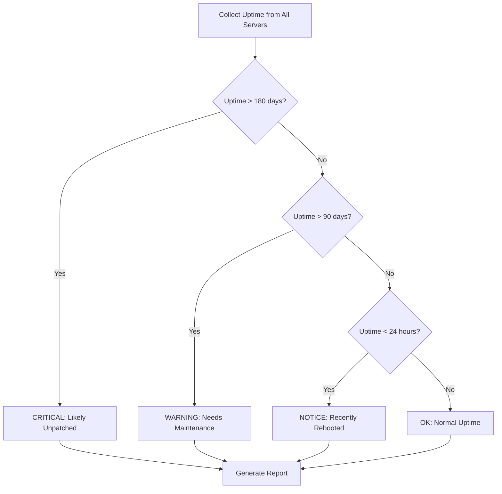

# How to Use Ansible to Check Server Uptime

Author: [nawazdhandala](https://www.github.com/nawazdhandala)

Tags: Ansible, Uptime, Monitoring, Server Management

Description: Use Ansible to check and report server uptime across your fleet for maintenance planning and compliance tracking.

---

Knowing how long your servers have been running is more useful than it sounds. High uptime might mean the server has not been patched in months. Low uptime could indicate instability problems. When planning maintenance windows or verifying that patching reboots happened, uptime data across your fleet is essential.

Ansible makes it easy to collect uptime from every server in your inventory and generate reports you can use for operational decisions. This guide covers several approaches from quick ad-hoc checks to structured reporting.

## Quick Uptime Check with Ad-Hoc Commands

The fastest way to check uptime is an ad-hoc Ansible command:

```bash
# Check uptime across all servers
ansible all -m command -a "uptime" -o

# Check uptime for a specific group
ansible web_servers -m command -a "uptime" -o

# Using setup module for structured data
ansible all -m setup -a "filter=ansible_uptime_seconds" -o
```

## Structured Uptime Report Playbook

For a proper report with categorization, use a playbook:

```yaml
# check-uptime.yml - Comprehensive uptime report across all servers
---
- name: Check server uptime across fleet
  hosts: all
  become: false
  gather_facts: true

  vars:
    # Thresholds for categorization (in days)
    critical_uptime_days: 180  # Servers up too long (probably unpatched)
    warning_uptime_days: 90
    recent_reboot_hours: 24    # Servers rebooted recently (unexpected?)

  tasks:
    # Calculate uptime in various units
    - name: Calculate uptime metrics
      ansible.builtin.set_fact:
        uptime_seconds: "{{ ansible_uptime_seconds }}"
        uptime_minutes: "{{ (ansible_uptime_seconds | int / 60) | round(1) }}"
        uptime_hours: "{{ (ansible_uptime_seconds | int / 3600) | round(1) }}"
        uptime_days: "{{ (ansible_uptime_seconds | int / 86400) | round(1) }}"

    # Get the last boot time
    - name: Get last boot time
      ansible.builtin.command:
        cmd: "who -b"
      register: last_boot
      changed_when: false

    # Get current running kernel
    - name: Get running kernel version
      ansible.builtin.command:
        cmd: uname -r
      register: kernel_version
      changed_when: false

    # Categorize the server based on uptime
    - name: Categorize uptime status
      ansible.builtin.set_fact:
        uptime_status: >-
          CRITICAL - Uptime exceeds {{ critical_uptime_days }} days
          WARNING - Uptime exceeds {{ warning_uptime_days }} days
          NOTICE - Recently rebooted
          OK

    # Build the report entry for this host
    - name: Build host report
      ansible.builtin.set_fact:
        host_report:
          hostname: "{{ inventory_hostname }}"
          ip: "{{ ansible_host | default(ansible_default_ipv4.address) }}"
          os: "{{ ansible_distribution }} {{ ansible_distribution_version }}"
          kernel: "{{ kernel_version.stdout }}"
          uptime_days: "{{ uptime_days }}"
          uptime_hours: "{{ uptime_hours }}"
          last_boot: "{{ last_boot.stdout | trim }}"
          status: "{{ uptime_status | trim }}"

    # Display the report for each host
    - name: Display uptime report
      ansible.builtin.debug:
        msg: >
          {{ inventory_hostname }} | {{ uptime_days }} days | {{ uptime_status | trim }} |
          Kernel: {{ kernel_version.stdout }} | Last boot: {{ last_boot.stdout | trim }}
```

## Fleet-Wide Uptime Dashboard

For a more comprehensive view that groups servers by their uptime status:

```yaml
# uptime-dashboard.yml - Fleet uptime dashboard with grouping
---
- name: Collect uptime data
  hosts: all
  become: false
  gather_facts: true

  tasks:
    - name: Set uptime facts
      ansible.builtin.set_fact:
        uptime_days: "{{ (ansible_uptime_seconds | int / 86400) | round(1) }}"

- name: Generate uptime dashboard
  hosts: localhost
  gather_facts: false

  tasks:
    # Group servers by uptime category
    - name: Categorize all servers
      ansible.builtin.set_fact:
        critical_servers: >-
          {{ groups['all'] | map('extract', hostvars)
             | selectattr('uptime_days', 'defined')
             | selectattr('uptime_days', '>', 180)
             | map(attribute='inventory_hostname') | list }}
        warning_servers: >-
          {{ groups['all'] | map('extract', hostvars)
             | selectattr('uptime_days', 'defined')
             | rejectattr('uptime_days', '>', 180)
             | selectattr('uptime_days', '>', 90)
             | map(attribute='inventory_hostname') | list }}

    # Display the dashboard
    - name: Display uptime dashboard
      ansible.builtin.debug:
        msg:
          - "========================================"
          - "        FLEET UPTIME DASHBOARD          "
          - "========================================"
          - "Total servers: {{ groups['all'] | length }}"
          - ""
          - "CRITICAL (>180 days): {{ critical_servers | length }}"
          - "{{ critical_servers }}"
          - ""
          - "WARNING (>90 days): {{ warning_servers | length }}"
          - "{{ warning_servers }}"

    # Generate CSV report
    - name: Generate CSV uptime report
      ansible.builtin.copy:
        dest: "/tmp/uptime-report-{{ ansible_date_time.date }}.csv"
        mode: '0644'
        content: |
          hostname,ip,os,kernel,uptime_days,last_boot,status
          
          
          {{ host }},{{ hostvars[host]['ansible_host'] | default('') }},{{ hostvars[host]['ansible_distribution'] | default('') }} {{ hostvars[host]['ansible_distribution_version'] | default('') }},{{ hostvars[host]['kernel_version']['stdout'] | default('') }},{{ hostvars[host]['uptime_days'] }},{{ hostvars[host]['last_boot']['stdout'] | default('') | trim }},{{ hostvars[host]['uptime_status'] | default('') | trim }}
          
          

    - name: Report saved
      ansible.builtin.debug:
        msg: "CSV report saved to /tmp/uptime-report-{{ ansible_date_time.date }}.csv"
```

## Uptime Categorization Flow



## Checking Uptime with Service Health

Uptime alone does not tell the full story. A server might be up but have crashed services:

```yaml
# uptime-with-health.yml - Uptime combined with service health check
---
- name: Uptime and service health check
  hosts: all
  become: true
  gather_facts: true

  vars:
    critical_services:
      - sshd
      - crond
      - rsyslog

    role_services:
      web_servers:
        - nginx
        - php-fpm
      db_servers:
        - mysqld
      app_servers:
        - myapp

  tasks:
    # Get uptime
    - name: Get uptime
      ansible.builtin.command:
        cmd: uptime -p
      register: uptime_pretty
      changed_when: false

    # Check critical services on all servers
    - name: Check critical services
      ansible.builtin.systemd:
        name: "{{ item }}"
      register: critical_check
      loop: "{{ critical_services }}"
      failed_when: false

    # Check role-specific services
    - name: Check role services
      ansible.builtin.systemd:
        name: "{{ item }}"
      register: role_check
      loop: "{{ role_services[group_names | first] | default([]) }}"
      failed_when: false

    # Count failed services
    - name: Count service failures
      ansible.builtin.set_fact:
        failed_services: "{{ (critical_check.results + role_check.results) | selectattr('status.ActiveState', 'ne', 'active') | map(attribute='item') | list }}"

    # Display combined health report
    - name: Display health report
      ansible.builtin.debug:
        msg: >
          {{ inventory_hostname }} |
          Uptime: {{ uptime_pretty.stdout }} |
          Services: {{ 'ALL OK' if failed_services | length == 0 else 'FAILED: ' + failed_services | join(', ') }}

    # Check system load
    - name: Get load average
      ansible.builtin.command:
        cmd: cat /proc/loadavg
      register: load_avg
      changed_when: false

    - name: Alert on high load
      ansible.builtin.debug:
        msg: "WARNING: High load on {{ inventory_hostname }}: {{ load_avg.stdout }}"
      when: load_avg.stdout.split(' ')[0] | float > ansible_processor_vcpus | default(2) | int * 2
```

## Historical Uptime Tracking

To track uptime over time and detect patterns:

```yaml
# track-uptime.yml - Record uptime for historical tracking
---
- name: Record uptime history
  hosts: all
  become: true
  gather_facts: true

  tasks:
    # Record current uptime to a log file
    - name: Append uptime to history log
      ansible.builtin.lineinfile:
        path: /var/log/uptime-history.log
        line: "{{ ansible_date_time.iso8601 }},{{ ansible_uptime_seconds }},{{ (ansible_uptime_seconds | int / 86400) | round(1) }}"
        create: true
        mode: '0644'

    # Check for unexpected reboots by comparing with last recorded uptime
    - name: Read last recorded uptime
      ansible.builtin.shell:
        cmd: "tail -2 /var/log/uptime-history.log | head -1 | cut -d',' -f2"
      register: last_uptime
      changed_when: false
      failed_when: false

    # If current uptime is less than last recorded, the server rebooted
    - name: Detect unexpected reboot
      ansible.builtin.debug:
        msg: "ALERT: {{ inventory_hostname }} appears to have rebooted since last check!"
      when:
        - last_uptime.stdout | default('0') | int > 0
        - ansible_uptime_seconds | int < last_uptime.stdout | int

    # Collect last boot reason from journal
    - name: Get last boot reason
      ansible.builtin.shell:
        cmd: "journalctl --list-boots | head -2"
      register: boot_log
      changed_when: false
      failed_when: false

    - name: Display boot history
      ansible.builtin.debug:
        var: boot_log.stdout_lines
      when: boot_log.rc == 0
```

## Comparing Uptime Before and After Maintenance

Use this to verify that a patching cycle actually rebooted the servers it was supposed to:

```yaml
# verify-reboot.yml - Verify servers were rebooted during maintenance
---
- name: Verify post-maintenance reboots
  hosts: all
  become: false
  gather_facts: true

  vars:
    maintenance_date: "2026-02-20"  # Date of the maintenance window

  tasks:
    # Calculate uptime
    - name: Calculate uptime in days
      ansible.builtin.set_fact:
        uptime_days: "{{ (ansible_uptime_seconds | int / 86400) | round(1) }}"

    # Get the boot timestamp
    - name: Get boot timestamp
      ansible.builtin.command:
        cmd: "who -b"
      register: boot_time
      changed_when: false

    # Check if server was rebooted after the maintenance date
    - name: Check if rebooted after maintenance
      ansible.builtin.set_fact:
        rebooted_after_maintenance: "{{ uptime_days | float < 2 }}"

    # Report servers that were NOT rebooted
    - name: Flag servers not rebooted
      ansible.builtin.debug:
        msg: "{{ inventory_hostname }} was NOT rebooted during maintenance window. Uptime: {{ uptime_days }} days, Boot: {{ boot_time.stdout | trim }}"
      when: not rebooted_after_maintenance | bool

    - name: Confirm rebooted servers
      ansible.builtin.debug:
        msg: "{{ inventory_hostname }} was rebooted. Uptime: {{ uptime_days }} days"
      when: rebooted_after_maintenance | bool
```

## Practical Uses for Uptime Data

Here is how I use uptime information in day-to-day operations:

1. Patch compliance auditing. If a server has been up for more than 90 days, it has missed at least one monthly patch cycle. These servers go on the priority list for the next maintenance window.

2. Unexpected reboot detection. By recording uptime periodically and comparing, you can detect servers that rebooted outside of maintenance windows. This often indicates hardware issues, kernel panics, or someone manually rebooting without following procedures.

3. Maintenance verification. After a patch cycle, run the uptime check to confirm that servers that needed rebooting actually got rebooted. It is surprisingly common for servers to "skip" reboots due to failed automated processes.

4. Capacity planning. Servers with very high uptime (300+ days) are often running older kernels with known vulnerabilities or bugs. They represent both a security risk and a reboot risk because services have been running so long that startup problems may have been forgotten.

5. Infrastructure health dashboard. Uptime data combined with service health gives you a quick overview of fleet status without needing a full monitoring system.

The uptime command is simple. What makes it powerful is collecting that data across hundreds of servers and turning it into actionable information. Ansible makes that collection trivial.
