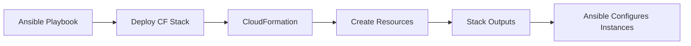

# How to Use Ansible with CloudFormation

Author: [nawazdhandala](https://www.github.com/nawazdhandala)

Tags: Ansible, CloudFormation, AWS, Infrastructure as Code

Description: Orchestrate AWS CloudFormation stack deployments with Ansible for combined infrastructure provisioning and configuration management.

---

AWS CloudFormation provisions resources using templates. Ansible has a built-in module for managing CloudFormation stacks, letting you orchestrate the full lifecycle from a single playbook: create the stack, capture outputs, then configure the created instances.

## Integration Flow



## Deploying a CloudFormation Stack

```yaml
# playbooks/deploy-stack.yml
# Deploy CloudFormation stack and configure instances
---
- name: Deploy CloudFormation stack
  hosts: localhost
  connection: local
  tasks:
    - name: Deploy infrastructure stack
      amazon.aws.cloudformation:
        stack_name: "{{ stack_name }}"
        state: present
        region: "{{ aws_region }}"
        template_body: "{{ lookup('file', '../cloudformation/app-stack.yml') }}"
        template_parameters:
          Environment: "{{ environment_name }}"
          InstanceType: "{{ instance_type }}"
          KeyName: "{{ key_name }}"
        tags:
          Environment: "{{ environment_name }}"
          ManagedBy: ansible
      register: cf_stack

    - name: Display stack outputs
      ansible.builtin.debug:
        var: cf_stack.stack_outputs

    - name: Wait for instances to be reachable
      ansible.builtin.wait_for:
        host: "{{ item }}"
        port: 22
        timeout: 300
      loop: "{{ cf_stack.stack_outputs.InstanceIPs.split(',') }}"

    - name: Add instances to inventory
      ansible.builtin.add_host:
        name: "web-{{ idx }}"
        ansible_host: "{{ item }}"
        groups: cf_webservers
      loop: "{{ cf_stack.stack_outputs.InstanceIPs.split(',') }}"
      loop_control:
        index_var: idx

- name: Configure deployed instances
  hosts: cf_webservers
  become: true
  roles:
    - common
    - nginx
    - app_deploy
```

## CloudFormation Template

```yaml
# cloudformation/app-stack.yml
AWSTemplateFormatVersion: '2010-09-09'
Description: Application infrastructure

Parameters:
  Environment:
    Type: String
  InstanceType:
    Type: String
    Default: t3.medium
  KeyName:
    Type: AWS::EC2::KeyPair::KeyName

Resources:
  VPC:
    Type: AWS::EC2::VPC
    Properties:
      CidrBlock: 10.0.0.0/16
      Tags:
        - Key: Name
          Value: !Sub "${Environment}-vpc"

  PublicSubnet:
    Type: AWS::EC2::Subnet
    Properties:
      VpcId: !Ref VPC
      CidrBlock: 10.0.1.0/24
      MapPublicIpOnLaunch: true

  WebServer:
    Type: AWS::EC2::Instance
    Properties:
      InstanceType: !Ref InstanceType
      ImageId: ami-0abcdef1234567890
      KeyName: !Ref KeyName
      SubnetId: !Ref PublicSubnet
      Tags:
        - Key: Role
          Value: webserver

Outputs:
  InstanceIPs:
    Value: !GetAtt WebServer.PrivateIp
  VpcId:
    Value: !Ref VPC
```

## Stack Updates

```yaml
# playbooks/update-stack.yml
# Update existing CloudFormation stack
---
- name: Update CloudFormation stack
  hosts: localhost
  connection: local
  tasks:
    - name: Create change set for review
      amazon.aws.cloudformation:
        stack_name: "{{ stack_name }}"
        state: present
        create_changeset: true
        changeset_name: "update-{{ ansible_date_time.epoch }}"
        template_body: "{{ lookup('file', '../cloudformation/app-stack.yml') }}"
        template_parameters:
          Environment: "{{ environment_name }}"
          InstanceType: "{{ new_instance_type }}"
      register: changeset

    - name: Show proposed changes
      ansible.builtin.debug:
        var: changeset
```

## Stack Deletion with Safety Check

```yaml
# playbooks/delete-stack.yml
---
- name: Delete CloudFormation stack
  hosts: localhost
  connection: local
  tasks:
    - name: Safety check - prevent production deletion
      ansible.builtin.assert:
        that: environment_name != 'production'
        fail_msg: "Cannot delete production stack!"

    - name: Delete the stack
      amazon.aws.cloudformation:
        stack_name: "{{ stack_name }}"
        state: absent
        region: "{{ aws_region }}"
```

## Multiple Stack Dependencies

```yaml
# playbooks/deploy-all-stacks.yml
# Deploy multiple dependent stacks
---
- name: Deploy infrastructure stacks
  hosts: localhost
  connection: local
  tasks:
    - name: Deploy network stack
      amazon.aws.cloudformation:
        stack_name: "{{ env }}-network"
        template_body: "{{ lookup('file', 'cf/network.yml') }}"
        state: present
      register: network_stack

    - name: Deploy database stack
      amazon.aws.cloudformation:
        stack_name: "{{ env }}-database"
        template_body: "{{ lookup('file', 'cf/database.yml') }}"
        template_parameters:
          VpcId: "{{ network_stack.stack_outputs.VpcId }}"
          SubnetIds: "{{ network_stack.stack_outputs.PrivateSubnetIds }}"
        state: present
      register: db_stack

    - name: Deploy application stack
      amazon.aws.cloudformation:
        stack_name: "{{ env }}-app"
        template_body: "{{ lookup('file', 'cf/app.yml') }}"
        template_parameters:
          VpcId: "{{ network_stack.stack_outputs.VpcId }}"
          DbEndpoint: "{{ db_stack.stack_outputs.DbEndpoint }}"
        state: present
```

## Key Takeaways

Using Ansible with CloudFormation gives you a unified workflow for AWS infrastructure. Deploy stacks with Ansible, capture outputs, and configure instances in the same playbook run. Use change sets to preview updates before applying them. Chain multiple stacks together using outputs from one as parameters to the next. Always include safety checks to prevent accidental deletion of production stacks.

## Common Use Cases

Here are several practical scenarios where this module proves essential in real-world playbooks.

### Infrastructure Provisioning Workflow

```yaml
# Complete workflow incorporating this module
- name: Infrastructure provisioning
  hosts: all
  become: true
  gather_facts: true
  tasks:
    - name: Gather system information
      ansible.builtin.setup:
        gather_subset:
          - hardware
          - network

    - name: Display system summary
      ansible.builtin.debug:
        msg: >-
          Host {{ inventory_hostname }} has
          {{ ansible_memtotal_mb }}MB RAM,
          {{ ansible_processor_vcpus }} vCPUs,
          running {{ ansible_distribution }} {{ ansible_distribution_version }}

    - name: Install required packages
      ansible.builtin.package:
        name:
          - curl
          - wget
          - git
          - vim
          - htop
          - jq
        state: present

    - name: Configure system timezone
      ansible.builtin.timezone:
        name: "{{ system_timezone | default('UTC') }}"

    - name: Configure hostname
      ansible.builtin.hostname:
        name: "{{ inventory_hostname }}"

    - name: Update /etc/hosts
      ansible.builtin.lineinfile:
        path: /etc/hosts
        regexp: '^127\.0\.1\.1'
        line: "127.0.1.1 {{ inventory_hostname }}"

    - name: Configure SSH hardening
      ansible.builtin.lineinfile:
        path: /etc/ssh/sshd_config
        regexp: "{{ item.regexp }}"
        line: "{{ item.line }}"
      loop:
        - { regexp: '^PermitRootLogin', line: 'PermitRootLogin no' }
        - { regexp: '^PasswordAuthentication', line: 'PasswordAuthentication no' }
      notify: restart sshd

    - name: Configure firewall rules
      community.general.ufw:
        rule: allow
        port: "{{ item }}"
        proto: tcp
      loop:
        - "22"
        - "80"
        - "443"

    - name: Enable firewall
      community.general.ufw:
        state: enabled
        policy: deny

  handlers:
    - name: restart sshd
      ansible.builtin.service:
        name: sshd
        state: restarted
```

### Integration with Monitoring

```yaml
# Using gathered facts to configure monitoring thresholds
- name: Configure monitoring based on system specs
  hosts: all
  become: true
  tasks:
    - name: Set monitoring thresholds based on hardware
      ansible.builtin.template:
        src: monitoring_config.yml.j2
        dest: /etc/monitoring/config.yml
      vars:
        memory_warning_threshold: "{{ (ansible_memtotal_mb * 0.8) | int }}"
        memory_critical_threshold: "{{ (ansible_memtotal_mb * 0.95) | int }}"
        cpu_warning_threshold: 80
        cpu_critical_threshold: 95

    - name: Register host with monitoring system
      ansible.builtin.uri:
        url: "https://monitoring.example.com/api/hosts"
        method: POST
        body_format: json
        body:
          hostname: "{{ inventory_hostname }}"
          ip_address: "{{ ansible_default_ipv4.address }}"
          os: "{{ ansible_distribution }}"
          memory_mb: "{{ ansible_memtotal_mb }}"
          cpus: "{{ ansible_processor_vcpus }}"
        headers:
          Authorization: "Bearer {{ monitoring_api_token }}"
        status_code: [200, 201, 409]
```

### Error Handling Patterns

```yaml
# Robust error handling with this module
- name: Robust task execution
  hosts: all
  tasks:
    - name: Attempt primary operation
      ansible.builtin.command: /opt/app/primary-task.sh
      register: primary_result
      failed_when: false

    - name: Handle primary failure with fallback
      ansible.builtin.command: /opt/app/fallback-task.sh
      when: primary_result.rc != 0
      register: fallback_result

    - name: Report final status
      ansible.builtin.debug:
        msg: >-
          Task completed via {{ 'primary' if primary_result.rc == 0 else 'fallback' }} path.
          Return code: {{ primary_result.rc if primary_result.rc == 0 else fallback_result.rc }}

    - name: Fail if both paths failed
      ansible.builtin.fail:
        msg: "Both primary and fallback operations failed"
      when:
        - primary_result.rc != 0
        - fallback_result is defined
        - fallback_result.rc != 0
```

### Scheduling and Automation

```yaml
# Set up scheduled compliance scans using cron
- name: Configure automated scans
  hosts: all
  become: true
  tasks:
    - name: Create scan script
      ansible.builtin.copy:
        dest: /opt/scripts/compliance_scan.sh
        mode: '0755'
        content: |
          #!/bin/bash
          cd /opt/ansible
          ansible-playbook playbooks/validate.yml -i inventory/ > /var/log/compliance_scan.log 2>&1
          EXIT_CODE=$?
          if [ $EXIT_CODE -ne 0 ]; then
            curl -X POST https://hooks.example.com/alert \
              -H "Content-Type: application/json" \
              -d "{\"text\":\"Compliance scan failed on $(hostname)\"}"
          fi
          exit $EXIT_CODE

    - name: Schedule weekly compliance scan
      ansible.builtin.cron:
        name: "Weekly compliance scan"
        minute: "0"
        hour: "3"
        weekday: "1"
        job: "/opt/scripts/compliance_scan.sh"
        user: ansible
```

