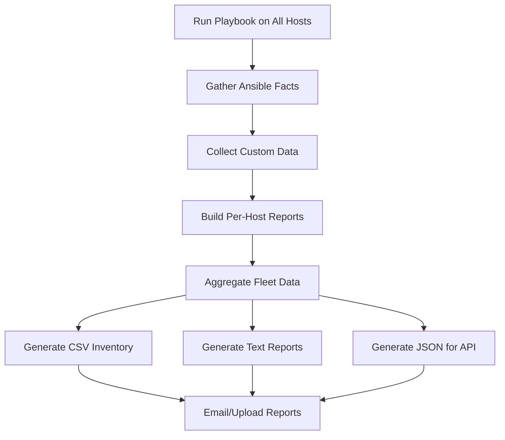

# How to Use Ansible to Collect System Information Reports

Author: [nawazdhandala](https://www.github.com/nawazdhandala)

Tags: Ansible, System Information, Inventory, Linux

Description: Use Ansible to collect detailed system information from your entire server fleet for inventory tracking and capacity planning.

---

Knowing exactly what hardware and software is running across your infrastructure is fundamental to good operations. You need this information for capacity planning, license auditing, security compliance, and incident response. Manually collecting system specs from each server is painfully slow and the data goes stale the moment you finish.

Ansible can pull detailed system information from every server in your fleet in minutes. The built-in `setup` module alone provides hundreds of facts about each host. Combined with custom commands, you can build comprehensive inventory reports that stay up to date.

## Quick Fact Collection

Ansible gathers a wealth of information automatically through the `setup` module:

```yaml
# collect-facts.yml - Collect basic system facts from all servers
---
- name: Collect system information
  hosts: all
  become: true
  gather_facts: true

  tasks:
    # Display key system information
    - name: Display system summary
      ansible.builtin.debug:
        msg:
          - "Hostname: {{ ansible_hostname }}"
          - "FQDN: {{ ansible_fqdn }}"
          - "OS: {{ ansible_distribution }} {{ ansible_distribution_version }}"
          - "Kernel: {{ ansible_kernel }}"
          - "Architecture: {{ ansible_architecture }}"
          - "CPU: {{ ansible_processor[2] | default('Unknown') }}"
          - "CPU Cores: {{ ansible_processor_vcpus }}"
          - "RAM: {{ (ansible_memtotal_mb / 1024) | round(1) }} GB"
          - "Swap: {{ (ansible_swaptotal_mb / 1024) | round(1) }} GB"
          - "Python: {{ ansible_python_version }}"
          - "Uptime: {{ (ansible_uptime_seconds / 86400) | round(1) }} days"
```

## Comprehensive System Report

For a full system report including hardware, storage, networking, and installed software:

```yaml
# system-report.yml - Comprehensive system information report
---
- name: Generate comprehensive system report
  hosts: all
  become: true
  gather_facts: true

  tasks:
    # Collect disk information
    - name: Get disk information
      ansible.builtin.shell:
        cmd: "lsblk -o NAME,SIZE,TYPE,MOUNTPOINT -J"
      register: disk_info
      changed_when: false

    # Get filesystem usage
    - name: Get filesystem usage
      ansible.builtin.command:
        cmd: "df -hT"
      register: fs_usage
      changed_when: false

    # Get network interface details
    - name: Get network interfaces
      ansible.builtin.command:
        cmd: "ip -o addr show"
      register: network_info
      changed_when: false

    # Get installed package count
    - name: Count installed packages (RedHat)
      ansible.builtin.shell:
        cmd: "rpm -qa | wc -l"
      register: pkg_count_rh
      changed_when: false
      when: ansible_os_family == "RedHat"

    - name: Count installed packages (Debian)
      ansible.builtin.shell:
        cmd: "dpkg -l | grep '^ii' | wc -l"
      register: pkg_count_deb
      changed_when: false
      when: ansible_os_family == "Debian"

    # Get running services
    - name: Get running services
      ansible.builtin.shell:
        cmd: "systemctl list-units --type=service --state=running --no-pager --no-legend | wc -l"
      register: running_services
      changed_when: false

    # Get listening ports
    - name: Get listening ports
      ansible.builtin.shell:
        cmd: "ss -tlnp | tail -n +2 | awk '{print $4}' | sort -u"
      register: listening_ports
      changed_when: false

    # Get top 5 processes by memory
    - name: Get top processes by memory
      ansible.builtin.shell:
        cmd: "ps aux --sort=-%mem | head -6 | tail -5 | awk '{print $11, $4\"%\"}'"
      register: top_procs
      changed_when: false

    # Get DMI/hardware info
    - name: Get hardware vendor info
      ansible.builtin.shell:
        cmd: "dmidecode -t system 2>/dev/null | grep -E 'Manufacturer|Product' | head -2 || echo 'DMI not available'"
      register: hw_vendor
      changed_when: false

    # Build the comprehensive report
    - name: Build system report
      ansible.builtin.set_fact:
        system_report:
          hostname: "{{ ansible_hostname }}"
          fqdn: "{{ ansible_fqdn }}"
          ip_addresses: "{{ ansible_all_ipv4_addresses }}"
          os: "{{ ansible_distribution }} {{ ansible_distribution_version }}"
          kernel: "{{ ansible_kernel }}"
          architecture: "{{ ansible_architecture }}"
          hardware: "{{ hw_vendor.stdout }}"
          cpu_model: "{{ ansible_processor[2] | default('Unknown') }}"
          cpu_cores: "{{ ansible_processor_vcpus }}"
          ram_gb: "{{ (ansible_memtotal_mb / 1024) | round(1) }}"
          swap_gb: "{{ (ansible_swaptotal_mb / 1024) | round(1) }}"
          installed_packages: "{{ pkg_count_rh.stdout | default(pkg_count_deb.stdout) | default('unknown') }}"
          running_services: "{{ running_services.stdout }}"
          uptime_days: "{{ (ansible_uptime_seconds / 86400) | round(1) }}"

    # Save report to local file
    - name: Save individual server report
      ansible.builtin.copy:
        content: |
          =========================================
          System Report: {{ ansible_hostname }}
          Generated: {{ ansible_date_time.iso8601 }}
          =========================================

          IDENTITY
            Hostname:    {{ ansible_hostname }}
            FQDN:        {{ ansible_fqdn }}
            IP:          {{ ansible_all_ipv4_addresses | join(', ') }}

          HARDWARE
            Vendor:      {{ hw_vendor.stdout }}
            CPU:         {{ ansible_processor[2] | default('Unknown') }}
            Cores:       {{ ansible_processor_vcpus }}
            RAM:         {{ (ansible_memtotal_mb / 1024) | round(1) }} GB
            Swap:        {{ (ansible_swaptotal_mb / 1024) | round(1) }} GB

          OPERATING SYSTEM
            OS:          {{ ansible_distribution }} {{ ansible_distribution_version }}
            Kernel:      {{ ansible_kernel }}
            Arch:        {{ ansible_architecture }}
            Python:      {{ ansible_python_version }}

          STORAGE
          {{ fs_usage.stdout }}

          NETWORK
          {{ network_info.stdout }}

          LISTENING PORTS
          {{ listening_ports.stdout }}

          TOP PROCESSES (by memory)
          {{ top_procs.stdout }}

          STATISTICS
            Packages:    {{ pkg_count_rh.stdout | default(pkg_count_deb.stdout) | default('unknown') }}
            Services:    {{ running_services.stdout }} running
            Uptime:      {{ (ansible_uptime_seconds / 86400) | round(1) }} days
        dest: "/tmp/system-report-{{ inventory_hostname }}.txt"
        mode: '0644'
      delegate_to: localhost
```

## Generating a Fleet Inventory CSV

For spreadsheet-friendly output:

```yaml
# fleet-inventory.yml - Generate CSV inventory of all servers
---
- name: Collect fleet inventory data
  hosts: all
  become: true
  gather_facts: true

  tasks:
    - name: Collect additional facts
      ansible.builtin.shell:
        cmd: "rpm -qa | wc -l 2>/dev/null || dpkg -l | grep '^ii' | wc -l 2>/dev/null || echo 0"
      register: pkg_count
      changed_when: false

- name: Generate fleet inventory CSV
  hosts: localhost
  gather_facts: true

  tasks:
    # Build the CSV header and rows
    - name: Generate CSV inventory file
      ansible.builtin.copy:
        dest: "/tmp/fleet-inventory-{{ ansible_date_time.date }}.csv"
        mode: '0644'
        content: |
          hostname,fqdn,ip_address,os,os_version,kernel,arch,cpu_model,cpu_cores,ram_gb,swap_gb,uptime_days,packages
          
          
          
          {{ host }},{{ hv.ansible_fqdn | default('') }},{{ hv.ansible_default_ipv4.address | default('') }},{{ hv.ansible_distribution }},{{ hv.ansible_distribution_version }},{{ hv.ansible_kernel }},{{ hv.ansible_architecture }},{{ hv.ansible_processor[2] | default('') | replace(',', ' ') }},{{ hv.ansible_processor_vcpus }},{{ (hv.ansible_memtotal_mb / 1024) | round(1) }},{{ (hv.ansible_swaptotal_mb / 1024) | round(1) }},{{ (hv.ansible_uptime_seconds / 86400) | round(1) }},{{ hv.pkg_count.stdout | default('') }}
          
          

    - name: Report inventory location
      ansible.builtin.debug:
        msg: "Fleet inventory saved to /tmp/fleet-inventory-{{ ansible_date_time.date }}.csv"
```

## Report Generation Workflow



## Collecting Security-Relevant Information

For security audits, you need specific information:

```yaml
# security-report.yml - Collect security-relevant system information
---
- name: Security information collection
  hosts: all
  become: true
  gather_facts: true

  tasks:
    # Check SELinux/AppArmor status
    - name: Check SELinux status (RedHat)
      ansible.builtin.command:
        cmd: getenforce
      register: selinux_status
      changed_when: false
      failed_when: false
      when: ansible_os_family == "RedHat"

    # Check for users with UID 0
    - name: Find users with UID 0
      ansible.builtin.shell:
        cmd: "awk -F: '$3 == 0 {print $1}' /etc/passwd"
      register: root_users
      changed_when: false

    # Check for world-writable directories
    - name: Check for world-writable dirs in common paths
      ansible.builtin.shell:
        cmd: "find /etc /var -maxdepth 2 -type d -perm -o+w 2>/dev/null | head -20"
      register: world_writable
      changed_when: false

    # Check SSH configuration
    - name: Check SSH root login setting
      ansible.builtin.shell:
        cmd: "grep -E '^PermitRootLogin' /etc/ssh/sshd_config || echo 'PermitRootLogin not explicitly set'"
      register: ssh_root
      changed_when: false

    # Check password policy
    - name: Check password max age
      ansible.builtin.shell:
        cmd: "grep PASS_MAX_DAYS /etc/login.defs | grep -v '^#'"
      register: pass_policy
      changed_when: false

    # Check firewall status
    - name: Check firewall status
      ansible.builtin.shell:
        cmd: "systemctl is-active firewalld 2>/dev/null || systemctl is-active ufw 2>/dev/null || echo 'no firewall detected'"
      register: firewall_status
      changed_when: false

    # Check for failed login attempts
    - name: Count recent failed logins
      ansible.builtin.shell:
        cmd: "lastb 2>/dev/null | wc -l || echo 0"
      register: failed_logins
      changed_when: false

    # Build security report
    - name: Display security summary
      ansible.builtin.debug:
        msg:
          - "=== Security Report: {{ inventory_hostname }} ==="
          - "SELinux: {{ selinux_status.stdout | default('N/A') }}"
          - "Root UID users: {{ root_users.stdout_lines }}"
          - "SSH root login: {{ ssh_root.stdout }}"
          - "Password policy: {{ pass_policy.stdout }}"
          - "Firewall: {{ firewall_status.stdout }}"
          - "Failed logins: {{ failed_logins.stdout }}"
          - "World-writable dirs: {{ world_writable.stdout_lines | length }}"
```

## Scheduling Regular Reports

Set up a cron job to generate reports automatically:

```yaml
# schedule-reports.yml - Schedule automatic report generation
---
- name: Schedule system reports
  hosts: ansible_controller
  become: true

  tasks:
    # Deploy the report generation script
    - name: Deploy report script
      ansible.builtin.copy:
        dest: /usr/local/bin/generate-fleet-report.sh
        mode: '0755'
        content: |
          #!/bin/bash
          # Weekly fleet report generation
          REPORT_DIR="/opt/reports/fleet"
          DATE=$(date +%Y-%m-%d)

          mkdir -p "$REPORT_DIR"

          # Run the playbook and collect reports
          ansible-playbook /opt/ansible/playbooks/system-report.yml \
              -i /opt/ansible/inventory/production \
              > "$REPORT_DIR/report-${DATE}.log" 2>&1

          # Copy individual reports into the report directory
          mv /tmp/system-report-*.txt "$REPORT_DIR/" 2>/dev/null
          mv /tmp/fleet-inventory-*.csv "$REPORT_DIR/" 2>/dev/null

          # Clean up old reports (keep 90 days)
          find "$REPORT_DIR" -name "*.txt" -mtime +90 -delete
          find "$REPORT_DIR" -name "*.csv" -mtime +90 -delete

    # Schedule weekly report
    - name: Schedule weekly report generation
      ansible.builtin.cron:
        name: "Weekly fleet report"
        weekday: "1"
        hour: "6"
        minute: "0"
        job: "/usr/local/bin/generate-fleet-report.sh"
        user: ansible
```

## Real-World Applications

How I use system information reports in practice:

1. License compliance. When software audits happen, you need to know exactly how many servers run a particular OS version or have specific software installed. The CSV report feeds directly into compliance spreadsheets.

2. Capacity planning. Tracking RAM utilization, CPU core counts, and disk usage across the fleet helps identify servers that are over-provisioned or under-provisioned. This data drives right-sizing decisions and cloud cost optimization.

3. Incident response. When a vulnerability is announced, you need to quickly identify which servers are affected. Having a current inventory with kernel versions, OS versions, and installed packages lets you find affected systems in seconds.

4. Change management. Before and after reports from maintenance windows document exactly what changed. This is invaluable for troubleshooting issues that appear after a change window.

5. Decommissioning. When retiring old hardware or migrating to the cloud, you need detailed specs of what is running where. The system report gives you everything needed to plan the migration.

Ansible makes system information collection a routine, automated process instead of a manual scramble. Run it weekly, store the reports, and you will always have an accurate picture of your infrastructure.
