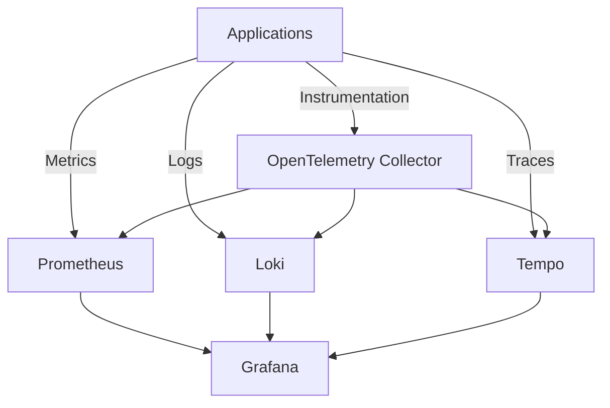

# How to Use Ansible to Set Up a Complete Observability Stack

Author: [nawazdhandala](https://www.github.com/nawazdhandala)

Tags: Ansible, Observability, Monitoring, Logging, Tracing

Description: Deploy a complete observability stack with metrics, logs, and traces using Ansible including Prometheus, Loki, Tempo, and Grafana.

---

Modern observability requires three pillars: metrics for quantitative measurements, logs for detailed event records, and traces for request flow through distributed systems. Setting up each component separately is common, but a unified stack gives you the ability to correlate across all three. Ansible deploys this entire observability platform consistently.

## Observability Architecture



## Role Defaults

```yaml
# roles/observability/defaults/main.yml - Full observability stack
prometheus_port: 9090
loki_port: 3100
tempo_port: 3200
grafana_port: 3000
otel_grpc_port: 4317
otel_http_port: 4318

observability_retention: 30d
observability_data_dir: /opt/observability/data
```

## Prometheus Setup

```yaml
# roles/observability/tasks/prometheus.yml - Metrics collection
---
- name: Deploy Prometheus configuration
  template:
    src: prometheus.yml.j2
    dest: /etc/prometheus/prometheus.yml
    mode: '0644'
  notify: restart prometheus

- name: Deploy Prometheus via Docker
  community.docker.docker_container:
    name: prometheus
    image: prom/prometheus:latest
    state: started
    restart_policy: unless-stopped
    ports:
      - "{{ prometheus_port }}:9090"
    volumes:
      - /etc/prometheus:/etc/prometheus:ro
      - prometheus_data:/prometheus
    command:
      - '--config.file=/etc/prometheus/prometheus.yml'
      - '--storage.tsdb.retention.time={{ observability_retention }}'
```

## Loki Setup for Logs

```yaml
# roles/observability/tasks/loki.yml - Log aggregation
---
- name: Deploy Loki configuration
  template:
    src: loki-config.yml.j2
    dest: /etc/loki/config.yml
    mode: '0644'

- name: Deploy Loki via Docker
  community.docker.docker_container:
    name: loki
    image: grafana/loki:latest
    state: started
    restart_policy: unless-stopped
    ports:
      - "{{ loki_port }}:3100"
    volumes:
      - /etc/loki:/etc/loki:ro
      - loki_data:/loki
    command:
      - '-config.file=/etc/loki/config.yml'
```

## Tempo Setup for Traces

```yaml
# roles/observability/tasks/tempo.yml - Distributed tracing
---
- name: Deploy Tempo configuration
  template:
    src: tempo-config.yml.j2
    dest: /etc/tempo/config.yml
    mode: '0644'

- name: Deploy Tempo via Docker
  community.docker.docker_container:
    name: tempo
    image: grafana/tempo:latest
    state: started
    restart_policy: unless-stopped
    ports:
      - "{{ tempo_port }}:3200"
      - "4317:4317"
    volumes:
      - /etc/tempo:/etc/tempo:ro
      - tempo_data:/var/tempo
    command:
      - '-config.file=/etc/tempo/config.yml'
```

## Grafana with Data Sources

```yaml
# roles/observability/tasks/grafana.yml - Visualization
---
- name: Deploy Grafana with all data sources
  community.docker.docker_container:
    name: grafana
    image: grafana/grafana:latest
    state: started
    restart_policy: unless-stopped
    ports:
      - "{{ grafana_port }}:3000"
    env:
      GF_SECURITY_ADMIN_PASSWORD: "{{ vault_grafana_password }}"
    volumes:
      - grafana_data:/var/lib/grafana
      - /etc/grafana/provisioning:/etc/grafana/provisioning:ro

- name: Deploy Grafana data source provisioning
  copy:
    content: |
      apiVersion: 1
      datasources:
        - name: Prometheus
          type: prometheus
          url: http://prometheus:{{ prometheus_port }}
          isDefault: true
        - name: Loki
          type: loki
          url: http://loki:{{ loki_port }}
        - name: Tempo
          type: tempo
          url: http://tempo:{{ tempo_port }}
    dest: /etc/grafana/provisioning/datasources/default.yml
    mode: '0644'
```

## Running the Deployment

```bash
# Deploy the complete observability stack
ansible-playbook -i inventory/hosts.ini observability.yml --ask-vault-pass
```

## Summary

This Ansible playbook deploys a complete observability stack with metrics (Prometheus), logs (Loki), and traces (Tempo), all visualized through Grafana. The OpenTelemetry Collector serves as a unified ingestion point, making it easy for applications to emit telemetry data. Having all three pillars in a single, correlated platform makes debugging distributed systems significantly easier.

## Common Use Cases

Here are several practical scenarios where this module proves essential in real-world playbooks.

### Infrastructure Provisioning Workflow

```yaml
# Complete workflow incorporating this module
- name: Infrastructure provisioning
  hosts: all
  become: true
  gather_facts: true
  tasks:
    - name: Gather system information
      ansible.builtin.setup:
        gather_subset:
          - hardware
          - network

    - name: Display system summary
      ansible.builtin.debug:
        msg: >-
          Host {{ inventory_hostname }} has
          {{ ansible_memtotal_mb }}MB RAM,
          {{ ansible_processor_vcpus }} vCPUs,
          running {{ ansible_distribution }} {{ ansible_distribution_version }}

    - name: Install required packages
      ansible.builtin.package:
        name:
          - curl
          - wget
          - git
          - vim
          - htop
          - jq
        state: present

    - name: Configure system timezone
      ansible.builtin.timezone:
        name: "{{ system_timezone | default('UTC') }}"

    - name: Configure hostname
      ansible.builtin.hostname:
        name: "{{ inventory_hostname }}"

    - name: Update /etc/hosts
      ansible.builtin.lineinfile:
        path: /etc/hosts
        regexp: '^127\.0\.1\.1'
        line: "127.0.1.1 {{ inventory_hostname }}"

    - name: Configure SSH hardening
      ansible.builtin.lineinfile:
        path: /etc/ssh/sshd_config
        regexp: "{{ item.regexp }}"
        line: "{{ item.line }}"
      loop:
        - { regexp: '^PermitRootLogin', line: 'PermitRootLogin no' }
        - { regexp: '^PasswordAuthentication', line: 'PasswordAuthentication no' }
      notify: restart sshd

    - name: Configure firewall rules
      community.general.ufw:
        rule: allow
        port: "{{ item }}"
        proto: tcp
      loop:
        - "22"
        - "80"
        - "443"

    - name: Enable firewall
      community.general.ufw:
        state: enabled
        policy: deny

  handlers:
    - name: restart sshd
      ansible.builtin.service:
        name: sshd
        state: restarted
```

### Integration with Monitoring

```yaml
# Using gathered facts to configure monitoring thresholds
- name: Configure monitoring based on system specs
  hosts: all
  become: true
  tasks:
    - name: Set monitoring thresholds based on hardware
      ansible.builtin.template:
        src: monitoring_config.yml.j2
        dest: /etc/monitoring/config.yml
      vars:
        memory_warning_threshold: "{{ (ansible_memtotal_mb * 0.8) | int }}"
        memory_critical_threshold: "{{ (ansible_memtotal_mb * 0.95) | int }}"
        cpu_warning_threshold: 80
        cpu_critical_threshold: 95

    - name: Register host with monitoring system
      ansible.builtin.uri:
        url: "https://monitoring.example.com/api/hosts"
        method: POST
        body_format: json
        body:
          hostname: "{{ inventory_hostname }}"
          ip_address: "{{ ansible_default_ipv4.address }}"
          os: "{{ ansible_distribution }}"
          memory_mb: "{{ ansible_memtotal_mb }}"
          cpus: "{{ ansible_processor_vcpus }}"
        headers:
          Authorization: "Bearer {{ monitoring_api_token }}"
        status_code: [200, 201, 409]
```

### Error Handling Patterns

```yaml
# Robust error handling with this module
- name: Robust task execution
  hosts: all
  tasks:
    - name: Attempt primary operation
      ansible.builtin.command: /opt/app/primary-task.sh
      register: primary_result
      failed_when: false

    - name: Handle primary failure with fallback
      ansible.builtin.command: /opt/app/fallback-task.sh
      when: primary_result.rc != 0
      register: fallback_result

    - name: Report final status
      ansible.builtin.debug:
        msg: >-
          Task completed via {{ 'primary' if primary_result.rc == 0 else 'fallback' }} path.
          Return code: {{ primary_result.rc if primary_result.rc == 0 else fallback_result.rc }}

    - name: Fail if both paths failed
      ansible.builtin.fail:
        msg: "Both primary and fallback operations failed"
      when:
        - primary_result.rc != 0
        - fallback_result is defined
        - fallback_result.rc != 0
```

### Scheduling and Automation

```yaml
# Set up scheduled compliance scans using cron
- name: Configure automated scans
  hosts: all
  become: true
  tasks:
    - name: Create scan script
      ansible.builtin.copy:
        dest: /opt/scripts/compliance_scan.sh
        mode: '0755'
        content: |
          #!/bin/bash
          cd /opt/ansible
          ansible-playbook playbooks/validate.yml -i inventory/ > /var/log/compliance_scan.log 2>&1
          EXIT_CODE=$?
          if [ $EXIT_CODE -ne 0 ]; then
            curl -X POST https://hooks.example.com/alert \
              -H "Content-Type: application/json" \
              -d "{\"text\":\"Compliance scan failed on $(hostname)\"}"
          fi
          exit $EXIT_CODE

    - name: Schedule weekly compliance scan
      ansible.builtin.cron:
        name: "Weekly compliance scan"
        minute: "0"
        hour: "3"
        weekday: "1"
        job: "/opt/scripts/compliance_scan.sh"
        user: ansible
```

