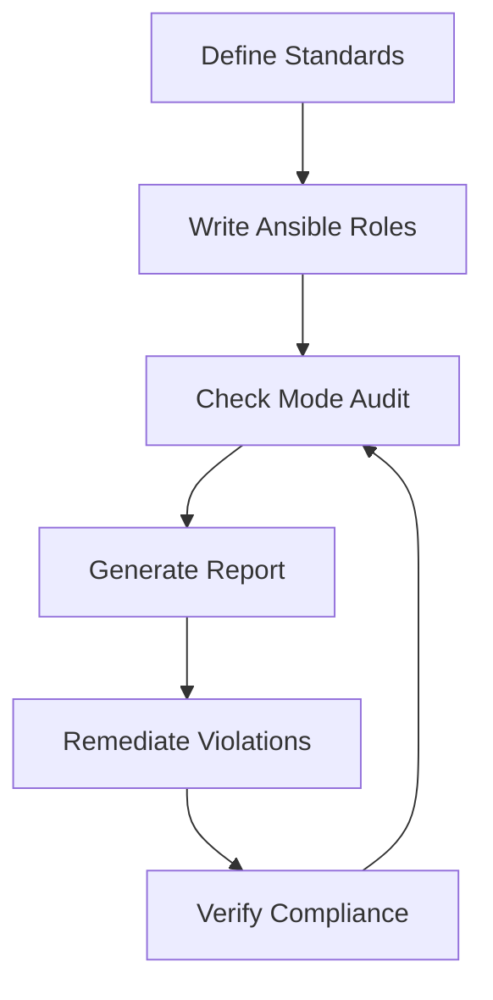

# How to Use Ansible for Compliance Automation

Author: [nawazdhandala](https://www.github.com/nawazdhandala)

Tags: Ansible, Compliance, Security, CIS Benchmark

Description: Automate compliance checks and remediation with Ansible to enforce CIS benchmarks, SOC 2 controls, and security baselines across your infrastructure.

---

Compliance is not a checkbox you tick once. It requires continuous verification that your systems meet security standards. Ansible can both check compliance status and remediate violations, turning compliance from a periodic audit exercise into continuous enforcement.

This post covers automating compliance with Ansible.

## Compliance Framework


```mermaid
graph TD
    A[Define Standards] --> B[Write Ansible Roles]
    B --> C[Check Mode Audit]
    C --> D[Generate Report]
    D --> E[Remediate Violations]
    E --> F[Verify Compliance]
    F --> C
```

## CIS Benchmark Implementation

The CIS (Center for Internet Security) benchmarks define security configurations. Here is how to implement a CIS-style baseline as Ansible tasks:

```yaml
# roles/cis_baseline/tasks/main.yml

# Example baseline tasks for Ubuntu 22.04
---
- name: "CIS 1.1.1 - Disable unused filesystems"
  ansible.builtin.template:
    src: disable-filesystems.conf.j2
    dest: /etc/modprobe.d/cis-disable-filesystems.conf
    mode: '0644'
  tags: [cis, cis-1.1.1]

- name: "CIS 1.4.1 - Ensure permissions on bootloader config"
  ansible.builtin.file:
    path: /boot/grub/grub.cfg
    owner: root
    group: root
    mode: '0400'
  tags: [cis, cis-1.4.1]

- name: "SSH - Ensure permissions on sshd_config"
  ansible.builtin.file:
    path: /etc/ssh/sshd_config
    owner: root
    group: root
    mode: '0600'
  tags: [cis, ssh]

- name: "SSH - Ensure LogLevel is set to INFO"
  ansible.builtin.lineinfile:
    path: /etc/ssh/sshd_config
    regexp: '^\s*#?\s*LogLevel\s+'
    line: 'LogLevel INFO'
    validate: /usr/sbin/sshd -t -f %s
  notify: restart sshd
  tags: [cis, ssh]

- name: "SSH - Set MaxAuthTries to 4"
  ansible.builtin.lineinfile:
    path: /etc/ssh/sshd_config
    regexp: '^\s*#?\s*MaxAuthTries\s+'
    line: 'MaxAuthTries 4'
    validate: /usr/sbin/sshd -t -f %s
  notify: restart sshd
  tags: [cis, ssh]

- name: "SSH - Disable root login"
  ansible.builtin.lineinfile:
    path: /etc/ssh/sshd_config
    regexp: '^\s*#?\s*PermitRootLogin\s+'
    line: 'PermitRootLogin no'
    validate: /usr/sbin/sshd -t -f %s
  notify: restart sshd
  tags: [cis, ssh]

- name: "SSH - Disable empty passwords"
  ansible.builtin.lineinfile:
    path: /etc/ssh/sshd_config
    regexp: '^\s*#?\s*PermitEmptyPasswords\s+'
    line: 'PermitEmptyPasswords no'
    validate: /usr/sbin/sshd -t -f %s
  notify: restart sshd
  tags: [cis, ssh]

- name: "CIS 5.4.1.1 - Ensure password expiration is 365 days"
  ansible.builtin.lineinfile:
    path: /etc/login.defs
    regexp: '^PASS_MAX_DAYS'
    line: 'PASS_MAX_DAYS 365'
  tags: [cis, cis-5.4.1.1, passwords]

- name: "CIS 6.1.2 - Ensure permissions on /etc/passwd"
  ansible.builtin.file:
    path: /etc/passwd
    owner: root
    group: root
    mode: '0644'
  tags: [cis, cis-6.1.2]

- name: "CIS 6.1.3 - Ensure permissions on /etc/shadow"
  ansible.builtin.file:
    path: /etc/shadow
    owner: root
    group: shadow
    mode: '0640'
  tags: [cis, cis-6.1.3]
```

## Compliance Audit Mode

Run compliance checks without making changes:

```yaml
# playbooks/compliance-audit.yml
# Audit compliance without remediation
---
- name: Compliance audit
  hosts: all
  become: true

  tasks:
    - name: Run CIS baseline in check mode
      ansible.builtin.include_role:
        name: cis_baseline
        apply:
          check_mode: true

    - name: Report findings
      ansible.builtin.debug:
        msg: |
          Host: {{ inventory_hostname }}
          Findings: Review changed tasks in the check-mode output
```

## Compliance Reporting

Generate detailed compliance reports:

```yaml
# playbooks/compliance-report.yml
# Generate compliance reports for auditors
---
- name: Generate compliance report
  hosts: all
  become: true
  vars:
    approved_services:
      - cron.service
      - dbus.service
      - ssh.service
      - systemd-journald.service
      - systemd-logind.service
    expected_file_permissions:
      /etc/passwd: '0644'
      /etc/shadow: '0640'
      /etc/group: '0644'
      /etc/gshadow: '0640'
      /boot/grub/grub.cfg: '0400'

  tasks:
    - name: Check SSH configuration compliance
      ansible.builtin.command: sshd -T
      register: sshd_config
      changed_when: false

    - name: Check file permissions
      ansible.builtin.stat:
        path: "{{ item.key }}"
      register: file_perms
      loop: "{{ expected_file_permissions | dict2items }}"

    - name: Check for unnecessary services
      ansible.builtin.service_facts:

    - name: Identify unauthorized services
      ansible.builtin.set_fact:
        unauthorized_services: >-
          {{ ansible_facts.services | dict2items
             | selectattr('value.state', 'equalto', 'running')
             | map(attribute='key')
             | difference(approved_services)
             | list }}

    - name: Identify file permission findings
      ansible.builtin.set_fact:
        file_permission_findings: >-
          {{ file_permission_findings | default([])
             + ([item.item.key] if (not item.stat.exists | default(false) or item.stat.mode != item.item.value) else []) }}
      loop: "{{ file_perms.results }}"

    - name: Compile host compliance data
      ansible.builtin.set_fact:
        host_compliance:
          hostname: "{{ inventory_hostname }}"
          ssh_root_login: "{{ (sshd_config.stdout_lines | select('match', '^permitrootlogin\\s+no$') | list | length) > 0 }}"
          file_permissions_ok: "{{ file_permission_findings | default([]) | length == 0 }}"
          file_permission_findings: "{{ file_permission_findings | default([]) }}"
          unauthorized_services: "{{ unauthorized_services }}"
          timestamp: "{{ ansible_date_time.iso8601 }}"

- name: Compile and distribute report
  hosts: localhost
  connection: local
  tasks:
    - name: Ensure report directory exists
      ansible.builtin.file:
        path: ./reports
        state: directory
        mode: '0755'

    - name: Generate HTML compliance report
      ansible.builtin.template:
        src: compliance-report.html.j2
        dest: "./reports/compliance-{{ ansible_date_time.date }}.html"
        mode: '0644'

    - name: Send report to compliance team
      community.general.mail:
        host: "{{ smtp_host }}"
        to: compliance@example.com
        subject: "Compliance Report - {{ ansible_date_time.date }}"
        body: "See attached compliance report."
        attach:
          - "./reports/compliance-{{ ansible_date_time.date }}.html"
```

## Automated Remediation

When violations are found, fix them:

```yaml
# playbooks/remediate-compliance.yml
# Fix compliance violations
---
- name: Remediate compliance violations
  hosts: all
  become: true

  tasks:
    - name: Apply CIS baseline (full remediation)
      ansible.builtin.include_role:
        name: cis_baseline
        apply:
          diff: true

    - name: Log remediation run
      ansible.builtin.lineinfile:
        path: /var/log/compliance-remediation.log
        line: "{{ ansible_date_time.iso8601 }} - cis_baseline remediation completed"
        create: true
        mode: '0644'
```

## Schedule Continuous Compliance

```yaml
# roles/compliance_scheduler/tasks/main.yml
---
- name: Schedule daily compliance audit
  ansible.builtin.cron:
    name: "Daily compliance audit"
    hour: "6"
    minute: "0"
    job: >
      ansible-playbook /opt/ansible/playbooks/compliance-audit.yml
      --check --diff
      >> /var/log/compliance-audit.log 2>&1

- name: Schedule weekly remediation
  ansible.builtin.cron:
    name: "Weekly compliance remediation"
    weekday: "0"
    hour: "2"
    minute: "0"
    job: >
      ansible-playbook /opt/ansible/playbooks/remediate-compliance.yml
      >> /var/log/compliance-remediation.log 2>&1
```

## Key Takeaways

Compliance automation with Ansible turns security standards like CIS benchmarks into executable code. Run compliance checks in audit mode (check mode) to generate reports without making changes. Use full runs for remediation. Schedule daily audits and weekly remediation. Generate reports that auditors can use during compliance reviews. The key benefit is that compliance becomes continuous rather than periodic, catching violations when they happen instead of months later during an audit.
