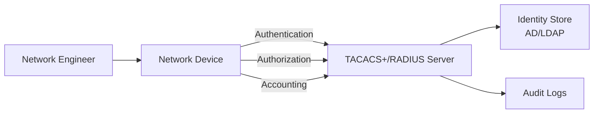

# How to Use Ansible to Configure AAA on Network Devices

Author: [nawazdhandala](https://www.github.com/nawazdhandala)

Tags: Ansible, AAA, TACACS, RADIUS, Network Security

Description: Automate AAA (Authentication, Authorization, Accounting) configuration on network devices using Ansible for centralized access control and audit logging.

---

AAA stands for Authentication, Authorization, and Accounting. It is the framework that controls who can log into your network devices, what they can do once they are in, and what gets logged for audit purposes. Configuring AAA consistently across every router and switch is critical for security, and it is exactly the kind of repetitive, high-stakes task that benefits from automation.

In this post, I will show you how to deploy TACACS+ and RADIUS-based AAA configurations with Ansible, including local fallback, command authorization, and accounting.

## AAA Overview



- **Authentication** - Proves the user is who they claim to be (username/password, certificate, etc.)
- **Authorization** - Determines what the authenticated user is allowed to do (which commands, which privilege levels)
- **Accounting** - Records what the user actually did (command logging, session tracking)

## AAA Configuration Variables

Define your AAA infrastructure in group variables.

```yaml
# group_vars/all_network/aaa.yml - AAA configuration baseline
---
aaa_config:
  # TACACS+ servers (primary auth/authz)
  tacacs_servers:
    - name: tacacs-primary
      address: 10.10.1.20
      key: "{{ vault_tacacs_key }}"
      timeout: 5
    - name: tacacs-secondary
      address: 10.10.1.21
      key: "{{ vault_tacacs_key }}"
      timeout: 5

  # RADIUS servers (optional, for 802.1X or wireless)
  radius_servers:
    - name: radius-primary
      address: 10.10.1.30
      key: "{{ vault_radius_key }}"
      auth_port: 1812
      acct_port: 1813

  # Local fallback accounts
  local_users:
    - name: admin
      privilege: 15
      secret: "{{ vault_local_admin_password }}"
      algorithm: sha256
    - name: readonly
      privilege: 1
      secret: "{{ vault_local_readonly_password }}"
      algorithm: sha256

  # Source interface for TACACS/RADIUS packets
  source_interface: Loopback0

  # Login banner
  banner: |
    *** WARNING ***
    This system is for authorized use only.
    All activity is monitored and recorded.
    Unauthorized access is prohibited.
```

## Deploying TACACS+ Configuration

Start with the TACACS+ server definitions and AAA method lists.

```yaml
# deploy_aaa_tacacs.yml - Configure TACACS+ and AAA on Cisco IOS devices
---
- name: Deploy AAA with TACACS+
  hosts: all_network
  gather_facts: false
  connection: network_cli

  tasks:
    # Enable AAA new-model
    - name: Enable AAA
      cisco.ios.ios_config:
        lines:
          - aaa new-model

    # Configure TACACS+ server groups
    - name: Configure TACACS+ servers
      cisco.ios.ios_config:
        lines:
          - "address ipv4 {{ item.address }}"
          - "key {{ item.key }}"
          - "timeout {{ item.timeout }}"
        parents: "tacacs server {{ item.name }}"
      loop: "{{ aaa_config.tacacs_servers }}"
      no_log: true

    # Create TACACS server group
    - name: Configure TACACS server group
      cisco.ios.ios_config:
        lines:
          - "server name {{ item.name }}"
        parents: aaa group server tacacs+ TACACS_SERVERS
      loop: "{{ aaa_config.tacacs_servers }}"

    # Set source interface for TACACS
    - name: Set TACACS source interface
      cisco.ios.ios_config:
        lines:
          - "ip tacacs source-interface {{ aaa_config.source_interface }}"

    # Configure authentication method lists
    - name: Configure login authentication
      cisco.ios.ios_config:
        lines:
          # Default auth uses TACACS then falls back to local
          - aaa authentication login default group TACACS_SERVERS local
          # Console auth uses local only (in case TACACS is unreachable)
          - aaa authentication login CONSOLE local
          # Enable authentication
          - aaa authentication enable default group TACACS_SERVERS enable

    # Configure authorization
    - name: Configure command authorization
      cisco.ios.ios_config:
        lines:
          # Authorize exec sessions via TACACS
          - aaa authorization exec default group TACACS_SERVERS local
          # Authorize all commands at privilege level 15
          - aaa authorization commands 15 default group TACACS_SERVERS local
          # Authorize configuration commands
          - aaa authorization config-commands

    # Configure accounting
    - name: Configure accounting
      cisco.ios.ios_config:
        lines:
          # Log all exec sessions (login/logout)
          - aaa accounting exec default start-stop group TACACS_SERVERS
          # Log all commands at all privilege levels
          - aaa accounting commands 0 default start-stop group TACACS_SERVERS
          - aaa accounting commands 15 default start-stop group TACACS_SERVERS
          # Log configuration changes
          - aaa accounting system default start-stop group TACACS_SERVERS
```

## Configuring Local Fallback Users

Always configure local accounts as a fallback for when TACACS/RADIUS servers are unreachable.

```yaml
# configure_local_users.yml - Set up local fallback accounts
---
- name: Configure local fallback users
  hosts: all_network
  gather_facts: false
  connection: network_cli

  tasks:
    # Create local user accounts with strong passwords
    - name: Configure local users
      cisco.ios.ios_config:
        lines:
          - "username {{ item.name }} privilege {{ item.privilege }} algorithm-type {{ item.algorithm }} secret {{ item.secret }}"
      loop: "{{ aaa_config.local_users }}"
      no_log: true

    # Remove any unauthorized local accounts
    - name: Get current local users
      cisco.ios.ios_command:
        commands:
          - show running-config | include ^username
      register: current_users

    # Identify authorized usernames
    - name: Build authorized user list
      ansible.builtin.set_fact:
        authorized_users: "{{ aaa_config.local_users | map(attribute='name') | list }}"

    - name: Report unauthorized users
      ansible.builtin.debug:
        msg: "WARNING: Unauthorized local user found: {{ item }}"
      loop: "{{ current_users.stdout[0] | regex_findall('username (\\S+)') }}"
      when: item not in authorized_users
```

## Configuring VTY and Console Lines

Apply the AAA method lists to the device access lines.

```yaml
# configure_access_lines.yml - Apply AAA to VTY and console lines
---
- name: Configure device access lines
  hosts: all_network
  gather_facts: false
  connection: network_cli

  tasks:
    # Configure console port
    - name: Configure console line
      cisco.ios.ios_config:
        lines:
          - login authentication CONSOLE
          - exec-timeout 10 0
          - logging synchronous
        parents: line console 0

    # Configure VTY lines for SSH access
    - name: Configure VTY lines
      cisco.ios.ios_config:
        lines:
          - login authentication default
          - authorization exec default
          - accounting exec default
          - accounting commands 15 default
          - transport input ssh
          - exec-timeout 30 0
          - access-class VTY_ACCESS in
        parents: line vty 0 15

    # Configure login banner
    - name: Set login banner
      cisco.ios.ios_config:
        lines:
          - "banner login ^{{ aaa_config.banner }}^"

    # Configure MOTD banner
    - name: Set MOTD banner
      cisco.ios.ios_config:
        lines:
          - "banner motd ^{{ aaa_config.banner }}^"
```

## Adding RADIUS Configuration

If you also use RADIUS (for example, for 802.1X or wireless authentication), add RADIUS servers alongside TACACS+.

```yaml
# configure_radius.yml - Add RADIUS server configuration
---
- name: Configure RADIUS servers
  hosts: all_network
  gather_facts: false
  connection: network_cli

  tasks:
    - name: Configure RADIUS servers
      cisco.ios.ios_config:
        lines:
          - "address ipv4 {{ item.address }} auth-port {{ item.auth_port }} acct-port {{ item.acct_port }}"
          - "key {{ item.key }}"
        parents: "radius server {{ item.name }}"
      loop: "{{ aaa_config.radius_servers }}"
      no_log: true

    # Create RADIUS server group
    - name: Configure RADIUS server group
      cisco.ios.ios_config:
        lines:
          - "server name {{ item.name }}"
        parents: aaa group server radius RADIUS_SERVERS
      loop: "{{ aaa_config.radius_servers }}"

    # Configure 802.1X authentication using RADIUS
    - name: Configure dot1x authentication
      cisco.ios.ios_config:
        lines:
          - aaa authentication dot1x default group RADIUS_SERVERS
          - aaa authorization network default group RADIUS_SERVERS
```

## AAA Verification

After deploying AAA, verify that everything is working correctly.

```yaml
# verify_aaa.yml - Validate AAA configuration is correct and functional
---
- name: Verify AAA configuration
  hosts: all_network
  gather_facts: false
  connection: network_cli

  tasks:
    # Check AAA is enabled
    - name: Verify AAA new-model
      cisco.ios.ios_command:
        commands:
          - show running-config | include aaa new-model
      register: aaa_enabled

    - name: Assert AAA is enabled
      ansible.builtin.assert:
        that:
          - "'aaa new-model' in aaa_enabled.stdout[0]"
        fail_msg: "AAA is not enabled on {{ inventory_hostname }}!"

    # Check TACACS server reachability
    - name: Test TACACS server reachability
      cisco.ios.ios_command:
        commands:
          - "show tacacs"
      register: tacacs_status

    - name: Display TACACS status
      ansible.builtin.debug:
        var: tacacs_status.stdout_lines[0]

    # Check AAA method lists
    - name: Verify authentication method lists
      cisco.ios.ios_command:
        commands:
          - show aaa method-lists all
      register: method_lists

    - name: Display method lists
      ansible.builtin.debug:
        var: method_lists.stdout_lines[0]

    # Check local user accounts
    - name: Verify local users exist
      cisco.ios.ios_command:
        commands:
          - show running-config | include ^username
      register: users

    - name: Verify admin user exists
      ansible.builtin.assert:
        that:
          - "'username admin' in users.stdout[0]"
        fail_msg: "Local admin account missing on {{ inventory_hostname }}"
        success_msg: "Local admin account present"

    # Check VTY configuration
    - name: Verify VTY settings
      cisco.ios.ios_command:
        commands:
          - show running-config | section line vty
      register: vty_config

    - name: Verify SSH-only access
      ansible.builtin.assert:
        that:
          - "'transport input ssh' in vty_config.stdout[0]"
        fail_msg: "VTY is not restricted to SSH on {{ inventory_hostname }}"
        success_msg: "VTY is SSH-only"
```

## Key Rotation Playbook

Periodically rotating TACACS+ and RADIUS keys is a security best practice.

```yaml
# rotate_aaa_keys.yml - Rotate TACACS and RADIUS shared secrets
---
- name: Rotate AAA server keys
  hosts: all_network
  gather_facts: false
  connection: network_cli

  tasks:
    # Update TACACS keys
    - name: Update TACACS server keys
      cisco.ios.ios_config:
        lines:
          - "key {{ vault_new_tacacs_key }}"
        parents: "tacacs server {{ item.name }}"
      loop: "{{ aaa_config.tacacs_servers }}"
      no_log: true

    # Verify TACACS still works after key change
    - name: Test TACACS connectivity
      cisco.ios.ios_command:
        commands:
          - "test aaa group TACACS_SERVERS admin {{ vault_test_password }} new-code"
      register: tacacs_test
      ignore_errors: true

    - name: Report key rotation status
      ansible.builtin.debug:
        msg: "{{ inventory_hostname }}: TACACS key rotation {{ 'succeeded' if tacacs_test is succeeded else 'FAILED' }}"
```

AAA automation with Ansible ensures that every device in your network has the same authentication standards, the same authorization rules, and the same accounting configuration. When you need to add a new TACACS server, rotate keys, or tighten authorization policies, you update the variables and run the playbook. Consistent security at scale, without the manual effort.
