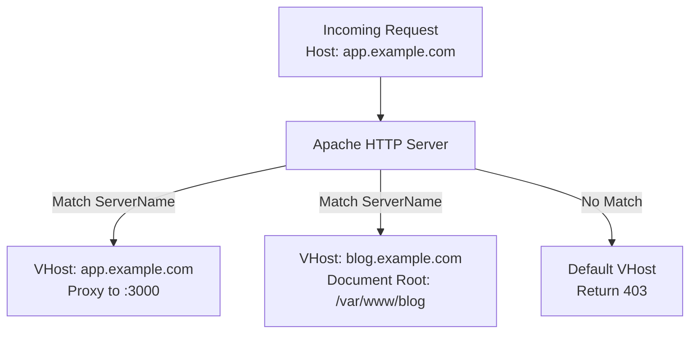
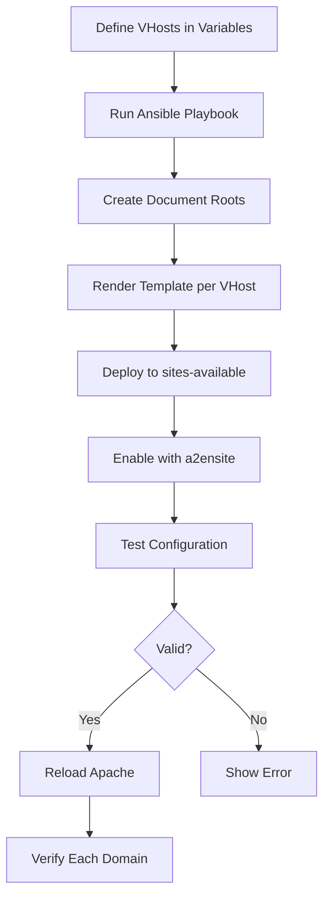

# How to Use Ansible to Configure Apache Virtual Hosts

Author: [nawazdhandala](https://www.github.com/nawazdhandala)

Tags: Ansible, Apache, Virtual Hosts, Web Hosting

Description: Manage multiple Apache virtual hosts for different websites and applications using Ansible templates with SSL and proxy support.

---

Apache virtual hosts let a single server handle multiple websites, each with its own domain name, document root, and configuration. On a shared hosting server or a multi-application deployment, you might have a dozen virtual hosts on one machine. Managing them by hand leads to inconsistencies: one vhost has security headers, another does not; one enables compression, another forgot. Ansible brings order to the chaos by templating your virtual hosts and deploying them consistently.

This guide covers managing Apache virtual hosts with Ansible, from basic static sites to complex proxy configurations.

## How Apache Virtual Hosts Work

Apache uses the `ServerName` directive to match incoming requests to virtual host configurations. When a request comes in, Apache checks the `Host` header against all defined virtual hosts and routes the request to the matching one.



## Defining Virtual Hosts as Variables

Define all your virtual hosts in a clean variable structure.

```yaml
# group_vars/apache_servers.yml
---
apache_vhosts:
  - name: company-website
    domain: www.example.com
    aliases:
      - example.com
    type: static
    document_root: /var/www/example.com/public
    ssl:
      enabled: true
      cert: /etc/letsencrypt/live/www.example.com/fullchain.pem
      key: /etc/letsencrypt/live/www.example.com/privkey.pem
    options:
      allow_override: All
      directory_index: index.html index.php
      enable_compression: true
      custom_headers:
        - "Cache-Control: public, max-age=3600"

  - name: app-backend
    domain: app.example.com
    type: proxy
    proxy_pass: "http://127.0.0.1:3000"
    ssl:
      enabled: true
      cert: /etc/letsencrypt/live/app.example.com/fullchain.pem
      key: /etc/letsencrypt/live/app.example.com/privkey.pem
    options:
      client_max_body: "50M"
      proxy_timeout: 120
      websocket_support: true

  - name: api-service
    domain: api.example.com
    type: proxy
    proxy_pass: "http://127.0.0.1:8080"
    ssl:
      enabled: true
      cert: /etc/letsencrypt/live/api.example.com/fullchain.pem
      key: /etc/letsencrypt/live/api.example.com/privkey.pem
    options:
      rate_limiting: true
      cors_enabled: true
      cors_origins: "https://www.example.com https://app.example.com"

  - name: staging
    domain: staging.example.com
    type: proxy
    proxy_pass: "http://127.0.0.1:3001"
    ssl:
      enabled: true
      cert: /etc/letsencrypt/live/staging.example.com/fullchain.pem
      key: /etc/letsencrypt/live/staging.example.com/privkey.pem
    options:
      basic_auth: true
      auth_user_file: /etc/apache2/.htpasswd-staging
```

## The Virtual Host Template

A single Jinja2 template handles all virtual host types.

```jinja2
# templates/apache-vhost.conf.j2
# Virtual host for {{ vhost.domain }} - managed by Ansible
# Type: {{ vhost.type }}

# HTTP - redirect to HTTPS if SSL enabled
<VirtualHost *:80>
    ServerName {{ vhost.domain }}

    ServerAlias {{ alias }}



    # Redirect all HTTP traffic to HTTPS
    RewriteEngine On
    RewriteCond %{HTTPS} off
    RewriteRule ^(.*)$ https://{{ vhost.domain }}$1 [R=301,L]

    # Serving on HTTP (no SSL configured)


    DocumentRoot {{ vhost.document_root }}
    <Directory {{ vhost.document_root }}>
        Options -Indexes +FollowSymLinks
        AllowOverride {{ vhost.options.allow_override | default('None') }}
        Require all granted
    </Directory>

    ProxyPreserveHost On
    ProxyPass / {{ vhost.proxy_pass }}/
    ProxyPassReverse / {{ vhost.proxy_pass }}/



    ErrorLog ${APACHE_LOG_DIR}/{{ vhost.name }}_error.log
    CustomLog ${APACHE_LOG_DIR}/{{ vhost.name }}_access.log combined
</VirtualHost>


# HTTPS virtual host
<VirtualHost *:443>
    ServerName {{ vhost.domain }}

    ServerAlias {{ alias }}

    ServerAdmin {{ apache_server_admin | default('admin@example.com') }}

    # SSL Configuration
    SSLEngine on
    SSLCertificateFile {{ vhost.ssl.cert }}
    SSLCertificateKeyFile {{ vhost.ssl.key }}


    # Static file serving
    DocumentRoot {{ vhost.document_root }}

    <Directory {{ vhost.document_root }}>
        Options -Indexes +FollowSymLinks
        AllowOverride {{ vhost.options.allow_override | default('None') }}
        Require all granted

        DirectoryIndex {{ vhost.options.directory_index }}

    </Directory>


    # Compression
    <IfModule mod_deflate.c>
        AddOutputFilterByType DEFLATE text/html text/plain text/xml text/css
        AddOutputFilterByType DEFLATE application/javascript application/json
        AddOutputFilterByType DEFLATE application/xml application/xhtml+xml
    </IfModule>



    # Reverse proxy configuration
    ProxyPreserveHost On
    ProxyRequests Off


    LimitRequestBody {{ vhost.options.client_max_body | regex_replace('[^0-9]', '') | int * 1048576 }}


    <Location />
        ProxyPass {{ vhost.proxy_pass }}/
        ProxyPassReverse {{ vhost.proxy_pass }}/

        ProxyTimeout {{ vhost.options.proxy_timeout }}

    </Location>


    # WebSocket support
    RewriteEngine On
    RewriteCond %{HTTP:Upgrade} websocket [NC]
    RewriteCond %{HTTP:Connection} upgrade [NC]
    RewriteRule ^/?(.*) "ws://{{ vhost.proxy_pass | regex_replace('^http://', '') }}/$1" [P,L]



    # CORS headers
    Header always set Access-Control-Allow-Origin "{{ vhost.options.cors_origins | default('*') }}"
    Header always set Access-Control-Allow-Methods "GET, POST, PUT, DELETE, OPTIONS"
    Header always set Access-Control-Allow-Headers "Authorization, Content-Type"
    Header always set Access-Control-Max-Age "3600"




    # Basic authentication
    <Location />
        AuthType Basic
        AuthName "Restricted Access"
        AuthUserFile {{ vhost.options.auth_user_file }}
        Require valid-user
    </Location>



    # Rate limiting (requires mod_ratelimit)
    <IfModule mod_ratelimit.c>
        <Location />
            SetOutputFilter RATE_LIMIT
            SetEnv rate-limit 1024
        </Location>
    </IfModule>



    Header always set {{ header }}


    # Security headers
    Header always set X-Frame-Options "SAMEORIGIN"
    Header always set X-Content-Type-Options "nosniff"

    # Logging
    ErrorLog ${APACHE_LOG_DIR}/{{ vhost.name }}_ssl_error.log
    CustomLog ${APACHE_LOG_DIR}/{{ vhost.name }}_ssl_access.log combined
</VirtualHost>

```

## The Deployment Playbook

```yaml
# playbooks/deploy-apache-vhosts.yml
---
- name: Deploy Apache virtual hosts
  hosts: apache_servers
  become: true

  tasks:
    - name: Create document root directories for static sites
      ansible.builtin.file:
        path: "{{ item.document_root }}"
        state: directory
        owner: www-data
        group: www-data
        mode: "0755"
      loop: "{{ apache_vhosts | selectattr('type', 'equalto', 'static') | list }}"
      loop_control:
        label: "{{ item.domain }}"

    - name: Deploy each virtual host configuration
      ansible.builtin.template:
        src: ../templates/apache-vhost.conf.j2
        dest: "/etc/apache2/sites-available/{{ item.name }}.conf"
        mode: "0644"
      vars:
        vhost: "{{ item }}"
      loop: "{{ apache_vhosts }}"
      loop_control:
        label: "{{ item.domain }}"
      notify: Test and reload Apache

    - name: Enable each virtual host
      ansible.builtin.command:
        cmd: "a2ensite {{ item.name }}"
      loop: "{{ apache_vhosts }}"
      loop_control:
        label: "{{ item.name }}"
      register: enable_result
      changed_when: "'Enabling' in enable_result.stdout"

    - name: Disable the default site
      ansible.builtin.command:
        cmd: a2dissite 000-default
      register: disable_default
      changed_when: "'disabled' in disable_default.stdout"
      failed_when: false

    - name: Deploy a catch-all default virtual host
      ansible.builtin.copy:
        dest: /etc/apache2/sites-available/000-default.conf
        content: |
          # Default catch-all virtual host - managed by Ansible
          # Returns 403 for requests that do not match any configured domain
          <VirtualHost *:80>
              ServerName _default_
              <Location />
                  Require all denied
              </Location>
          </VirtualHost>
        mode: "0644"

    - name: Enable the catch-all default site
      ansible.builtin.command:
        cmd: a2ensite 000-default
      register: enable_default
      changed_when: "'Enabling' in enable_default.stdout"

  handlers:
    - name: Test and reload Apache
      ansible.builtin.command:
        cmd: apache2ctl configtest
      register: test_result
      changed_when: false
      notify: Reload Apache

    - name: Reload Apache
      ansible.builtin.systemd:
        name: apache2
        state: reloaded
```

## Managing Basic Authentication

For staging or internal sites that need password protection.

```yaml
# playbooks/manage-htpasswd.yml
---
- name: Manage Apache basic authentication files
  hosts: apache_servers
  become: true
  vars_files:
    - ../vault/apache-secrets.yml
  vars:
    htpasswd_files:
      - path: /etc/apache2/.htpasswd-staging
        users:
          - name: developer
            password: "{{ vault_staging_dev_password }}"
          - name: qa
            password: "{{ vault_staging_qa_password }}"

  tasks:
    - name: Create htpasswd entries for each file
      community.general.htpasswd:
        path: "{{ item.0.path }}"
        name: "{{ item.1.name }}"
        password: "{{ item.1.password }}"
        owner: root
        group: www-data
        mode: "0640"
      loop: "{{ htpasswd_files | subelements('users') }}"
      loop_control:
        label: "{{ item.0.path }} - {{ item.1.name }}"
      no_log: true
```

## Disabling and Removing Virtual Hosts

```yaml
# playbooks/disable-vhost.yml
---
- name: Disable and remove an Apache virtual host
  hosts: apache_servers
  become: true
  vars:
    vhost_to_remove: old-site

  tasks:
    - name: Disable the virtual host
      ansible.builtin.command:
        cmd: "a2dissite {{ vhost_to_remove }}"
      register: disable_result
      changed_when: "'disabled' in disable_result.stdout"
      failed_when: false

    - name: Remove the configuration file
      ansible.builtin.file:
        path: "/etc/apache2/sites-available/{{ vhost_to_remove }}.conf"
        state: absent
      notify: Reload Apache

  handlers:
    - name: Reload Apache
      ansible.builtin.systemd:
        name: apache2
        state: reloaded
```

## Virtual Host Verification

```yaml
# playbooks/verify-vhosts.yml
---
- name: Verify Apache virtual hosts
  hosts: apache_servers
  become: true

  tasks:
    - name: List all enabled sites
      ansible.builtin.command:
        cmd: apache2ctl -S
      register: vhost_list
      changed_when: false

    - name: Display virtual host configuration
      ansible.builtin.debug:
        msg: "{{ vhost_list.stdout_lines }}"

    - name: Test configuration syntax
      ansible.builtin.command:
        cmd: apache2ctl configtest
      register: config_test
      changed_when: false

    - name: Display config test result
      ansible.builtin.debug:
        msg: "{{ config_test.stderr }}"

    - name: Test each virtual host responds
      ansible.builtin.uri:
        url: "https://{{ item.domain }}"
        validate_certs: false
        status_code:
          - 200
          - 301
          - 302
          - 401
      loop: "{{ apache_vhosts | selectattr('ssl.enabled', 'equalto', true) | list }}"
      loop_control:
        label: "{{ item.domain }}"
      register: vhost_tests
      ignore_errors: true

    - name: Display test results
      ansible.builtin.debug:
        msg: "{{ item.item.domain }}: HTTP {{ item.status | default('ERROR') }}"
      loop: "{{ vhost_tests.results }}"
      loop_control:
        label: "{{ item.item.domain }}"
```

## Virtual Host Management Flow



## Production Tips

1. **Always deploy a catch-all default virtual host.** Without it, Apache serves the first defined virtual host for unrecognized domains, which can leak information.

2. **Use `a2ensite` and `a2dissite`** instead of symlinking manually. They handle the sites-available/sites-enabled pattern correctly and are idempotent.

3. **Separate SSL virtual hosts from HTTP virtual hosts.** Even though you can put both in one file, having them separated makes debugging easier.

4. **Log each virtual host separately.** Use `ErrorLog` and `CustomLog` with the site name in the filename. Searching through a single combined log for issues with one site is painful.

5. **Set `AllowOverride None` where possible.** Every request checks for `.htaccess` files up the directory tree. This adds filesystem lookups that slow down every request. Only enable `AllowOverride` for directories that genuinely need it (like WordPress installations).

## Conclusion

Managing Apache virtual hosts with Ansible turns a manual, file-editing task into a data-driven workflow. Define your sites as variables, use a universal template to generate configurations, and let Ansible handle deployment, enabling, and verification. Adding a new site or modifying an existing one becomes a variable change and a playbook run. This approach scales cleanly whether you are managing three sites or thirty.
