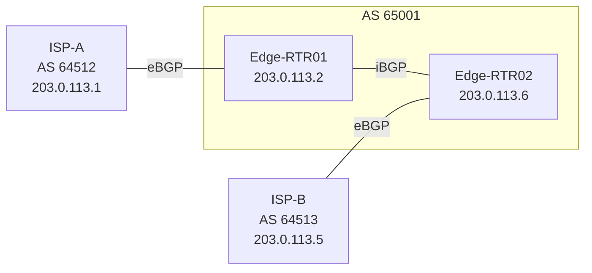

# How to Use Ansible to Configure BGP on Network Devices

Author: [nawazdhandala](https://www.github.com/nawazdhandala)

Tags: Ansible, BGP, Routing, Network Automation

Description: Automate BGP configuration on network devices with Ansible, covering eBGP peering, iBGP mesh, route policies, and operational verification.

---

BGP is the protocol that holds the internet together. In enterprise networks, it handles ISP peering, MPLS VPN connectivity, and increasingly, data center fabric routing. BGP configuration is also notoriously detailed and error-prone. A wrong AS number, a missing route map, or a misconfigured prefix list can have serious consequences.

Ansible takes the risk out of BGP deployment by letting you define your peering relationships and routing policies as code, test them before applying, and deploy them consistently across all edge routers.

## BGP Topology for This Guide

Here is the topology we will automate.



## Inventory Setup

```yaml
# inventory/bgp_routers.yml - Edge router inventory for BGP deployment
---
all:
  children:
    edge_routers:
      hosts:
        edge-rtr01:
          ansible_host: 10.1.1.1
          router_id: 10.255.0.1
          loopback_ip: 10.255.0.1
          ebgp_peer: 203.0.113.1
          ebgp_remote_as: "64512"
          ebgp_description: "ISP-A PRIMARY"
        edge-rtr02:
          ansible_host: 10.1.1.2
          router_id: 10.255.0.2
          loopback_ip: 10.255.0.2
          ebgp_peer: 203.0.113.5
          ebgp_remote_as: "64513"
          ebgp_description: "ISP-B BACKUP"
      vars:
        ansible_connection: ansible.netcommon.network_cli
        ansible_network_os: cisco.ios.ios
        local_as: "65001"
        ansible_user: admin
        ansible_password: "{{ vault_password }}"
        ansible_become: true
        ansible_become_method: enable
```

## BGP Global Configuration

The `ios_bgp_global` resource module manages the BGP process, neighbors, and global settings.

```yaml
# configure_bgp_global.yml - Set up BGP process and peer relationships
---
- name: Configure BGP global settings
  hosts: edge_routers
  gather_facts: false
  connection: network_cli

  tasks:
    - name: Configure BGP process and neighbors
      cisco.ios.ios_bgp_global:
        config:
          as_number: "{{ local_as }}"
          router_id: "{{ router_id }}"
          log_neighbor_changes: true
          bgp:
            bestpath:
              - compare_routerid: true
            graceful_shutdown:
              neighbors:
                time: 120
          neighbors:
            # eBGP peer to ISP
            - neighbor_address: "{{ ebgp_peer }}"
              remote_as: "{{ ebgp_remote_as }}"
              description: "{{ ebgp_description }}"
              timers:
                keepalive: 30
                holdtime: 90
              password: "{{ vault_bgp_password }}"
            # iBGP peer to other edge router
            - neighbor_address: "{{ hostvars['edge-rtr01'].loopback_ip if inventory_hostname == 'edge-rtr02' else hostvars['edge-rtr02'].loopback_ip }}"
              remote_as: "{{ local_as }}"
              description: "iBGP to peer edge router"
              update_source: Loopback0
        state: merged
      register: bgp_result

    - name: Show BGP changes
      ansible.builtin.debug:
        var: bgp_result.commands
      when: bgp_result.changed
```

## BGP Address Family Configuration

The `ios_bgp_address_family` module handles per-address-family settings like network advertisements, neighbor activation, and route maps.

```yaml
# configure_bgp_af.yml - Set up BGP address families and route policies
---
- name: Configure BGP address families
  hosts: edge_routers
  gather_facts: false
  connection: network_cli

  tasks:
    - name: Configure IPv4 unicast address family
      cisco.ios.ios_bgp_address_family:
        config:
          as_number: "{{ local_as }}"
          address_family:
            - afi: ipv4
              safi: unicast
              neighbors:
                # Activate eBGP peer
                - neighbor_address: "{{ ebgp_peer }}"
                  activate: true
                  soft_reconfiguration: true
                  prefix_list:
                    - name: ISP_INBOUND
                      in: true
                    - name: ISP_OUTBOUND
                      out: true
                # Activate iBGP peer
                - neighbor_address: "{{ hostvars['edge-rtr01'].loopback_ip if inventory_hostname == 'edge-rtr02' else hostvars['edge-rtr02'].loopback_ip }}"
                  activate: true
                  next_hop_self:
                    set: true
              networks:
                # Advertise our aggregate prefixes
                - address: 10.0.0.0
                  mask: 255.0.0.0
                - address: 172.16.0.0
                  mask: 255.240.0.0
              redistribute:
                - connected:
                    set: true
                    route_map: CONNECTED_TO_BGP
        state: merged
```

## Prefix Lists and Route Maps

BGP without proper filtering is dangerous. Always define prefix lists and route maps to control what you accept and advertise.

```yaml
# bgp_route_policy.yml - Create prefix lists and route maps for BGP
---
- name: Configure BGP routing policy
  hosts: edge_routers
  gather_facts: false
  connection: network_cli

  tasks:
    # Define what prefixes we will accept from ISPs
    - name: Create inbound prefix list
      cisco.ios.ios_config:
        lines:
          # Accept a default route
          - ip prefix-list ISP_INBOUND seq 10 permit 0.0.0.0/0
          # Accept specific prefixes if needed
          - ip prefix-list ISP_INBOUND seq 100 permit 0.0.0.0/0 le 24
          # Block anything longer than /24 to prevent hijack attempts
          - ip prefix-list ISP_INBOUND seq 900 deny 0.0.0.0/0 ge 25

    # Define what prefixes we will advertise to ISPs
    - name: Create outbound prefix list
      cisco.ios.ios_config:
        lines:
          # Only advertise our aggregate blocks
          - ip prefix-list ISP_OUTBOUND seq 10 permit 10.0.0.0/8
          - ip prefix-list ISP_OUTBOUND seq 20 permit 172.16.0.0/12
          # Deny everything else
          - ip prefix-list ISP_OUTBOUND seq 1000 deny 0.0.0.0/0 le 32

    # Define what connected routes get redistributed
    - name: Create connected redistribution prefix list
      cisco.ios.ios_config:
        lines:
          - ip prefix-list CONNECTED_FILTER seq 10 permit 10.0.0.0/8 le 30
          - ip prefix-list CONNECTED_FILTER seq 20 deny 0.0.0.0/0 le 32

    # Create route map for connected redistribution
    - name: Create connected redistribution route map
      cisco.ios.ios_config:
        lines:
          - match ip address prefix-list CONNECTED_FILTER
          - set community 65001:100
        parents: route-map CONNECTED_TO_BGP permit 10
```

## BGP Community Configuration

BGP communities are useful for tagging routes and applying policy decisions at scale.

```yaml
# bgp_communities.yml - Configure BGP community-based policies
---
- name: Configure BGP community handling
  hosts: edge_routers
  gather_facts: false
  connection: network_cli

  tasks:
    # Enable sending communities to iBGP peers
    - name: Configure community propagation
      cisco.ios.ios_config:
        lines:
          - "neighbor {{ hostvars['edge-rtr01'].loopback_ip if inventory_hostname == 'edge-rtr02' else hostvars['edge-rtr02'].loopback_ip }} send-community both"
        parents: "router bgp {{ local_as }}"

    # Create route map that sets local preference based on community
    - name: Configure local preference for ISP routes
      cisco.ios.ios_config:
        lines:
          - match community ISP_PRIMARY
          - set local-preference 200
        parents: route-map SET_LOCAL_PREF permit 10

    - name: Configure lower local preference for backup ISP
      cisco.ios.ios_config:
        lines:
          - match community ISP_BACKUP
          - set local-preference 100
        parents: route-map SET_LOCAL_PREF permit 20

    # Create community lists
    - name: Define community lists
      cisco.ios.ios_config:
        lines:
          - ip community-list standard ISP_PRIMARY permit 65001:100
          - ip community-list standard ISP_BACKUP permit 65001:200
```

## BGP Aggregate Routes

To keep your routing advertisements clean, configure aggregate routes with the suppress-map.

```yaml
# bgp_aggregation.yml - Configure BGP route aggregation
---
- name: Configure BGP route aggregation
  hosts: edge_routers
  gather_facts: false
  connection: network_cli

  tasks:
    # Create null routes for aggregates (required for BGP to advertise them)
    - name: Create null routes for aggregates
      cisco.ios.ios_static_routes:
        config:
          - address_families:
              - afi: ipv4
                routes:
                  - dest: 10.0.0.0/8
                    next_hops:
                      - interface: "Null0"
                        name: BGP_AGGREGATE
                        tag: 999
                  - dest: 172.16.0.0/12
                    next_hops:
                      - interface: "Null0"
                        name: BGP_AGGREGATE
                        tag: 999
        state: merged

    # Configure aggregate addresses in BGP
    - name: Configure BGP aggregates
      cisco.ios.ios_config:
        lines:
          - aggregate-address 10.0.0.0 255.0.0.0 summary-only
          - aggregate-address 172.16.0.0 255.240.0.0 summary-only
        parents:
          - "router bgp {{ local_as }}"
          - address-family ipv4 unicast
```

## BGP Verification Playbook

After deploying BGP, always verify that sessions are established and routes are being exchanged.

```yaml
# verify_bgp.yml - Comprehensive BGP verification after deployment
---
- name: Verify BGP deployment
  hosts: edge_routers
  gather_facts: false
  connection: network_cli

  tasks:
    - name: Check BGP summary
      cisco.ios.ios_command:
        commands:
          - show ip bgp summary
      register: bgp_summary

    - name: Display BGP summary
      ansible.builtin.debug:
        var: bgp_summary.stdout_lines[0]

    # Check that eBGP session is established
    - name: Verify eBGP session state
      cisco.ios.ios_command:
        commands:
          - "show ip bgp neighbors {{ ebgp_peer }} | include BGP state"
      register: ebgp_state

    - name: Assert eBGP session is established
      ansible.builtin.assert:
        that:
          - "'Established' in ebgp_state.stdout[0]"
        fail_msg: "eBGP session to {{ ebgp_peer }} is NOT established!"
        success_msg: "eBGP session to {{ ebgp_peer }} is established"

    # Check received and advertised route counts
    - name: Check received routes from ISP
      cisco.ios.ios_command:
        commands:
          - "show ip bgp neighbors {{ ebgp_peer }} received-routes | include Total"
      register: received_routes

    - name: Display received route count
      ansible.builtin.debug:
        var: received_routes.stdout_lines[0]

    - name: Check advertised routes to ISP
      cisco.ios.ios_command:
        commands:
          - "show ip bgp neighbors {{ ebgp_peer }} advertised-routes | include Total"
      register: advertised_routes

    - name: Display advertised route count
      ansible.builtin.debug:
        var: advertised_routes.stdout_lines[0]

    # Verify our aggregates are in the BGP table
    - name: Check for aggregate routes
      cisco.ios.ios_command:
        commands:
          - show ip bgp 10.0.0.0/8
          - show ip bgp 172.16.0.0/12
      register: aggregate_check

    - name: Display aggregate route status
      ansible.builtin.debug:
        msg: "Aggregate check: {{ item.stdout_lines[0] | default('NOT FOUND') }}"
      loop: "{{ aggregate_check.results }}"
```

## Gathering BGP State for Documentation

```yaml
# gather_bgp.yml - Export BGP state for documentation and comparison
---
- name: Gather BGP configuration state
  hosts: edge_routers
  gather_facts: false
  connection: network_cli

  tasks:
    - name: Gather BGP global config
      cisco.ios.ios_bgp_global:
        state: gathered
      register: bgp_global

    - name: Gather BGP address family config
      cisco.ios.ios_bgp_address_family:
        state: gathered
      register: bgp_af

    - name: Save BGP state
      ansible.builtin.copy:
        content: |
          {{ {'bgp_global': bgp_global.gathered, 'bgp_af': bgp_af.gathered} | to_nice_json }}
        dest: "state/{{ inventory_hostname }}_bgp.json"
      delegate_to: localhost
```

BGP automation with Ansible gives you the confidence to make changes to your most critical routing infrastructure. Every peering relationship, every route policy, every community tag is defined in code, reviewed before deployment, and applied consistently. That kind of discipline is what separates networks that stay up from networks that have outages during changes.
