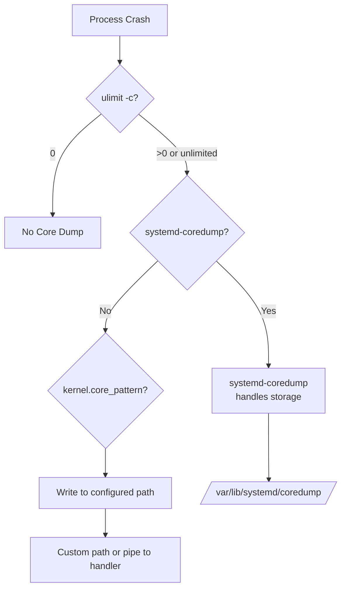

# How to Use Ansible to Configure Core Dump Settings

Author: [nawazdhandala](https://www.github.com/nawazdhandala)

Tags: Ansible, Core Dumps, Debugging, Linux Administration

Description: Configure and manage core dump settings across your Linux servers with Ansible for better crash debugging and security compliance.

---

Core dumps are snapshots of a process's memory at the time it crashes. They are invaluable for debugging application failures, but they also present security and storage challenges. A core dump can contain sensitive data like passwords, encryption keys, and customer information. On production servers, uncontrolled core dumps can fill up disks and expose secrets.

The right approach is to configure core dumps thoughtfully: enable them where debugging is needed, disable or restrict them where security is the priority, and set proper storage limits everywhere. Ansible makes it possible to apply these policies consistently across your fleet.

## Core Dump Configuration Options

Linux core dump behavior is controlled by several mechanisms:



## Disabling Core Dumps for Security

On production servers that do not need debugging, disabling core dumps is often the right call. CIS Benchmarks and security compliance frameworks typically require this:

```yaml
# disable-coredumps.yml - Disable core dumps for security compliance
---
- name: Disable core dumps on production servers
  hosts: production
  become: true

  tasks:
    # Set hard limit to 0 via limits.conf
    - name: Disable core dumps in limits.conf
      ansible.builtin.copy:
        dest: /etc/security/limits.d/99-no-coredump.conf
        owner: root
        group: root
        mode: '0644'
        content: |
          # Disable core dumps - Managed by Ansible
          * hard core 0
          * soft core 0

    # Set the sysctl to disable core dumps for SUID programs
    - name: Disable SUID core dumps via sysctl
      ansible.builtin.sysctl:
        name: fs.suid_dumpable
        value: "0"
        state: present
        sysctl_set: true
        reload: true

    # Configure systemd to not store core dumps
    - name: Configure systemd-coredump to disable storage
      ansible.builtin.copy:
        dest: /etc/systemd/coredump.conf.d/disable.conf
        owner: root
        group: root
        mode: '0644'
        content: |
          [Coredump]
          Storage=none
          ProcessSizeMax=0
      notify: reload systemd

    # Disable the core dump service
    - name: Mask systemd-coredump socket
      ansible.builtin.systemd:
        name: systemd-coredump.socket
        masked: true
      failed_when: false

    # Set the core pattern to /dev/null as a fallback
    - name: Set core_pattern to discard
      ansible.builtin.sysctl:
        name: kernel.core_pattern
        value: "|/bin/false"
        state: present
        sysctl_set: true
        reload: true

    # Verify core dumps are disabled
    - name: Verify core dump limits
      ansible.builtin.shell:
        cmd: "ulimit -c"
      register: core_limit
      changed_when: false

    - name: Display core dump status
      ansible.builtin.debug:
        msg: "{{ inventory_hostname }}: Core dump limit = {{ core_limit.stdout }} (should be 0)"

  handlers:
    - name: reload systemd
      ansible.builtin.systemd:
        daemon_reload: true
```

## Configuring Core Dumps for Development Servers

On development and staging servers, you want core dumps enabled so developers can debug crashes:

```yaml
# enable-coredumps.yml - Configure controlled core dumps for dev/staging
---
- name: Configure core dumps for development servers
  hosts: development:staging
  become: true

  vars:
    coredump_storage_path: /var/coredumps
    coredump_max_size_mb: 2048
    coredump_max_files: 10
    coredump_compress: true
    coredump_retention_days: 7

  tasks:
    # Create core dump storage directory
    - name: Create core dump storage directory
      ansible.builtin.file:
        path: "{{ coredump_storage_path }}"
        state: directory
        owner: root
        group: root
        mode: '1777'

    # Set core dump file size limits
    - name: Configure core dump limits
      ansible.builtin.copy:
        dest: /etc/security/limits.d/99-coredump.conf
        owner: root
        group: root
        mode: '0644'
        content: |
          # Core dump limits - Managed by Ansible
          * soft core unlimited
          * hard core unlimited

    # Configure the core pattern for where dumps are stored
    - name: Set core dump file pattern
      ansible.builtin.sysctl:
        name: kernel.core_pattern
        value: "{{ coredump_storage_path }}/core.%e.%p.%t"
        state: present
        sysctl_set: true
        reload: true

    # Allow SUID programs to dump core (needed for some debugging)
    - name: Configure SUID dumpable setting
      ansible.builtin.sysctl:
        name: fs.suid_dumpable
        value: "2"
        state: present
        sysctl_set: true
        reload: true

    # Configure systemd-coredump for managed storage
    - name: Configure systemd-coredump
      ansible.builtin.copy:
        dest: /etc/systemd/coredump.conf.d/custom.conf
        owner: root
        group: root
        mode: '0644'
        content: |
          [Coredump]
          Storage=external
          Compress={{ 'yes' if coredump_compress else 'no' }}
          ProcessSizeMax={{ coredump_max_size_mb }}M
          ExternalSizeMax={{ coredump_max_size_mb }}M
          MaxUse={{ coredump_max_size_mb * coredump_max_files }}M
          KeepFree=1024M
      notify: reload systemd

    # Set up cleanup cron job for old core dumps
    - name: Schedule core dump cleanup
      ansible.builtin.cron:
        name: "Clean old core dumps"
        minute: "0"
        hour: "3"
        job: "find {{ coredump_storage_path }} -name 'core.*' -mtime +{{ coredump_retention_days }} -delete"
        user: root

    # Install debugging tools
    - name: Install debugging tools
      ansible.builtin.yum:
        name:
          - gdb
          - crash
          - strace
        state: present
      when: ansible_os_family == "RedHat"

  handlers:
    - name: reload systemd
      ansible.builtin.systemd:
        daemon_reload: true
```

## Using systemd-coredump (Modern Approach)

On modern systems with systemd, `systemd-coredump` provides managed core dump handling:

```yaml
# systemd-coredump.yml - Configure systemd-coredump for managed core handling
---
- name: Configure systemd-coredump
  hosts: all
  become: true

  vars:
    coredump_storage: external  # 'none', 'external', or 'journal'
    coredump_compress: true
    coredump_max_size: "2G"
    coredump_keep_free: "1G"

  tasks:
    # Create the coredump configuration directory
    - name: Create coredump.conf.d directory
      ansible.builtin.file:
        path: /etc/systemd/coredump.conf.d
        state: directory
        mode: '0755'

    # Deploy the configuration
    - name: Configure systemd-coredump
      ansible.builtin.copy:
        dest: /etc/systemd/coredump.conf.d/ansible.conf
        mode: '0644'
        content: |
          # systemd-coredump configuration - Managed by Ansible
          [Coredump]
          Storage={{ coredump_storage }}
          Compress={{ 'yes' if coredump_compress else 'no' }}
          ProcessSizeMax={{ coredump_max_size }}
          ExternalSizeMax={{ coredump_max_size }}
          MaxUse={{ coredump_max_size }}
          KeepFree={{ coredump_keep_free }}
      notify: reload systemd

    # Set kernel core pattern to use systemd-coredump
    - name: Set core_pattern to systemd-coredump
      ansible.builtin.sysctl:
        name: kernel.core_pattern
        value: "|/usr/lib/systemd/systemd-coredump %P %u %g %s %t %c %h"
        state: present
        sysctl_set: true
        reload: true

    # List existing core dumps
    - name: List stored core dumps
      ansible.builtin.command:
        cmd: coredumpctl list --no-pager
      register: coredump_list
      changed_when: false
      failed_when: false

    - name: Display core dump inventory
      ansible.builtin.debug:
        var: coredump_list.stdout_lines

  handlers:
    - name: reload systemd
      ansible.builtin.systemd:
        daemon_reload: true
```

## Monitoring Core Dump Activity

Track core dumps across your fleet to identify unstable applications:

```yaml
# monitor-coredumps.yml - Monitor core dump activity
---
- name: Monitor core dumps across fleet
  hosts: all
  become: true

  tasks:
    # Check for recent core dumps using coredumpctl
    - name: Check for recent core dumps (systemd)
      ansible.builtin.shell:
        cmd: "coredumpctl list --since '7 days ago' --no-pager 2>/dev/null | tail -20 || echo 'No coredumpctl available'"
      register: recent_dumps
      changed_when: false

    # Check for core files on disk
    - name: Find core dump files on disk
      ansible.builtin.shell:
        cmd: "find /var/coredumps /var/lib/systemd/coredump /tmp -name 'core*' -type f -mtime -7 2>/dev/null | head -20 || echo 'None found'"
      register: core_files
      changed_when: false

    # Check disk usage of core dump storage
    - name: Check core dump storage usage
      ansible.builtin.shell:
        cmd: "du -sh /var/lib/systemd/coredump/ 2>/dev/null || du -sh /var/coredumps/ 2>/dev/null || echo '0 bytes'"
      register: dump_usage
      changed_when: false

    # Report findings
    - name: Display core dump report
      ansible.builtin.debug:
        msg:
          - "Host: {{ inventory_hostname }}"
          - "Recent dumps: {{ recent_dumps.stdout_lines | length }} entries"
          - "Core files on disk: {{ core_files.stdout_lines | length }}"
          - "Storage used: {{ dump_usage.stdout }}"
      when: recent_dumps.stdout != 'No coredumpctl available' or core_files.stdout != 'None found'

    # Alert on servers with many recent core dumps
    - name: Alert on excessive core dumps
      ansible.builtin.debug:
        msg: "WARNING: {{ inventory_hostname }} has {{ recent_dumps.stdout_lines | length }} core dumps in the last 7 days!"
      when:
        - recent_dumps.stdout != 'No coredumpctl available'
        - recent_dumps.stdout_lines | length > 5
```

## Auditing Core Dump Compliance

For security compliance, verify core dump settings match policy:

```yaml
# audit-coredump.yml - Audit core dump configuration for compliance
---
- name: Audit core dump compliance
  hosts: all
  become: true

  tasks:
    # Check ulimit settings
    - name: Check hard core limit
      ansible.builtin.shell:
        cmd: "grep -r 'core' /etc/security/limits.conf /etc/security/limits.d/ 2>/dev/null || echo 'No limits configured'"
      register: limits_check
      changed_when: false

    # Check sysctl settings
    - name: Check fs.suid_dumpable
      ansible.builtin.command:
        cmd: sysctl -n fs.suid_dumpable
      register: suid_dumpable
      changed_when: false

    - name: Check kernel.core_pattern
      ansible.builtin.command:
        cmd: sysctl -n kernel.core_pattern
      register: core_pattern
      changed_when: false

    # Check systemd-coredump config
    - name: Check systemd-coredump storage setting
      ansible.builtin.shell:
        cmd: "systemd-analyze cat-config systemd/coredump.conf 2>/dev/null | grep 'Storage=' | tail -1 || echo 'Not configured'"
      register: coredump_storage
      changed_when: false

    # Build compliance report
    - name: Generate compliance report
      ansible.builtin.set_fact:
        coredump_compliance:
          hostname: "{{ inventory_hostname }}"
          limits_configured: "{{ 'core' in limits_check.stdout }}"
          suid_dumpable: "{{ suid_dumpable.stdout }}"
          core_pattern: "{{ core_pattern.stdout }}"
          systemd_storage: "{{ coredump_storage.stdout | trim }}"
          compliant: "{{ suid_dumpable.stdout == '0' and '0' in limits_check.stdout }}"

    - name: Display compliance status
      ansible.builtin.debug:
        msg:
          - "{{ inventory_hostname }}: {{ 'COMPLIANT' if coredump_compliance.compliant else 'NON-COMPLIANT' }}"
          - "  suid_dumpable: {{ suid_dumpable.stdout }}"
          - "  core_pattern: {{ core_pattern.stdout }}"
          - "  limits: {{ limits_check.stdout_lines | first | default('none') }}"
```

## Practical Tips

From managing core dump configurations in production:

1. On production servers, disable core dumps unless you have a specific debugging need. The security risk of core dumps containing sensitive data usually outweighs the debugging convenience.

2. If you must enable core dumps on production, use `systemd-coredump` with `Storage=external` and `Compress=yes`. This gives you managed, compressed dumps with automatic space limits, rather than random core files appearing in the working directory.

3. Set `fs.suid_dumpable=0` on all production systems. This prevents SUID programs from creating core dumps that could contain elevated privilege data. Set it to 2 only on development systems where you need to debug SUID programs.

4. Monitor core dump activity. Frequent core dumps from the same application indicate a stability problem that needs investigation, not just cleanup.

5. Clean up core dumps on a schedule. Even with size limits, old core dumps waste disk space. A weekly cron job that removes dumps older than 7 days (or whatever your investigation SLA is) keeps storage under control.

6. Remember that core dumps can be very large. A process using 8 GB of memory will create an 8 GB core dump. Set `ProcessSizeMax` appropriately to avoid filling up your disk from a single crash.

Core dump configuration is a balance between debuggability and security. Ansible lets you apply the right policy to the right servers, whether that is disabling dumps entirely on production or enabling full debugging on development systems.
