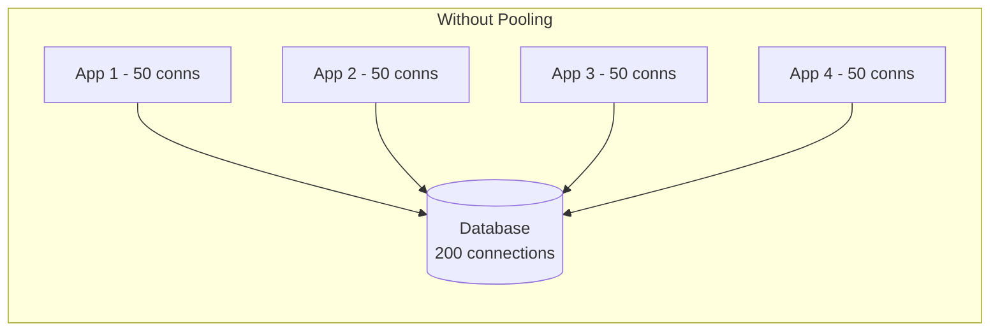
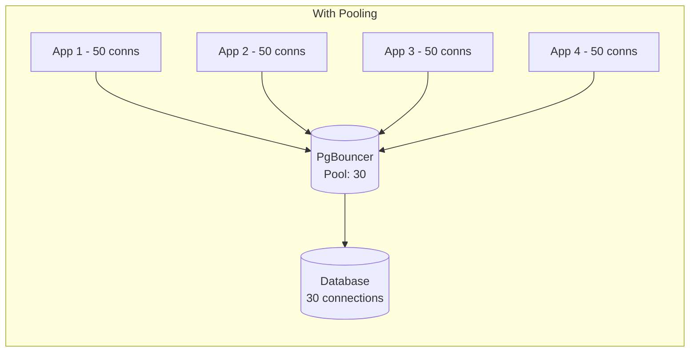

# How to Use Ansible to Configure Database Connection Pooling

Author: [nawazdhandala](https://www.github.com/nawazdhandala)

Tags: Ansible, Connection Pooling, PgBouncer, Database Performance

Description: Deploy and configure database connection poolers like PgBouncer and ProxySQL using Ansible for better database performance.

---

Every database connection costs memory and CPU. PostgreSQL forks a new process for each connection. MySQL allocates a thread. When you have 20 application instances each opening 50 connections, that is 1000 database connections. Most databases start struggling well before that number. Connection pooling solves this by maintaining a smaller pool of actual database connections and multiplexing application requests through them.

This guide covers deploying PgBouncer for PostgreSQL and ProxySQL for MySQL using Ansible.

## Why Connection Pooling Matters





With pooling, 200 application connections get multiplexed through 30 actual database connections. The database stays healthy, and you can scale your application tier independently.

## Inventory

```ini
# inventory/pooling.ini
[pgbouncer_servers]
pgbouncer-1 ansible_host=10.0.10.10
pgbouncer-2 ansible_host=10.0.10.11

[proxysql_servers]
proxysql-1 ansible_host=10.0.10.20

[pgbouncer_servers:vars]
ansible_user=ubuntu
pg_host=10.0.9.10
pg_port=5432

[proxysql_servers:vars]
ansible_user=ubuntu
mysql_host=10.0.9.20
mysql_port=3306
```

## Installing PgBouncer

PgBouncer is the standard connection pooler for PostgreSQL. It is lightweight, battle-tested, and simple to configure.

```yaml
# playbooks/install-pgbouncer.yml
---
- name: Install PgBouncer
  hosts: pgbouncer_servers
  become: true

  tasks:
    - name: Install PgBouncer package
      ansible.builtin.apt:
        name: pgbouncer
        state: present
        update_cache: true

    - name: Create PgBouncer log directory
      ansible.builtin.file:
        path: /var/log/pgbouncer
        state: directory
        owner: postgres
        group: postgres
        mode: "0750"

    - name: Ensure PgBouncer is enabled on boot
      ansible.builtin.systemd:
        name: pgbouncer
        enabled: true
```

## Configuring PgBouncer

The configuration has two parts: the main config file and the user authentication file.

```yaml
# playbooks/configure-pgbouncer.yml
---
- name: Configure PgBouncer
  hosts: pgbouncer_servers
  become: true
  vars_files:
    - ../vault/db-secrets.yml
  vars:
    pgbouncer_listen_port: 6432
    pgbouncer_pool_mode: transaction
    pgbouncer_max_client_conn: 1000
    pgbouncer_default_pool_size: 30
    pgbouncer_min_pool_size: 10
    pgbouncer_reserve_pool_size: 5
    pgbouncer_databases:
      - name: myapp_production
        host: "{{ pg_host }}"
        port: "{{ pg_port }}"
        dbname: myapp_production
      - name: analytics_db
        host: "{{ pg_host }}"
        port: "{{ pg_port }}"
        dbname: analytics_db

  tasks:
    - name: Deploy PgBouncer configuration
      ansible.builtin.template:
        src: ../templates/pgbouncer.ini.j2
        dest: /etc/pgbouncer/pgbouncer.ini
        owner: postgres
        group: postgres
        mode: "0640"
      notify: Restart PgBouncer

    - name: Deploy PgBouncer user authentication file
      ansible.builtin.template:
        src: ../templates/userlist.txt.j2
        dest: /etc/pgbouncer/userlist.txt
        owner: postgres
        group: postgres
        mode: "0600"
      notify: Reload PgBouncer
      no_log: true

  handlers:
    - name: Restart PgBouncer
      ansible.builtin.systemd:
        name: pgbouncer
        state: restarted

    - name: Reload PgBouncer
      ansible.builtin.systemd:
        name: pgbouncer
        state: reloaded
```

The PgBouncer configuration template.

```jinja2
;; templates/pgbouncer.ini.j2
;; PgBouncer configuration - managed by Ansible

[databases]

{{ db.name }} = host={{ db.host }} port={{ db.port }} dbname={{ db.dbname }}


[pgbouncer]
listen_addr = 0.0.0.0
listen_port = {{ pgbouncer_listen_port }}

;; Authentication
auth_type = md5
auth_file = /etc/pgbouncer/userlist.txt

;; Pool settings
pool_mode = {{ pgbouncer_pool_mode }}
max_client_conn = {{ pgbouncer_max_client_conn }}
default_pool_size = {{ pgbouncer_default_pool_size }}
min_pool_size = {{ pgbouncer_min_pool_size }}
reserve_pool_size = {{ pgbouncer_reserve_pool_size }}
reserve_pool_timeout = 5

;; Timeouts
server_lifetime = 3600
server_idle_timeout = 600
client_idle_timeout = 0
client_login_timeout = 60
query_timeout = 0
query_wait_timeout = 120

;; Connection limits
max_db_connections = 50
max_user_connections = 0

;; Logging
logfile = /var/log/pgbouncer/pgbouncer.log
log_connections = 1
log_disconnections = 1
log_pooler_errors = 1
stats_period = 60

;; Admin access
admin_users = pgbouncer_admin
stats_users = pgbouncer_stats

;; TLS (uncomment for production)
;; client_tls_sslmode = require
;; client_tls_key_file = /etc/pgbouncer/server.key
;; client_tls_cert_file = /etc/pgbouncer/server.crt
```

The user authentication file template.

```jinja2
;; templates/userlist.txt.j2
;; PgBouncer user list - managed by Ansible
"{{ vault_app_db_user }}" "{{ vault_app_db_password }}"
"pgbouncer_admin" "{{ vault_pgbouncer_admin_password }}"
"pgbouncer_stats" "{{ vault_pgbouncer_stats_password }}"
```

## Installing and Configuring ProxySQL for MySQL

ProxySQL is the equivalent for MySQL. It provides connection pooling, query routing, and read/write splitting.

```yaml
# playbooks/install-proxysql.yml
---
- name: Install ProxySQL
  hosts: proxysql_servers
  become: true

  tasks:
    - name: Add ProxySQL repository key
      ansible.builtin.apt_key:
        url: https://repo.proxysql.com/ProxySQL/proxysql-2.6.x/repo_pub_key
        state: present

    - name: Add ProxySQL repository
      ansible.builtin.apt_repository:
        repo: "deb https://repo.proxysql.com/ProxySQL/proxysql-2.6.x/{{ ansible_distribution_release }}/ ./"
        state: present
        filename: proxysql

    - name: Install ProxySQL
      ansible.builtin.apt:
        name: proxysql
        state: present
        update_cache: true

    - name: Ensure ProxySQL is started and enabled
      ansible.builtin.systemd:
        name: proxysql
        state: started
        enabled: true
```

Configure ProxySQL through its admin interface.

```yaml
# playbooks/configure-proxysql.yml
---
- name: Configure ProxySQL
  hosts: proxysql_servers
  become: true
  vars_files:
    - ../vault/db-secrets.yml
  vars:
    proxysql_admin_port: 6032
    proxysql_mysql_port: 6033

  tasks:
    - name: Add MySQL backend server to ProxySQL
      ansible.builtin.command:
        cmd: >
          mysql -h 127.0.0.1 -P {{ proxysql_admin_port }}
          -u admin -padmin
          -e "INSERT INTO mysql_servers (hostgroup_id, hostname, port, max_connections)
              VALUES (0, '{{ mysql_host }}', {{ mysql_port }}, 100)
              ON DUPLICATE KEY UPDATE max_connections=100;"
      changed_when: true

    - name: Add application user to ProxySQL
      ansible.builtin.command:
        cmd: >
          mysql -h 127.0.0.1 -P {{ proxysql_admin_port }}
          -u admin -padmin
          -e "INSERT INTO mysql_users (username, password, default_hostgroup, max_connections)
              VALUES ('{{ vault_app_db_user }}', '{{ vault_app_db_password }}', 0, 200)
              ON DUPLICATE KEY UPDATE password='{{ vault_app_db_password }}';"
      changed_when: true
      no_log: true

    - name: Set connection pool size
      ansible.builtin.command:
        cmd: >
          mysql -h 127.0.0.1 -P {{ proxysql_admin_port }}
          -u admin -padmin
          -e "UPDATE global_variables SET variable_value='30'
              WHERE variable_name='mysql-max_connections';"
      changed_when: true

    - name: Load configuration to runtime and save to disk
      ansible.builtin.command:
        cmd: >
          mysql -h 127.0.0.1 -P {{ proxysql_admin_port }}
          -u admin -padmin
          -e "LOAD MYSQL SERVERS TO RUNTIME;
              LOAD MYSQL USERS TO RUNTIME;
              LOAD MYSQL VARIABLES TO RUNTIME;
              SAVE MYSQL SERVERS TO DISK;
              SAVE MYSQL USERS TO DISK;
              SAVE MYSQL VARIABLES TO DISK;"
      changed_when: true
```

## Monitoring PgBouncer

```yaml
# playbooks/monitor-pgbouncer.yml
---
- name: Check PgBouncer statistics
  hosts: pgbouncer_servers
  become: true
  vars_files:
    - ../vault/db-secrets.yml

  tasks:
    - name: Get PgBouncer pool statistics
      ansible.builtin.command:
        cmd: >
          psql -h localhost -p 6432 -U pgbouncer_stats pgbouncer
          -c "SHOW POOLS;"
      environment:
        PGPASSWORD: "{{ vault_pgbouncer_stats_password }}"
      register: pool_stats
      changed_when: false
      no_log: true

    - name: Display pool statistics
      ansible.builtin.debug:
        msg: "{{ pool_stats.stdout_lines }}"

    - name: Get PgBouncer server statistics
      ansible.builtin.command:
        cmd: >
          psql -h localhost -p 6432 -U pgbouncer_stats pgbouncer
          -c "SHOW STATS;"
      environment:
        PGPASSWORD: "{{ vault_pgbouncer_stats_password }}"
      register: server_stats
      changed_when: false
      no_log: true

    - name: Display server statistics
      ansible.builtin.debug:
        msg: "{{ server_stats.stdout_lines }}"
```

## Pool Mode Selection Guide

Choosing the right pool mode is critical.

- **Session mode**: Each client gets a dedicated server connection for the entire session. Least efficient but most compatible. Use when you rely on session-level features (prepared statements, temp tables, SET commands).

- **Transaction mode**: Connections are returned to the pool after each transaction. Best balance of efficiency and compatibility. Use this in most cases.

- **Statement mode**: Connections are returned after each statement. Most efficient but breaks multi-statement transactions. Only use with simple CRUD operations.

## Production Tips

1. **Start with transaction mode.** It works with 90% of applications out of the box. Only switch to session mode if you hit compatibility issues.

2. **Monitor the wait queue.** If clients are waiting for connections, your pool is too small. Track the `cl_waiting` metric in PgBouncer.

3. **Set `query_wait_timeout` to prevent indefinite waiting.** A 120-second timeout is reasonable. Without it, requests queue forever when the pool is exhausted.

4. **Deploy PgBouncer on the application server**, not the database server. This reduces the network hop between the application and the pooler, and keeps the database server focused on queries.

5. **Use `md5` or `scram-sha-256` auth.** Never use `trust` or `plain` in production. PgBouncer supports both common PostgreSQL auth methods.

## Conclusion

Database connection pooling with Ansible ensures consistent pooler deployment across your infrastructure. PgBouncer for PostgreSQL and ProxySQL for MySQL are both excellent tools that dramatically reduce the load on your database. The playbooks in this guide cover installation, configuration, and monitoring. Start with transaction-mode pooling, monitor your pool metrics, and adjust pool sizes based on actual usage patterns.
