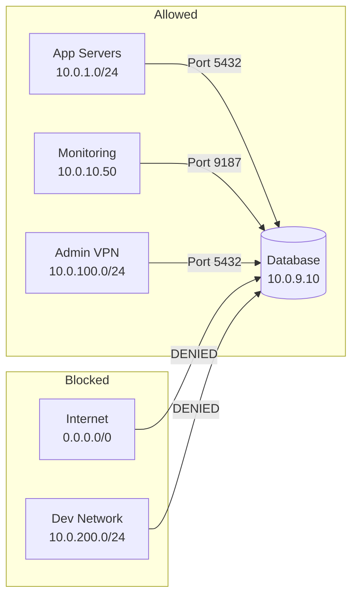
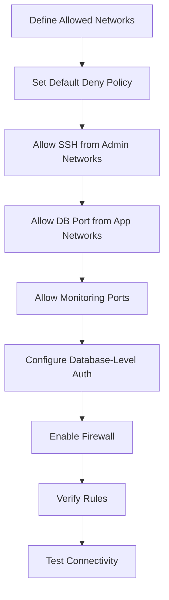

# How to Use Ansible to Configure Database Firewalls

Author: [nawazdhandala](https://www.github.com/nawazdhandala)

Tags: Ansible, Database Security, Firewall, Network Security

Description: Automate database firewall configuration using Ansible with iptables, UFW, and firewalld to restrict access and protect your data.

---

Every database breach starts with unauthorized access. If your database port is open to the internet, it is not a question of whether it will be attacked, but when. Database firewalls are your first line of defense, restricting which hosts can connect to your database servers. Configuring firewall rules manually across dozens of servers is error-prone and hard to audit. Ansible lets you define your firewall rules as code, apply them consistently, and verify them across your fleet.

This guide covers configuring database firewalls using Ansible with iptables, UFW, and firewalld.

## Firewall Strategy

The principle is simple: deny everything, then allow only what is needed.



## Inventory

```ini
# inventory/databases.ini
[postgres_servers]
pg-primary ansible_host=10.0.9.10 db_port=5432

[mysql_servers]
mysql-primary ansible_host=10.0.9.20 db_port=3306

[mongodb_servers]
mongo-primary ansible_host=10.0.9.30 db_port=27017

[all:vars]
ansible_user=ubuntu
# Networks allowed to connect to databases
allowed_app_networks:
  - 10.0.1.0/24
  - 10.0.2.0/24
allowed_admin_networks:
  - 10.0.100.0/24
monitoring_hosts:
  - 10.0.10.50
```

## Using UFW (Ubuntu/Debian)

UFW is the simplest option for Ubuntu systems. Ansible has a built-in module for it.

```yaml
# playbooks/configure-ufw-database.yml
---
- name: Configure UFW firewall for database servers
  hosts: postgres_servers:mysql_servers:mongodb_servers
  become: true

  tasks:
    - name: Ensure UFW is installed
      ansible.builtin.apt:
        name: ufw
        state: present

    - name: Set default policy to deny incoming traffic
      community.general.ufw:
        direction: incoming
        default: deny

    - name: Set default policy to allow outgoing traffic
      community.general.ufw:
        direction: outgoing
        default: allow

    - name: Allow SSH from admin networks
      community.general.ufw:
        rule: allow
        port: "22"
        proto: tcp
        src: "{{ item }}"
        comment: "SSH from admin network"
      loop: "{{ allowed_admin_networks }}"

    - name: Allow database port from application networks
      community.general.ufw:
        rule: allow
        port: "{{ db_port }}"
        proto: tcp
        src: "{{ item }}"
        comment: "Database access from app network"
      loop: "{{ allowed_app_networks }}"

    - name: Allow database port from admin networks
      community.general.ufw:
        rule: allow
        port: "{{ db_port }}"
        proto: tcp
        src: "{{ item }}"
        comment: "Database access from admin network"
      loop: "{{ allowed_admin_networks }}"

    - name: Allow monitoring exporter port from monitoring hosts
      community.general.ufw:
        rule: allow
        port: "{{ item.1 }}"
        proto: tcp
        src: "{{ item.0 }}"
        comment: "Monitoring exporter access"
      loop: "{{ monitoring_hosts | product(['9187', '9104', '9216']) | list }}"

    - name: Enable UFW
      community.general.ufw:
        state: enabled
```

## Using firewalld (RHEL/CentOS)

For RHEL-based systems, firewalld is the standard.

```yaml
# playbooks/configure-firewalld-database.yml
---
- name: Configure firewalld for database servers
  hosts: postgres_servers:mysql_servers:mongodb_servers
  become: true

  tasks:
    - name: Ensure firewalld is installed and running
      ansible.builtin.yum:
        name: firewalld
        state: present

    - name: Start and enable firewalld
      ansible.builtin.systemd:
        name: firewalld
        state: started
        enabled: true

    - name: Set default zone to drop (deny all)
      ansible.posix.firewalld:
        zone: drop
        state: enabled
        permanent: true
        immediate: true

    - name: Create a database access zone
      ansible.posix.firewalld:
        zone: database
        state: present
        permanent: true
      notify: Reload firewalld

    - name: Add application network sources to database zone
      ansible.posix.firewalld:
        zone: database
        source: "{{ item }}"
        state: enabled
        permanent: true
        immediate: true
      loop: "{{ allowed_app_networks + allowed_admin_networks }}"

    - name: Allow database port in the database zone
      ansible.posix.firewalld:
        zone: database
        port: "{{ db_port }}/tcp"
        state: enabled
        permanent: true
        immediate: true

    - name: Allow SSH in the database zone
      ansible.posix.firewalld:
        zone: database
        service: ssh
        state: enabled
        permanent: true
        immediate: true

    - name: Add monitoring sources
      ansible.posix.firewalld:
        zone: database
        source: "{{ item }}/32"
        state: enabled
        permanent: true
        immediate: true
      loop: "{{ monitoring_hosts }}"

  handlers:
    - name: Reload firewalld
      ansible.builtin.command:
        cmd: firewall-cmd --reload
      changed_when: true
```

## Using iptables Directly

For maximum control, use iptables rules.

```yaml
# playbooks/configure-iptables-database.yml
---
- name: Configure iptables for database servers
  hosts: postgres_servers
  become: true
  vars:
    db_port: 5432

  tasks:
    - name: Install iptables-persistent to save rules
      ansible.builtin.apt:
        name: iptables-persistent
        state: present

    - name: Allow established and related connections
      ansible.builtin.iptables:
        chain: INPUT
        ctstate:
          - ESTABLISHED
          - RELATED
        jump: ACCEPT
        comment: "Allow established connections"

    - name: Allow loopback traffic
      ansible.builtin.iptables:
        chain: INPUT
        in_interface: lo
        jump: ACCEPT
        comment: "Allow loopback"

    - name: Allow SSH from admin networks
      ansible.builtin.iptables:
        chain: INPUT
        protocol: tcp
        destination_port: "22"
        source: "{{ item }}"
        jump: ACCEPT
        comment: "SSH from {{ item }}"
      loop: "{{ allowed_admin_networks }}"

    - name: Allow database port from application networks
      ansible.builtin.iptables:
        chain: INPUT
        protocol: tcp
        destination_port: "{{ db_port }}"
        source: "{{ item }}"
        jump: ACCEPT
        comment: "DB access from {{ item }}"
      loop: "{{ allowed_app_networks }}"

    - name: Allow database port from admin networks
      ansible.builtin.iptables:
        chain: INPUT
        protocol: tcp
        destination_port: "{{ db_port }}"
        source: "{{ item }}"
        jump: ACCEPT
        comment: "DB admin access from {{ item }}"
      loop: "{{ allowed_admin_networks }}"

    - name: Allow monitoring exporter port
      ansible.builtin.iptables:
        chain: INPUT
        protocol: tcp
        destination_port: "9187"
        source: "{{ item }}/32"
        jump: ACCEPT
        comment: "Monitoring from {{ item }}"
      loop: "{{ monitoring_hosts }}"

    - name: Drop all other incoming traffic
      ansible.builtin.iptables:
        chain: INPUT
        jump: DROP
        comment: "Default deny"

    - name: Save iptables rules persistently
      ansible.builtin.command:
        cmd: netfilter-persistent save
      changed_when: true
```

## Database-Specific Access Control

Besides the OS firewall, configure access control within the database itself.

```yaml
# playbooks/configure-pg-hba.yml
---
- name: Configure PostgreSQL host-based authentication
  hosts: postgres_servers
  become: true
  vars:
    pg_conf_dir: /etc/postgresql/16/main

  tasks:
    - name: Deploy pg_hba.conf with restricted access
      ansible.builtin.copy:
        dest: "{{ pg_conf_dir }}/pg_hba.conf"
        content: |
          # PostgreSQL host-based authentication - managed by Ansible
          # TYPE  DATABASE  USER      ADDRESS         METHOD

          # Local connections
          local   all       postgres                  peer
          local   all       all                       peer

          # Application servers (SSL required)
          
          hostssl all       app_user  {{ network }}   scram-sha-256
          

          # Admin access (SSL required)
          
          hostssl all       all       {{ network }}   scram-sha-256
          

          # Monitoring (local only)
          host    all       monitoring 127.0.0.1/32   scram-sha-256

          # Deny everything else
          host    all       all       0.0.0.0/0       reject
        owner: postgres
        group: postgres
        mode: "0640"
      notify: Reload PostgreSQL

  handlers:
    - name: Reload PostgreSQL
      ansible.builtin.systemd:
        name: postgresql
        state: reloaded
```

## Verification Playbook

After applying firewall rules, verify they work correctly.

```yaml
# playbooks/verify-database-firewall.yml
---
- name: Verify database firewall configuration
  hosts: postgres_servers:mysql_servers:mongodb_servers
  become: true

  tasks:
    - name: Display UFW status
      ansible.builtin.command:
        cmd: ufw status verbose
      register: ufw_status
      changed_when: false
      when: ansible_os_family == "Debian"

    - name: Display firewalld status
      ansible.builtin.command:
        cmd: firewall-cmd --list-all
      register: firewalld_status
      changed_when: false
      when: ansible_os_family == "RedHat"

    - name: Display iptables rules
      ansible.builtin.command:
        cmd: iptables -L -n -v --line-numbers
      register: iptables_rules
      changed_when: false

    - name: Show firewall rules
      ansible.builtin.debug:
        msg: "{{ ufw_status.stdout_lines | default(firewalld_status.stdout_lines | default(iptables_rules.stdout_lines)) }}"

    - name: Test that the database port is listening
      ansible.builtin.command:
        cmd: ss -tlnp sport = :{{ db_port }}
      register: port_check
      changed_when: false

    - name: Display listening ports
      ansible.builtin.debug:
        msg: "{{ port_check.stdout_lines }}"
```

## Testing Firewall Rules

Verify from an application server that connectivity works.

```yaml
# playbooks/test-firewall-connectivity.yml
---
- name: Test database connectivity through firewall
  hosts: app_servers
  become: true

  tasks:
    - name: Test TCP connection to PostgreSQL
      ansible.builtin.wait_for:
        host: "{{ hostvars['pg-primary'].ansible_host }}"
        port: 5432
        timeout: 5
      register: pg_connection
      ignore_errors: true

    - name: Display PostgreSQL connectivity result
      ansible.builtin.debug:
        msg: "PostgreSQL: {{ 'REACHABLE' if pg_connection is succeeded else 'BLOCKED' }}"

    - name: Test TCP connection to MySQL
      ansible.builtin.wait_for:
        host: "{{ hostvars['mysql-primary'].ansible_host }}"
        port: 3306
        timeout: 5
      register: mysql_connection
      ignore_errors: true

    - name: Display MySQL connectivity result
      ansible.builtin.debug:
        msg: "MySQL: {{ 'REACHABLE' if mysql_connection is succeeded else 'BLOCKED' }}"
```

## Firewall Configuration Flow



## Production Tips

1. **Layer your defenses.** Use both OS-level firewalls and database-level access control. If one fails, the other still protects you.

2. **Never open database ports to 0.0.0.0/0.** Not even temporarily. Automated scanners find exposed databases within minutes.

3. **Use network segmentation.** Put databases on a separate VLAN or subnet from application servers. This limits the blast radius of a compromised app server.

4. **Audit firewall rules regularly.** Run the verification playbook as part of your compliance checks. Rules drift over time as people add "temporary" exceptions.

5. **Log denied connections.** Configure your firewall to log dropped packets. This helps you detect unauthorized access attempts and troubleshoot connectivity issues.

## Conclusion

Database firewall configuration with Ansible gives you auditable, repeatable network security for your database fleet. The playbooks in this guide cover UFW, firewalld, and iptables, plus database-level access control for PostgreSQL. Define your allowed networks as variables, apply them consistently, and verify connectivity after every change. Treat firewall rules like code: version-controlled, reviewed, and tested.
