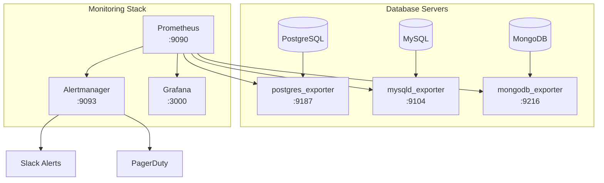

# How to Use Ansible to Configure Database Monitoring

Author: [nawazdhandala](https://www.github.com/nawazdhandala)

Tags: Ansible, Database Monitoring, Prometheus, Observability

Description: Set up database monitoring with Prometheus exporters for PostgreSQL, MySQL, and MongoDB using Ansible automation playbooks.

---

You cannot fix what you cannot see. Database problems often start as slow queries or growing connection counts long before they become outages. By the time users complain, the situation is usually critical. Proactive database monitoring catches these issues early. Ansible lets you deploy monitoring agents and exporters consistently across your database fleet so every instance reports metrics from day one.

This guide covers deploying Prometheus exporters for PostgreSQL, MySQL, and MongoDB using Ansible, plus configuring alerting rules.

## Monitoring Architecture



## Inventory

```ini
# inventory/monitoring.ini
[postgres_servers]
pg-primary ansible_host=10.0.9.10

[mysql_servers]
mysql-primary ansible_host=10.0.9.20

[mongodb_servers]
mongo-primary ansible_host=10.0.9.30

[prometheus_servers]
prometheus ansible_host=10.0.10.50

[all:vars]
ansible_user=ubuntu
```

## PostgreSQL Exporter

The `postgres_exporter` exposes PostgreSQL metrics in Prometheus format.

```yaml
# playbooks/install-postgres-exporter.yml
---
- name: Install and configure PostgreSQL Prometheus exporter
  hosts: postgres_servers
  become: true
  vars_files:
    - ../vault/db-secrets.yml
  vars:
    pg_exporter_version: "0.15.0"
    pg_exporter_port: 9187

  tasks:
    - name: Create a monitoring user in PostgreSQL
      community.postgresql.postgresql_user:
        name: monitoring
        password: "{{ vault_pg_monitoring_password }}"
        role_attr_flags: "LOGIN,NOSUPERUSER,NOCREATEDB,NOCREATEROLE"
        db: postgres
        login_user: postgres
      become_user: postgres

    - name: Grant monitoring permissions
      community.postgresql.postgresql_query:
        db: postgres
        login_user: postgres
        query: |
          GRANT pg_monitor TO monitoring;
          GRANT CONNECT ON DATABASE postgres TO monitoring;
      become_user: postgres

    - name: Create postgres_exporter system user
      ansible.builtin.user:
        name: postgres_exporter
        system: true
        shell: /usr/sbin/nologin
        create_home: false

    - name: Download postgres_exporter binary
      ansible.builtin.get_url:
        url: "https://github.com/prometheus-community/postgres_exporter/releases/download/v{{ pg_exporter_version }}/postgres_exporter-{{ pg_exporter_version }}.linux-amd64.tar.gz"
        dest: "/tmp/postgres_exporter-{{ pg_exporter_version }}.tar.gz"
        mode: "0644"

    - name: Extract postgres_exporter
      ansible.builtin.unarchive:
        src: "/tmp/postgres_exporter-{{ pg_exporter_version }}.tar.gz"
        dest: /tmp
        remote_src: true

    - name: Install postgres_exporter binary
      ansible.builtin.copy:
        src: "/tmp/postgres_exporter-{{ pg_exporter_version }}.linux-amd64/postgres_exporter"
        dest: /usr/local/bin/postgres_exporter
        remote_src: true
        mode: "0755"

    - name: Create environment file with database connection string
      ansible.builtin.copy:
        dest: /etc/default/postgres_exporter
        content: |
          DATA_SOURCE_NAME="postgresql://monitoring:{{ vault_pg_monitoring_password }}@localhost:5432/postgres?sslmode=disable"
        owner: postgres_exporter
        group: postgres_exporter
        mode: "0600"
      no_log: true

    - name: Create custom query file for application-specific metrics
      ansible.builtin.copy:
        dest: /etc/postgres_exporter_queries.yml
        content: |
          pg_database_size:
            query: "SELECT datname, pg_database_size(datname) as size_bytes FROM pg_database WHERE datistemplate = false"
            metrics:
              - datname:
                  usage: "LABEL"
                  description: "Database name"
              - size_bytes:
                  usage: "GAUGE"
                  description: "Database size in bytes"

          pg_slow_queries:
            query: "SELECT count(*) as count FROM pg_stat_activity WHERE state = 'active' AND now() - query_start > interval '30 seconds'"
            metrics:
              - count:
                  usage: "GAUGE"
                  description: "Number of queries running longer than 30 seconds"

          pg_replication_lag:
            query: "SELECT CASE WHEN pg_is_in_recovery() THEN EXTRACT(EPOCH FROM now() - pg_last_xact_replay_timestamp()) ELSE 0 END AS lag_seconds"
            metrics:
              - lag_seconds:
                  usage: "GAUGE"
                  description: "Replication lag in seconds"
        mode: "0644"

    - name: Create systemd service for postgres_exporter
      ansible.builtin.copy:
        dest: /etc/systemd/system/postgres_exporter.service
        content: |
          [Unit]
          Description=Prometheus PostgreSQL Exporter
          After=network.target postgresql.service

          [Service]
          Type=simple
          User=postgres_exporter
          Group=postgres_exporter
          EnvironmentFile=/etc/default/postgres_exporter
          ExecStart=/usr/local/bin/postgres_exporter \
            --extend.query-path=/etc/postgres_exporter_queries.yml \
            --web.listen-address=:{{ pg_exporter_port }}
          Restart=always
          RestartSec=5

          [Install]
          WantedBy=multi-user.target
        mode: "0644"
      notify: Start postgres_exporter

  handlers:
    - name: Start postgres_exporter
      ansible.builtin.systemd:
        daemon_reload: true
        name: postgres_exporter
        state: started
        enabled: true
```

## MySQL Exporter

```yaml
# playbooks/install-mysql-exporter.yml
---
- name: Install and configure MySQL Prometheus exporter
  hosts: mysql_servers
  become: true
  vars_files:
    - ../vault/db-secrets.yml
  vars:
    mysql_exporter_version: "0.15.1"
    mysql_exporter_port: 9104

  tasks:
    - name: Create monitoring user in MySQL
      community.mysql.mysql_user:
        name: exporter
        password: "{{ vault_mysql_monitoring_password }}"
        priv: "*.*:PROCESS,REPLICATION CLIENT,SELECT"
        host: "localhost"
        login_user: root
        login_password: "{{ vault_mysql_root_password }}"
        state: present
      no_log: true

    - name: Create mysqld_exporter system user
      ansible.builtin.user:
        name: mysqld_exporter
        system: true
        shell: /usr/sbin/nologin
        create_home: false

    - name: Download mysqld_exporter
      ansible.builtin.get_url:
        url: "https://github.com/prometheus/mysqld_exporter/releases/download/v{{ mysql_exporter_version }}/mysqld_exporter-{{ mysql_exporter_version }}.linux-amd64.tar.gz"
        dest: "/tmp/mysqld_exporter-{{ mysql_exporter_version }}.tar.gz"
        mode: "0644"

    - name: Extract mysqld_exporter
      ansible.builtin.unarchive:
        src: "/tmp/mysqld_exporter-{{ mysql_exporter_version }}.tar.gz"
        dest: /tmp
        remote_src: true

    - name: Install mysqld_exporter binary
      ansible.builtin.copy:
        src: "/tmp/mysqld_exporter-{{ mysql_exporter_version }}.linux-amd64/mysqld_exporter"
        dest: /usr/local/bin/mysqld_exporter
        remote_src: true
        mode: "0755"

    - name: Create MySQL exporter config file
      ansible.builtin.copy:
        dest: /etc/.mysqld_exporter.cnf
        content: |
          [client]
          user=exporter
          password={{ vault_mysql_monitoring_password }}
        owner: mysqld_exporter
        mode: "0600"
      no_log: true

    - name: Create systemd service for mysqld_exporter
      ansible.builtin.copy:
        dest: /etc/systemd/system/mysqld_exporter.service
        content: |
          [Unit]
          Description=Prometheus MySQL Exporter
          After=network.target mysql.service

          [Service]
          Type=simple
          User=mysqld_exporter
          Group=mysqld_exporter
          ExecStart=/usr/local/bin/mysqld_exporter \
            --config.my-cnf=/etc/.mysqld_exporter.cnf \
            --web.listen-address=:{{ mysql_exporter_port }} \
            --collect.global_status \
            --collect.global_variables \
            --collect.info_schema.innodb_metrics \
            --collect.info_schema.processlist \
            --collect.slave_status
          Restart=always
          RestartSec=5

          [Install]
          WantedBy=multi-user.target
        mode: "0644"
      notify: Start mysqld_exporter

  handlers:
    - name: Start mysqld_exporter
      ansible.builtin.systemd:
        daemon_reload: true
        name: mysqld_exporter
        state: started
        enabled: true
```

## MongoDB Exporter

```yaml
# playbooks/install-mongodb-exporter.yml
---
- name: Install and configure MongoDB Prometheus exporter
  hosts: mongodb_servers
  become: true
  vars_files:
    - ../vault/db-secrets.yml
  vars:
    mongodb_exporter_version: "0.40.0"
    mongodb_exporter_port: 9216

  tasks:
    - name: Create mongodb_exporter system user
      ansible.builtin.user:
        name: mongodb_exporter
        system: true
        shell: /usr/sbin/nologin
        create_home: false

    - name: Download mongodb_exporter
      ansible.builtin.get_url:
        url: "https://github.com/percona/mongodb_exporter/releases/download/v{{ mongodb_exporter_version }}/mongodb_exporter-{{ mongodb_exporter_version }}.linux-amd64.tar.gz"
        dest: "/tmp/mongodb_exporter-{{ mongodb_exporter_version }}.tar.gz"
        mode: "0644"

    - name: Extract mongodb_exporter
      ansible.builtin.unarchive:
        src: "/tmp/mongodb_exporter-{{ mongodb_exporter_version }}.tar.gz"
        dest: /tmp
        remote_src: true

    - name: Install mongodb_exporter binary
      ansible.builtin.copy:
        src: "/tmp/mongodb_exporter-{{ mongodb_exporter_version }}.linux-amd64/mongodb_exporter"
        dest: /usr/local/bin/mongodb_exporter
        remote_src: true
        mode: "0755"

    - name: Create systemd service for mongodb_exporter
      ansible.builtin.copy:
        dest: /etc/systemd/system/mongodb_exporter.service
        content: |
          [Unit]
          Description=Prometheus MongoDB Exporter
          After=network.target mongod.service

          [Service]
          Type=simple
          User=mongodb_exporter
          Environment="MONGODB_URI=mongodb://monitoring:{{ vault_mongo_monitoring_password }}@localhost:27017/admin"
          ExecStart=/usr/local/bin/mongodb_exporter \
            --web.listen-address=:{{ mongodb_exporter_port }} \
            --collect-all
          Restart=always
          RestartSec=5

          [Install]
          WantedBy=multi-user.target
        mode: "0644"
      no_log: true
      notify: Start mongodb_exporter

  handlers:
    - name: Start mongodb_exporter
      ansible.builtin.systemd:
        daemon_reload: true
        name: mongodb_exporter
        state: started
        enabled: true
```

## Prometheus Configuration

Configure Prometheus to scrape all database exporters.

```yaml
# playbooks/configure-prometheus-db-targets.yml
---
- name: Configure Prometheus to scrape database exporters
  hosts: prometheus_servers
  become: true

  tasks:
    - name: Deploy Prometheus database targets configuration
      ansible.builtin.template:
        src: ../templates/prometheus-db-targets.yml.j2
        dest: /etc/prometheus/targets/databases.yml
        mode: "0644"
      notify: Reload Prometheus

  handlers:
    - name: Reload Prometheus
      ansible.builtin.systemd:
        name: prometheus
        state: reloaded
```

```jinja2
# templates/prometheus-db-targets.yml.j2
# Database monitoring targets - managed by Ansible
- targets:

    - {{ hostvars[host].ansible_host }}:9187

  labels:
    job: postgresql
    environment: production

- targets:

    - {{ hostvars[host].ansible_host }}:9104

  labels:
    job: mysql
    environment: production

- targets:

    - {{ hostvars[host].ansible_host }}:9216

  labels:
    job: mongodb
    environment: production
```

## Alert Rules

Deploy alerting rules for common database issues.

```yaml
# playbooks/deploy-db-alert-rules.yml
---
- name: Deploy database alerting rules
  hosts: prometheus_servers
  become: true

  tasks:
    - name: Deploy database alert rules file
      ansible.builtin.copy:
        dest: /etc/prometheus/rules/database-alerts.yml
        content: |
          groups:
            - name: database_alerts
              rules:
                - alert: PostgreSQLDown
                  expr: pg_up == 0
                  for: 1m
                  labels:
                    severity: critical
                  annotations:
                    summary: "PostgreSQL is down on {{ '{{' }} $labels.instance {{ '}}' }}"

                - alert: PostgreSQLHighConnections
                  expr: pg_stat_activity_count > 100
                  for: 5m
                  labels:
                    severity: warning
                  annotations:
                    summary: "High connection count on {{ '{{' }} $labels.instance {{ '}}' }}"

                - alert: PostgreSQLSlowQueries
                  expr: pg_slow_queries_count > 5
                  for: 5m
                  labels:
                    severity: warning
                  annotations:
                    summary: "{{ '{{' }} $value {{ '}}' }} slow queries on {{ '{{' }} $labels.instance {{ '}}' }}"

                - alert: PostgreSQLReplicationLag
                  expr: pg_replication_lag_lag_seconds > 30
                  for: 5m
                  labels:
                    severity: warning
                  annotations:
                    summary: "Replication lag {{ '{{' }} $value {{ '}}' }}s on {{ '{{' }} $labels.instance {{ '}}' }}"

                - alert: MySQLDown
                  expr: mysql_up == 0
                  for: 1m
                  labels:
                    severity: critical
                  annotations:
                    summary: "MySQL is down on {{ '{{' }} $labels.instance {{ '}}' }}"

                - alert: MongoDBDown
                  expr: mongodb_up == 0
                  for: 1m
                  labels:
                    severity: critical
                  annotations:
                    summary: "MongoDB is down on {{ '{{' }} $labels.instance {{ '}}' }}"
        mode: "0644"
      notify: Reload Prometheus

  handlers:
    - name: Reload Prometheus
      ansible.builtin.systemd:
        name: prometheus
        state: reloaded
```

## Verification

```yaml
# playbooks/verify-db-monitoring.yml
---
- name: Verify database monitoring is working
  hosts: database_servers
  become: true

  tasks:
    - name: Check PostgreSQL exporter metrics endpoint
      ansible.builtin.uri:
        url: "http://localhost:9187/metrics"
        method: GET
        status_code: 200
      register: pg_metrics
      when: "'postgres_servers' in group_names"

    - name: Check MySQL exporter metrics endpoint
      ansible.builtin.uri:
        url: "http://localhost:9104/metrics"
        method: GET
        status_code: 200
      register: mysql_metrics
      when: "'mysql_servers' in group_names"

    - name: Check MongoDB exporter metrics endpoint
      ansible.builtin.uri:
        url: "http://localhost:9216/metrics"
        method: GET
        status_code: 200
      register: mongo_metrics
      when: "'mongodb_servers' in group_names"

    - name: Display monitoring status
      ansible.builtin.debug:
        msg: "Exporter is running and serving metrics on {{ inventory_hostname }}"
```

## Key Metrics to Monitor

Here are the most important metrics for each database:

**PostgreSQL**: `pg_stat_activity_count`, `pg_stat_bgwriter_buffers_alloc_total`, `pg_locks_count`, `pg_replication_lag`, `pg_database_size_bytes`

**MySQL**: `mysql_global_status_threads_connected`, `mysql_global_status_slow_queries`, `mysql_global_status_innodb_buffer_pool_reads`, `mysql_slave_status_seconds_behind_master`

**MongoDB**: `mongodb_connections_current`, `mongodb_opcounters_total`, `mongodb_mongod_wiredtiger_cache_bytes`, `mongodb_mongod_replset_member_replication_lag`

## Conclusion

Database monitoring with Ansible ensures every database instance in your fleet reports metrics from the moment it is deployed. The playbooks in this guide cover Prometheus exporter installation for PostgreSQL, MySQL, and MongoDB, plus alerting rules for common failure scenarios. Deploy monitoring alongside your database, not as an afterthought. When your database has a problem at 3 AM, you want the alert to wake you up before your users notice.
