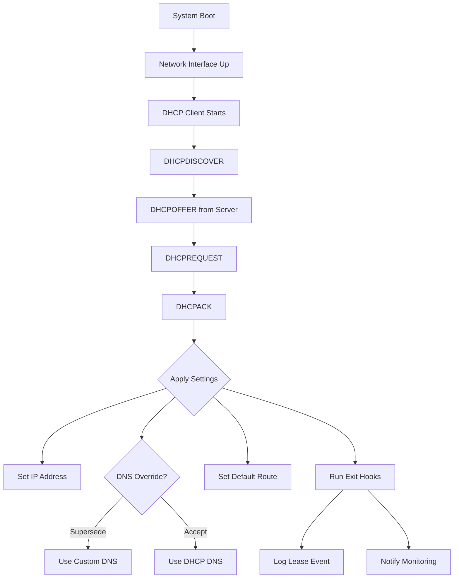

# How to Use Ansible to Configure DHCP Client

Author: [nawazdhandala](https://www.github.com/nawazdhandala)

Tags: Ansible, DHCP, Networking, Linux, System Configuration

Description: Automate DHCP client configuration on Linux servers using Ansible to control IP assignment, hostname, DNS settings, and lease behavior across your fleet.

---

DHCP (Dynamic Host Configuration Protocol) automatically assigns IP addresses and network configuration to devices. While production servers often use static IPs, plenty of environments rely on DHCP for automatic network setup, especially in cloud environments, development labs, and dynamically scaled infrastructure. Even when you use DHCP, you still need control over how the client behaves. Ansible gives you that control.

## Why Configure DHCP Clients?

You might think DHCP "just works" and does not need configuration. Here is why that is wrong:

- Default DHCP clients accept whatever the server sends, including DNS servers you do not want
- DHCP can overwrite your carefully configured /etc/resolv.conf
- The default hostname behavior might conflict with your naming scheme
- Lease timing and retry behavior matter for reliability
- You may need to request specific DHCP options or ignore others

## Configuring dhclient (ISC DHCP Client)

dhclient is the traditional DHCP client on Debian/Ubuntu systems. Its configuration lives in `/etc/dhcp/dhclient.conf`.

This playbook configures dhclient with customized behavior:

```yaml
# configure-dhclient.yml - Configure ISC DHCP client
---
- name: Configure DHCP Client
  hosts: all
  become: true
  vars:
    dhcp_interface: eth0
    dhcp_hostname_from_system: true
    dhcp_request_options:
      - subnet-mask
      - broadcast-address
      - time-offset
      - routers
      - domain-name
      - domain-name-servers
      - domain-search
      - host-name
      - ntp-servers
    dhcp_supersede_dns: true
    dhcp_custom_dns:
      - 10.0.0.2
      - 10.0.0.3
    dhcp_custom_search:
      - example.com
      - internal.example.com
    dhcp_timeout: 30
    dhcp_retry: 60

  tasks:
    - name: Install ISC DHCP client
      ansible.builtin.apt:
        name: isc-dhcp-client
        state: present
      when: ansible_os_family == "Debian"

    - name: Deploy dhclient configuration
      ansible.builtin.template:
        src: dhclient.conf.j2
        dest: /etc/dhcp/dhclient.conf
        owner: root
        group: root
        mode: '0644'
        backup: true
      notify: Restart networking

  handlers:
    - name: Restart networking
      ansible.builtin.systemd:
        name: networking
        state: restarted
      failed_when: false
```

The dhclient configuration template:

```jinja2
# dhclient.conf.j2 - ISC DHCP client configuration
# Managed by Ansible - do not edit manually

# Timeout for initial DHCP request
timeout {{ dhcp_timeout }};

# Time between retries
retry {{ dhcp_retry }};

# Lease requirements and requests
request {{ dhcp_request_options | join(', ') }};


# Send the system hostname to the DHCP server
send host-name = gethostname();



# Override DNS servers from DHCP with our own
supersede domain-name-servers {{ dhcp_custom_dns | join(', ') }};
supersede domain-search "{{ dhcp_custom_search | join('", "') }}";


# Do not accept default routes from DHCP on secondary interfaces
# (uncomment for multi-interface setups)
# interface "eth1" {
#     supersede routers;
# }

# Prepend our DNS servers before DHCP-provided ones
# (alternative to supersede - keeps DHCP DNS as fallback)
# prepend domain-name-servers {{ dhcp_custom_dns | join(', ') }};
```

## Preventing DHCP from Overwriting DNS

One of the most common DHCP headaches is the client overwriting `/etc/resolv.conf`. Here is how to prevent that.

This playbook creates hook scripts to control what DHCP updates:

```yaml
# prevent-dhcp-dns-overwrite.yml - Stop DHCP from changing DNS
---
- name: Prevent DHCP DNS Overwrite
  hosts: all
  become: true
  tasks:
    - name: Create dhclient enter hook to prevent DNS changes
      ansible.builtin.copy:
        dest: /etc/dhcp/dhclient-enter-hooks.d/no-dns-update
        mode: '0755'
        content: |
          #!/bin/sh
          # Prevent DHCP from updating DNS configuration
          # Managed by Ansible
          make_resolv_conf() {
            # Do nothing - DNS is managed by Ansible
            :
          }
      when: ansible_os_family == "Debian"

    - name: Create NetworkManager dispatcher to preserve DNS
      ansible.builtin.copy:
        dest: /etc/NetworkManager/dispatcher.d/no-dns-update
        mode: '0755'
        content: |
          #!/bin/bash
          # Prevent NetworkManager from updating DNS
          # Managed by Ansible
          if [ "$2" = "dhcp4-change" ] || [ "$2" = "up" ]; then
            # Restore our managed resolv.conf
            if [ -f /etc/resolv.conf.ansible ]; then
              cp /etc/resolv.conf.ansible /etc/resolv.conf
            fi
          fi
      when: ansible_os_family == "RedHat"

    - name: Configure NetworkManager to not manage DNS
      ansible.builtin.lineinfile:
        path: /etc/NetworkManager/NetworkManager.conf
        regexp: '^dns='
        line: 'dns=none'
        insertafter: '^\[main\]'
      when: ansible_os_family == "RedHat"
      notify: Restart NetworkManager

  handlers:
    - name: Restart NetworkManager
      ansible.builtin.systemd:
        name: NetworkManager
        state: restarted
```

## Configuring systemd-networkd DHCP Client

On systems using systemd-networkd (which is becoming more common), DHCP client behavior is configured in .network files.

This playbook configures DHCP through systemd-networkd:

```yaml
# configure-networkd-dhcp.yml - DHCP via systemd-networkd
---
- name: Configure systemd-networkd DHCP
  hosts: all
  become: true
  vars:
    dhcp_interface: eth0
    dhcp_use_dns: false
    dhcp_use_ntp: true
    dhcp_use_hostname: false
    dhcp_use_routes: true
    dhcp_route_metric: 100
    custom_dns:
      - 10.0.0.2
      - 10.0.0.3

  tasks:
    - name: Deploy networkd configuration with DHCP
      ansible.builtin.copy:
        dest: "/etc/systemd/network/10-{{ dhcp_interface }}.network"
        mode: '0644'
        content: |
          # Network configuration for {{ dhcp_interface }} - managed by Ansible
          [Match]
          Name={{ dhcp_interface }}

          [Network]
          DHCP=ipv4
          
          DNS={{ dns }}
          

          [DHCP]
          # Control what DHCP options we accept
          UseDNS={{ 'true' if dhcp_use_dns else 'false' }}
          UseNTP={{ 'true' if dhcp_use_ntp else 'false' }}
          UseHostname={{ 'true' if dhcp_use_hostname else 'false' }}
          UseRoutes={{ 'true' if dhcp_use_routes else 'false' }}
          RouteMetric={{ dhcp_route_metric }}
          # Send our hostname to the DHCP server
          SendHostname=true
          # Request a specific lease time (in seconds)
          # RequestLeaseTimeSec=3600
      notify: Restart networkd

    - name: Enable systemd-networkd
      ansible.builtin.systemd:
        name: systemd-networkd
        enabled: true
        state: started

  handlers:
    - name: Restart networkd
      ansible.builtin.systemd:
        name: systemd-networkd
        state: restarted
```

## DHCP Client for Multi-Interface Servers

Servers with multiple NICs often need DHCP on some interfaces but not others, and you need to control which interface provides the default route.

This playbook configures DHCP differently per interface:

```yaml
# configure-multi-nic-dhcp.yml - Per-interface DHCP settings
---
- name: Configure Multi-NIC DHCP
  hosts: multi_nic_servers
  become: true
  vars:
    network_interfaces:
      - name: eth0
        dhcp: true
        purpose: management
        use_default_route: true
        route_metric: 100
      - name: eth1
        dhcp: true
        purpose: data
        use_default_route: false
        route_metric: 200
      - name: eth2
        dhcp: false
        purpose: storage
        ip: "10.2.0.100/24"

  tasks:
    - name: Configure each network interface
      ansible.builtin.copy:
        dest: "/etc/systemd/network/{{ '%02d' | format(idx + 10) }}-{{ item.name }}.network"
        mode: '0644'
        content: |
          # {{ item.purpose }} interface - managed by Ansible
          [Match]
          Name={{ item.name }}

          
          [Network]
          DHCP=ipv4

          [DHCP]
          UseDNS={{ 'true' if item.use_default_route else 'false' }}
          UseRoutes={{ 'true' if item.use_default_route else 'false' }}
          RouteMetric={{ item.route_metric }}
          UseHostname=false
          
          [Network]
          Address={{ item.ip }}
          
      loop: "{{ network_interfaces }}"
      loop_control:
        index_var: idx
        label: "{{ item.name }} ({{ item.purpose }})"
      notify: Restart networkd

  handlers:
    - name: Restart networkd
      ansible.builtin.systemd:
        name: systemd-networkd
        state: restarted
```

## DHCP Client Hooks and Scripts

Sometimes you need custom actions when the DHCP lease changes. Hook scripts let you react to DHCP events.

This playbook creates DHCP hook scripts for custom behavior:

```yaml
# configure-dhcp-hooks.yml - Custom DHCP event handlers
---
- name: Configure DHCP Client Hooks
  hosts: all
  become: true
  tasks:
    - name: Create DHCP lease change notification script
      ansible.builtin.copy:
        dest: /etc/dhcp/dhclient-exit-hooks.d/notify-lease-change
        mode: '0755'
        content: |
          #!/bin/bash
          # Log DHCP lease changes - managed by Ansible
          LOG="/var/log/dhcp-events.log"

          case "$reason" in
            BOUND|RENEW|REBIND|REBOOT)
              echo "$(date): $reason - Got IP $new_ip_address from $new_dhcp_server_identifier" >> $LOG
              echo "  Lease time: $new_dhcp_lease_time seconds" >> $LOG
              echo "  DNS: $new_domain_name_servers" >> $LOG
              echo "  Gateway: $new_routers" >> $LOG
              ;;
            EXPIRE|FAIL|RELEASE|STOP)
              echo "$(date): $reason - Lost IP $old_ip_address" >> $LOG
              ;;
          esac

    - name: Create hook to update monitoring on IP change
      ansible.builtin.copy:
        dest: /etc/dhcp/dhclient-exit-hooks.d/update-monitoring
        mode: '0755'
        content: |
          #!/bin/bash
          # Notify monitoring system of IP changes
          # Managed by Ansible

          if [ "$reason" = "BOUND" ] || [ "$reason" = "RENEW" ]; then
            if [ "$new_ip_address" != "$old_ip_address" ]; then
              # IP changed - update monitoring registration
              logger -t dhcp-hook "IP changed from $old_ip_address to $new_ip_address"
              # Uncomment and adjust for your monitoring system
              # curl -s -X POST http://monitoring.example.com/api/hosts/$(hostname) \
              #   -d "ip=$new_ip_address" > /dev/null 2>&1
            fi
          fi
```

## DHCP Lease Monitoring

Keep an eye on DHCP lease status across your fleet.

This playbook checks DHCP lease status:

```yaml
# check-dhcp-status.yml - Monitor DHCP lease health
---
- name: Check DHCP Lease Status
  hosts: all
  become: true
  tasks:
    - name: Check current DHCP leases
      ansible.builtin.shell: |
        # Find and display active DHCP leases
        if [ -f /var/lib/dhcp/dhclient.leases ]; then
          grep -A5 "^lease" /var/lib/dhcp/dhclient.leases | tail -10
        elif [ -d /run/systemd/netif/leases ]; then
          cat /run/systemd/netif/leases/* 2>/dev/null
        else
          echo "No DHCP lease files found"
        fi
      register: lease_info
      changed_when: false

    - name: Display lease information
      ansible.builtin.debug:
        msg: "{{ lease_info.stdout_lines }}"

    - name: Check if DHCP-assigned IP matches expected subnet
      ansible.builtin.shell: |
        ip addr show {{ dhcp_interface | default('eth0') }} | grep "inet " | awk '{print $2}'
      register: current_ip
      changed_when: false

    - name: Display current IP assignment
      ansible.builtin.debug:
        msg: "{{ inventory_hostname }} IP: {{ current_ip.stdout }}"

    - name: Verify DNS settings are as expected
      ansible.builtin.command: cat /etc/resolv.conf
      register: dns_config
      changed_when: false

    - name: Check for DNS override protection
      ansible.builtin.stat:
        path: /etc/dhcp/dhclient-enter-hooks.d/no-dns-update
      register: dns_protection

    - name: Report DNS protection status
      ansible.builtin.debug:
        msg: "DNS protection: {{ 'ENABLED' if dns_protection.stat.exists else 'DISABLED' }}"
```

## DHCP Client Configuration Flow



## Common DHCP Client Issues

**Lease storms on large networks**: If many servers reboot simultaneously (power outage recovery), they all try to get leases at once. The `retry` and `initial-interval` options in dhclient.conf help spread out the requests.

**DHCP not starting before dependent services**: Services that bind to a specific IP address might fail if they start before DHCP completes. Use systemd dependencies (`After=network-online.target` and `Wants=network-online.target`) to fix this.

**Multiple interfaces getting default routes**: When you have DHCP on multiple interfaces, both might install default routes, causing routing confusion. Use `UseRoutes=false` or `supersede routers` on secondary interfaces.

**Cloud provider DHCP quirks**: AWS, Azure, and GCP all use DHCP to assign instance IPs, but they also use it to provide metadata routes. Be careful about overriding DHCP settings on cloud instances because you might break metadata service access (169.254.169.254).

DHCP client configuration is one of those things that seems like it should be automatic, but in practice needs careful management to avoid surprises. Ansible gives you the tools to control exactly how your servers interact with DHCP, ensuring that automation does not accidentally break your DNS or routing.
