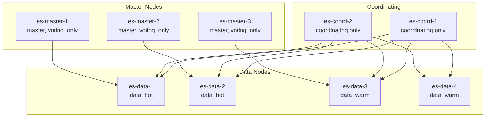

# How to Use Ansible to Configure Elasticsearch Cluster

Author: [nawazdhandala](https://www.github.com/nawazdhandala)

Tags: Ansible, Elasticsearch, Cluster Management, Search Infrastructure

Description: Configure a production-ready Elasticsearch cluster using Ansible with node roles, shard allocation, and index lifecycle management.

---

Getting Elasticsearch installed is only the beginning. Configuring it as a production cluster with proper node roles, shard allocation rules, index lifecycle policies, and monitoring takes real work. When you are managing a multi-node cluster, Ansible helps you push configuration changes consistently and roll out updates without taking down the whole cluster at once.

This guide focuses on the configuration side of Elasticsearch clustering: node roles, discovery settings, shard allocation, templates, and lifecycle policies.

## Cluster Topology

A well-designed Elasticsearch cluster separates node roles. Here is a typical production setup.



## Inventory with Node Roles

```ini
# inventory/es-cluster.ini
[es_master_nodes]
es-master-1 ansible_host=10.0.5.10 es_node_roles='["master"]'
es-master-2 ansible_host=10.0.5.11 es_node_roles='["master"]'
es-master-3 ansible_host=10.0.5.12 es_node_roles='["master"]'

[es_data_hot]
es-data-1 ansible_host=10.0.5.20 es_node_roles='["data_hot", "data_content", "ingest"]'
es-data-2 ansible_host=10.0.5.21 es_node_roles='["data_hot", "data_content", "ingest"]'

[es_data_warm]
es-data-3 ansible_host=10.0.5.22 es_node_roles='["data_warm"]'
es-data-4 ansible_host=10.0.5.23 es_node_roles='["data_warm"]'

[es_coordinating]
es-coord-1 ansible_host=10.0.5.30 es_node_roles='[]'
es-coord-2 ansible_host=10.0.5.31 es_node_roles='[]'

[es_all:children]
es_master_nodes
es_data_hot
es_data_warm
es_coordinating

[es_all:vars]
ansible_user=ubuntu
es_cluster_name=production-logs
es_version=8.12
```

## Configuring Node Roles

Each node type gets a slightly different `elasticsearch.yml`. Use a single template with conditionals.

```jinja2
# templates/elasticsearch-cluster.yml.j2
# Elasticsearch cluster config - managed by Ansible
cluster.name: {{ es_cluster_name }}
node.name: {{ inventory_hostname }}

# Node roles determine what this node does in the cluster
node.roles: {{ es_node_roles }}

path.data: /var/lib/elasticsearch
path.logs: /var/log/elasticsearch

network.host: {{ ansible_host }}
http.port: 9200
transport.port: 9300

# Discovery settings - all master-eligible nodes
discovery.seed_hosts:

  - {{ hostvars[host].ansible_host }}:9300


# Bootstrap the cluster with these master nodes
cluster.initial_master_nodes:

  - {{ host }}


# Memory locking
bootstrap.memory_lock: true

# Security
xpack.security.enabled: true
xpack.security.transport.ssl.enabled: true
xpack.security.transport.ssl.verification_mode: certificate
xpack.security.transport.ssl.keystore.path: certs/transport.p12
xpack.security.transport.ssl.truststore.path: certs/transport.p12
xpack.security.http.ssl.enabled: true
xpack.security.http.ssl.keystore.path: certs/http.p12


# Coordinating-only node settings
node.store.allow_mmap: true


# Shard allocation awareness (spread shards across racks/zones)

node.attr.rack: {{ es_rack }}
cluster.routing.allocation.awareness.attributes: rack

```

## Deploying Configuration Across All Nodes

```yaml
# playbooks/configure-es-cluster.yml
---
- name: Configure Elasticsearch cluster nodes
  hosts: es_all
  become: true
  serial: 1  # Roll out one node at a time for zero downtime
  vars_files:
    - ../vault/es-secrets.yml

  pre_tasks:
    - name: Disable shard allocation before updating this node
      ansible.builtin.uri:
        url: "https://{{ hostvars[groups['es_coordinating'][0]].ansible_host }}:9200/_cluster/settings"
        method: PUT
        user: elastic
        password: "{{ es_elastic_password }}"
        validate_certs: false
        body_format: json
        body:
          persistent:
            cluster.routing.allocation.enable: "primaries"
      when: es_cluster_is_running | default(false)

  tasks:
    - name: Deploy Elasticsearch configuration
      ansible.builtin.template:
        src: ../templates/elasticsearch-cluster.yml.j2
        dest: /etc/elasticsearch/elasticsearch.yml
        owner: root
        group: elasticsearch
        mode: "0640"
        backup: true
      notify: Restart Elasticsearch node

    - name: Set JVM heap based on node role
      ansible.builtin.copy:
        dest: /etc/elasticsearch/jvm.options.d/heap.options
        content: |
          -Xms{{ es_heap_size }}
          -Xmx{{ es_heap_size }}
        owner: root
        group: elasticsearch
        mode: "0640"
      notify: Restart Elasticsearch node

  post_tasks:
    - name: Wait for node to rejoin the cluster
      ansible.builtin.uri:
        url: "https://{{ ansible_host }}:9200/_cat/health"
        method: GET
        user: elastic
        password: "{{ es_elastic_password }}"
        validate_certs: false
        status_code: 200
      register: health
      retries: 30
      delay: 10
      until: health.status == 200

    - name: Re-enable shard allocation
      ansible.builtin.uri:
        url: "https://{{ hostvars[groups['es_coordinating'][0]].ansible_host }}:9200/_cluster/settings"
        method: PUT
        user: elastic
        password: "{{ es_elastic_password }}"
        validate_certs: false
        body_format: json
        body:
          persistent:
            cluster.routing.allocation.enable: "all"
      when: es_cluster_is_running | default(false)

    - name: Wait for cluster to reach green status
      ansible.builtin.uri:
        url: "https://{{ ansible_host }}:9200/_cluster/health?wait_for_status=green&timeout=120s"
        method: GET
        user: elastic
        password: "{{ es_elastic_password }}"
        validate_certs: false
      register: cluster_health
      retries: 5
      delay: 30
      until: cluster_health.json.status == "green"

  handlers:
    - name: Restart Elasticsearch node
      ansible.builtin.systemd:
        name: elasticsearch
        state: restarted
```

## Configuring Index Templates

Index templates define how new indices are configured. Push them through Ansible.

```yaml
# playbooks/configure-index-templates.yml
---
- name: Configure Elasticsearch index templates
  hosts: es_coordinating[0]
  become: true
  vars_files:
    - ../vault/es-secrets.yml

  tasks:
    - name: Create logs index template
      ansible.builtin.uri:
        url: "https://{{ ansible_host }}:9200/_index_template/logs-template"
        method: PUT
        user: elastic
        password: "{{ es_elastic_password }}"
        validate_certs: false
        body_format: json
        body:
          index_patterns:
            - "logs-*"
          priority: 100
          template:
            settings:
              number_of_shards: 3
              number_of_replicas: 1
              index.lifecycle.name: "logs-policy"
              index.lifecycle.rollover_alias: "logs"
              index.routing.allocation.include._tier_preference: "data_hot"
            mappings:
              properties:
                "@timestamp":
                  type: date
                message:
                  type: text
                level:
                  type: keyword
                service:
                  type: keyword
        status_code:
          - 200

    - name: Create metrics index template
      ansible.builtin.uri:
        url: "https://{{ ansible_host }}:9200/_index_template/metrics-template"
        method: PUT
        user: elastic
        password: "{{ es_elastic_password }}"
        validate_certs: false
        body_format: json
        body:
          index_patterns:
            - "metrics-*"
          priority: 100
          template:
            settings:
              number_of_shards: 2
              number_of_replicas: 1
              index.routing.allocation.include._tier_preference: "data_hot"
            mappings:
              properties:
                "@timestamp":
                  type: date
                host:
                  type: keyword
                metric_name:
                  type: keyword
                value:
                  type: float
        status_code:
          - 200
```

## Index Lifecycle Management

ILM policies move data from hot to warm to cold tiers and eventually delete it.

```yaml
# playbooks/configure-ilm.yml
---
- name: Configure Index Lifecycle Management policies
  hosts: es_coordinating[0]
  become: true
  vars_files:
    - ../vault/es-secrets.yml

  tasks:
    - name: Create ILM policy for logs
      ansible.builtin.uri:
        url: "https://{{ ansible_host }}:9200/_ilm/policy/logs-policy"
        method: PUT
        user: elastic
        password: "{{ es_elastic_password }}"
        validate_certs: false
        body_format: json
        body:
          policy:
            phases:
              hot:
                actions:
                  rollover:
                    max_primary_shard_size: "50gb"
                    max_age: "1d"
              warm:
                min_age: "2d"
                actions:
                  shrink:
                    number_of_shards: 1
                  forcemerge:
                    max_num_segments: 1
                  allocate:
                    include:
                      _tier_preference: "data_warm"
              delete:
                min_age: "30d"
                actions:
                  delete: {}
        status_code:
          - 200
```

## Cluster Settings

Configure cluster-wide settings for shard allocation and recovery.

```yaml
# playbooks/configure-cluster-settings.yml
---
- name: Configure cluster-wide settings
  hosts: es_coordinating[0]
  become: true
  vars_files:
    - ../vault/es-secrets.yml

  tasks:
    - name: Set cluster-wide persistent settings
      ansible.builtin.uri:
        url: "https://{{ ansible_host }}:9200/_cluster/settings"
        method: PUT
        user: elastic
        password: "{{ es_elastic_password }}"
        validate_certs: false
        body_format: json
        body:
          persistent:
            # Limit concurrent recoveries to reduce load
            cluster.routing.allocation.node_concurrent_recoveries: 2
            # Watermark thresholds for disk usage
            cluster.routing.allocation.disk.watermark.low: "85%"
            cluster.routing.allocation.disk.watermark.high: "90%"
            cluster.routing.allocation.disk.watermark.flood_stage: "95%"
            # Recovery throttling
            indices.recovery.max_bytes_per_sec: "100mb"
        status_code:
          - 200
```

## Production Tips

1. **Separate master nodes from data nodes.** Masters should be lightweight (2GB heap is enough). If a data node goes down under heavy indexing, you do not want it to take the master with it.

2. **Use `serial: 1` for rolling restarts.** This restarts one node at a time and waits for the cluster to stabilize before moving to the next. You avoid the whole cluster going yellow or red.

3. **Disable shard allocation during restarts.** Without this, Elasticsearch starts moving shards around every time a node drops out temporarily, wasting IO and bandwidth.

4. **Size your shards at 10-50GB each.** Too many small shards waste resources. Too few large shards make rebalancing slow. Use ILM rollover to control shard sizes.

5. **Monitor cluster health with external tools.** Do not rely on checking manually. Use OneUptime or similar monitoring to alert on cluster status changes, disk watermarks, and JVM heap pressure.

## Conclusion

Configuring an Elasticsearch cluster with Ansible gives you version-controlled, repeatable infrastructure. The playbooks in this guide cover node role configuration, rolling restarts, index templates, ILM policies, and cluster settings. By separating concerns across node types and using Ansible's `serial` option for safe rollouts, you can manage a production Elasticsearch cluster without downtime.
