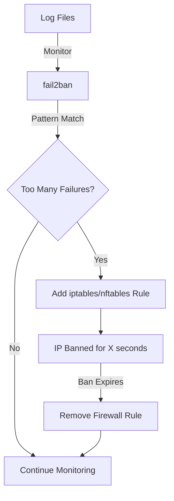

# How to Use Ansible to Configure fail2ban

Author: [nawazdhandala](https://www.github.com/nawazdhandala)

Tags: Ansible, fail2ban, Security, Linux, Intrusion Prevention

Description: Deploy and configure fail2ban across your Linux servers using Ansible with custom jails for SSH, nginx, and application-specific brute force protection.

---

fail2ban is one of those tools that should be on every internet-facing Linux server. It monitors log files for patterns that indicate malicious activity (like repeated failed SSH logins) and automatically bans the offending IP addresses using firewall rules. Without it, your servers are sitting targets for brute force attacks, and even if password authentication is disabled, the constant connection attempts waste resources and fill your logs.

Managing fail2ban configuration manually is fine for one server. But when you have dozens or hundreds of servers, each potentially needing different jail configurations based on the services they run, Ansible is the right approach. In this guide, I will walk through deploying fail2ban with Ansible, including custom jails for SSH, nginx, and application-specific protection.

## How fail2ban Works



## Variables

Define fail2ban settings and jail configurations as Ansible variables.

```yaml
# group_vars/all.yml
fail2ban_version: "latest"

# Default settings applied to all jails
fail2ban_default_bantime: 3600     # 1 hour ban
fail2ban_default_findtime: 600     # 10 minute window
fail2ban_default_maxretry: 5       # 5 failures trigger ban
fail2ban_default_action: "%(action_mwl)s"
fail2ban_default_backend: "auto"

# Email notifications
fail2ban_destemail: "security@company.com"
fail2ban_sender: "fail2ban@{{ ansible_fqdn }}"
fail2ban_mta: "sendmail"

# IP addresses that should never be banned
fail2ban_ignoreip:
  - 127.0.0.1/8
  - 10.0.0.0/8
  - 172.16.0.0/12
  - 192.168.0.0/16

# Jail definitions
fail2ban_jails:
  - name: sshd
    enabled: true
    port: ssh
    logpath: /var/log/auth.log
    maxretry: 3
    bantime: 7200
    findtime: 300

  - name: sshd-ddos
    enabled: true
    port: ssh
    logpath: /var/log/auth.log
    maxretry: 10
    bantime: 86400
    findtime: 60
    filter: sshd-ddos

  - name: nginx-http-auth
    enabled: "{{ 'true' if 'webservers' in group_names else 'false' }}"
    port: "http,https"
    logpath: /var/log/nginx/error.log
    maxretry: 5
    bantime: 3600

  - name: nginx-botsearch
    enabled: "{{ 'true' if 'webservers' in group_names else 'false' }}"
    port: "http,https"
    logpath: /var/log/nginx/access.log
    maxretry: 2
    bantime: 86400
    filter: nginx-botsearch

  - name: nginx-limit-req
    enabled: "{{ 'true' if 'webservers' in group_names else 'false' }}"
    port: "http,https"
    logpath: /var/log/nginx/error.log
    maxretry: 10
    bantime: 3600
    filter: nginx-limit-req

# Custom filters
fail2ban_custom_filters:
  - name: nginx-botsearch
    definition: |
      [Definition]
      failregex = ^<HOST> - .* "(GET|POST|HEAD) .*(wp-login|xmlrpc|\.env|phpmyadmin|admin\.php|\.git).*" (404|403)
      ignoreregex =

  - name: nginx-limit-req
    definition: |
      [Definition]
      failregex = limiting requests, excess:.* by zone .*, client: <HOST>
      ignoreregex =

  - name: app-login
    definition: |
      [Definition]
      failregex = Failed login attempt from <HOST>
      ignoreregex =
```

## fail2ban Role

```yaml
# roles/fail2ban/tasks/main.yml
---
- name: Install fail2ban
  ansible.builtin.package:
    name: fail2ban
    state: "{{ fail2ban_version }}"
  notify: Enable fail2ban

- name: Create fail2ban local configuration directory
  ansible.builtin.file:
    path: /etc/fail2ban/jail.d
    state: directory
    owner: root
    group: root
    mode: '0755'

- name: Create filter.d directory for custom filters
  ansible.builtin.file:
    path: /etc/fail2ban/filter.d
    state: directory
    owner: root
    group: root
    mode: '0755'

- name: Deploy fail2ban default settings
  ansible.builtin.template:
    src: jail.local.j2
    dest: /etc/fail2ban/jail.local
    owner: root
    group: root
    mode: '0644'
  notify: Restart fail2ban

- name: Deploy individual jail configurations
  ansible.builtin.template:
    src: jail.conf.j2
    dest: "/etc/fail2ban/jail.d/{{ item.name }}.conf"
    owner: root
    group: root
    mode: '0644'
  loop: "{{ fail2ban_jails }}"
  notify: Restart fail2ban

- name: Deploy custom filter definitions
  ansible.builtin.copy:
    dest: "/etc/fail2ban/filter.d/{{ item.name }}.conf"
    content: "{{ item.definition }}"
    owner: root
    group: root
    mode: '0644'
  loop: "{{ fail2ban_custom_filters }}"
  notify: Restart fail2ban

- name: Start and enable fail2ban
  ansible.builtin.service:
    name: fail2ban
    state: started
    enabled: yes
```

## Default Configuration Template

```jinja2
# roles/fail2ban/templates/jail.local.j2
# fail2ban default settings - Managed by Ansible
[DEFAULT]
# Ban settings
bantime = {{ fail2ban_default_bantime }}
findtime = {{ fail2ban_default_findtime }}
maxretry = {{ fail2ban_default_maxretry }}

# Ignored IPs (never ban these)
ignoreip = {{ fail2ban_ignoreip | join(' ') }}

# Action settings
banaction = iptables-multiport
banaction_allports = iptables-allports
action = {{ fail2ban_default_action }}

# Email notifications
destemail = {{ fail2ban_destemail }}
sender = {{ fail2ban_sender }}
mta = {{ fail2ban_mta }}

# Backend
backend = {{ fail2ban_default_backend }}
```

## Individual Jail Template

```jinja2
# roles/fail2ban/templates/jail.conf.j2
# {{ item.name }} jail - Managed by Ansible
[{{ item.name }}]
enabled = {{ item.enabled }}
port = {{ item.port }}
logpath = {{ item.logpath }}
maxretry = {{ item.maxretry }}
bantime = {{ item.bantime | default(fail2ban_default_bantime) }}
findtime = {{ item.findtime | default(fail2ban_default_findtime) }}

filter = {{ item.filter }}


action = {{ item.action }}

```

## Handlers

```yaml
# roles/fail2ban/handlers/main.yml
---
- name: Enable fail2ban
  ansible.builtin.service:
    name: fail2ban
    enabled: yes

- name: Restart fail2ban
  ansible.builtin.service:
    name: fail2ban
    state: restarted
```

## Monitoring fail2ban

Deploy a check that reports on fail2ban status and currently banned IPs.

```yaml
# roles/fail2ban/tasks/monitoring.yml
---
- name: Deploy fail2ban status check script
  ansible.builtin.copy:
    dest: /usr/local/bin/fail2ban-report
    content: |
      #!/bin/bash
      # fail2ban status report - Managed by Ansible
      echo "=== fail2ban Status Report ==="
      echo "Date: $(date)"
      echo "Host: $(hostname)"
      echo ""

      # Overall status
      fail2ban-client status

      echo ""
      echo "=== Jail Details ==="

      # Get status of each jail
      for jail in $(fail2ban-client status | grep 'Jail list' | sed 's/.*://;s/,//g'); do
        echo ""
        echo "--- $jail ---"
        fail2ban-client status "$jail"
      done

      echo ""
      echo "=== Currently Banned IPs ==="
      fail2ban-client banned
    owner: root
    group: root
    mode: '0755'

- name: Set up fail2ban metrics for Prometheus (optional)
  ansible.builtin.copy:
    dest: /usr/local/bin/fail2ban-metrics
    content: |
      #!/bin/bash
      # Export fail2ban metrics in Prometheus format
      for jail in $(fail2ban-client status | grep 'Jail list' | sed 's/.*://;s/,//g'); do
        banned=$(fail2ban-client status "$jail" | grep 'Currently banned' | awk '{print $NF}')
        total=$(fail2ban-client status "$jail" | grep 'Total banned' | awk '{print $NF}')
        echo "fail2ban_banned_current{jail=\"$jail\"} $banned"
        echo "fail2ban_banned_total{jail=\"$jail\"} $total"
      done
    owner: root
    group: root
    mode: '0755'
```

## Main Playbook

```yaml
# site.yml
---
- name: Deploy and configure fail2ban
  hosts: all
  become: yes
  roles:
    - fail2ban
```

## Verification

```yaml
# verify-fail2ban.yml
---
- name: Verify fail2ban deployment
  hosts: all
  become: yes
  tasks:
    - name: Check fail2ban is running
      ansible.builtin.service:
        name: fail2ban
        state: started
      check_mode: yes
      register: service_check

    - name: Get fail2ban status
      ansible.builtin.command:
        cmd: fail2ban-client status
      register: f2b_status
      changed_when: false

    - name: Display active jails
      ansible.builtin.debug:
        msg: "{{ f2b_status.stdout }}"

    - name: Check specific jail status
      ansible.builtin.command:
        cmd: "fail2ban-client status {{ item.name }}"
      register: jail_statuses
      loop: "{{ fail2ban_jails | selectattr('enabled', 'equalto', true) | list }}"
      changed_when: false
      ignore_errors: yes

    - name: Display jail details
      ansible.builtin.debug:
        msg: "{{ item.stdout }}"
      loop: "{{ jail_statuses.results }}"
      when: item.rc == 0
```

## Running the Playbook

```bash
# Deploy fail2ban
ansible-playbook -i inventory/hosts.ini site.yml

# Verify deployment
ansible-playbook -i inventory/hosts.ini verify-fail2ban.yml

# Deploy only to webservers (gets nginx jails)
ansible-playbook -i inventory/hosts.ini site.yml --limit webservers

# Unban a specific IP (ad hoc command)
ansible webservers -i inventory/hosts.ini -m command -a "fail2ban-client set sshd unbanip 1.2.3.4" --become
```

## Wrapping Up

fail2ban is a lightweight but effective defense against brute force attacks. With Ansible managing the deployment, you get consistent jail configurations across your fleet, custom filters that match your specific application log patterns, and a central place to manage the whitelist of IPs that should never be banned. The role-based approach means web servers automatically get nginx jails while database servers only get SSH protection. Start with conservative ban times and low retry thresholds, and adjust based on what you see in the logs.
