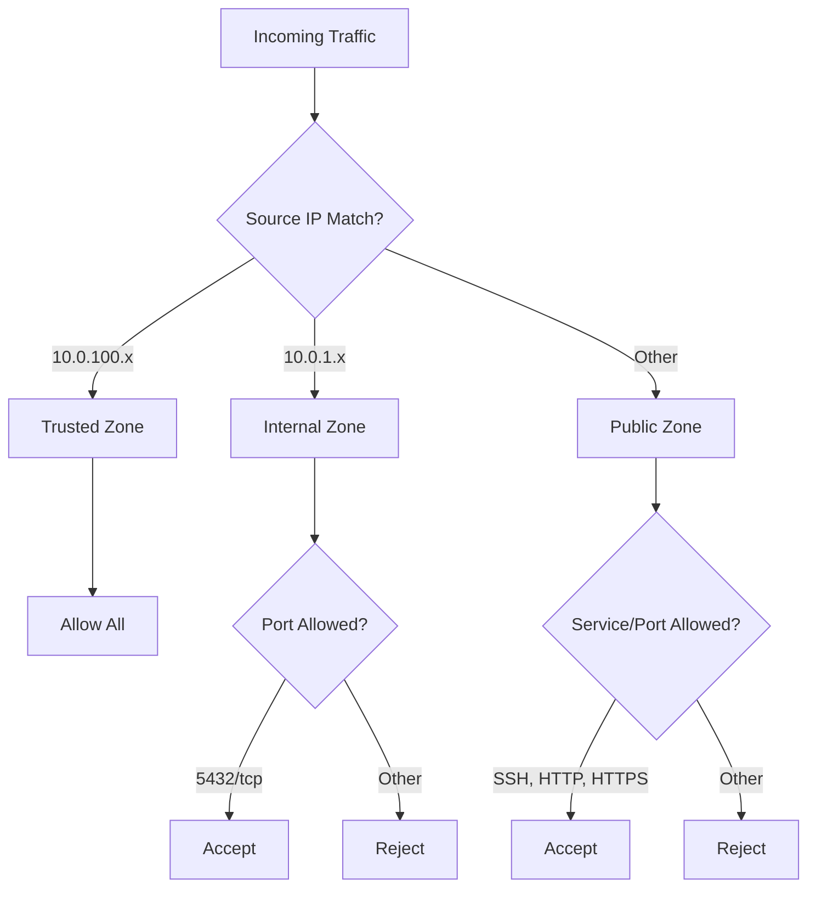

# How to Use Ansible to Configure Firewall Rules with firewalld

Author: [nawazdhandala](https://www.github.com/nawazdhandala)

Tags: Ansible, firewalld, Firewall, Security, RHEL

Description: Learn how to manage firewalld zones, services, and rules with Ansible on RHEL, CentOS, and Fedora systems for consistent firewall automation.

---

firewalld is the default firewall management tool on Red Hat Enterprise Linux, CentOS, Fedora, and their derivatives. Unlike UFW, firewalld organizes rules into zones, making it well-suited for servers that have interfaces connected to different trust levels. Ansible ships with a dedicated `ansible.posix.firewalld` module that lets you manage zones, services, ports, and rich rules declaratively.

This post covers practical patterns for automating firewalld with Ansible.

## Prerequisites

- Ansible 2.9+ with the `ansible.posix` collection installed
- RHEL, CentOS, or Fedora target hosts
- Root or sudo access on target machines
- Basic familiarity with firewalld zones and services

## Understanding firewalld Zones

firewalld uses zones to define trust levels for network connections. Each zone has a set of rules that determine what traffic is allowed. The most commonly used zones are:

- **public** - for untrusted networks (default zone)
- **internal** - for trusted internal networks
- **dmz** - for servers in a DMZ
- **trusted** - accepts all traffic
- **drop** - drops all incoming traffic silently

## Basic Port and Service Management

The simplest use case is opening ports and enabling services. Here is a playbook that sets up a basic web server firewall:

```yaml
# basic_firewalld.yml - Open ports and services with firewalld
---
- name: Configure firewalld for web server
  hosts: webservers
  become: true
  tasks:
    - name: Ensure firewalld is installed and running
      ansible.builtin.yum:
        name: firewalld
        state: present

    - name: Start and enable firewalld
      ansible.builtin.service:
        name: firewalld
        state: started
        enabled: true

    - name: Allow HTTP service permanently
      ansible.posix.firewalld:
        service: http
        permanent: true
        immediate: true
        state: enabled

    - name: Allow HTTPS service permanently
      ansible.posix.firewalld:
        service: https
        permanent: true
        immediate: true
        state: enabled

    - name: Allow custom application port
      ansible.posix.firewalld:
        port: 8080/tcp
        permanent: true
        immediate: true
        state: enabled
```

The `permanent: true` flag writes the rule to the permanent configuration, and `immediate: true` applies it to the running firewall without requiring a reload. Always use both together so the rule survives reboots and takes effect immediately.

## Working with Zones

Different interfaces or source networks can be assigned to different zones. This is one of the most powerful features of firewalld:

```yaml
# zone_config.yml - Configure firewalld zones for multi-network server
---
- name: Configure firewalld zones
  hosts: database_servers
  become: true
  tasks:
    - name: Assign public interface to public zone
      ansible.posix.firewalld:
        zone: public
        interface: eth0
        permanent: true
        immediate: true
        state: enabled

    - name: Assign private interface to internal zone
      ansible.posix.firewalld:
        zone: internal
        interface: eth1
        permanent: true
        immediate: true
        state: enabled

    - name: Allow SSH only in public zone
      ansible.posix.firewalld:
        zone: public
        service: ssh
        permanent: true
        immediate: true
        state: enabled

    - name: Allow PostgreSQL only in internal zone
      ansible.posix.firewalld:
        zone: internal
        service: postgresql
        permanent: true
        immediate: true
        state: enabled

    - name: Allow all monitoring ports in internal zone
      ansible.posix.firewalld:
        zone: internal
        port: "{{ item }}"
        permanent: true
        immediate: true
        state: enabled
      loop:
        - 9100/tcp
        - 9090/tcp
        - 9093/tcp
```

## Source-Based Zone Assignment

Instead of assigning zones by interface, you can assign them by source IP address or subnet. This is useful when you want to grant different access levels to different networks on the same interface:

```yaml
# source_zones.yml - Assign zones based on source IP
---
- name: Configure source-based zones
  hosts: all
  become: true
  vars:
    trusted_management_ips:
      - 10.0.100.5/32
      - 10.0.100.6/32
    app_subnet: 10.0.1.0/24
  tasks:
    - name: Add management IPs to trusted zone
      ansible.posix.firewalld:
        zone: trusted
        source: "{{ item }}"
        permanent: true
        immediate: true
        state: enabled
      loop: "{{ trusted_management_ips }}"

    - name: Add app subnet to internal zone
      ansible.posix.firewalld:
        zone: internal
        source: "{{ app_subnet }}"
        permanent: true
        immediate: true
        state: enabled

    - name: Allow database port in internal zone
      ansible.posix.firewalld:
        zone: internal
        port: 3306/tcp
        permanent: true
        immediate: true
        state: enabled
```

## Rich Rules

For more complex filtering logic, firewalld supports "rich rules" that let you combine source addresses, ports, and actions in a single rule:

```yaml
# rich_rules.yml - Configure firewalld rich rules
---
- name: Configure rich rules
  hosts: all
  become: true
  tasks:
    - name: Allow SSH from specific subnet with logging
      ansible.posix.firewalld:
        rich_rule: 'rule family="ipv4" source address="10.0.0.0/8" service name="ssh" log prefix="SSH_ACCESS" level="info" accept'
        permanent: true
        immediate: true
        state: enabled

    - name: Rate limit HTTP connections
      ansible.posix.firewalld:
        rich_rule: 'rule family="ipv4" service name="http" accept limit value="25/m"'
        permanent: true
        immediate: true
        state: enabled

    - name: Drop traffic from known bad network
      ansible.posix.firewalld:
        rich_rule: 'rule family="ipv4" source address="198.51.100.0/24" drop'
        permanent: true
        immediate: true
        state: enabled

    - name: Allow port 5432 from app servers only
      ansible.posix.firewalld:
        rich_rule: 'rule family="ipv4" source address="{{ item }}" port port="5432" protocol="tcp" accept'
        permanent: true
        immediate: true
        state: enabled
      loop:
        - 10.0.1.10
        - 10.0.1.11
```

## Creating Custom Services

firewalld comes with predefined service definitions, but you can create custom ones for your applications. This makes rules more readable:

```yaml
# custom_service.yml - Create and use custom firewalld services
---
- name: Create custom firewalld service
  hosts: all
  become: true
  tasks:
    - name: Create custom service XML file
      ansible.builtin.copy:
        dest: /etc/firewalld/services/myapp.xml
        content: |
          <?xml version="1.0" encoding="utf-8"?>
          <service>
            <short>MyApp</short>
            <description>Custom application service</description>
            <port protocol="tcp" port="8443"/>
            <port protocol="tcp" port="8444"/>
            <port protocol="udp" port="9999"/>
          </service>
        owner: root
        group: root
        mode: '0644'
      notify: Reload firewalld

    - name: Enable custom service
      ansible.posix.firewalld:
        service: myapp
        permanent: true
        immediate: true
        state: enabled

  handlers:
    - name: Reload firewalld
      ansible.builtin.service:
        name: firewalld
        state: reloaded
```

## Role-Based Configuration with Variables

A clean pattern for managing firewall rules across different server roles:

```yaml
# group_vars/all.yml - Base firewall rules for all servers
base_firewall_services:
  - ssh
base_firewall_ports: []

# group_vars/webservers.yml - Additional rules for web servers
extra_firewall_services:
  - http
  - https
extra_firewall_ports:
  - 8080/tcp
```

```yaml
# firewall_playbook.yml - Apply role-based firewall configuration
---
- name: Configure firewall based on server role
  hosts: all
  become: true
  vars:
    all_services: "{{ base_firewall_services + (extra_firewall_services | default([])) }}"
    all_ports: "{{ base_firewall_ports + (extra_firewall_ports | default([])) }}"
  tasks:
    - name: Ensure firewalld is running
      ansible.builtin.service:
        name: firewalld
        state: started
        enabled: true

    - name: Enable required services
      ansible.posix.firewalld:
        service: "{{ item }}"
        permanent: true
        immediate: true
        state: enabled
      loop: "{{ all_services }}"

    - name: Enable required ports
      ansible.posix.firewalld:
        port: "{{ item }}"
        permanent: true
        immediate: true
        state: enabled
      loop: "{{ all_ports }}"
      when: all_ports | length > 0
```

## Removing Rules

To remove rules that are no longer needed:

```yaml
# remove_rules.yml - Remove firewalld rules
---
- name: Remove outdated firewall rules
  hosts: all
  become: true
  tasks:
    - name: Remove deprecated service
      ansible.posix.firewalld:
        service: telnet
        permanent: true
        immediate: true
        state: disabled

    - name: Remove old application port
      ansible.posix.firewalld:
        port: 9090/tcp
        permanent: true
        immediate: true
        state: disabled
```

## Verification and Auditing

After applying rules, verify the configuration:

```yaml
# verify_firewall.yml - Check firewalld configuration
---
- name: Verify firewalld configuration
  hosts: all
  become: true
  tasks:
    - name: Get active zones
      ansible.builtin.command: firewall-cmd --get-active-zones
      register: active_zones
      changed_when: false

    - name: Show active zones
      ansible.builtin.debug:
        var: active_zones.stdout_lines

    - name: List all rules in public zone
      ansible.builtin.command: firewall-cmd --zone=public --list-all
      register: public_rules
      changed_when: false

    - name: Show public zone rules
      ansible.builtin.debug:
        var: public_rules.stdout_lines
```

## Zone Architecture



## Key Differences from UFW

If you are coming from Ubuntu/Debian and UFW, the main conceptual difference with firewalld is the zone system. Instead of one flat list of rules, you organize access into zones and assign interfaces or source networks to them. This makes it easier to manage servers that sit on multiple networks with different trust levels. The `ansible.posix.firewalld` module maps cleanly to these concepts, and once you get comfortable with zones, the approach feels very natural for complex network topologies.
