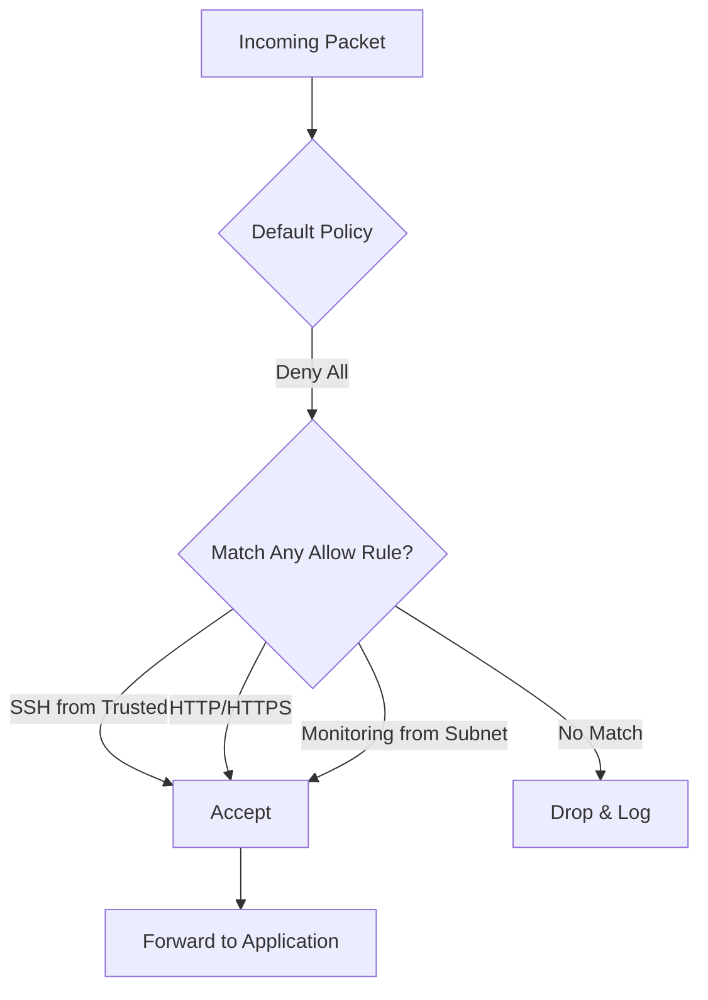

# How to Use Ansible to Configure Firewall Rules with UFW

Author: [nawazdhandala](https://www.github.com/nawazdhandala)

Tags: Ansible, UFW, Firewall, Security, Linux

Description: Learn how to use Ansible to manage UFW firewall rules on Ubuntu and Debian servers for consistent, repeatable security configurations.

---

UFW (Uncomplicated Firewall) is the default firewall management tool on Ubuntu and Debian-based systems. It provides a friendly interface on top of iptables, making firewall management much less painful. When you combine UFW with Ansible, you get repeatable, auditable firewall configurations that you can roll out to hundreds of servers at once.

In this post, I will show you how to use the `community.general.ufw` module to manage firewall rules across your infrastructure.

## Prerequisites

You will need:

- Ansible 2.9+ on your control node
- Ubuntu or Debian target hosts with UFW installed
- SSH access with sudo privileges
- The `community.general` collection installed (`ansible-galaxy collection install community.general`)

## Basic UFW Configuration

Let us start with a simple playbook that sets up a basic firewall policy. The standard approach is to deny all incoming traffic by default and then explicitly allow what you need.

```yaml
# basic_ufw.yml - Set up a basic UFW firewall policy
---
- name: Configure UFW firewall
  hosts: all
  become: true
  tasks:
    - name: Install UFW
      ansible.builtin.apt:
        name: ufw
        state: present
        update_cache: true

    - name: Set default incoming policy to deny
      community.general.ufw:
        direction: incoming
        default: deny

    - name: Set default outgoing policy to allow
      community.general.ufw:
        direction: outgoing
        default: allow

    - name: Allow SSH connections
      community.general.ufw:
        rule: allow
        port: '22'
        proto: tcp
        comment: 'Allow SSH access'

    - name: Enable UFW
      community.general.ufw:
        state: enabled
```

The order matters here. You set the default policies first, then open the ports you need, and finally enable the firewall. If you enable it before allowing SSH, you will lock yourself out.

## Allowing Common Services

Most servers need a handful of standard ports open. Here is how to allow common services:

```yaml
# common_services.yml - Allow common service ports through UFW
---
- name: Configure firewall for web server
  hosts: webservers
  become: true
  vars:
    allowed_ports:
      - { port: '22', proto: 'tcp', comment: 'SSH' }
      - { port: '80', proto: 'tcp', comment: 'HTTP' }
      - { port: '443', proto: 'tcp', comment: 'HTTPS' }
      - { port: '8080', proto: 'tcp', comment: 'Alt HTTP' }
  tasks:
    - name: Allow required ports
      community.general.ufw:
        rule: allow
        port: "{{ item.port }}"
        proto: "{{ item.proto }}"
        comment: "{{ item.comment }}"
      loop: "{{ allowed_ports }}"

    - name: Allow port range for application
      community.general.ufw:
        rule: allow
        port: '3000:3010'
        proto: tcp
        comment: 'Application port range'
```

## Source-Based Filtering

Allowing a port from anywhere is sometimes too broad. You often want to restrict access to specific source IP addresses or subnets. For example, you might only want your monitoring server to reach the SNMP port:

```yaml
# source_filtering.yml - UFW rules with source IP restrictions
---
- name: Configure source-based firewall rules
  hosts: all
  become: true
  vars:
    monitoring_subnet: 10.0.5.0/24
    office_ip: 203.0.113.50
    vpn_subnet: 10.8.0.0/16
  tasks:
    - name: Allow SNMP only from monitoring subnet
      community.general.ufw:
        rule: allow
        port: '161'
        proto: udp
        src: "{{ monitoring_subnet }}"
        comment: 'SNMP from monitoring'

    - name: Allow database access from app servers only
      community.general.ufw:
        rule: allow
        port: '5432'
        proto: tcp
        src: "{{ item }}"
        comment: 'PostgreSQL from app tier'
      loop:
        - 10.0.1.10
        - 10.0.1.11
        - 10.0.1.12

    - name: Allow SSH only from office and VPN
      community.general.ufw:
        rule: allow
        port: '22'
        proto: tcp
        src: "{{ item }}"
        comment: 'SSH from trusted networks'
      loop:
        - "{{ office_ip }}"
        - "{{ vpn_subnet }}"
```

## Rate Limiting

UFW has a built-in rate limiting feature that helps protect against brute-force attacks. It limits connections to 6 per 30 seconds from a single IP. This is particularly useful for SSH:

```yaml
# rate_limiting.yml - Apply rate limiting rules with UFW
---
- name: Configure rate limiting
  hosts: all
  become: true
  tasks:
    - name: Rate limit SSH connections
      community.general.ufw:
        rule: limit
        port: '22'
        proto: tcp
        comment: 'Rate limit SSH to prevent brute force'
```

## Role-Based Firewall Configuration

In a real environment, different server roles need different firewall rules. Here is a pattern using Ansible roles and group variables:

```yaml
# group_vars/webservers.yml - Firewall config for web servers
ufw_rules:
  - { port: '22', proto: 'tcp', src: '10.0.0.0/8', comment: 'SSH internal' }
  - { port: '80', proto: 'tcp', comment: 'HTTP public' }
  - { port: '443', proto: 'tcp', comment: 'HTTPS public' }
  - { port: '9100', proto: 'tcp', src: '10.0.5.0/24', comment: 'Node exporter' }
```

```yaml
# group_vars/dbservers.yml - Firewall config for database servers
ufw_rules:
  - { port: '22', proto: 'tcp', src: '10.0.0.0/8', comment: 'SSH internal' }
  - { port: '5432', proto: 'tcp', src: '10.0.1.0/24', comment: 'PostgreSQL from app tier' }
  - { port: '9100', proto: 'tcp', src: '10.0.5.0/24', comment: 'Node exporter' }
```

```yaml
# firewall_role.yml - Apply role-based firewall rules from group vars
---
- name: Apply role-based firewall configuration
  hosts: all
  become: true
  tasks:
    - name: Reset UFW to clean state
      community.general.ufw:
        state: reset

    - name: Set default deny incoming
      community.general.ufw:
        direction: incoming
        default: deny

    - name: Set default allow outgoing
      community.general.ufw:
        direction: outgoing
        default: allow

    - name: Apply firewall rules for this server role
      community.general.ufw:
        rule: allow
        port: "{{ item.port }}"
        proto: "{{ item.proto }}"
        src: "{{ item.src | default(omit) }}"
        comment: "{{ item.comment | default(omit) }}"
      loop: "{{ ufw_rules }}"

    - name: Enable UFW
      community.general.ufw:
        state: enabled
```

## Deleting Rules

Sometimes you need to remove a rule that is no longer needed. The `delete` parameter handles this:

```yaml
# delete_rules.yml - Remove specific UFW rules
---
- name: Remove outdated firewall rules
  hosts: all
  become: true
  tasks:
    - name: Remove old application port rule
      community.general.ufw:
        rule: allow
        port: '8080'
        proto: tcp
        delete: true

    - name: Remove deprecated source-based rule
      community.general.ufw:
        rule: allow
        port: '3306'
        proto: tcp
        src: 10.0.2.50
        delete: true
```

## Logging Configuration

UFW can log blocked and allowed traffic, which is useful for troubleshooting and security auditing:

```yaml
# logging.yml - Configure UFW logging level
---
- name: Configure UFW logging
  hosts: all
  become: true
  tasks:
    - name: Enable UFW logging at medium level
      community.general.ufw:
        logging: 'on'

    # Options: on, off, low, medium, high, full
    - name: Set logging to high for security audit
      community.general.ufw:
        logging: 'high'
```

## Full Production Playbook

Here is a complete playbook that ties everything together for a typical web application stack:

```yaml
# production_firewall.yml - Complete UFW setup for production web servers
---
- name: Production firewall configuration
  hosts: webservers
  become: true
  vars:
    trusted_ssh_sources:
      - 10.0.0.0/8
      - 172.16.0.0/12
    monitoring_subnet: 10.0.5.0/24
  tasks:
    - name: Ensure UFW is installed
      ansible.builtin.apt:
        name: ufw
        state: present

    - name: Reset UFW rules
      community.general.ufw:
        state: reset

    - name: Set default policies
      community.general.ufw:
        direction: "{{ item.direction }}"
        default: "{{ item.policy }}"
      loop:
        - { direction: incoming, policy: deny }
        - { direction: outgoing, policy: allow }

    - name: Allow SSH from trusted sources with rate limiting
      community.general.ufw:
        rule: limit
        port: '22'
        proto: tcp
        src: "{{ item }}"
        comment: 'SSH from trusted network'
      loop: "{{ trusted_ssh_sources }}"

    - name: Allow HTTP and HTTPS from anywhere
      community.general.ufw:
        rule: allow
        port: "{{ item.port }}"
        proto: tcp
        comment: "{{ item.comment }}"
      loop:
        - { port: '80', comment: 'HTTP' }
        - { port: '443', comment: 'HTTPS' }

    - name: Allow monitoring ports from monitoring subnet
      community.general.ufw:
        rule: allow
        port: "{{ item }}"
        proto: tcp
        src: "{{ monitoring_subnet }}"
        comment: 'Monitoring access'
      loop:
        - '9100'
        - '9090'

    - name: Enable logging
      community.general.ufw:
        logging: 'medium'

    - name: Enable UFW
      community.general.ufw:
        state: enabled

    - name: Verify UFW status
      ansible.builtin.command: ufw status verbose
      register: ufw_status
      changed_when: false

    - name: Show firewall status
      ansible.builtin.debug:
        var: ufw_status.stdout_lines
```

## Firewall Rule Flow



## Common Pitfalls

There are a few things to watch out for. First, always allow SSH before enabling the firewall. If you enable UFW with a deny-all policy and no SSH rule, you will lose access. Second, be careful with the `state: reset` task. It removes all existing rules, so only use it when you are managing the complete rule set with Ansible. Third, UFW rules are evaluated in order, and the first matching rule wins. Ansible adds rules in the order you specify them, so put more specific rules before broader ones. Fourth, remember that UFW rules persist across reboots by default, so running your playbook once is enough unless you need to change something.

UFW with Ansible gives you a solid, manageable firewall setup without the complexity of raw iptables. For most Ubuntu and Debian deployments, this combination covers everything you need.
