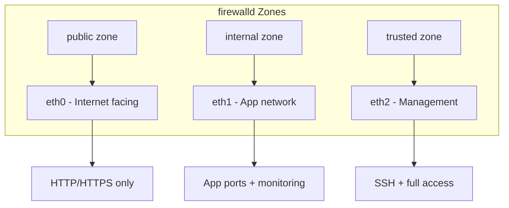

# How to Use Ansible to Configure firewalld

Author: [nawazdhandala](https://www.github.com/nawazdhandala)

Tags: Ansible, firewalld, Firewall, Security, RHEL

Description: Automate firewalld zone and service configuration on RHEL, CentOS, and Fedora servers using Ansible with zone-based network segmentation.

---

firewalld is the default firewall management tool on RHEL, CentOS, Fedora, and their derivatives. Unlike UFW's straightforward allow/deny model, firewalld uses a zone-based architecture where network interfaces are assigned to zones, and each zone has its own set of allowed services and ports. This makes it well suited for servers with multiple network interfaces that need different security policies on each.

Managing firewalld with Ansible is particularly valuable because zone configurations and rich rules can get complex quickly. Having them defined in code means you can review changes, roll back mistakes, and ensure every server in a group has identical firewall rules. In this guide, I will cover deploying firewalld configurations with Ansible, including zone management, service definitions, rich rules, and port forwarding.

## Zone Architecture



## Variables

```yaml
# group_vars/all.yml
# Default zone for interfaces not explicitly assigned
firewalld_default_zone: public

# Zone configurations
firewalld_zones:
  - name: public
    description: "Internet-facing interfaces"
    target: "default"  # default means deny unless explicitly allowed
    services:
      - http
      - https
    ports: []
    rich_rules: []

  - name: internal
    description: "Internal application network"
    target: "default"
    services: []
    ports:
      - port: 8080
        protocol: tcp
      - port: 9100
        protocol: tcp
    rich_rules: []

  - name: management
    description: "Management and monitoring access"
    target: "default"
    services:
      - ssh
    ports:
      - port: 9090
        protocol: tcp
    rich_rules: []

# Interface to zone mappings
firewalld_interface_zones:
  - interface: eth0
    zone: public
  - interface: eth1
    zone: internal
  - interface: eth2
    zone: management

# Global allowed services (applied to default zone on all servers)
firewalld_global_services:
  - ssh

# Per-role firewall settings (overridden in group_vars)
firewalld_role_services: []
firewalld_role_ports: []
firewalld_role_rich_rules: []
```

Web server group variables.

```yaml
# group_vars/webservers.yml
firewalld_role_services:
  - http
  - https

firewalld_role_ports:
  - port: 9100
    protocol: tcp
    zone: internal

firewalld_role_rich_rules:
  - zone: public
    rule: 'rule family="ipv4" source address="10.0.100.0/24" service name="ssh" accept'
```

Database server group variables.

```yaml
# group_vars/dbservers.yml
firewalld_role_ports:
  - port: 5432
    protocol: tcp
    zone: internal

  - port: 5432
    protocol: tcp
    zone: management

firewalld_role_rich_rules:
  - zone: internal
    rule: 'rule family="ipv4" source address="10.0.1.0/24" port port="5432" protocol="tcp" accept'
```

## firewalld Role

```yaml
# roles/firewalld/tasks/main.yml
---
- name: Install firewalld
  ansible.builtin.package:
    name: firewalld
    state: present

- name: Start and enable firewalld
  ansible.builtin.service:
    name: firewalld
    state: started
    enabled: yes

- name: Set default zone
  ansible.builtin.command:
    cmd: "firewall-cmd --set-default-zone={{ firewalld_default_zone }}"
  register: default_zone_result
  changed_when: "'ZONE_ALREADY_SET' not in default_zone_result.stderr"

# Assign interfaces to zones
- name: Assign interfaces to zones
  ansible.posix.firewalld:
    zone: "{{ item.zone }}"
    interface: "{{ item.interface }}"
    permanent: yes
    immediate: yes
    state: enabled
  loop: "{{ firewalld_interface_zones | default([]) }}"
  when: item.interface in ansible_interfaces

# Apply global services to default zone
- name: Add global services to default zone
  ansible.posix.firewalld:
    service: "{{ item }}"
    zone: "{{ firewalld_default_zone }}"
    permanent: yes
    immediate: yes
    state: enabled
  loop: "{{ firewalld_global_services }}"

# Apply zone-specific services
- name: Configure zone services
  ansible.posix.firewalld:
    service: "{{ item.1 }}"
    zone: "{{ item.0.name }}"
    permanent: yes
    immediate: yes
    state: enabled
  loop: "{{ firewalld_zones | subelements('services', skip_missing=True) }}"
  when: item.1 is defined

# Apply zone-specific ports
- name: Configure zone ports
  ansible.posix.firewalld:
    port: "{{ item.1.port }}/{{ item.1.protocol }}"
    zone: "{{ item.0.name }}"
    permanent: yes
    immediate: yes
    state: enabled
  loop: "{{ firewalld_zones | subelements('ports', skip_missing=True) }}"
  when: item.1 is defined

# Apply role-specific services
- name: Add role-specific services
  ansible.posix.firewalld:
    service: "{{ item }}"
    zone: "{{ firewalld_default_zone }}"
    permanent: yes
    immediate: yes
    state: enabled
  loop: "{{ firewalld_role_services | default([]) }}"

# Apply role-specific ports
- name: Add role-specific ports
  ansible.posix.firewalld:
    port: "{{ item.port }}/{{ item.protocol }}"
    zone: "{{ item.zone | default(firewalld_default_zone) }}"
    permanent: yes
    immediate: yes
    state: enabled
  loop: "{{ firewalld_role_ports | default([]) }}"

# Apply rich rules
- name: Add role-specific rich rules
  ansible.posix.firewalld:
    rich_rule: "{{ item.rule }}"
    zone: "{{ item.zone | default(firewalld_default_zone) }}"
    permanent: yes
    immediate: yes
    state: enabled
  loop: "{{ firewalld_role_rich_rules | default([]) }}"

# Remove unwanted services from default zone
- name: Remove unwanted services from public zone
  ansible.posix.firewalld:
    service: "{{ item }}"
    zone: public
    permanent: yes
    immediate: yes
    state: disabled
  loop:
    - cockpit
    - dhcpv6-client
  ignore_errors: yes
```

## Custom Service Definition

Create custom firewalld service definitions for application-specific ports.

```yaml
# roles/firewalld/tasks/custom-services.yml
---
- name: Create custom service directory
  ansible.builtin.file:
    path: /etc/firewalld/services
    state: directory
    owner: root
    group: root
    mode: '0750'

- name: Deploy custom service definitions
  ansible.builtin.template:
    src: custom-service.xml.j2
    dest: "/etc/firewalld/services/{{ item.name }}.xml"
    owner: root
    group: root
    mode: '0640'
  loop: "{{ firewalld_custom_services | default([]) }}"
  notify: Reload firewalld
```

The custom service XML template.

```jinja2
# roles/firewalld/templates/custom-service.xml.j2
<?xml version="1.0" encoding="utf-8"?>
<service>
  <short>{{ item.short_name | default(item.name) }}</short>
  <description>{{ item.description | default('Custom service managed by Ansible') }}</description>

  <port protocol="{{ port.protocol }}" port="{{ port.port }}"/>

</service>
```

## Port Forwarding

```yaml
# roles/firewalld/tasks/port-forwarding.yml
---
- name: Configure port forwarding rules
  ansible.posix.firewalld:
    rich_rule: 'rule family="ipv4" forward-port port="{{ item.source_port }}" protocol="{{ item.protocol }}" to-port="{{ item.dest_port }}" to-addr="{{ item.dest_addr | default("") }}"'
    zone: "{{ item.zone | default(firewalld_default_zone) }}"
    permanent: yes
    immediate: yes
    state: enabled
  loop: "{{ firewalld_port_forwards | default([]) }}"
```

## Handlers

```yaml
# roles/firewalld/handlers/main.yml
---
- name: Reload firewalld
  ansible.builtin.command:
    cmd: firewall-cmd --reload

- name: Restart firewalld
  ansible.builtin.service:
    name: firewalld
    state: restarted
```

## Verification

```yaml
# verify-firewalld.yml
---
- name: Verify firewalld configuration
  hosts: all
  become: yes
  tasks:
    - name: Check firewalld is running
      ansible.builtin.command:
        cmd: firewall-cmd --state
      register: fw_state
      changed_when: false

    - name: Get active zones
      ansible.builtin.command:
        cmd: firewall-cmd --get-active-zones
      register: active_zones
      changed_when: false

    - name: Display active zones
      ansible.builtin.debug:
        msg: "{{ active_zones.stdout_lines }}"

    - name: Get all zone details
      ansible.builtin.command:
        cmd: "firewall-cmd --zone={{ item.name }} --list-all"
      register: zone_details
      loop: "{{ firewalld_zones }}"
      changed_when: false

    - name: Display zone configurations
      ansible.builtin.debug:
        msg: "{{ item.stdout_lines }}"
      loop: "{{ zone_details.results }}"

    - name: List all rich rules
      ansible.builtin.command:
        cmd: "firewall-cmd --zone={{ item.name }} --list-rich-rules"
      register: rich_rules
      loop: "{{ firewalld_zones }}"
      changed_when: false

    - name: Display rich rules
      ansible.builtin.debug:
        msg: "Zone {{ item.item.name }}: {{ item.stdout_lines }}"
      loop: "{{ rich_rules.results }}"
      when: item.stdout | length > 0
```

## Running the Playbook

```bash
# Deploy firewalld configuration
ansible-playbook -i inventory/hosts.ini site.yml

# Verify configuration
ansible-playbook -i inventory/hosts.ini verify-firewalld.yml

# Apply only to database servers
ansible-playbook -i inventory/hosts.ini site.yml --limit dbservers

# Dry run
ansible-playbook -i inventory/hosts.ini site.yml --check --diff
```

## Wrapping Up

firewalld's zone-based architecture maps naturally to Ansible's inventory groups. Web servers, application servers, and database servers each get their own zone configurations through group variables, while global rules are applied everywhere. The rich rules syntax handles more complex requirements like source-based filtering and port forwarding. The key advantage of managing firewalld through Ansible is that your firewall rules are documented, reviewed, and deployed consistently. When you add a new service or change a network topology, updating firewall rules is a variable change and a playbook run rather than manual commands on each server.
