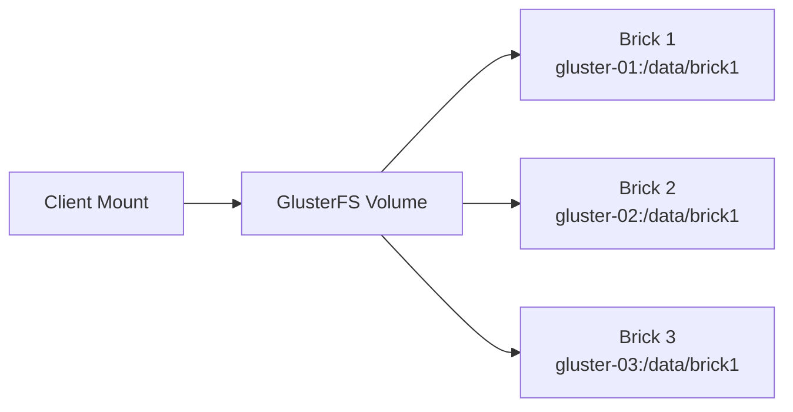

# How to Use Ansible to Configure GlusterFS

Author: [nawazdhandala](https://www.github.com/nawazdhandala)

Tags: Ansible, GlusterFS, Storage, Distributed Filesystem

Description: Learn how to deploy and configure GlusterFS distributed storage clusters with Ansible for scalable file sharing.

---

GlusterFS is a scalable distributed filesystem that aggregates storage from multiple servers into a single namespace. Unlike Ceph, which has a steep learning curve and complex architecture, GlusterFS is relatively straightforward to set up and manage. It works by combining "bricks" (directories on different servers) into volumes that clients can mount like any other filesystem.

Ansible is a perfect match for GlusterFS because the setup involves repeated steps across multiple nodes that need to be identical. This guide walks through deploying a complete GlusterFS cluster from scratch using Ansible.

## Cluster Topology

For this guide, we will build a 3-node replicated cluster. Replicated volumes mean every brick has a complete copy of the data, providing high availability.



## Inventory Setup

```ini
# inventory/gluster
[gluster_nodes]
gluster-01 ansible_host=10.0.1.10 gluster_ip=10.0.1.10
gluster-02 ansible_host=10.0.1.11 gluster_ip=10.0.1.11
gluster-03 ansible_host=10.0.1.12 gluster_ip=10.0.1.12

[gluster_clients]
app-server-01 ansible_host=10.0.2.10
app-server-02 ansible_host=10.0.2.11

[gluster_nodes:vars]
brick_path=/data/brick1
volume_name=shared_data
```

## Installing GlusterFS

First, install the GlusterFS server on all cluster nodes and the client on machines that need to mount the volumes.

```yaml
# install-glusterfs.yml - Install GlusterFS server and client packages
---
- name: Install GlusterFS server
  hosts: gluster_nodes
  become: true

  tasks:
    # Add the GlusterFS repository for the latest stable release
    - name: Install GlusterFS repo (CentOS/RHEL)
      ansible.builtin.yum:
        name: centos-release-gluster10
        state: present
      when: ansible_os_family == "RedHat"

    # Install the server daemon
    - name: Install GlusterFS server
      ansible.builtin.yum:
        name:
          - glusterfs-server
          - glusterfs-cli
        state: present
      when: ansible_os_family == "RedHat"

    # Install on Debian/Ubuntu
    - name: Install GlusterFS server (Debian)
      ansible.builtin.apt:
        name:
          - glusterfs-server
          - glusterfs-client
        state: present
        update_cache: true
      when: ansible_os_family == "Debian"

    # Start and enable the glusterd service
    - name: Enable and start glusterd
      ansible.builtin.systemd:
        name: glusterd
        state: started
        enabled: true

    # Open firewall ports for GlusterFS
    - name: Open GlusterFS firewall ports
      ansible.posix.firewalld:
        service: glusterfs
        permanent: true
        state: enabled
        immediate: true
      when: ansible_os_family == "RedHat"
      failed_when: false

- name: Install GlusterFS client
  hosts: gluster_clients
  become: true

  tasks:
    - name: Install GlusterFS client package
      ansible.builtin.yum:
        name: glusterfs-fuse
        state: present
      when: ansible_os_family == "RedHat"

    - name: Install GlusterFS client (Debian)
      ansible.builtin.apt:
        name: glusterfs-client
        state: present
        update_cache: true
      when: ansible_os_family == "Debian"
```

## Preparing Storage Bricks

Each GlusterFS node needs a dedicated filesystem for its brick. Using a separate partition or LVM volume for bricks is strongly recommended over using the root filesystem.

```yaml
# prepare-bricks.yml - Set up storage devices and directories for GlusterFS bricks
---
- name: Prepare GlusterFS bricks
  hosts: gluster_nodes
  become: true

  vars:
    brick_device: /dev/sdb
    brick_mount: /data
    brick_dir: /data/brick1/vol0

  tasks:
    # Create an XFS filesystem on the brick device
    - name: Create XFS filesystem on brick device
      community.general.filesystem:
        fstype: xfs
        dev: "{{ brick_device }}"
        opts: "-i size=512"

    # Create the mount point directory
    - name: Create brick mount directory
      ansible.builtin.file:
        path: "{{ brick_mount }}"
        state: directory
        mode: '0755'

    # Mount the filesystem and add to fstab
    - name: Mount brick filesystem
      ansible.posix.mount:
        path: "{{ brick_mount }}"
        src: "{{ brick_device }}"
        fstype: xfs
        opts: defaults
        state: mounted

    # Create the actual brick directory within the mount
    - name: Create brick directory
      ansible.builtin.file:
        path: "{{ brick_dir }}"
        state: directory
        owner: root
        group: root
        mode: '0755'
```

## Building the Trusted Storage Pool

GlusterFS requires nodes to be part of a "trusted storage pool" before they can share bricks. One node probes the others:

```yaml
# create-pool.yml - Build the GlusterFS trusted storage pool
---
- name: Create GlusterFS trusted storage pool
  hosts: gluster_nodes[0]
  become: true

  tasks:
    # Probe each peer node to add it to the trusted pool
    - name: Probe peer nodes
      gluster.gluster.gluster_peer:
        state: present
        nodes: "{{ groups['gluster_nodes'] | map('extract', hostvars, 'gluster_ip') | list }}"

    # Wait for peers to connect
    - name: Wait for peer connections
      ansible.builtin.command:
        cmd: gluster peer status
      register: peer_status
      until: peer_status.stdout_lines | select('search', 'Peer in Cluster') | list | length == (groups['gluster_nodes'] | length - 1)
      retries: 10
      delay: 5
      changed_when: false

    - name: Display peer status
      ansible.builtin.debug:
        var: peer_status.stdout_lines
```

## Creating and Starting Volumes

Now we create the actual GlusterFS volume across the bricks:

```yaml
# create-volume.yml - Create and start GlusterFS volumes
---
- name: Create GlusterFS volumes
  hosts: gluster_nodes[0]
  become: true

  vars:
    volumes:
      - name: shared_data
        type: replicate
        replicas: 3
        brick_dir: /data/brick1/vol0
        options:
          performance.cache-size: "256MB"
          performance.io-thread-count: "16"
          network.ping-timeout: "10"
          diagnostics.client-log-level: WARNING

  tasks:
    # Build the brick list from all cluster nodes
    - name: Create replicated volume
      gluster.gluster.gluster_volume:
        state: present
        name: "{{ item.name }}"
        bricks: "{{ item.brick_dir }}"
        replicas: "{{ item.replicas }}"
        cluster: "{{ groups['gluster_nodes'] | map('extract', hostvars, 'gluster_ip') | list }}"
        force: true
      loop: "{{ volumes }}"

    # Start the volume
    - name: Start GlusterFS volume
      gluster.gluster.gluster_volume:
        state: started
        name: "{{ item.name }}"
      loop: "{{ volumes }}"

    # Apply volume tuning options
    - name: Set volume options
      ansible.builtin.command:
        cmd: "gluster volume set {{ item.0.name }} {{ item.1.key }} {{ item.1.value }}"
      loop: "{{ volumes | subelements('options') | list }}"
      loop_control:
        label: "{{ item.0.name }}: {{ item.1.key }}={{ item.1.value }}"
      changed_when: true
      when: item.0.options is defined

    # Verify the volume is healthy
    - name: Get volume info
      ansible.builtin.command:
        cmd: "gluster volume info {{ item.name }}"
      loop: "{{ volumes }}"
      register: vol_info
      changed_when: false

    - name: Display volume info
      ansible.builtin.debug:
        var: vol_info.results | map(attribute='stdout_lines') | list
```

## Mounting on Clients

With the volume running, clients can mount it using the native GlusterFS FUSE client:

```yaml
# mount-clients.yml - Mount GlusterFS volumes on application servers
---
- name: Mount GlusterFS volumes on clients
  hosts: gluster_clients
  become: true

  vars:
    gluster_mounts:
      - volume: shared_data
        mount_point: /mnt/shared_data
        server: "{{ hostvars[groups['gluster_nodes'][0]]['gluster_ip'] }}"
        options: "defaults,_netdev,backup-volfile-servers={{ groups['gluster_nodes'][1:] | map('extract', hostvars, 'gluster_ip') | join(':') }}"

  tasks:
    # Create mount point directories
    - name: Create mount point
      ansible.builtin.file:
        path: "{{ item.mount_point }}"
        state: directory
        mode: '0755'
      loop: "{{ gluster_mounts }}"

    # Mount the GlusterFS volume
    - name: Mount GlusterFS volume
      ansible.posix.mount:
        path: "{{ item.mount_point }}"
        src: "{{ item.server }}:/{{ item.volume }}"
        fstype: glusterfs
        opts: "{{ item.options }}"
        state: mounted
      loop: "{{ gluster_mounts }}"

    # Verify the mount is working
    - name: Test write to GlusterFS mount
      ansible.builtin.copy:
        content: "Mount test from {{ inventory_hostname }} at {{ ansible_date_time.iso8601 }}\n"
        dest: "{{ item.mount_point }}/.mount_test_{{ inventory_hostname }}"
        mode: '0644'
      loop: "{{ gluster_mounts }}"
```

## Health Monitoring

Regular health checks are essential for any distributed storage system:

```yaml
# health-check.yml - Monitor GlusterFS cluster health
---
- name: GlusterFS health check
  hosts: gluster_nodes[0]
  become: true

  tasks:
    # Check peer connectivity
    - name: Check peer status
      ansible.builtin.command:
        cmd: gluster peer status
      register: peer_status
      changed_when: false

    # Check volume status including brick health
    - name: Check volume status
      ansible.builtin.command:
        cmd: gluster volume status all detail
      register: vol_status
      changed_when: false

    # Look for any heal entries that indicate split-brain or inconsistencies
    - name: Check heal info
      ansible.builtin.command:
        cmd: gluster volume heal shared_data info
      register: heal_info
      changed_when: false

    # Parse the heal count
    - name: Check for entries needing healing
      ansible.builtin.command:
        cmd: gluster volume heal shared_data info summary
      register: heal_summary
      changed_when: false
      failed_when: false

    - name: Display cluster health report
      ansible.builtin.debug:
        msg:
          - "=== Peer Status ==="
          - "{{ peer_status.stdout_lines }}"
          - "=== Heal Summary ==="
          - "{{ heal_summary.stdout_lines | default(['No heal info available']) }}"
```

## Expanding the Cluster

When you need more capacity, adding bricks is straightforward:

```yaml
# expand-volume.yml - Add new bricks to an existing volume
---
- name: Expand GlusterFS volume
  hosts: gluster_nodes[0]
  become: true

  vars:
    volume_name: shared_data
    new_bricks:
      - "10.0.1.10:/data/brick2/vol0"
      - "10.0.1.11:/data/brick2/vol0"
      - "10.0.1.12:/data/brick2/vol0"

  tasks:
    # Add new bricks to the volume (must add in multiples of replica count)
    - name: Add bricks to volume
      ansible.builtin.command:
        cmd: "gluster volume add-brick {{ volume_name }} replica 3 {{ new_bricks | join(' ') }}"
      register: add_result
      changed_when: "'successful' in add_result.stdout"

    # Rebalance data across old and new bricks
    - name: Start rebalance
      ansible.builtin.command:
        cmd: "gluster volume rebalance {{ volume_name }} start"
      changed_when: true

    # Monitor rebalance progress
    - name: Check rebalance status
      ansible.builtin.command:
        cmd: "gluster volume rebalance {{ volume_name }} status"
      register: rebalance
      until: "'completed' in rebalance.stdout"
      retries: 120
      delay: 30
      changed_when: false
```

## Operational Tips

Here are a few things that have helped me keep GlusterFS clusters healthy in production:

1. Always use XFS for brick filesystems. GlusterFS relies on extended attributes heavily, and XFS handles them better than ext4 in most cases.

2. When adding bricks to a replicated volume, you must add them in multiples of the replica count. For a replica-3 volume, add 3, 6, or 9 bricks at a time. Getting this wrong will fail with a confusing error.

3. Set `backup-volfile-servers` in your client mount options. This gives clients alternative servers to connect to if the primary is down, providing true high availability at the mount level.

4. Run the heal check regularly. If files are accumulating in the heal queue, something is wrong with brick connectivity and needs attention before it becomes a bigger problem.

5. Monitor disk usage on individual bricks, not just the volume total. GlusterFS does not rebalance automatically when new files are written, so bricks can become unevenly filled over time.

GlusterFS with Ansible gives you a repeatable, scalable storage solution that is much simpler to operate than alternatives like Ceph. For use cases like shared web content, log aggregation, or media storage, it is often the right choice.
