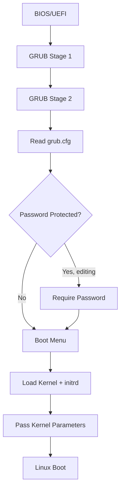

# How to Use Ansible to Configure GRUB Boot Loader

Author: [nawazdhandala](https://www.github.com/nawazdhandala)

Tags: Ansible, GRUB, Boot Loader, Linux, System Administration

Description: Automate GRUB bootloader configuration across your Linux servers using Ansible for kernel parameters, boot options, timeout settings, and security.

---

GRUB (GRand Unified Bootloader) is the first thing that runs when your Linux server boots. Misconfigure it, and your server might not come back up after a reboot. That is why most people are afraid to touch it. But there are legitimate reasons to modify GRUB settings: adding kernel parameters for performance tuning, changing the default boot entry, setting a boot timeout, or securing the bootloader with a password. Ansible takes the fear out of GRUB management by making changes repeatable and consistent.

## GRUB Configuration Basics

GRUB2 (which is what modern Linux uses) has its configuration split across several files:

- `/etc/default/grub` - Main configuration variables (this is what you edit)
- `/etc/grub.d/` - Scripts that generate the final config
- `/boot/grub/grub.cfg` - Generated config (never edit this directly)

You modify `/etc/default/grub` and then run `update-grub` (Debian) or `grub2-mkconfig` (RHEL) to regenerate the final config.

## Modifying Kernel Boot Parameters

The most common GRUB change is adding or modifying kernel command line parameters.

This playbook manages kernel boot parameters through GRUB:

```yaml
# configure-grub.yml - Manage GRUB bootloader settings
---
- name: Configure GRUB Boot Loader
  hosts: all
  become: true
  vars:
    grub_cmdline_additions:
      - "transparent_hugepage=never"
      - "elevator=deadline"
      - "intel_iommu=on"
      - "audit=1"
    grub_timeout: 5
    grub_default: 0

  tasks:
    - name: Read current GRUB configuration
      ansible.builtin.slurp:
        src: /etc/default/grub
      register: current_grub

    - name: Parse current GRUB_CMDLINE_LINUX
      ansible.builtin.set_fact:
        current_cmdline: >-
          {{ (current_grub.content | b64decode) | regex_search('GRUB_CMDLINE_LINUX="([^"]*)"', '\1') | first | default('') }}

    - name: Build new GRUB_CMDLINE_LINUX
      ansible.builtin.set_fact:
        new_cmdline: >-
          
          
          
          
          
          {{ (params + grub_cmdline_additions) | join(' ') }}

    - name: Update GRUB_CMDLINE_LINUX
      ansible.builtin.lineinfile:
        path: /etc/default/grub
        regexp: '^GRUB_CMDLINE_LINUX='
        line: 'GRUB_CMDLINE_LINUX="{{ new_cmdline | trim }}"'
        backup: true
      notify: Update GRUB

    - name: Set GRUB timeout
      ansible.builtin.lineinfile:
        path: /etc/default/grub
        regexp: '^GRUB_TIMEOUT='
        line: 'GRUB_TIMEOUT={{ grub_timeout }}'
      notify: Update GRUB

    - name: Set default boot entry
      ansible.builtin.lineinfile:
        path: /etc/default/grub
        regexp: '^GRUB_DEFAULT='
        line: 'GRUB_DEFAULT={{ grub_default }}'
      notify: Update GRUB

  handlers:
    - name: Update GRUB
      ansible.builtin.command:
        cmd: "{{ 'update-grub' if ansible_os_family == 'Debian' else 'grub2-mkconfig -o /boot/grub2/grub.cfg' }}"
```

## Adding Kernel Parameters for Specific Use Cases

Different workloads need different kernel boot parameters. Here are some common profiles.

This variable file defines kernel parameters for database servers:

```yaml
# group_vars/database_servers.yml
grub_cmdline_additions:
  # Disable THP (causes latency spikes in databases)
  - "transparent_hugepage=never"
  # Use deadline I/O scheduler for better DB performance
  - "elevator=deadline"
  # Increase kernel audit buffer
  - "audit_backlog_limit=8192"
  # Disable spectre/meltdown mitigations for performance
  # Only do this if your threat model allows it
  # - "mitigations=off"
```

Parameters for Kubernetes nodes:

```yaml
# group_vars/k8s_nodes.yml
grub_cmdline_additions:
  # Enable cgroup v2
  - "systemd.unified_cgroup_hierarchy=1"
  # Enable user namespaces
  - "user_namespace.enable=1"
  # Reserve memory for system overhead
  - "cgroup.memory=nokmem"
```

## Securing GRUB with a Password

On physical servers or VMs where console access is possible, protecting GRUB with a password prevents unauthorized boot parameter changes.

This playbook sets a GRUB bootloader password:

```yaml
# secure-grub.yml - Add password protection to GRUB
---
- name: Secure GRUB Bootloader
  hosts: all
  become: true
  vars:
    grub_superuser: admin
    # Store this in Ansible Vault in production!
    grub_password: "{{ vault_grub_password }}"

  tasks:
    - name: Generate GRUB password hash
      ansible.builtin.shell: |
        echo -e "{{ grub_password }}\n{{ grub_password }}" | grub-mkpasswd-pbkdf2 | grep "PBKDF2" | awk '{print $NF}'
      register: grub_password_hash
      changed_when: false
      no_log: true

    - name: Create GRUB superuser configuration on Debian
      ansible.builtin.copy:
        dest: /etc/grub.d/01_users
        mode: '0755'
        content: |
          #!/bin/sh
          cat << EOF
          set superusers="{{ grub_superuser }}"
          password_pbkdf2 {{ grub_superuser }} {{ grub_password_hash.stdout }}
          EOF
      notify: Update GRUB
      when: ansible_os_family == "Debian"

    - name: Create GRUB superuser configuration on RHEL
      ansible.builtin.copy:
        dest: /etc/grub.d/01_users
        mode: '0755'
        content: |
          #!/bin/sh
          cat << EOF
          set superusers="{{ grub_superuser }}"
          password_pbkdf2 {{ grub_superuser }} {{ grub_password_hash.stdout }}
          EOF
      notify: Update GRUB RHEL
      when: ansible_os_family == "RedHat"

    - name: Allow normal boot without password (restrict editing only)
      ansible.builtin.lineinfile:
        path: /etc/grub.d/10_linux
        regexp: '(menuentry.*) \{'
        backrefs: true
        line: '\1 --unrestricted {'
      notify: Update GRUB
      when: ansible_os_family == "Debian"

  handlers:
    - name: Update GRUB
      ansible.builtin.command: update-grub

    - name: Update GRUB RHEL
      ansible.builtin.command: grub2-mkconfig -o /boot/grub2/grub.cfg
```

## Configuring Serial Console for GRUB

For headless servers and cloud instances, serial console access through GRUB is important for debugging boot issues.

This playbook enables serial console output in GRUB:

```yaml
# configure-grub-serial.yml - Enable serial console
---
- name: Configure GRUB Serial Console
  hosts: all
  become: true
  tasks:
    - name: Configure GRUB for serial console
      ansible.builtin.blockinfile:
        path: /etc/default/grub
        marker: "# {mark} ANSIBLE SERIAL CONSOLE"
        block: |
          GRUB_TERMINAL="console serial"
          GRUB_SERIAL_COMMAND="serial --speed=115200 --unit=0 --word=8 --parity=no --stop=1"
      notify: Update GRUB

    - name: Add serial console to kernel parameters
      ansible.builtin.lineinfile:
        path: /etc/default/grub
        regexp: '^GRUB_CMDLINE_LINUX_DEFAULT='
        line: 'GRUB_CMDLINE_LINUX_DEFAULT="quiet console=tty0 console=ttyS0,115200n8"'
      notify: Update GRUB

  handlers:
    - name: Update GRUB
      ansible.builtin.command:
        cmd: "{{ 'update-grub' if ansible_os_family == 'Debian' else 'grub2-mkconfig -o /boot/grub2/grub.cfg' }}"
```

## Managing Default Kernel Version

When you have multiple kernels installed, you might want to pin a specific version as the default.

This playbook sets a specific kernel as the default boot entry:

```yaml
# set-default-kernel.yml - Pin default kernel version
---
- name: Set Default Boot Kernel
  hosts: all
  become: true
  vars:
    target_kernel: "5.15.0-91-generic"

  tasks:
    - name: List available kernels
      ansible.builtin.shell: |
        grep -E "^menuentry" /boot/grub/grub.cfg | cut -d"'" -f2
      register: available_kernels
      changed_when: false

    - name: Display available kernels
      ansible.builtin.debug:
        msg: "{{ available_kernels.stdout_lines }}"

    - name: Find the menu entry for target kernel
      ansible.builtin.shell: |
        grep -n "menuentry.*{{ target_kernel }}" /boot/grub/grub.cfg | head -1 | cut -d: -f1
      register: kernel_entry
      changed_when: false

    - name: Set default kernel using GRUB_DEFAULT
      ansible.builtin.lineinfile:
        path: /etc/default/grub
        regexp: '^GRUB_DEFAULT='
        line: 'GRUB_DEFAULT="Advanced options for Ubuntu>Ubuntu, with Linux {{ target_kernel }}"'
      notify: Update GRUB
      when: kernel_entry.stdout != ""

    - name: Enable GRUB saved default for persistent selection
      ansible.builtin.lineinfile:
        path: /etc/default/grub
        regexp: '^GRUB_SAVEDEFAULT='
        line: 'GRUB_SAVEDEFAULT=true'
      notify: Update GRUB

  handlers:
    - name: Update GRUB
      ansible.builtin.command: update-grub
```

## GRUB Boot Process



## Safety Practices

GRUB changes can make your server unbootable. Follow these rules:

1. **Always create backups**: The playbooks above include `backup: true` on lineinfile tasks. Verify the backups exist before rebooting.

2. **Test on one server first**: Never push GRUB changes to your entire fleet at once. Test on a single non-critical server and reboot it to verify.

3. **Have console access**: Before making GRUB changes, make sure you have out-of-band console access (IPMI, iLO, iDRAC, or cloud console) in case the server does not boot.

4. **Keep the old kernel**: When changing the default kernel, do not remove the old one. If the new kernel fails to boot, you can select the old one from the GRUB menu.

5. **Validate syntax**: After running `update-grub`, check `/boot/grub/grub.cfg` is valid by looking for your expected entries.

GRUB configuration with Ansible is powerful but should be treated with respect. The playbooks above handle the most common scenarios safely, but always have a recovery plan before pushing changes to production servers.
