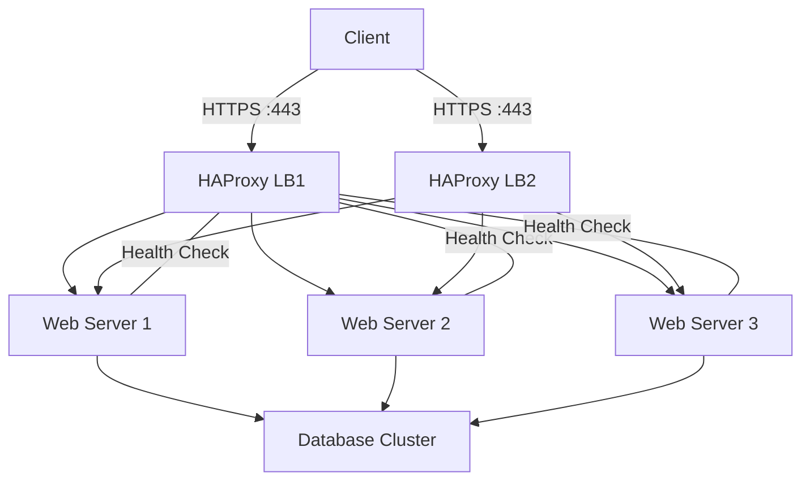

# How to Use Ansible to Configure HAProxy Load Balancer

Author: [nawazdhandala](https://www.github.com/nawazdhandala)

Tags: Ansible, HAProxy, Load Balancing, High Availability, DevOps

Description: Learn how to install and configure HAProxy load balancer with Ansible for HTTP and TCP load balancing with health checks and SSL termination.

---

HAProxy is one of the most widely used open-source load balancers and reverse proxies. It handles millions of connections per second at companies like GitHub, Reddit, and Stack Overflow. Setting up HAProxy manually is not terribly difficult for a single instance, but when you have multiple load balancers across environments (dev, staging, production) and need to keep backend server lists in sync, Ansible becomes invaluable.

## Prerequisites

- Ansible 2.9+ on your control node
- Ubuntu/Debian or RHEL/CentOS target hosts
- Root or sudo access
- Backend servers that HAProxy will balance traffic to

## Installing HAProxy

Start with a playbook that installs HAProxy and ensures it starts on boot:

```yaml
# install_haproxy.yml - Install HAProxy load balancer
---
- name: Install HAProxy
  hosts: load_balancers
  become: true
  tasks:
    - name: Install HAProxy on Debian/Ubuntu
      ansible.builtin.apt:
        name: haproxy
        state: present
        update_cache: true
      when: ansible_os_family == "Debian"

    - name: Install HAProxy on RHEL/CentOS
      ansible.builtin.yum:
        name: haproxy
        state: present
      when: ansible_os_family == "RedHat"

    - name: Enable HAProxy service
      ansible.builtin.service:
        name: haproxy
        enabled: true
```

## Basic HTTP Load Balancing

Here is a complete playbook for a basic HTTP load balancer with round-robin balancing:

```yaml
# haproxy_http.yml - Configure HAProxy for HTTP load balancing
---
- name: Configure HAProxy HTTP load balancer
  hosts: load_balancers
  become: true
  vars:
    haproxy_frontend_port: 80
    haproxy_stats_port: 8404
    haproxy_stats_user: admin
    haproxy_stats_pass: "{{ vault_haproxy_stats_pass }}"
    backend_servers:
      - name: web1
        address: 10.0.1.10
        port: 80
      - name: web2
        address: 10.0.1.11
        port: 80
      - name: web3
        address: 10.0.1.12
        port: 80
  tasks:
    - name: Deploy HAProxy configuration
      ansible.builtin.template:
        src: templates/haproxy.cfg.j2
        dest: /etc/haproxy/haproxy.cfg
        owner: root
        group: root
        mode: '0644'
        validate: 'haproxy -c -f %s'
      notify: Reload HAProxy

    - name: Start HAProxy
      ansible.builtin.service:
        name: haproxy
        state: started
        enabled: true

  handlers:
    - name: Reload HAProxy
      ansible.builtin.service:
        name: haproxy
        state: reloaded
```

The HAProxy configuration template:

```jinja2
# templates/haproxy.cfg.j2 - HAProxy configuration
# Managed by Ansible - do not edit manually

global
    log /dev/log local0
    log /dev/log local1 notice
    chroot /var/lib/haproxy
    stats socket /run/haproxy/admin.sock mode 660 level admin
    stats timeout 30s
    user haproxy
    group haproxy
    daemon

    # SSL settings
    ssl-default-bind-ciphersuites TLS_AES_128_GCM_SHA256:TLS_AES_256_GCM_SHA384
    ssl-default-bind-options ssl-min-ver TLSv1.2 no-tls-tickets

defaults
    log     global
    mode    http
    option  httplog
    option  dontlognull
    option  forwardfor
    option  http-server-close
    timeout connect 5000
    timeout client  50000
    timeout server  50000
    errorfile 400 /etc/haproxy/errors/400.http
    errorfile 403 /etc/haproxy/errors/403.http
    errorfile 408 /etc/haproxy/errors/408.http
    errorfile 500 /etc/haproxy/errors/500.http
    errorfile 502 /etc/haproxy/errors/502.http
    errorfile 503 /etc/haproxy/errors/503.http
    errorfile 504 /etc/haproxy/errors/504.http

# Stats page
listen stats
    bind *:{{ haproxy_stats_port }}
    stats enable
    stats uri /stats
    stats refresh 10s
    stats auth {{ haproxy_stats_user }}:{{ haproxy_stats_pass }}

# HTTP Frontend
frontend http_front
    bind *:{{ haproxy_frontend_port }}
    default_backend http_back

# HTTP Backend
backend http_back
    balance roundrobin
    option httpchk GET /health
    http-check expect status 200

    server {{ server.name }} {{ server.address }}:{{ server.port }} check inter 5s rise 2 fall 3

```

## SSL Termination

HAProxy can terminate SSL connections and forward plain HTTP to backends:

```yaml
# haproxy_ssl.yml - Configure HAProxy with SSL termination
---
- name: Configure HAProxy with SSL
  hosts: load_balancers
  become: true
  vars:
    domain: www.example.com
    ssl_cert_path: /etc/haproxy/certs
    backend_servers:
      - name: web1
        address: 10.0.1.10
        port: 80
      - name: web2
        address: 10.0.1.11
        port: 80
  tasks:
    - name: Create certificate directory
      ansible.builtin.file:
        path: "{{ ssl_cert_path }}"
        state: directory
        owner: root
        group: root
        mode: '0700'

    - name: Deploy combined PEM file (cert + key)
      ansible.builtin.copy:
        src: "files/certs/{{ domain }}.pem"
        dest: "{{ ssl_cert_path }}/{{ domain }}.pem"
        owner: root
        group: root
        mode: '0600'
      notify: Reload HAProxy

    - name: Deploy SSL HAProxy configuration
      ansible.builtin.template:
        src: templates/haproxy-ssl.cfg.j2
        dest: /etc/haproxy/haproxy.cfg
        owner: root
        group: root
        mode: '0644'
        validate: 'haproxy -c -f %s'
      notify: Reload HAProxy

  handlers:
    - name: Reload HAProxy
      ansible.builtin.service:
        name: haproxy
        state: reloaded
```

The SSL configuration adds HTTPS frontend with HTTP redirect:

```jinja2
# templates/haproxy-ssl.cfg.j2 - HAProxy SSL configuration (partial)
# Add to the template above, replacing the frontend section

# Redirect HTTP to HTTPS
frontend http_front
    bind *:80
    http-request redirect scheme https unless { ssl_fc }

# HTTPS Frontend
frontend https_front
    bind *:443 ssl crt {{ ssl_cert_path }}/{{ domain }}.pem
    http-request set-header X-Forwarded-Proto https
    http-request set-header X-Real-IP %[src]
    default_backend http_back

backend http_back
    balance roundrobin
    option httpchk GET /health
    http-check expect status 200
    cookie SERVERID insert indirect nocache

    server {{ server.name }} {{ server.address }}:{{ server.port }} check cookie {{ server.name }} inter 5s rise 2 fall 3

```

## TCP Load Balancing

HAProxy also works great for TCP services like databases or message queues:

```yaml
# haproxy_tcp.yml - Configure HAProxy for TCP load balancing
---
- name: Configure HAProxy TCP load balancer
  hosts: load_balancers
  become: true
  vars:
    tcp_backends:
      - name: mysql_cluster
        port: 3306
        balance: leastconn
        servers:
          - { name: mysql1, address: 10.0.2.10, port: 3306 }
          - { name: mysql2, address: 10.0.2.11, port: 3306 }
          - { name: mysql3, address: 10.0.2.12, port: 3306 }
      - name: redis_cluster
        port: 6379
        balance: roundrobin
        servers:
          - { name: redis1, address: 10.0.3.10, port: 6379 }
          - { name: redis2, address: 10.0.3.11, port: 6379 }
  tasks:
    - name: Deploy TCP HAProxy configuration
      ansible.builtin.template:
        src: templates/haproxy-tcp.cfg.j2
        dest: /etc/haproxy/haproxy.cfg
        owner: root
        group: root
        mode: '0644'
        validate: 'haproxy -c -f %s'
      notify: Reload HAProxy

  handlers:
    - name: Reload HAProxy
      ansible.builtin.service:
        name: haproxy
        state: reloaded
```

```jinja2
# templates/haproxy-tcp.cfg.j2 - TCP load balancing configuration (partial)


frontend {{ backend.name }}_front
    bind *:{{ backend.port }}
    mode tcp
    default_backend {{ backend.name }}_back

backend {{ backend.name }}_back
    mode tcp
    balance {{ backend.balance }}
    option tcp-check

    server {{ server.name }} {{ server.address }}:{{ server.port }} check inter 5s rise 2 fall 3


```

## Dynamic Backend Updates

When you add or remove backend servers, you need to update HAProxy. Here is a pattern that automatically builds the backend list from your Ansible inventory:

```yaml
# dynamic_backends.yml - Build backend list from inventory groups
---
- name: Configure HAProxy with dynamic backends
  hosts: load_balancers
  become: true
  vars:
    app_port: 8080
  tasks:
    - name: Build backend server list from inventory
      ansible.builtin.set_fact:
        dynamic_backends: >-
          {{ groups['webservers'] | map('extract', hostvars, ['ansible_host']) |
             list | zip(groups['webservers']) | map('reverse') | map('list') }}

    - name: Deploy configuration with dynamic backends
      ansible.builtin.template:
        src: templates/haproxy-dynamic.cfg.j2
        dest: /etc/haproxy/haproxy.cfg
        validate: 'haproxy -c -f %s'
      notify: Reload HAProxy

  handlers:
    - name: Reload HAProxy
      ansible.builtin.service:
        name: haproxy
        state: reloaded
```

## Load Balancing Architecture



## Health Check Verification

Verify your HAProxy setup is healthy:

```yaml
# verify_haproxy.yml - Verify HAProxy configuration and health
---
- name: Verify HAProxy
  hosts: load_balancers
  become: true
  tasks:
    - name: Check HAProxy configuration syntax
      ansible.builtin.command: haproxy -c -f /etc/haproxy/haproxy.cfg
      register: config_check
      changed_when: false

    - name: Show config validation result
      ansible.builtin.debug:
        var: config_check.stdout

    - name: Check HAProxy is running
      ansible.builtin.service_facts:

    - name: Verify HAProxy service
      ansible.builtin.assert:
        that:
          - "'haproxy.service' in ansible_facts.services"
          - "ansible_facts.services['haproxy.service'].state == 'running'"

    - name: Test frontend is listening
      ansible.builtin.wait_for:
        port: 80
        timeout: 5

    - name: Test stats page
      ansible.builtin.uri:
        url: "http://localhost:8404/stats"
        status_code: [200, 401]
      register: stats_check

    - name: Show stats page status
      ansible.builtin.debug:
        msg: "Stats page is accessible: {{ stats_check.status }}"
```

The `validate` parameter in the template task is your best friend with HAProxy. It runs `haproxy -c -f` on the generated config before deploying it, so syntax errors never make it to production. Combined with the reload handler (which does a graceful reload rather than a restart), you can update HAProxy configurations with zero downtime.
