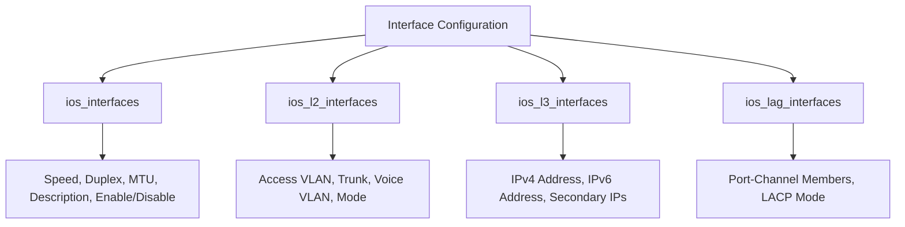

# How to Use Ansible to Configure Interfaces on Network Devices

Author: [nawazdhandala](https://www.github.com/nawazdhandala)

Tags: Ansible, Networking, Interface Configuration, Automation

Description: Automate interface configuration on routers and switches with Ansible resource modules covering physical, logical, and L3 interfaces.

---

Interface configuration is the most fundamental task in network management. Whether you are bringing up a new switch, changing IP addressing, or enabling jumbo frames across your data center, you are configuring interfaces. Doing this manually on each device is slow, error-prone, and does not scale. Ansible gives you a set of resource modules that handle interface configuration declaratively, so you describe what you want and the module figures out which commands to send.

This post covers how to manage physical interfaces, L2 interfaces, L3 interfaces, and logical interfaces like port-channels and loopbacks using Ansible.

## Interface Module Hierarchy

Ansible separates interface configuration into several modules, each handling a specific layer or aspect.



## Configuring Physical Interface Properties

The `ios_interfaces` module handles the physical properties of an interface: description, speed, duplex, MTU, and whether the port is enabled.

```yaml
# configure_physical.yml - Set physical interface properties
---
- name: Configure physical interface properties
  hosts: switches
  gather_facts: false
  connection: network_cli

  tasks:
    - name: Configure interface descriptions and state
      cisco.ios.ios_interfaces:
        config:
          - name: GigabitEthernet0/0
            description: "WAN Uplink to ISP"
            enabled: true
            speed: "1000"
            duplex: full
            mtu: 1500
          - name: GigabitEthernet0/1
            description: "Server Farm Segment A"
            enabled: true
            speed: "1000"
            duplex: full
            mtu: 9000
          - name: GigabitEthernet0/2
            description: "UNUSED - Shutdown"
            enabled: false
        state: merged
      register: result

    - name: Display applied commands
      ansible.builtin.debug:
        var: result.commands
      when: result.changed
```

## Configuring L2 Interface Properties

The `ios_l2_interfaces` module handles Layer 2 settings: access VLAN, trunk allowed VLANs, native VLAN, and switchport mode.

```yaml
# configure_l2.yml - Set Layer 2 interface properties
---
- name: Configure Layer 2 interfaces
  hosts: switches
  gather_facts: false
  connection: network_cli

  tasks:
    # Configure access ports
    - name: Set access ports
      cisco.ios.ios_l2_interfaces:
        config:
          - name: GigabitEthernet0/1
            mode: access
            access:
              vlan: 20
          - name: GigabitEthernet0/2
            mode: access
            access:
              vlan: 20
          # Access port with voice VLAN for IP phones
          - name: GigabitEthernet0/3
            mode: access
            access:
              vlan: 30
            voice:
              vlan: 40
        state: merged

    # Configure trunk ports
    - name: Set trunk ports
      cisco.ios.ios_l2_interfaces:
        config:
          - name: GigabitEthernet0/24
            mode: trunk
            trunk:
              allowed_vlans: "10,20,30,40"
              native_vlan: 99
              encapsulation: dot1q
        state: merged
```

## Configuring L3 Interface Properties

The `ios_l3_interfaces` module assigns IP addresses to routed interfaces. It handles both IPv4 and IPv6, including secondary addresses.

```yaml
# configure_l3.yml - Assign IP addresses to routed interfaces
---
- name: Configure L3 interfaces
  hosts: routers
  gather_facts: false
  connection: network_cli

  tasks:
    - name: Assign IP addresses
      cisco.ios.ios_l3_interfaces:
        config:
          # WAN interface with primary and secondary IPv4
          - name: GigabitEthernet0/0
            ipv4:
              - address: 203.0.113.1/30
              - address: 203.0.113.5/30
                secondary: true
            ipv6:
              - address: 2001:db8:1::1/64

          # LAN interface
          - name: GigabitEthernet0/1
            ipv4:
              - address: 10.1.1.1/24
            ipv6:
              - address: 2001:db8:10::1/64
              - address: fe80::1
                link_local: true

          # Loopback for routing protocols
          - name: Loopback0
            ipv4:
              - address: 10.255.0.1/32
            ipv6:
              - address: 2001:db8:ff::1/128
        state: merged
```

## Configuring Port-Channels (LAG)

For link aggregation, the `ios_lag_interfaces` module manages port-channel membership and LACP settings.

```yaml
# configure_portchannel.yml - Set up port-channel bundles with LACP
---
- name: Configure port-channels
  hosts: switches
  gather_facts: false
  connection: network_cli

  tasks:
    # First create the port-channel interface
    - name: Create port-channel interface
      cisco.ios.ios_interfaces:
        config:
          - name: Port-channel1
            description: "Uplink Bundle to Core"
            enabled: true
        state: merged

    # Then assign member interfaces
    - name: Configure LAG members
      cisco.ios.ios_lag_interfaces:
        config:
          - name: Port-channel1
            members:
              - member: GigabitEthernet0/23
                mode: active
              - member: GigabitEthernet0/24
                mode: active
        state: merged

    # Configure the port-channel as a trunk
    - name: Set port-channel as trunk
      cisco.ios.ios_l2_interfaces:
        config:
          - name: Port-channel1
            mode: trunk
            trunk:
              allowed_vlans: "10,20,30,40,99"
              native_vlan: 99
        state: merged
```

## Variable-Driven Interface Configuration

For large-scale deployments, define interface configurations in variables and loop over them. This keeps your playbooks clean and your data separate.

```yaml
# group_vars/access_switches.yml - Shared interface config for all access switches
---
uplink_interfaces:
  - name: GigabitEthernet0/23
    description: "Uplink 1 to Distribution"
    speed: "1000"
    duplex: full
    enabled: true
  - name: GigabitEthernet0/24
    description: "Uplink 2 to Distribution"
    speed: "1000"
    duplex: full
    enabled: true

management_interface:
  name: Vlan10
  ipv4: "{{ management_ip }}/24"
  description: "Management SVI"
```

```yaml
# host_vars/access-sw01.yml - Per-switch variables
---
management_ip: 10.1.10.11

server_ports:
  - name: GigabitEthernet0/1
    description: "ESXi Host 1 - NIC1"
    vlan: 20
    mtu: 9000
  - name: GigabitEthernet0/2
    description: "ESXi Host 1 - NIC2"
    vlan: 20
    mtu: 9000

user_ports:
  - name: GigabitEthernet0/10
    description: "Floor 2 - Desk A"
    data_vlan: 30
    voice_vlan: 40
  - name: GigabitEthernet0/11
    description: "Floor 2 - Desk B"
    data_vlan: 30
    voice_vlan: 40
```

```yaml
# configure_from_vars.yml - Apply interface configs using host variables
---
- name: Configure interfaces from variables
  hosts: access_switches
  gather_facts: false
  connection: network_cli

  tasks:
    # Configure uplink physical properties
    - name: Set uplink interface properties
      cisco.ios.ios_interfaces:
        config: "{{ uplink_interfaces }}"
        state: merged

    # Configure server ports with jumbo frames
    - name: Set server port properties
      cisco.ios.ios_interfaces:
        config:
          - name: "{{ item.name }}"
            description: "{{ item.description }}"
            mtu: "{{ item.mtu }}"
            enabled: true
        state: merged
      loop: "{{ server_ports | default([]) }}"

    # Set server port VLANs
    - name: Assign server port VLANs
      cisco.ios.ios_l2_interfaces:
        config:
          - name: "{{ item.name }}"
            mode: access
            access:
              vlan: "{{ item.vlan }}"
        state: merged
      loop: "{{ server_ports | default([]) }}"

    # Configure user ports with voice VLAN
    - name: Assign user port VLANs
      cisco.ios.ios_l2_interfaces:
        config:
          - name: "{{ item.name }}"
            mode: access
            access:
              vlan: "{{ item.data_vlan }}"
            voice:
              vlan: "{{ item.voice_vlan }}"
        state: merged
      loop: "{{ user_ports | default([]) }}"

    # Configure management SVI
    - name: Set management SVI IP
      cisco.ios.ios_l3_interfaces:
        config:
          - name: "{{ management_interface.name }}"
            ipv4:
              - address: "{{ management_interface.ipv4 }}"
        state: merged
```

## Gathering Interface State for Auditing

Use the `gathered` state to pull current interface configuration for auditing and compliance checks.

```yaml
# audit_interfaces.yml - Gather interface state for compliance reporting
---
- name: Audit interface configuration
  hosts: switches
  gather_facts: false
  connection: network_cli

  tasks:
    - name: Gather physical interface state
      cisco.ios.ios_interfaces:
        state: gathered
      register: physical_state

    - name: Gather L2 interface state
      cisco.ios.ios_l2_interfaces:
        state: gathered
      register: l2_state

    # Find ports that are up but have no description
    - name: Report undocumented active ports
      ansible.builtin.debug:
        msg: "WARNING: {{ item.name }} is enabled but has no description"
      loop: "{{ physical_state.gathered }}"
      when:
        - item.enabled | default(false)
        - item.description is not defined or item.description == ""

    # Find trunk ports allowing all VLANs
    - name: Report wide-open trunks
      ansible.builtin.debug:
        msg: "SECURITY: {{ item.name }} is a trunk with no VLAN restriction"
      loop: "{{ l2_state.gathered }}"
      when:
        - item.mode | default('') == 'trunk'
        - item.trunk.allowed_vlans is not defined
```

## Multi-Platform Interface Configuration

When managing devices from multiple vendors, the module names change but the data structure stays consistent.

```yaml
# multi_platform_interfaces.yml - Configure interfaces across vendors
---
- name: Configure interfaces on Cisco IOS
  hosts: ios_devices
  gather_facts: false
  tasks:
    - name: Set IOS interfaces
      cisco.ios.ios_interfaces:
        config: "{{ interface_config }}"
        state: merged

- name: Configure interfaces on Arista EOS
  hosts: eos_devices
  gather_facts: false
  tasks:
    - name: Set EOS interfaces
      arista.eos.eos_interfaces:
        config: "{{ interface_config }}"
        state: merged

- name: Configure interfaces on Cisco NX-OS
  hosts: nxos_devices
  gather_facts: false
  tasks:
    - name: Set NX-OS interfaces
      cisco.nxos.nxos_interfaces:
        config: "{{ interface_config }}"
        state: merged
```

Interface configuration with Ansible takes what used to be hours of repetitive CLI work and turns it into a repeatable, version-controlled process. Define your interfaces in variables, apply them with resource modules, and audit them with the gathered state. Your network becomes consistent, documented, and easy to change at scale.
