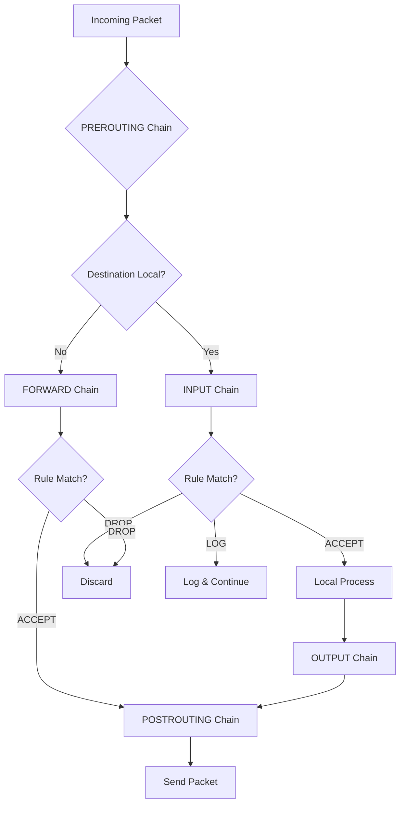

# How to Use Ansible to Configure iptables Rules

Author: [nawazdhandala](https://www.github.com/nawazdhandala)

Tags: Ansible, iptables, Firewall, Security, Linux

Description: Learn how to manage iptables firewall rules with Ansible using the iptables module and template-based approaches for persistent configurations.

---

While higher-level tools like UFW and firewalld are popular, iptables remains the backbone of Linux packet filtering. It is what those tools use under the hood. Sometimes you need the fine-grained control that only raw iptables provides, especially in environments with complex routing, NAT requirements, or custom packet mangling. Ansible's `ansible.builtin.iptables` module gives you direct control over iptables rules from your playbooks.

This guide covers practical patterns for managing iptables with Ansible.

## Prerequisites

- Ansible 2.9+ on your control node
- Linux target hosts (any distribution)
- Root or sudo privileges
- The `iptables` package installed on target hosts

## Understanding iptables Basics

iptables organizes rules into tables (filter, nat, mangle, raw) and chains (INPUT, OUTPUT, FORWARD, plus custom chains). The filter table is the default and handles most firewall rules. Each rule in a chain specifies conditions and a target action (ACCEPT, DROP, REJECT, LOG, etc.).

## Basic Firewall Rules

Here is a playbook that sets up a fundamental firewall using the iptables module:

```yaml
# basic_iptables.yml - Configure basic iptables firewall rules
---
- name: Configure iptables firewall
  hosts: all
  become: true
  tasks:
    - name: Allow loopback traffic
      ansible.builtin.iptables:
        chain: INPUT
        in_interface: lo
        jump: ACCEPT
        comment: "Allow loopback"

    - name: Allow established and related connections
      ansible.builtin.iptables:
        chain: INPUT
        ctstate:
          - ESTABLISHED
          - RELATED
        jump: ACCEPT
        comment: "Allow established connections"

    - name: Allow SSH
      ansible.builtin.iptables:
        chain: INPUT
        protocol: tcp
        destination_port: '22'
        jump: ACCEPT
        comment: "Allow SSH"

    - name: Allow HTTP
      ansible.builtin.iptables:
        chain: INPUT
        protocol: tcp
        destination_port: '80'
        jump: ACCEPT
        comment: "Allow HTTP"

    - name: Allow HTTPS
      ansible.builtin.iptables:
        chain: INPUT
        protocol: tcp
        destination_port: '443'
        jump: ACCEPT
        comment: "Allow HTTPS"

    - name: Drop all other incoming traffic
      ansible.builtin.iptables:
        chain: INPUT
        policy: DROP
```

## Source-Based Filtering

You can restrict access to specific ports based on source IP addresses:

```yaml
# source_filter.yml - iptables rules with source IP restrictions
---
- name: Configure source-based iptables rules
  hosts: database_servers
  become: true
  vars:
    app_servers:
      - 10.0.1.10
      - 10.0.1.11
      - 10.0.1.12
    monitoring_server: 10.0.5.5
  tasks:
    - name: Allow PostgreSQL from app servers
      ansible.builtin.iptables:
        chain: INPUT
        protocol: tcp
        source: "{{ item }}"
        destination_port: '5432'
        jump: ACCEPT
        comment: "PostgreSQL from {{ item }}"
      loop: "{{ app_servers }}"

    - name: Allow node exporter from monitoring
      ansible.builtin.iptables:
        chain: INPUT
        protocol: tcp
        source: "{{ monitoring_server }}"
        destination_port: '9100'
        jump: ACCEPT
        comment: "Node exporter from monitoring"

    - name: Block PostgreSQL from everywhere else
      ansible.builtin.iptables:
        chain: INPUT
        protocol: tcp
        destination_port: '5432'
        jump: DROP
        comment: "Block PostgreSQL from other sources"
```

## Rate Limiting with iptables

iptables has powerful rate limiting through the `limit` match. This is great for protecting against brute-force attacks:

```yaml
# rate_limit.yml - iptables rate limiting rules
---
- name: Configure rate limiting
  hosts: all
  become: true
  tasks:
    - name: Rate limit new SSH connections
      ansible.builtin.iptables:
        chain: INPUT
        protocol: tcp
        destination_port: '22'
        ctstate:
          - NEW
        limit: 3/minute
        limit_burst: 3
        jump: ACCEPT
        comment: "Rate limit SSH"

    - name: Drop SSH connections that exceed rate limit
      ansible.builtin.iptables:
        chain: INPUT
        protocol: tcp
        destination_port: '22'
        ctstate:
          - NEW
        jump: DROP
        comment: "Drop excess SSH"
```

## Logging Dropped Packets

For troubleshooting and security monitoring, you will want to log dropped packets before they get dropped:

```yaml
# logging.yml - Log dropped packets before dropping them
---
- name: Configure iptables logging
  hosts: all
  become: true
  tasks:
    - name: Log dropped incoming packets
      ansible.builtin.iptables:
        chain: INPUT
        jump: LOG
        log_prefix: "IPTABLES_DROP_IN: "
        log_level: 4
        comment: "Log dropped incoming"

    - name: Log dropped forwarded packets
      ansible.builtin.iptables:
        chain: FORWARD
        jump: LOG
        log_prefix: "IPTABLES_DROP_FWD: "
        log_level: 4
        comment: "Log dropped forwarded"
```

These LOG rules need to be placed just before the DROP/REJECT rules in the chain to work correctly.

## Making iptables Rules Persistent

By default, iptables rules are lost on reboot. The Ansible module only modifies the running rules. To make them persistent, you need to save them:

```yaml
# persistent_iptables.yml - Save iptables rules for persistence across reboots
---
- name: Make iptables rules persistent
  hosts: all
  become: true
  tasks:
    - name: Install iptables-persistent on Debian/Ubuntu
      ansible.builtin.apt:
        name: iptables-persistent
        state: present
      when: ansible_os_family == "Debian"

    - name: Install iptables-services on RHEL/CentOS
      ansible.builtin.yum:
        name: iptables-services
        state: present
      when: ansible_os_family == "RedHat"

    - name: Save iptables rules on Debian/Ubuntu
      ansible.builtin.command: netfilter-persistent save
      changed_when: true
      when: ansible_os_family == "Debian"

    - name: Save iptables rules on RHEL/CentOS
      ansible.builtin.command: service iptables save
      changed_when: true
      when: ansible_os_family == "RedHat"
```

## Template-Based Approach

For complex firewall setups, managing individual rules with the iptables module can get unwieldy. A template-based approach lets you define the entire ruleset in one file:

```yaml
# template_iptables.yml - Deploy complete iptables ruleset from template
---
- name: Deploy iptables rules from template
  hosts: all
  become: true
  vars:
    ssh_allowed_sources:
      - 10.0.0.0/8
    web_ports:
      - 80
      - 443
    monitoring_subnet: 10.0.5.0/24
  tasks:
    - name: Deploy iptables rules file
      ansible.builtin.template:
        src: templates/iptables.rules.j2
        dest: /etc/iptables/rules.v4
        owner: root
        group: root
        mode: '0600'
        validate: 'iptables-restore --test %s'
      notify: Restore iptables rules

  handlers:
    - name: Restore iptables rules
      ansible.builtin.command: iptables-restore /etc/iptables/rules.v4
      changed_when: true
```

The corresponding Jinja2 template:

```jinja2
# templates/iptables.rules.j2 - iptables rules template
# Managed by Ansible - do not edit manually
*filter
:INPUT DROP [0:0]
:FORWARD DROP [0:0]
:OUTPUT ACCEPT [0:0]

# Allow loopback
-A INPUT -i lo -j ACCEPT

# Allow established and related
-A INPUT -m conntrack --ctstate ESTABLISHED,RELATED -j ACCEPT

# Allow ICMP ping
-A INPUT -p icmp --icmp-type echo-request -j ACCEPT

# Allow SSH from trusted sources

-A INPUT -p tcp -s {{ source }} --dport 22 -j ACCEPT


# Allow web traffic

-A INPUT -p tcp --dport {{ port }} -j ACCEPT


# Allow monitoring from monitoring subnet
-A INPUT -p tcp -s {{ monitoring_subnet }} --dport 9100 -j ACCEPT

# Log everything else before dropping
-A INPUT -j LOG --log-prefix "IPTABLES_DROP: " --log-level 4

COMMIT
```

Notice the `validate` parameter on the template task. This runs `iptables-restore --test` on the generated file before deploying it, so a malformed ruleset will not get applied.

## NAT and Port Forwarding

iptables is also used for NAT. Here is how to configure SNAT and DNAT:

```yaml
# nat_rules.yml - Configure NAT rules with iptables
---
- name: Configure NAT rules
  hosts: gateway_servers
  become: true
  tasks:
    - name: Enable IP forwarding
      ansible.posix.sysctl:
        name: net.ipv4.ip_forward
        value: '1'
        sysctl_set: true
        state: present
        reload: true

    - name: Masquerade outbound traffic from internal network
      ansible.builtin.iptables:
        table: nat
        chain: POSTROUTING
        source: 10.0.0.0/8
        out_interface: eth0
        jump: MASQUERADE
        comment: "NAT for internal network"

    - name: Forward port 80 to internal web server
      ansible.builtin.iptables:
        table: nat
        chain: PREROUTING
        protocol: tcp
        destination_port: '80'
        jump: DNAT
        to_destination: 10.0.1.20:80
        comment: "DNAT port 80 to web server"
```

## Flushing Rules Safely

When you need to start fresh, flush the rules but keep SSH access:

```yaml
# flush_iptables.yml - Safely flush all iptables rules
---
- name: Flush iptables rules safely
  hosts: all
  become: true
  tasks:
    - name: Set INPUT chain policy to ACCEPT before flushing
      ansible.builtin.iptables:
        chain: INPUT
        policy: ACCEPT

    - name: Flush all rules
      ansible.builtin.iptables:
        flush: true

    - name: Flush NAT table
      ansible.builtin.iptables:
        table: nat
        flush: true

    - name: Delete all custom chains
      ansible.builtin.command: iptables -X
      changed_when: true
```

## iptables Chain Flow



## Best Practices

When managing iptables with Ansible, always set the INPUT policy to ACCEPT before flushing rules to avoid locking yourself out. Use the template approach for complex rulesets since it gives you a single file that represents the entire firewall state. Always validate generated rules before applying them. And always save rules for persistence, because nothing is more frustrating than debugging a firewall issue, fixing it, and then losing the fix on the next reboot.
