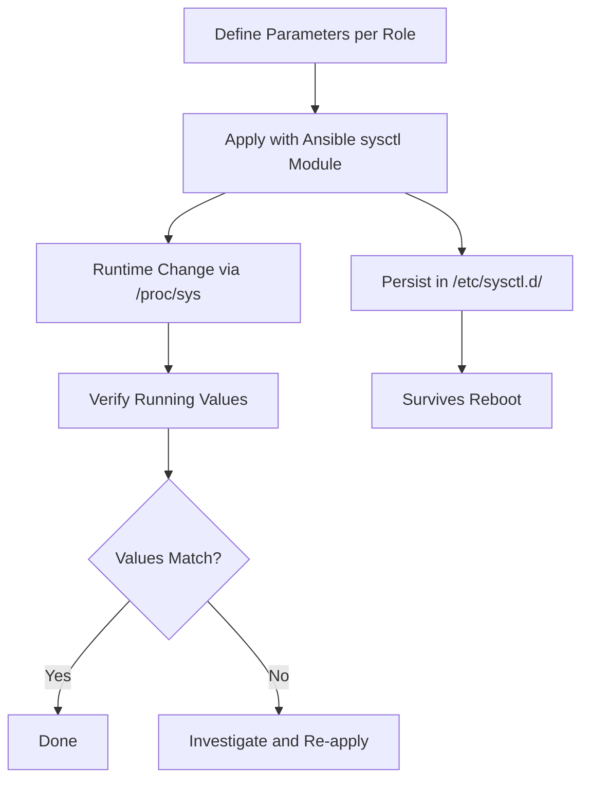

# How to Use Ansible to Configure Kernel Parameters (sysctl)

Author: [nawazdhandala](https://www.github.com/nawazdhandala)

Tags: Ansible, sysctl, Kernel, Linux, Performance Tuning

Description: Learn how to tune Linux kernel parameters using Ansible and sysctl for networking, memory, security, and performance optimization across your infrastructure.

---

The Linux kernel has hundreds of tunable parameters that affect everything from network throughput to memory management to security posture. Most servers run with default kernel settings, which are designed to be safe and conservative rather than optimal for your specific workload. With Ansible, you can define kernel parameter profiles for each server role and apply them consistently.

## How sysctl Works

The `sysctl` interface lets you read and modify kernel parameters at runtime through the `/proc/sys` virtual filesystem. Changes made with `sysctl` take effect immediately but are lost on reboot unless you persist them in `/etc/sysctl.conf` or files under `/etc/sysctl.d/`. Ansible's `ansible.posix.sysctl` module handles both the runtime change and the persistence in one step.

## Network Tuning Parameters

Network parameters are the ones I tune most often. Default Linux networking settings are conservative and leave a lot of performance on the table, especially for high-traffic servers.

This playbook optimizes kernel networking parameters for web servers:

```yaml
# tune-network-sysctl.yml - Network performance tuning
---
- name: Tune Network Kernel Parameters
  hosts: webservers
  become: true
  tasks:
    - name: Apply network performance tuning
      ansible.posix.sysctl:
        name: "{{ item.key }}"
        value: "{{ item.value }}"
        sysctl_set: true
        state: present
        reload: true
        sysctl_file: /etc/sysctl.d/60-network-tuning.conf
      loop:
        # Increase the maximum socket receive buffer size
        - { key: "net.core.rmem_max", value: "16777216" }
        # Increase the maximum socket send buffer size
        - { key: "net.core.wmem_max", value: "16777216" }
        # Default receive buffer size
        - { key: "net.core.rmem_default", value: "1048576" }
        # Default send buffer size
        - { key: "net.core.wmem_default", value: "1048576" }
        # Maximum number of packets queued on the INPUT side
        - { key: "net.core.netdev_max_backlog", value: "5000" }
        # Maximum number of pending connections
        - { key: "net.core.somaxconn", value: "65535" }
        # TCP memory allocation (min, pressure, max) in pages
        - { key: "net.ipv4.tcp_mem", value: "786432 1048576 26777216" }
        # TCP receive buffer (min, default, max) in bytes
        - { key: "net.ipv4.tcp_rmem", value: "4096 1048576 16777216" }
        # TCP send buffer (min, default, max) in bytes
        - { key: "net.ipv4.tcp_wmem", value: "4096 65536 16777216" }
        # Enable TCP window scaling for high-bandwidth links
        - { key: "net.ipv4.tcp_window_scaling", value: "1" }
        # Reduce TIME_WAIT connections by reusing sockets
        - { key: "net.ipv4.tcp_tw_reuse", value: "1" }
        # Faster TIME_WAIT timeout
        - { key: "net.ipv4.tcp_fin_timeout", value: "15" }
        # Increase local port range for outgoing connections
        - { key: "net.ipv4.ip_local_port_range", value: "1024 65535" }
        # Maximum SYN backlog
        - { key: "net.ipv4.tcp_max_syn_backlog", value: "8096" }
      loop_control:
        label: "{{ item.key }}"
```

## Security Hardening Parameters

Kernel parameters play a big role in system security. These settings help prevent common network attacks and information leaks.

This playbook applies security-focused kernel parameters:

```yaml
# tune-security-sysctl.yml - Security hardening
---
- name: Apply Security Kernel Parameters
  hosts: all
  become: true
  tasks:
    - name: Apply security hardening sysctl settings
      ansible.posix.sysctl:
        name: "{{ item.key }}"
        value: "{{ item.value }}"
        sysctl_set: true
        state: present
        reload: true
        sysctl_file: /etc/sysctl.d/50-security-hardening.conf
      loop:
        # Enable SYN flood protection
        - { key: "net.ipv4.tcp_syncookies", value: "1" }
        # Disable source routing (prevents spoofed packets)
        - { key: "net.ipv4.conf.all.accept_source_route", value: "0" }
        - { key: "net.ipv4.conf.default.accept_source_route", value: "0" }
        # Enable reverse path filtering (anti-spoofing)
        - { key: "net.ipv4.conf.all.rp_filter", value: "1" }
        - { key: "net.ipv4.conf.default.rp_filter", value: "1" }
        # Ignore ICMP redirects (prevent MITM)
        - { key: "net.ipv4.conf.all.accept_redirects", value: "0" }
        - { key: "net.ipv4.conf.default.accept_redirects", value: "0" }
        - { key: "net.ipv6.conf.all.accept_redirects", value: "0" }
        # Do not send ICMP redirects
        - { key: "net.ipv4.conf.all.send_redirects", value: "0" }
        - { key: "net.ipv4.conf.default.send_redirects", value: "0" }
        # Log martian packets (impossible source addresses)
        - { key: "net.ipv4.conf.all.log_martians", value: "1" }
        # Ignore broadcast ICMP (prevent smurf attacks)
        - { key: "net.ipv4.icmp_echo_ignore_broadcasts", value: "1" }
        # Restrict kernel pointer exposure
        - { key: "kernel.kptr_restrict", value: "2" }
        # Restrict dmesg access to root
        - { key: "kernel.dmesg_restrict", value: "1" }
        # Disable kernel profiling for non-root
        - { key: "kernel.perf_event_paranoid", value: "3" }
        # Restrict BPF to CAP_SYS_ADMIN
        - { key: "kernel.unprivileged_bpf_disabled", value: "1" }
        # Restrict ptrace to parent processes
        - { key: "kernel.yama.ptrace_scope", value: "1" }
        # Disable IP forwarding (unless this is a router)
        - { key: "net.ipv4.ip_forward", value: "0" }
      loop_control:
        label: "{{ item.key }}"

    - name: Enable IP forwarding on router/gateway servers
      ansible.posix.sysctl:
        name: net.ipv4.ip_forward
        value: "1"
        sysctl_set: true
        state: present
        sysctl_file: /etc/sysctl.d/50-security-hardening.conf
      when: "'routers' in group_names or 'gateways' in group_names"
```

## Memory and VM Parameters

Memory parameters affect how the kernel manages RAM, swap, and the page cache.

This playbook tunes memory management for database servers:

```yaml
# tune-memory-sysctl.yml - Memory tuning for databases
---
- name: Tune Memory Parameters for Databases
  hosts: database_servers
  become: true
  tasks:
    - name: Apply memory tuning parameters
      ansible.posix.sysctl:
        name: "{{ item.key }}"
        value: "{{ item.value }}"
        sysctl_set: true
        state: present
        reload: true
        sysctl_file: /etc/sysctl.d/70-memory-tuning.conf
      loop:
        # Controls how aggressively the kernel swaps
        # Low values keep more data in RAM
        - { key: "vm.swappiness", value: "1" }
        # Percentage of RAM that can be dirty before forced writeback
        - { key: "vm.dirty_ratio", value: "40" }
        # Percentage of RAM that triggers background writeback
        - { key: "vm.dirty_background_ratio", value: "10" }
        # Minimum free memory in KB (helps prevent OOM situations)
        - { key: "vm.min_free_kbytes", value: "131072" }
        # How aggressively to reclaim dentries and inodes
        - { key: "vm.vfs_cache_pressure", value: "50" }
        # Maximum number of memory map areas per process
        # Needed for applications that use many files or shared libs
        - { key: "vm.max_map_count", value: "262144" }
        # Overcommit memory strategy (0=heuristic, 1=always, 2=never)
        - { key: "vm.overcommit_memory", value: "0" }
        # Enable transparent huge pages (can help or hurt depending on workload)
        # Disable for database servers
        - { key: "vm.nr_hugepages", value: "0" }
      loop_control:
        label: "{{ item.key }}"

    - name: Disable transparent huge pages for database workloads
      ansible.builtin.shell: |
        echo never > /sys/kernel/mm/transparent_hugepage/enabled
        echo never > /sys/kernel/mm/transparent_hugepage/defrag
      changed_when: false

    - name: Make THP disable persistent across reboots
      ansible.builtin.copy:
        dest: /etc/systemd/system/disable-thp.service
        mode: '0644'
        content: |
          [Unit]
          Description=Disable Transparent Huge Pages (THP)
          DefaultDependencies=no
          After=sysinit.target local-fs.target

          [Service]
          Type=oneshot
          ExecStart=/bin/sh -c 'echo never > /sys/kernel/mm/transparent_hugepage/enabled && echo never > /sys/kernel/mm/transparent_hugepage/defrag'

          [Install]
          WantedBy=basic.target

    - name: Enable THP disable service
      ansible.builtin.systemd:
        name: disable-thp
        enabled: true
        daemon_reload: true
```

## Role-Based Parameter Profiles

Different server roles need different kernel tuning. Here is how to organize parameters by role using group variables.

The web server profile:

```yaml
# group_vars/webservers.yml
sysctl_params:
  net.core.somaxconn: "65535"
  net.ipv4.tcp_max_syn_backlog: "8096"
  net.ipv4.tcp_tw_reuse: "1"
  net.ipv4.tcp_fin_timeout: "15"
  net.core.netdev_max_backlog: "5000"
  vm.swappiness: "10"
```

The database server profile:

```yaml
# group_vars/database_servers.yml
sysctl_params:
  vm.swappiness: "1"
  vm.dirty_ratio: "40"
  vm.dirty_background_ratio: "10"
  vm.max_map_count: "262144"
  vm.overcommit_memory: "0"
  net.core.somaxconn: "4096"
```

A generic playbook that applies whatever profile is defined:

```yaml
# apply-sysctl-profile.yml - Apply role-based kernel parameters
---
- name: Apply Role-Based Sysctl Profile
  hosts: all
  become: true
  tasks:
    - name: Apply sysctl parameters from role profile
      ansible.posix.sysctl:
        name: "{{ item.key }}"
        value: "{{ item.value }}"
        sysctl_set: true
        state: present
        reload: true
        sysctl_file: "/etc/sysctl.d/80-role-{{ group_names[0] | default('default') }}.conf"
      loop: "{{ sysctl_params | dict2items }}"
      loop_control:
        label: "{{ item.key }}"
      when: sysctl_params is defined
```

## Validating sysctl Settings

After applying changes, verify that the running kernel actually has the values you set.

This playbook validates that sysctl settings match your configuration:

```yaml
# validate-sysctl.yml - Verify kernel parameters
---
- name: Validate Sysctl Settings
  hosts: all
  become: true
  tasks:
    - name: Check each sysctl parameter
      ansible.builtin.command:
        cmd: "sysctl {{ item.key }}"
      register: sysctl_check
      changed_when: false
      loop: "{{ sysctl_params | dict2items }}"
      loop_control:
        label: "{{ item.key }}"
      when: sysctl_params is defined

    - name: Verify parameter values match expected
      ansible.builtin.assert:
        that:
          - item.stdout.split('=')[1] | trim == sysctl_params[item.item.key]
        fail_msg: >
          Mismatch: {{ item.item.key }}
          Expected: {{ sysctl_params[item.item.key] }}
          Got: {{ item.stdout.split('=')[1] | trim }}
      loop: "{{ sysctl_check.results }}"
      loop_control:
        label: "{{ item.item.key }}"
      when: sysctl_params is defined
```

## Parameter Application Flow



Kernel tuning is not something you do once and forget. As your traffic patterns change and your applications evolve, revisit these parameters. But having them in Ansible means you have a documented, version-controlled record of every tuning decision you have made, which is invaluable when you need to reproduce a performance issue or roll back a change.
