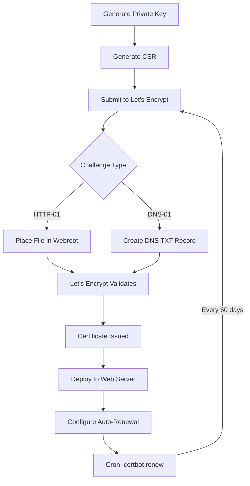

# How to Use Ansible to Configure Let's Encrypt Certificates

Author: [nawazdhandala](https://www.github.com/nawazdhandala)

Tags: Ansible, Let's Encrypt, SSL, Certbot, Security

Description: Learn how to automate Let's Encrypt SSL certificate issuance and renewal with Ansible using certbot and the ACME protocol.

---

Let's Encrypt provides free, automated SSL/TLS certificates that are trusted by all major browsers. When you have a handful of servers, running certbot manually is fine. But when you have dozens or hundreds of web servers, you want the entire process automated: installing certbot, requesting certificates, configuring web servers, and setting up auto-renewal. Ansible handles all of this.

## Prerequisites

- Ansible 2.9+ on your control node
- Target hosts with a public IP address
- DNS A records pointing to your server
- Port 80 or 443 accessible from the internet (for HTTP-01 or TLS-ALPN-01 challenges)
- Root or sudo access

## Installing Certbot

Certbot is the most popular Let's Encrypt client. Install it along with the web server plugin you need:

```yaml
# install_certbot.yml - Install certbot and plugins
---
- name: Install certbot
  hosts: webservers
  become: true
  tasks:
    - name: Install certbot on Debian/Ubuntu
      ansible.builtin.apt:
        name:
          - certbot
          - python3-certbot-nginx
          - python3-certbot-apache
        state: present
        update_cache: true
      when: ansible_os_family == "Debian"

    - name: Install certbot on RHEL/CentOS
      ansible.builtin.yum:
        name:
          - certbot
          - python3-certbot-nginx
          - python3-certbot-apache
        state: present
      when: ansible_os_family == "RedHat"
```

## Requesting a Certificate with Certbot (Nginx)

The certbot nginx plugin can automatically configure Nginx to use the new certificate:

```yaml
# certbot_nginx.yml - Request Let's Encrypt cert for Nginx
---
- name: Request Let's Encrypt certificate for Nginx
  hosts: webservers
  become: true
  vars:
    domain: www.example.com
    email: admin@example.com
    webroot: /var/www/html
  tasks:
    - name: Ensure Nginx is installed and running
      ansible.builtin.service:
        name: nginx
        state: started

    - name: Check if certificate already exists
      ansible.builtin.stat:
        path: "/etc/letsencrypt/live/{{ domain }}/fullchain.pem"
      register: cert_file

    - name: Request certificate using certbot nginx plugin
      ansible.builtin.command: >
        certbot certonly
        --nginx
        --non-interactive
        --agree-tos
        --email {{ email }}
        -d {{ domain }}
      when: not cert_file.stat.exists
      register: certbot_result
      changed_when: "'Successfully received certificate' in certbot_result.stdout"
      notify: Reload Nginx

    - name: Deploy Nginx SSL configuration
      ansible.builtin.template:
        src: templates/nginx-ssl-letsencrypt.conf.j2
        dest: /etc/nginx/sites-available/{{ domain }}.conf
        mode: '0644'
      notify: Reload Nginx

    - name: Enable site
      ansible.builtin.file:
        src: /etc/nginx/sites-available/{{ domain }}.conf
        dest: /etc/nginx/sites-enabled/{{ domain }}.conf
        state: link
      notify: Reload Nginx

  handlers:
    - name: Reload Nginx
      ansible.builtin.service:
        name: nginx
        state: reloaded
```

```jinja2
# templates/nginx-ssl-letsencrypt.conf.j2 - Nginx with Let's Encrypt cert
# Managed by Ansible

server {
    listen 80;
    server_name {{ domain }};
    return 301 https://$host$request_uri;
}

server {
    listen 443 ssl http2;
    server_name {{ domain }};

    ssl_certificate /etc/letsencrypt/live/{{ domain }}/fullchain.pem;
    ssl_certificate_key /etc/letsencrypt/live/{{ domain }}/privkey.pem;
    ssl_protocols TLSv1.2 TLSv1.3;
    ssl_ciphers HIGH:!aNULL:!MD5;

    root {{ webroot }};
    index index.html;

    location / {
        try_files $uri $uri/ =404;
    }
}
```

## Webroot Method

If you do not want certbot to touch your web server configuration, use the webroot method. It places a challenge file in your document root and lets the existing web server serve it:

```yaml
# certbot_webroot.yml - Request cert using webroot method
---
- name: Request certificate with webroot method
  hosts: webservers
  become: true
  vars:
    domains:
      - name: app.example.com
        webroot: /var/www/app
      - name: api.example.com
        webroot: /var/www/api
    email: admin@example.com
  tasks:
    - name: Create webroot directories
      ansible.builtin.file:
        path: "{{ item.webroot }}/.well-known/acme-challenge"
        state: directory
        owner: www-data
        group: www-data
        mode: '0755'
      loop: "{{ domains }}"

    - name: Ensure Nginx serves ACME challenge files
      ansible.builtin.copy:
        dest: /etc/nginx/snippets/letsencrypt.conf
        content: |
          location ^~ /.well-known/acme-challenge/ {
              allow all;
              default_type "text/plain";
          }
        mode: '0644'
      notify: Reload Nginx

    - name: Request certificates
      ansible.builtin.command: >
        certbot certonly
        --webroot
        --webroot-path {{ item.webroot }}
        --non-interactive
        --agree-tos
        --email {{ email }}
        -d {{ item.name }}
      loop: "{{ domains }}"
      register: cert_results
      changed_when: "'Successfully received certificate' in cert_results.stdout"
      ignore_errors: true

    - name: Show certificate request results
      ansible.builtin.debug:
        msg: "{{ item.item.name }}: {{ 'SUCCESS' if item.rc == 0 else 'FAILED' }}"
      loop: "{{ cert_results.results }}"
      loop_control:
        label: "{{ item.item.name }}"

  handlers:
    - name: Reload Nginx
      ansible.builtin.service:
        name: nginx
        state: reloaded
```

## DNS Challenge for Wildcard Certificates

Wildcard certificates require the DNS-01 challenge. This is useful for domains like `*.example.com`:

```yaml
# certbot_dns.yml - Request wildcard cert using DNS challenge
---
- name: Request wildcard certificate with DNS challenge
  hosts: webservers
  become: true
  vars:
    domain: example.com
    email: admin@example.com
    dns_plugin: cloudflare
    cloudflare_credentials: /etc/letsencrypt/cloudflare.ini
  tasks:
    - name: Install certbot DNS plugin
      ansible.builtin.apt:
        name: "python3-certbot-dns-{{ dns_plugin }}"
        state: present
      when: ansible_os_family == "Debian"

    - name: Deploy DNS provider credentials
      ansible.builtin.copy:
        dest: "{{ cloudflare_credentials }}"
        content: |
          dns_cloudflare_api_token = {{ vault_cloudflare_api_token }}
        owner: root
        group: root
        mode: '0600'

    - name: Request wildcard certificate
      ansible.builtin.command: >
        certbot certonly
        --dns-cloudflare
        --dns-cloudflare-credentials {{ cloudflare_credentials }}
        --non-interactive
        --agree-tos
        --email {{ email }}
        -d "{{ domain }}"
        -d "*.{{ domain }}"
      register: wildcard_result
      changed_when: "'Successfully received certificate' in wildcard_result.stdout"
```

## Auto-Renewal Configuration

Let's Encrypt certificates are valid for only 90 days. Auto-renewal is essential:

```yaml
# certbot_renewal.yml - Configure automatic certificate renewal
---
- name: Configure certificate auto-renewal
  hosts: webservers
  become: true
  tasks:
    - name: Create renewal hook directory
      ansible.builtin.file:
        path: /etc/letsencrypt/renewal-hooks/deploy
        state: directory
        mode: '0755'

    - name: Create post-renewal hook to reload web server
      ansible.builtin.copy:
        dest: /etc/letsencrypt/renewal-hooks/deploy/reload-nginx.sh
        content: |
          #!/bin/bash
          # Reload Nginx after certificate renewal
          systemctl reload nginx
        owner: root
        group: root
        mode: '0755'

    - name: Set up certbot renewal cron job
      ansible.builtin.cron:
        name: "Let's Encrypt renewal"
        minute: "30"
        hour: "2"
        day: "*"
        month: "*"
        weekday: "1,4"
        job: "certbot renew --quiet --deploy-hook 'systemctl reload nginx'"
        user: root

    - name: Test renewal process (dry run)
      ansible.builtin.command: certbot renew --dry-run
      register: renewal_test
      changed_when: false
      ignore_errors: true

    - name: Show renewal test result
      ansible.builtin.debug:
        var: renewal_test.stdout_lines
```

## Using the ACME Module Directly

Ansible also has a built-in ACME module (`community.crypto.acme_certificate`) that talks to the Let's Encrypt API directly, without needing certbot installed:

```yaml
# acme_module.yml - Use Ansible ACME module for Let's Encrypt
---
- name: Request certificate using ACME module
  hosts: webservers
  become: true
  vars:
    domain: www.example.com
    acme_directory: https://acme-v02.api.letsencrypt.org/directory
    cert_dir: /etc/ssl/letsencrypt
  tasks:
    - name: Create certificate directory
      ansible.builtin.file:
        path: "{{ cert_dir }}"
        state: directory
        mode: '0700'

    - name: Generate account key
      community.crypto.openssl_privatekey:
        path: "{{ cert_dir }}/account.key"
        size: 4096
        mode: '0600'

    - name: Generate domain private key
      community.crypto.openssl_privatekey:
        path: "{{ cert_dir }}/{{ domain }}.key"
        size: 2048
        mode: '0600'

    - name: Generate CSR
      community.crypto.openssl_csr:
        path: "{{ cert_dir }}/{{ domain }}.csr"
        privatekey_path: "{{ cert_dir }}/{{ domain }}.key"
        common_name: "{{ domain }}"
        subject_alt_name:
          - "DNS:{{ domain }}"

    - name: Request certificate challenge
      community.crypto.acme_certificate:
        account_key_src: "{{ cert_dir }}/account.key"
        csr: "{{ cert_dir }}/{{ domain }}.csr"
        dest: "{{ cert_dir }}/{{ domain }}.crt"
        fullchain_dest: "{{ cert_dir }}/{{ domain }}-fullchain.crt"
        acme_directory: "{{ acme_directory }}"
        acme_version: 2
        terms_agreed: true
        challenge: http-01
      register: acme_challenge

    - name: Create challenge response file
      ansible.builtin.copy:
        dest: "/var/www/html/{{ acme_challenge.challenge_data[domain]['http-01'].resource }}"
        content: "{{ acme_challenge.challenge_data[domain]['http-01'].resource_value }}"
        mode: '0644'
      when: acme_challenge is changed

    - name: Validate challenge and get certificate
      community.crypto.acme_certificate:
        account_key_src: "{{ cert_dir }}/account.key"
        csr: "{{ cert_dir }}/{{ domain }}.csr"
        dest: "{{ cert_dir }}/{{ domain }}.crt"
        fullchain_dest: "{{ cert_dir }}/{{ domain }}-fullchain.crt"
        acme_directory: "{{ acme_directory }}"
        acme_version: 2
        terms_agreed: true
        challenge: http-01
        data: "{{ acme_challenge }}"
      when: acme_challenge is changed
```

## Certificate Lifecycle



## Monitoring Certificate Expiration

Even with auto-renewal, you should monitor for failures:

```yaml
# monitor_certs.yml - Monitor Let's Encrypt certificate expiration
---
- name: Monitor certificate expiration
  hosts: webservers
  become: true
  tasks:
    - name: Find all Let's Encrypt certificates
      ansible.builtin.find:
        paths: /etc/letsencrypt/live
        patterns: "fullchain.pem"
        recurse: true
      register: cert_files

    - name: Check each certificate expiration
      community.crypto.x509_certificate_info:
        path: "{{ item.path }}"
      loop: "{{ cert_files.files }}"
      register: cert_info

    - name: Report certificates expiring within 14 days
      ansible.builtin.debug:
        msg: "WARNING: {{ item.item.path }} expires on {{ item.not_after }}"
      loop: "{{ cert_info.results }}"
      when: >
        (item.not_after | to_datetime('%Y%m%d%H%M%SZ') -
         ansible_date_time.date | to_datetime('%Y-%m-%d')).days < 14
      loop_control:
        label: "{{ item.item.path }}"
```

Let's Encrypt with Ansible is a winning combination. You get free, trusted SSL certificates across your entire fleet with zero manual intervention. The key is to set up the initial certificate request with Ansible and then configure auto-renewal so that certificates rotate themselves every 60 days or so. The renewal hooks ensure your web server picks up the new certificate without any downtime.
