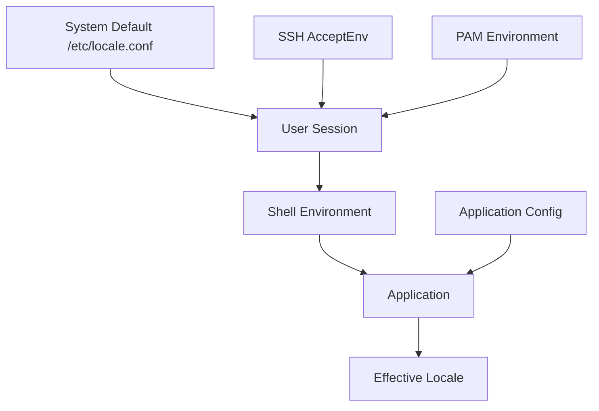

# How to Use Ansible to Configure Locale Settings

Author: [nawazdhandala](https://www.github.com/nawazdhandala)

Tags: Ansible, Locale, Linux, System Configuration, Internationalization

Description: Automate locale configuration across your Linux servers using Ansible to ensure consistent language, character encoding, and formatting settings.

---

Locale misconfigurations are sneaky. Everything works fine until someone deploys an application that writes Unicode to a log file and the whole thing breaks because the server is set to ASCII. Or a database starts rejecting inserts because the collation does not match the client encoding. I have lost hours to locale-related issues that could have been prevented with proper configuration. Ansible lets you get this right once and push it everywhere.

## What Locales Actually Control

The locale system in Linux controls several aspects of how the system handles text and formatting:

- **LANG**: Default locale for all categories
- **LC_CTYPE**: Character classification and conversion
- **LC_COLLATE**: String collation (sorting order)
- **LC_MESSAGES**: Language of system messages
- **LC_NUMERIC**: Number formatting (decimal separator)
- **LC_TIME**: Date and time formatting
- **LC_MONETARY**: Currency formatting

For servers, you almost always want `en_US.UTF-8` as the base locale. UTF-8 encoding handles virtually every character set, and English system messages make troubleshooting easier when you are grepping through logs.

## Setting Up Locales with Ansible

This playbook generates and configures the locales your servers need.

This playbook installs, generates, and sets the system locale:

```yaml
# configure-locales.yml - Set up system locale
---
- name: Configure System Locale
  hosts: all
  become: true
  vars:
    system_locale: "en_US.UTF-8"
    system_language: "en_US.UTF-8"
    additional_locales:
      - en_US.UTF-8
      - en_GB.UTF-8
      - C.UTF-8

  tasks:
    - name: Install locale-related packages on Debian
      ansible.builtin.apt:
        name:
          - locales
          - locales-all
        state: present
        update_cache: true
      when: ansible_os_family == "Debian"

    - name: Install locale-related packages on RHEL
      ansible.builtin.yum:
        name:
          - glibc-langpack-en
          - glibc-locale-source
        state: present
      when: ansible_os_family == "RedHat"

    - name: Generate required locales on Debian
      community.general.locale_gen:
        name: "{{ item }}"
        state: present
      loop: "{{ additional_locales }}"
      when: ansible_os_family == "Debian"

    - name: Set system locale
      ansible.builtin.command:
        cmd: "localectl set-locale LANG={{ system_locale }}"
      register: locale_result
      changed_when: true

    - name: Configure /etc/default/locale
      ansible.builtin.copy:
        dest: /etc/default/locale
        mode: '0644'
        content: |
          LANG={{ system_locale }}
          LANGUAGE={{ system_language }}
          LC_ALL={{ system_locale }}
      when: ansible_os_family == "Debian"

    - name: Configure /etc/locale.conf for RHEL
      ansible.builtin.copy:
        dest: /etc/locale.conf
        mode: '0644'
        content: |
          LANG={{ system_locale }}
          LC_ALL={{ system_locale }}
      when: ansible_os_family == "RedHat"

    - name: Set locale in environment for all users
      ansible.builtin.copy:
        dest: /etc/profile.d/locale.sh
        mode: '0644'
        content: |
          # System locale - managed by Ansible
          export LANG="{{ system_locale }}"
          export LC_ALL="{{ system_locale }}"
          export LANGUAGE="{{ system_language }}"
```

## Handling Locale Generation on Debian

Debian-based systems use `/etc/locale.gen` to control which locales are generated. This playbook manages that file.

This playbook configures locale generation and rebuilds locales:

```yaml
# generate-locales-debian.yml - Manage locale generation
---
- name: Generate Locales on Debian
  hosts: all
  become: true
  vars:
    enabled_locales:
      - { locale: "en_US.UTF-8", charset: "UTF-8" }
      - { locale: "en_GB.UTF-8", charset: "UTF-8" }
      - { locale: "C.UTF-8", charset: "UTF-8" }
      - { locale: "de_DE.UTF-8", charset: "UTF-8" }
      - { locale: "fr_FR.UTF-8", charset: "UTF-8" }

  tasks:
    - name: Configure /etc/locale.gen
      ansible.builtin.lineinfile:
        path: /etc/locale.gen
        regexp: "^#?\\s*{{ item.locale }}\\s+{{ item.charset }}"
        line: "{{ item.locale }} {{ item.charset }}"
      loop: "{{ enabled_locales }}"
      loop_control:
        label: "{{ item.locale }}"
      register: locale_gen_config
      when: ansible_os_family == "Debian"

    - name: Regenerate locales if configuration changed
      ansible.builtin.command: locale-gen
      when:
        - ansible_os_family == "Debian"
        - locale_gen_config.changed

    - name: Verify generated locales
      ansible.builtin.command: locale -a
      register: available_locales
      changed_when: false

    - name: Display available locales
      ansible.builtin.debug:
        msg: "Available locales: {{ available_locales.stdout_lines }}"
```

## Configuring Locale for SSH Sessions

SSH sessions sometimes lose locale settings during the connection. This playbook fixes that.

This playbook configures SSH to pass and accept locale environment variables:

```yaml
# configure-ssh-locale.yml - Fix locale over SSH
---
- name: Configure Locale for SSH Sessions
  hosts: all
  become: true
  tasks:
    - name: Configure SSH server to accept locale variables
      ansible.builtin.lineinfile:
        path: /etc/ssh/sshd_config
        regexp: '^#?AcceptEnv'
        line: "AcceptEnv LANG LC_* LANGUAGE"
      notify: Restart sshd

    - name: Configure SSH client to send locale variables
      ansible.builtin.blockinfile:
        path: /etc/ssh/ssh_config
        marker: "# {mark} ANSIBLE MANAGED - LOCALE"
        block: |
          Host *
              SendEnv LANG LC_* LANGUAGE

    - name: Set locale in PAM session configuration
      ansible.builtin.lineinfile:
        path: /etc/pam.d/sshd
        line: "session    required     pam_env.so envfile=/etc/default/locale"
        insertafter: "^session"
      when: ansible_os_family == "Debian"

  handlers:
    - name: Restart sshd
      ansible.builtin.systemd:
        name: sshd
        state: restarted
```

## Application-Specific Locale Settings

Some applications need their own locale configuration beyond what the system provides.

This playbook sets locale for common applications:

```yaml
# configure-app-locales.yml - Application locale settings
---
- name: Configure Application Locales
  hosts: all
  become: true
  vars:
    app_locale: "en_US.UTF-8"

  tasks:
    - name: Set PostgreSQL locale settings
      ansible.builtin.lineinfile:
        path: /etc/postgresql/15/main/postgresql.conf
        regexp: "^#?{{ item.key }}"
        line: "{{ item.key }} = '{{ item.value }}'"
      loop:
        - { key: "lc_messages", value: "{{ app_locale }}" }
        - { key: "lc_monetary", value: "{{ app_locale }}" }
        - { key: "lc_numeric", value: "{{ app_locale }}" }
        - { key: "lc_time", value: "{{ app_locale }}" }
      when: "'postgres_servers' in group_names"
      notify: Restart postgresql

    - name: Set MySQL character set configuration
      ansible.builtin.blockinfile:
        path: /etc/mysql/mysql.conf.d/charset.cnf
        create: true
        mode: '0644'
        marker: "# {mark} ANSIBLE MANAGED CHARSET"
        block: |
          [mysqld]
          character-set-server = utf8mb4
          collation-server = utf8mb4_unicode_ci
          init-connect = 'SET NAMES utf8mb4'

          [client]
          default-character-set = utf8mb4
      when: "'database_servers' in group_names"
      notify: Restart mysql

    - name: Configure Python default encoding
      ansible.builtin.copy:
        dest: /etc/profile.d/python-encoding.sh
        mode: '0644'
        content: |
          # Ensure Python uses UTF-8 by default
          export PYTHONIOENCODING="utf-8"
          export PYTHONUTF8=1

    - name: Set systemd service locale environment
      ansible.builtin.lineinfile:
        path: /etc/systemd/system.conf
        regexp: '^#?DefaultEnvironment='
        line: 'DefaultEnvironment="LANG={{ app_locale }}" "LC_ALL={{ app_locale }}"'
      notify: Reload systemd

  handlers:
    - name: Restart postgresql
      ansible.builtin.systemd:
        name: postgresql
        state: restarted

    - name: Restart mysql
      ansible.builtin.systemd:
        name: mysql
        state: restarted

    - name: Reload systemd
      ansible.builtin.systemd:
        daemon_reload: true
```

## Locale Validation Playbook

This playbook checks that locale settings are consistent and working.

This playbook validates locale configuration across your fleet:

```yaml
# validate-locales.yml - Check locale consistency
---
- name: Validate Locale Configuration
  hosts: all
  become: true
  vars:
    expected_locale: "en_US.UTF-8"

  tasks:
    - name: Get current locale settings
      ansible.builtin.command: locale
      register: current_locale
      changed_when: false

    - name: Display current locale
      ansible.builtin.debug:
        msg: "{{ current_locale.stdout_lines }}"

    - name: Check LANG is set correctly
      ansible.builtin.shell: |
        locale | grep "^LANG=" | cut -d= -f2
      register: lang_value
      changed_when: false

    - name: Verify LANG matches expected value
      ansible.builtin.assert:
        that:
          - lang_value.stdout == expected_locale
        fail_msg: "LANG mismatch! Expected {{ expected_locale }}, got {{ lang_value.stdout }}"

    - name: Test UTF-8 support works
      ansible.builtin.shell: |
        # Try to write and read a UTF-8 string
        echo "Test UTF-8: Uberprufen Sie die Einstellungen" > /tmp/utf8-test.txt
        cat /tmp/utf8-test.txt
      register: utf8_test
      changed_when: false

    - name: Clean up test file
      ansible.builtin.file:
        path: /tmp/utf8-test.txt
        state: absent

    - name: Verify locale is available
      ansible.builtin.shell: |
        locale -a | grep -c "{{ expected_locale | regex_replace('\\.', '\\.') }}"
      register: locale_available
      changed_when: false
      failed_when: locale_available.stdout | int == 0
```

## Locale Configuration Hierarchy



## Troubleshooting Tips

**"locale: Cannot set LC_ALL"**: This means the locale is referenced but not generated. Run `locale-gen en_US.UTF-8` or use the Ansible `locale_gen` module.

**Different locale over SSH vs local**: Check that your SSH server has `AcceptEnv LANG LC_*` and the client has `SendEnv LANG LC_*`. Also check PAM configuration.

**Perl warnings about locale**: Perl is notoriously noisy about locale issues. If you see "Setting locale failed" warnings, make sure all `LC_*` variables point to generated locales.

**Ansible itself needs proper locale**: If your control node has a broken locale, Ansible might fail with encoding errors when processing non-ASCII output from managed hosts. Fix the control node locale first.

Locale configuration might not be glamorous, but getting it wrong leads to some of the most frustrating bugs in production. Set it once with Ansible, validate it regularly, and move on to more interesting problems.
