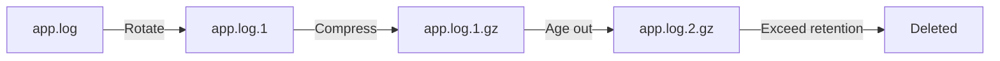

# How to Use Ansible to Configure Log Rotation for Web Apps

Author: [nawazdhandala](https://www.github.com/nawazdhandala)

Tags: Ansible, Log Rotation, Logrotate, Monitoring, DevOps

Description: Configure log rotation for web applications using Ansible with logrotate, custom rotation policies, and disk space management.

---

Log files grow. Left unchecked, they will fill your disk and crash your application. Every production web application needs log rotation. Logrotate is the standard tool on Linux systems for managing log file lifecycle: rotating, compressing, and deleting old log files on a schedule. Ansible makes it easy to deploy consistent logrotate configurations across all your servers, ensuring that every application follows the same log management policies.

This guide covers configuring logrotate with Ansible for various web application stacks, including Nginx, Apache, application logs, and custom log formats.

## How Logrotate Works

Logrotate runs daily via a systemd timer (or cron on older systems). It reads configuration files from `/etc/logrotate.d/` and performs rotation based on the rules defined. A typical rotation cycle looks like:



Each rotation: the current log is renamed, a new empty log is created, old logs are compressed, and logs exceeding the retention period are deleted.

## Project Structure

```
logrotate-setup/
  inventory/
    hosts.yml
  group_vars/
    all.yml
  roles/
    logrotate/
      tasks/
        main.yml
      templates/
        nginx-logrotate.conf.j2
        apache-logrotate.conf.j2
        app-logrotate.conf.j2
        gunicorn-logrotate.conf.j2
        pm2-logrotate.conf.j2
      handlers/
        main.yml
  playbook.yml
```

## Variables

```yaml
# group_vars/all.yml
log_retention_days: 14
log_rotation_frequency: daily  # daily, weekly, monthly
log_compress: true
log_max_size: "100M"

# Application-specific settings
apps:
  - name: webapp
    log_dir: /var/log/webapp
    log_pattern: "*.log"
    rotate_count: 14
    postrotate: "systemctl reload webapp"
    create_mode: "0640"
    create_user: webapp
    create_group: webapp

  - name: api-service
    log_dir: /var/log/api-service
    log_pattern: "*.log"
    rotate_count: 30
    postrotate: "systemctl kill -s USR1 api-service"
    create_mode: "0640"
    create_user: apiuser
    create_group: apiuser

# Nginx settings
nginx_log_dir: /var/log/nginx
nginx_rotate_count: 14

# Disk space alert threshold (percentage)
disk_alert_threshold: 85
```

## Role Tasks

```yaml
# roles/logrotate/tasks/main.yml
---
- name: Ensure logrotate is installed
  apt:
    name: logrotate
    state: present
    update_cache: yes

- name: Deploy Nginx logrotate configuration
  template:
    src: nginx-logrotate.conf.j2
    dest: /etc/logrotate.d/nginx-custom
    owner: root
    group: root
    mode: '0644'
  when: "'nginx' in ansible_facts.packages | default({})"

- name: Deploy Apache logrotate configuration
  template:
    src: apache-logrotate.conf.j2
    dest: /etc/logrotate.d/apache2-custom
    owner: root
    group: root
    mode: '0644'
  when: "'apache2' in ansible_facts.packages | default({})"

- name: Deploy application logrotate configurations
  template:
    src: app-logrotate.conf.j2
    dest: "/etc/logrotate.d/{{ item.name }}"
    owner: root
    group: root
    mode: '0644'
  loop: "{{ apps }}"

- name: Ensure log directories exist with correct permissions
  file:
    path: "{{ item.log_dir }}"
    state: directory
    owner: "{{ item.create_user | default('root') }}"
    group: "{{ item.create_group | default('root') }}"
    mode: '0755'
  loop: "{{ apps }}"

- name: Deploy disk space monitoring script
  copy:
    content: |
      #!/bin/bash
      # Check disk usage and alert if above threshold
      THRESHOLD={{ disk_alert_threshold }}
      USAGE=$(df /var/log --output=pcent | tail -1 | tr -d ' %')
      if [ "$USAGE" -gt "$THRESHOLD" ]; then
        echo "$(date): WARNING - /var/log is at ${USAGE}% capacity" >> /var/log/disk-alert.log
        # Find largest log files
        echo "Largest log files:" >> /var/log/disk-alert.log
        find /var/log -name "*.log" -size +50M -exec ls -lh {} \; >> /var/log/disk-alert.log
      fi
    dest: /opt/scripts/check-log-disk.sh
    mode: '0755'

- name: Schedule disk space check
  cron:
    name: "Check log disk space"
    minute: "0"
    hour: "*/4"
    job: "/opt/scripts/check-log-disk.sh"
    user: root

- name: Test logrotate configuration syntax
  command: logrotate -d /etc/logrotate.conf
  register: logrotate_test
  changed_when: false
  failed_when: "'error' in logrotate_test.stderr | lower"

- name: Force initial rotation if logs are already large
  command: logrotate -f /etc/logrotate.d/{{ item.name }}
  loop: "{{ apps }}"
  when: force_initial_rotation | default(false)
```

## Nginx Logrotate Template

```
# roles/logrotate/templates/nginx-logrotate.conf.j2
{{ nginx_log_dir }}/*.log {
    {{ log_rotation_frequency }}
    missingok
    rotate {{ nginx_rotate_count }}

    compress
    delaycompress

    notifempty
    create 0640 www-data adm
    sharedscripts
    postrotate
        # Tell Nginx to reopen log files
        if [ -f /var/run/nginx.pid ]; then
            kill -USR1 $(cat /var/run/nginx.pid)
        fi
    endscript
}
```

## Apache Logrotate Template

```
# roles/logrotate/templates/apache-logrotate.conf.j2
/var/log/apache2/*.log {
    {{ log_rotation_frequency }}
    missingok
    rotate {{ log_retention_days }}

    compress
    delaycompress

    notifempty
    create 0640 root adm
    sharedscripts
    postrotate
        # Gracefully restart Apache to reopen log files
        if systemctl is-active --quiet apache2; then
            systemctl reload apache2
        fi
    endscript
}
```

## Application Logrotate Template

This is the flexible template that works for any application.

```
# roles/logrotate/templates/app-logrotate.conf.j2
{{ item.log_dir }}/{{ item.log_pattern | default('*.log') }} {
    {{ log_rotation_frequency }}
    missingok
    rotate {{ item.rotate_count | default(log_retention_days) }}

    compress
    delaycompress

    notifempty

    maxsize {{ item.max_size }}

    maxsize {{ log_max_size }}

    create {{ item.create_mode | default('0640') }} {{ item.create_user | default('root') }} {{ item.create_group | default('root') }}

    dateext
    dateformat -%Y%m%d

    sharedscripts

    postrotate
        {{ item.postrotate }}
    endscript


    prerotate
        {{ item.prerotate }}
    endscript

}
```

## Gunicorn Logrotate Template

```
# roles/logrotate/templates/gunicorn-logrotate.conf.j2
/var/log/gunicorn/*.log {
    daily
    missingok
    rotate 14
    compress
    delaycompress
    notifempty
    create 0640 appuser appuser
    sharedscripts
    postrotate
        # Send HUP signal to Gunicorn master to reopen log files
        if [ -f /run/gunicorn/gunicorn.pid ]; then
            kill -HUP $(cat /run/gunicorn/gunicorn.pid)
        fi
    endscript
}
```

## Size-Based Rotation

Sometimes you want to rotate based on file size rather than time:

```yaml
# Application that generates large logs
- name: hightraffic-api
  log_dir: /var/log/hightraffic-api
  log_pattern: "*.log"
  rotate_count: 7
  max_size: "500M"
  postrotate: "systemctl kill -s USR1 hightraffic-api"
  create_mode: "0640"
  create_user: apiuser
  create_group: apiuser
```

The `maxsize` directive in the logrotate config will rotate the log when it exceeds the specified size, regardless of the time-based schedule.

## Emergency Log Cleanup

For situations where logs have gotten out of control:

```yaml
# Emergency log cleanup playbook
- name: Emergency log cleanup
  hosts: all
  become: yes
  tasks:
    - name: Find log files larger than 1GB
      find:
        paths: /var/log
        patterns: "*.log,*.log.*"
        size: "1g"
        recurse: yes
      register: large_logs

    - name: Display large log files
      debug:
        msg: "{{ item.path }} - {{ (item.size / 1048576) | round(1) }}MB"
      loop: "{{ large_logs.files }}"

    - name: Truncate large unrotated log files
      command: "truncate -s 0 {{ item.path }}"
      loop: "{{ large_logs.files }}"
      when: item.path is not search('\.gz$')

    - name: Remove compressed logs older than 30 days
      find:
        paths: /var/log
        patterns: "*.gz"
        age: "30d"
        recurse: yes
      register: old_compressed

    - name: Delete old compressed logs
      file:
        path: "{{ item.path }}"
        state: absent
      loop: "{{ old_compressed.files }}"

    - name: Force logrotate run
      command: logrotate -f /etc/logrotate.conf
```

## Running the Playbook

```bash
# Deploy logrotate configurations
ansible-playbook -i inventory/hosts.yml playbook.yml

# Force initial rotation
ansible-playbook -i inventory/hosts.yml playbook.yml -e "force_initial_rotation=true"

# Test logrotate configuration (dry run)
ansible all -i inventory/hosts.yml -m command -a "logrotate -d /etc/logrotate.conf"
```

## Wrapping Up

Log rotation is one of those things that is easy to forget until it causes an outage. This Ansible playbook ensures every application on every server has proper logrotate configuration. The template-driven approach makes it easy to add new applications with custom rotation policies. The combination of time-based and size-based rotation, compression, and post-rotation hooks (for signaling applications to reopen log files) covers the needs of most web application stacks. Deploy it once and stop worrying about full disks from runaway logs.
