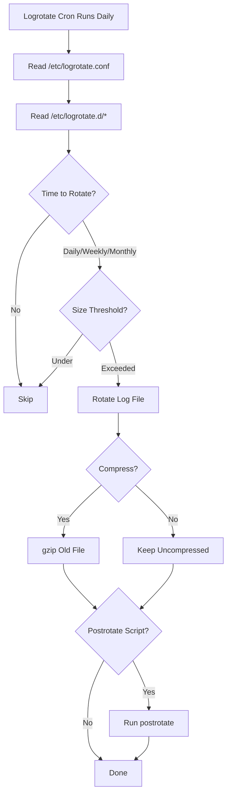

# How to Use Ansible to Configure Logrotate

Author: [nawazdhandala](https://www.github.com/nawazdhandala)

Tags: Ansible, Logrotate, Logging, Linux, DevOps

Description: Automate logrotate configuration across your Linux infrastructure using Ansible for managing log file rotation, compression, and retention policies.

---

Log files grow forever if you let them. I have seen production servers go down because /var/log filled up the root partition. It is one of those problems that is completely preventable with proper logrotate configuration. Ansible makes it straightforward to deploy consistent log rotation policies across all your servers, covering both system logs and application-specific log files.

## How Logrotate Works

Logrotate runs as a daily cron job (or systemd timer) and processes configuration files that define how to handle specific log files. Each configuration specifies:

- How often to rotate (daily, weekly, monthly)
- How many old copies to keep
- Whether to compress rotated logs
- What to do after rotation (restart services, run scripts)
- Size-based rotation triggers

Configuration lives in `/etc/logrotate.conf` (global defaults) and `/etc/logrotate.d/` (per-application configs).

## Global Logrotate Configuration

Let us start by setting sensible global defaults.

This playbook configures the main logrotate.conf with production-ready defaults:

```yaml
# configure-logrotate.yml - Set up log rotation
---
- name: Configure Logrotate
  hosts: all
  become: true
  vars:
    logrotate_frequency: weekly
    logrotate_rotate: 4
    logrotate_compress: true
    logrotate_delaycompress: true
    logrotate_dateext: true

  tasks:
    - name: Install logrotate
      ansible.builtin.package:
        name: logrotate
        state: present

    - name: Deploy main logrotate configuration
      ansible.builtin.copy:
        dest: /etc/logrotate.conf
        owner: root
        group: root
        mode: '0644'
        backup: true
        content: |
          # Global logrotate configuration - managed by Ansible
          # Rotate logs on a {{ logrotate_frequency }} basis
          {{ logrotate_frequency }}

          # Keep {{ logrotate_rotate }} weeks worth of backlogs
          rotate {{ logrotate_rotate }}

          # Create new log files after rotating old ones
          create

          # Use date as suffix for rotated files
          
          dateext
          dateformat -%Y%m%d
          

          
          # Compress rotated log files
          compress

          
          # Delay compression to allow processes to finish writing
          delaycompress
          
          

          # Do not rotate empty log files
          notifempty

          # Include per-application configurations
          include /etc/logrotate.d
```

## Application-Specific Logrotate Configurations

Different applications need different rotation policies. Here is how to deploy them.

This playbook creates logrotate configs for common applications:

```yaml
# configure-app-logrotate.yml - Per-application log rotation
---
- name: Configure Application Logrotate
  hosts: all
  become: true
  vars:
    logrotate_configs:
      - name: nginx
        path: /var/log/nginx/*.log
        frequency: daily
        rotate: 14
        options:
          - compress
          - delaycompress
          - notifempty
          - missingok
          - sharedscripts
          - dateext
        postrotate: |
          if [ -f /var/run/nginx.pid ]; then
            kill -USR1 $(cat /var/run/nginx.pid)
          fi

      - name: application
        path: /var/log/app/*.log
        frequency: daily
        rotate: 30
        size: 100M
        options:
          - compress
          - delaycompress
          - notifempty
          - missingok
          - copytruncate
          - dateext

      - name: syslog
        path: "/var/log/syslog\n/var/log/messages"
        frequency: daily
        rotate: 7
        options:
          - compress
          - delaycompress
          - notifempty
          - missingok
        postrotate: |
          /usr/lib/rsyslog/rsyslog-rotate

      - name: auth-logs
        path: /var/log/auth.log
        frequency: weekly
        rotate: 52
        options:
          - compress
          - delaycompress
          - notifempty
          - missingok
        postrotate: |
          systemctl reload rsyslog 2>/dev/null || true

  tasks:
    - name: Deploy logrotate configuration for each application
      ansible.builtin.template:
        src: logrotate-app.j2
        dest: "/etc/logrotate.d/{{ item.name }}"
        owner: root
        group: root
        mode: '0644'
      loop: "{{ logrotate_configs }}"
      loop_control:
        label: "{{ item.name }}"
```

The template for generating logrotate configs:

```jinja2
# logrotate-app.j2 - Application logrotate configuration
# Managed by Ansible - do not edit manually
# Application: {{ item.name }}

{{ item.path }} {
    {{ item.frequency }}
    rotate {{ item.rotate }}

    size {{ item.size }}


    {{ opt }}


    postrotate
        {{ item.postrotate | indent(8) }}
    endscript

}
```

## Size-Based Rotation

Sometimes you want to rotate based on file size rather than time. This is common for applications that generate variable amounts of logs.

This playbook configures size-based log rotation:

```yaml
# configure-size-rotation.yml - Size-based log rotation
---
- name: Configure Size-Based Log Rotation
  hosts: all
  become: true
  tasks:
    - name: Create size-based logrotate config for database logs
      ansible.builtin.copy:
        dest: /etc/logrotate.d/database
        mode: '0644'
        content: |
          # Database log rotation - size-based
          # Managed by Ansible
          /var/log/postgresql/*.log
          /var/log/mysql/*.log {
              # Rotate when file exceeds 200MB
              size 200M
              # Keep 10 rotated files
              rotate 10
              compress
              delaycompress
              notifempty
              missingok
              # Use copytruncate since databases keep the file open
              copytruncate
              dateext
              dateformat -%Y%m%d-%s
          }

    - name: Create size-based logrotate for Docker container logs
      ansible.builtin.copy:
        dest: /etc/logrotate.d/docker-containers
        mode: '0644'
        content: |
          # Docker container log rotation
          # Managed by Ansible
          /var/lib/docker/containers/*/*.log {
              size 50M
              rotate 5
              compress
              delaycompress
              missingok
              copytruncate
          }
```

## Adding Logrotate for Custom Applications

When deploying custom applications, include their logrotate config in the deployment.

This playbook template creates logrotate configs for custom apps:

```yaml
# deploy-app-logrotate.yml - Custom application log rotation
---
- name: Deploy Application with Logrotate
  hosts: app_servers
  become: true
  vars:
    apps:
      - name: myapi
        log_dir: /var/log/myapi
        log_pattern: "*.log"
        rotate_days: 30
        max_size: 100M
        user: myapi
        group: myapi
      - name: worker
        log_dir: /var/log/worker
        log_pattern: "*.log"
        rotate_days: 14
        max_size: 50M
        user: worker
        group: worker

  tasks:
    - name: Ensure log directories exist
      ansible.builtin.file:
        path: "{{ item.log_dir }}"
        state: directory
        owner: "{{ item.user }}"
        group: "{{ item.group }}"
        mode: '0755'
      loop: "{{ apps }}"
      loop_control:
        label: "{{ item.name }}"

    - name: Create logrotate config for each app
      ansible.builtin.copy:
        dest: "/etc/logrotate.d/{{ item.name }}"
        mode: '0644'
        content: |
          # {{ item.name }} log rotation - managed by Ansible
          {{ item.log_dir }}/{{ item.log_pattern }} {
              daily
              rotate {{ item.rotate_days }}
              size {{ item.max_size }}
              compress
              delaycompress
              notifempty
              missingok
              copytruncate
              dateext
              create 0640 {{ item.user }} {{ item.group }}
          }
      loop: "{{ apps }}"
      loop_control:
        label: "{{ item.name }}"
```

## Testing Logrotate Configuration

Always test your logrotate configs before relying on them in production.

This playbook validates and tests logrotate configurations:

```yaml
# test-logrotate.yml - Validate logrotate configs
---
- name: Test Logrotate Configuration
  hosts: all
  become: true
  tasks:
    - name: Validate global logrotate configuration
      ansible.builtin.command:
        cmd: logrotate -d /etc/logrotate.conf
      register: logrotate_test
      changed_when: false
      failed_when: false

    - name: Check for configuration errors
      ansible.builtin.debug:
        msg: "{{ logrotate_test.stderr_lines | select('search', 'error') | list }}"
      when: logrotate_test.stderr is defined

    - name: Test each logrotate config individually
      ansible.builtin.command:
        cmd: "logrotate -d /etc/logrotate.d/{{ item }}"
      register: individual_test
      changed_when: false
      failed_when: false
      loop:
        - nginx
        - application
        - syslog

    - name: Force a test rotation (dry run)
      ansible.builtin.command:
        cmd: logrotate -d -f /etc/logrotate.conf
      register: force_test
      changed_when: false

    - name: Check logrotate status file
      ansible.builtin.command:
        cmd: cat /var/lib/logrotate/status
      register: logrotate_status
      changed_when: false
      failed_when: false

    - name: Display last rotation times
      ansible.builtin.debug:
        msg: "{{ logrotate_status.stdout_lines | last(10) if logrotate_status.stdout_lines | length > 10 else logrotate_status.stdout_lines }}"
```

## Monitoring Log Disk Usage

This playbook checks log-related disk usage to catch potential problems.

This playbook monitors log directory sizes and alerts on high usage:

```yaml
# monitor-log-space.yml - Check log disk usage
---
- name: Monitor Log Disk Usage
  hosts: all
  become: true
  tasks:
    - name: Check /var/log directory size
      ansible.builtin.shell: |
        du -sh /var/log 2>/dev/null | awk '{print $1}'
      register: log_size
      changed_when: false

    - name: Check individual log directory sizes
      ansible.builtin.shell: |
        du -sh /var/log/*/ 2>/dev/null | sort -rh | head -10
      register: log_dirs
      changed_when: false

    - name: Display log usage
      ansible.builtin.debug:
        msg: |
          Total /var/log: {{ log_size.stdout }}
          Top directories:
          {{ log_dirs.stdout }}

    - name: Find log files larger than 500MB
      ansible.builtin.shell: |
        find /var/log -type f -size +500M -exec ls -lh {} \; 2>/dev/null
      register: large_logs
      changed_when: false

    - name: Alert on large log files
      ansible.builtin.debug:
        msg: "WARNING: Large log files found on {{ inventory_hostname }}:\n{{ large_logs.stdout }}"
      when: large_logs.stdout | length > 0
```

## Logrotate Decision Flow



## Key Tips

**copytruncate vs create**: Use `copytruncate` when the application keeps the log file open and you cannot signal it to reopen. Use `create` (with a postrotate signal) when possible, as it is more reliable and does not risk losing log lines written during the copy.

**delaycompress is your friend**: It delays compression by one rotation cycle. This means the most recent rotated log is still in plain text, making it easy to grep without decompressing.

**Test before deploying**: Always run `logrotate -d` (debug/dry-run mode) to verify your configuration before it runs in production. A syntax error in logrotate can mean no logs get rotated at all.

**Watch for selinux**: On RHEL systems with SELinux enabled, logrotate might fail to rotate files in non-standard directories. Check audit logs and use `semanage fcontext` to set the correct labels.

Log rotation is boring infrastructure work, but the consequences of getting it wrong range from full disks to missing audit data. Let Ansible handle the tedium and you will never lose sleep over log management again.
