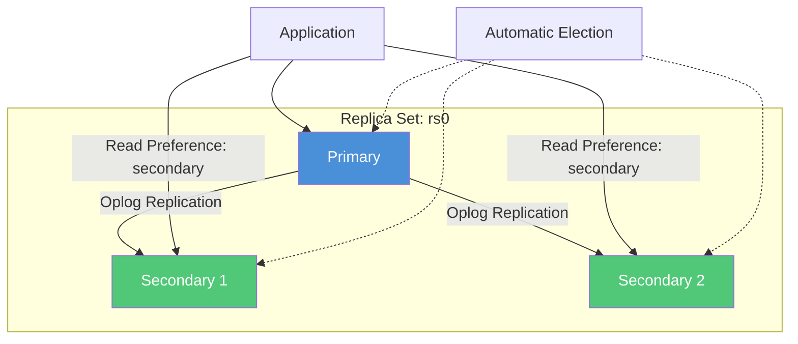
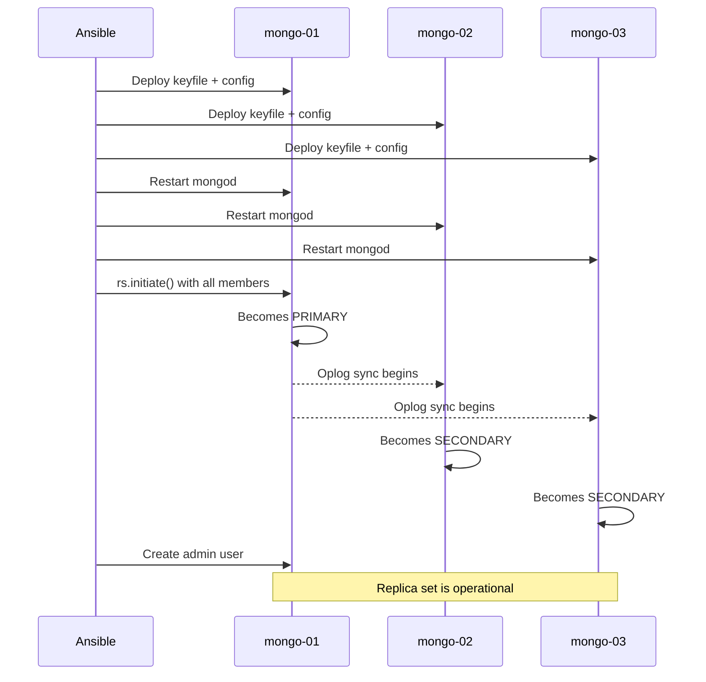

# How to Use Ansible to Configure MongoDB Replica Sets

Author: [nawazdhandala](https://www.github.com/nawazdhandala)

Tags: Ansible, MongoDB, Replica Sets, High Availability

Description: Set up MongoDB replica sets with Ansible for high availability and automatic failover across your database cluster.

---

A MongoDB replica set is a group of MongoDB instances that maintain the same data. One member is the primary (handles writes), and the others are secondaries (replicate data from the primary and can serve reads). If the primary goes down, the replica set automatically elects a new primary. This is MongoDB's built-in high availability mechanism, and Ansible can automate the entire setup.

This post covers configuring a three-member MongoDB replica set with Ansible, from initial server configuration to replica set initialization and health monitoring.

## Replica Set Architecture



A three-member replica set provides data redundancy and automatic failover. If the primary fails, one of the secondaries is elected as the new primary within seconds.

## Inventory Setup

```yaml
# inventory/production/hosts.yml
# MongoDB replica set cluster definition
all:
  children:
    mongodb_replicaset:
      hosts:
        mongo-01:
          ansible_host: 10.0.3.10
          mongodb_priority: 10
        mongo-02:
          ansible_host: 10.0.3.11
          mongodb_priority: 5
        mongo-03:
          ansible_host: 10.0.3.12
          mongodb_priority: 5
      vars:
        mongodb_version: "7.0"
        mongodb_replset_name: "rs0"
        mongodb_port: 27017
        mongodb_admin_user: admin
        mongodb_admin_password: "{{ vault_mongodb_admin_password }}"
        mongodb_keyfile_content: "{{ vault_mongodb_keyfile }}"
```

## Generating the Keyfile

Replica set members authenticate with each other using a shared keyfile. Generate it once and store it in Ansible Vault.

```bash
# Generate a keyfile for internal authentication
openssl rand -base64 756 > /tmp/mongodb-keyfile
```

Store the content in your vault file.

```yaml
# group_vars/mongodb_replicaset/vault.yml (encrypted)
vault_mongodb_admin_password: "Str0ngAdm1nP@ss"
vault_mongodb_keyfile: |
  kfH3e7wR8x5Bq... (base64 content from the openssl command)
```

## Configuring All Members

Every replica set member needs the same base configuration with the replica set name and authentication settings.

```yaml
# roles/mongodb_replicaset/tasks/main.yml
# Configure MongoDB for replica set operation
---
- name: Deploy MongoDB keyfile for internal auth
  copy:
    content: "{{ mongodb_keyfile_content }}"
    dest: /etc/mongodb-keyfile
    owner: "{{ 'mongodb' if ansible_os_family == 'Debian' else 'mongod' }}"
    group: "{{ 'mongodb' if ansible_os_family == 'Debian' else 'mongod' }}"
    mode: '0400'

- name: Deploy MongoDB configuration
  template:
    src: mongod-replicaset.conf.j2
    dest: /etc/mongod.conf
    owner: root
    group: root
    mode: '0644'
  notify: restart mongod

- name: Flush handlers to apply configuration
  meta: flush_handlers

- name: Wait for MongoDB to accept connections
  wait_for:
    port: "{{ mongodb_port }}"
    host: 127.0.0.1
    delay: 5
    timeout: 60
```

## MongoDB Replica Set Configuration Template

```yaml
# roles/mongodb_replicaset/templates/mongod-replicaset.conf.j2
# MongoDB configuration for replica set member
# Managed by Ansible - do not edit manually

storage:
  dbPath: {{ mongodb_dbpath | default('/var/lib/mongodb') }}
  journal:
    enabled: true

  wiredTiger:
    engineConfig:
      cacheSizeGB: {{ mongodb_wiredtiger_cache_size_gb }}


systemLog:
  destination: file
  logAppend: true
  path: {{ mongodb_logpath | default('/var/log/mongodb/mongod.log') }}

net:
  port: {{ mongodb_port }}
  bindIp: 127.0.0.1,{{ ansible_host }}

processManagement:
  timeZoneInfo: /usr/share/zoneinfo

security:
  authorization: enabled
  keyFile: /etc/mongodb-keyfile

replication:
  replSetName: {{ mongodb_replset_name }}
  oplogSizeMB: {{ mongodb_oplog_size_mb | default(2048) }}
```

## Initializing the Replica Set

This is the critical step. The replica set needs to be initialized from one member, and then other members join.

```yaml
# roles/mongodb_replicaset/tasks/init-replicaset.yml
# Initialize the MongoDB replica set
---
- name: Check if replica set is already initialized
  command: >
    mongosh --quiet --port {{ mongodb_port }}
    --eval "rs.status().ok"
  register: rs_status
  changed_when: false
  failed_when: false
  delegate_to: "{{ groups['mongodb_replicaset'][0] }}"
  run_once: true

- name: Initialize replica set on first member
  command: >
    mongosh --quiet --port {{ mongodb_port }} --eval "
    rs.initiate({
      _id: '{{ mongodb_replset_name }}',
      members: [
    
        {
          _id: {{ loop.index0 }},
          host: '{{ hostvars[host].ansible_host }}:{{ mongodb_port }}',
          priority: {{ hostvars[host].mongodb_priority | default(1) }}
        }{{ ',' if not loop.last else '' }}
    
      ]
    })"
  delegate_to: "{{ groups['mongodb_replicaset'][0] }}"
  run_once: true
  when: rs_status.stdout != "1"

- name: Wait for replica set election to complete
  command: >
    mongosh --quiet --port {{ mongodb_port }}
    --eval "rs.status().members.filter(m => m.stateStr === 'PRIMARY').length"
  register: primary_check
  until: primary_check.stdout | trim == "1"
  retries: 30
  delay: 5
  delegate_to: "{{ groups['mongodb_replicaset'][0] }}"
  run_once: true
  changed_when: false
```

## Creating the Admin User on the Replica Set

After initialization, create the admin user. This only needs to happen on the primary.

```yaml
# roles/mongodb_replicaset/tasks/create-admin.yml
# Create admin user on the replica set primary
---
- name: Wait for primary to be ready
  command: >
    mongosh --quiet --port {{ mongodb_port }}
    --eval "db.isMaster().ismaster"
  register: is_primary
  until: is_primary.stdout | trim == "true"
  retries: 20
  delay: 5
  delegate_to: "{{ groups['mongodb_replicaset'][0] }}"
  run_once: true
  changed_when: false

- name: Check if admin user exists
  command: >
    mongosh --quiet --port {{ mongodb_port }}
    --eval "db.getSiblingDB('admin').getUser('{{ mongodb_admin_user }}')"
  register: admin_check
  delegate_to: "{{ groups['mongodb_replicaset'][0] }}"
  run_once: true
  changed_when: false
  failed_when: false

- name: Create admin user
  command: >
    mongosh --quiet --port {{ mongodb_port }} --eval "
    db.getSiblingDB('admin').createUser({
      user: '{{ mongodb_admin_user }}',
      pwd: '{{ mongodb_admin_password }}',
      roles: [
        { role: 'root', db: 'admin' }
      ]
    })"
  delegate_to: "{{ groups['mongodb_replicaset'][0] }}"
  run_once: true
  when: "'null' in admin_check.stdout"
  no_log: true
```

## The Complete Playbook

```yaml
# playbooks/setup-mongodb-replicaset.yml
# Set up a MongoDB replica set cluster
---
- name: Configure MongoDB replica set members
  hosts: mongodb_replicaset
  become: true
  vars:
    mongodb_dbpath: "/var/lib/mongodb"
    mongodb_logpath: "/var/log/mongodb/mongod.log"

  roles:
    - mongodb_replicaset

  handlers:
    - name: restart mongod
      systemd:
        name: mongod
        state: restarted

  post_tasks:
    - name: Initialize replica set
      include_tasks: roles/mongodb_replicaset/tasks/init-replicaset.yml

    - name: Create admin user
      include_tasks: roles/mongodb_replicaset/tasks/create-admin.yml
```

## Monitoring Replica Set Health

```yaml
# playbooks/check-mongodb-replicaset.yml
# Monitor replica set status and health
---
- name: Check MongoDB replica set health
  hosts: mongodb_replicaset[0]
  become: true
  tasks:
    - name: Get replica set status
      command: >
        mongosh --quiet
        -u "{{ mongodb_admin_user }}"
        -p "{{ mongodb_admin_password }}"
        --authenticationDatabase admin
        --port {{ mongodb_port }}
        --eval "JSON.stringify(rs.status().members.map(m => ({
          name: m.name,
          state: m.stateStr,
          health: m.health,
          uptime: m.uptime,
          optimeDate: m.optimeDate,
          lag: m.optimeDate ? (new Date() - new Date(m.optimeDate))/1000 : 'N/A'
        })), null, 2)"
      register: rs_health
      changed_when: false
      no_log: true

    - name: Display replica set health
      debug:
        msg: "{{ rs_health.stdout | from_json }}"

    - name: Get replica set configuration
      command: >
        mongosh --quiet
        -u "{{ mongodb_admin_user }}"
        -p "{{ mongodb_admin_password }}"
        --authenticationDatabase admin
        --port {{ mongodb_port }}
        --eval "JSON.stringify(rs.conf().members.map(m => ({
          host: m.host,
          priority: m.priority,
          votes: m.votes,
          arbiterOnly: m.arbiterOnly || false
        })), null, 2)"
      register: rs_conf
      changed_when: false
      no_log: true

    - name: Display replica set configuration
      debug:
        msg: "{{ rs_conf.stdout | from_json }}"
```

## Adding a New Member to an Existing Replica Set

```yaml
# playbooks/add-replicaset-member.yml
# Add a new member to an existing replica set
---
- name: Configure new MongoDB member
  hosts: "{{ new_member }}"
  become: true
  roles:
    - mongodb_replicaset
  handlers:
    - name: restart mongod
      systemd:
        name: mongod
        state: restarted

- name: Add member to replica set
  hosts: mongodb_replicaset[0]
  become: true
  tasks:
    - name: Add new member
      command: >
        mongosh --quiet
        -u "{{ mongodb_admin_user }}"
        -p "{{ mongodb_admin_password }}"
        --authenticationDatabase admin
        --port {{ mongodb_port }}
        --eval "rs.add('{{ hostvars[new_member].ansible_host }}:{{ mongodb_port }}')"
      no_log: true
```

```bash
# Add a new member to the replica set
ansible-playbook playbooks/add-replicaset-member.yml \
  -i inventory/production/ \
  -e "new_member=mongo-04" \
  --ask-vault-pass
```

## Replica Set Setup Flow



## Running the Setup

```bash
# Set up the complete replica set
ansible-playbook playbooks/setup-mongodb-replicaset.yml \
  -i inventory/production/ \
  --ask-vault-pass

# Check replica set health
ansible-playbook playbooks/check-mongodb-replicaset.yml \
  -i inventory/production/ \
  --ask-vault-pass
```

## Conclusion

MongoDB replica sets with Ansible give you automated, reproducible high availability setup. The keyfile provides internal authentication between members, the configuration template ensures consistent settings across all nodes, and the initialization playbook handles the one-time `rs.initiate()` call with proper member definitions. The priority settings let you control which member is preferred as primary. Add monitoring tasks to track replication lag and member health, and you have a solid foundation for a production MongoDB cluster that handles failover automatically.
