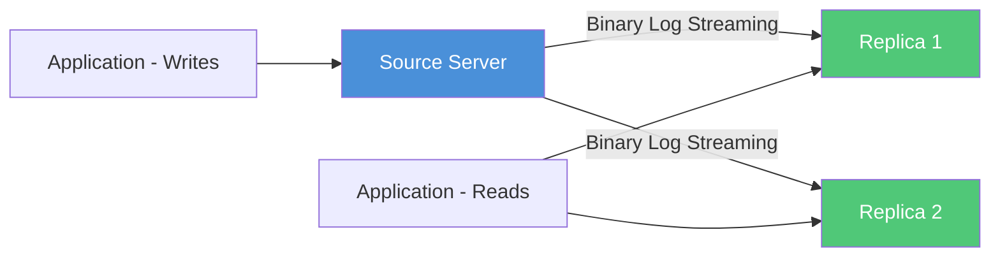
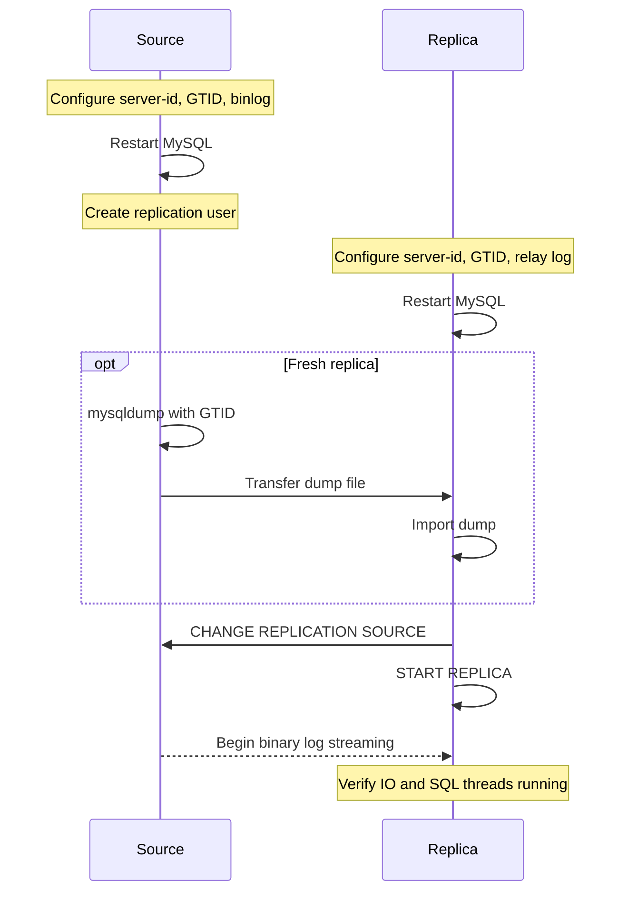

# How to Use Ansible to Configure MySQL Replication

Author: [nawazdhandala](https://www.github.com/nawazdhandala)

Tags: Ansible, MySQL, Replication, High Availability

Description: Set up MySQL source-replica replication with Ansible including GTID-based replication, health monitoring, and failover preparation.

---

MySQL replication copies data from a source server (formerly called master) to one or more replica servers (formerly called slaves). This gives you read scaling, data redundancy, and the foundation for high availability. Setting it up manually involves coordinating configuration between the source and each replica, creating replication users, taking consistent snapshots, and configuring the replication channel. Ansible automates all of this.

This post covers GTID-based MySQL replication setup with Ansible, which is the recommended approach for MySQL 8.0 and later.

## Replication Architecture



## Inventory Setup

```yaml
# inventory/production/hosts.yml
# MySQL replication cluster definition
all:
  children:
    mysql_source:
      hosts:
        mysql-source:
          ansible_host: 10.0.2.10
    mysql_replicas:
      hosts:
        mysql-replica-01:
          ansible_host: 10.0.2.11
        mysql-replica-02:
          ansible_host: 10.0.2.12
    mysql_cluster:
      children:
        mysql_source:
        mysql_replicas:
      vars:
        mysql_version: "8.0"
        mysql_replication_user: repl_user
        mysql_replication_password: "{{ vault_mysql_replication_password }}"
        mysql_socket: /var/run/mysqld/mysqld.sock
```

## Configuring the Source Server

The source server needs binary logging and a unique server ID.

```yaml
# roles/mysql_source/tasks/main.yml
# Configure MySQL source server for GTID-based replication
---
- name: Configure MySQL source for replication
  blockinfile:
    path: /etc/mysql/mysql.conf.d/replication.cnf
    create: true
    owner: root
    group: root
    mode: '0644'
    block: |
      [mysqld]
      # Server identification
      server-id = 1

      # Binary logging
      log_bin = /var/log/mysql/mysql-bin
      binlog_format = ROW
      binlog_row_image = FULL
      expire_logs_days = 7
      max_binlog_size = 100M

      # GTID configuration
      gtid_mode = ON
      enforce_gtid_consistency = ON

      # Semi-synchronous replication (optional but recommended)
      # plugin_load_add = semisync_source
      # rpl_semi_sync_source_enabled = 1
      # rpl_semi_sync_source_timeout = 1000

      # Performance
      sync_binlog = 1
      innodb_flush_log_at_trx_commit = 1
  notify: restart mysql

- name: Create replication user
  community.mysql.mysql_user:
    name: "{{ mysql_replication_user }}"
    password: "{{ mysql_replication_password }}"
    host: "10.0.2.%"
    priv: "*.*:REPLICATION SLAVE,REPLICATION CLIENT"
    state: present
    login_unix_socket: "{{ mysql_socket }}"
  no_log: true

- name: Flush privileges
  community.mysql.mysql_query:
    query: "FLUSH PRIVILEGES"
    login_unix_socket: "{{ mysql_socket }}"
```

## Configuring the Replica Servers

Each replica needs a unique server ID and GTID configuration.

```yaml
# roles/mysql_replica/tasks/main.yml
# Configure MySQL replica for GTID-based replication
---
- name: Configure MySQL replica settings
  blockinfile:
    path: /etc/mysql/mysql.conf.d/replication.cnf
    create: true
    owner: root
    group: root
    mode: '0644'
    block: |
      [mysqld]
      # Unique server ID (different for each replica)
      server-id = {{ mysql_server_id }}

      # Binary logging (needed for chained replication)
      log_bin = /var/log/mysql/mysql-bin
      binlog_format = ROW

      # GTID configuration
      gtid_mode = ON
      enforce_gtid_consistency = ON

      # Relay log
      relay_log = /var/log/mysql/mysql-relay
      relay_log_recovery = ON

      # Read-only mode
      read_only = ON
      super_read_only = ON

      # Replication filters (optional)
      # replicate_do_db = myapp_production
      # replicate_ignore_db = test
  notify: restart mysql

- name: Restart MySQL to apply configuration
  systemd:
    name: mysql
    state: restarted

- name: Wait for MySQL to accept connections
  wait_for:
    port: 3306
    host: 127.0.0.1
    delay: 3
    timeout: 30

- name: Stop any existing replication
  community.mysql.mysql_query:
    query: "STOP REPLICA"
    login_unix_socket: "{{ mysql_socket }}"
  ignore_errors: true

- name: Reset replica state
  community.mysql.mysql_query:
    query: "RESET REPLICA ALL"
    login_unix_socket: "{{ mysql_socket }}"
  ignore_errors: true

- name: Configure replication channel
  community.mysql.mysql_replication:
    mode: changeprimary
    primary_host: "{{ hostvars[groups['mysql_source'][0]].ansible_host }}"
    primary_port: 3306
    primary_user: "{{ mysql_replication_user }}"
    primary_password: "{{ mysql_replication_password }}"
    primary_auto_position: true
    login_unix_socket: "{{ mysql_socket }}"
  no_log: true

- name: Start replication
  community.mysql.mysql_replication:
    mode: startreplica
    login_unix_socket: "{{ mysql_socket }}"

- name: Verify replication is running
  community.mysql.mysql_replication:
    mode: getreplica
    login_unix_socket: "{{ mysql_socket }}"
  register: replica_status

- name: Check that replication IO thread is running
  assert:
    that:
      - replica_status.Slave_IO_Running == "Yes" or replica_status.Replica_IO_Running == "Yes"
    fail_msg: "Replication IO thread is not running on {{ inventory_hostname }}"

- name: Check that replication SQL thread is running
  assert:
    that:
      - replica_status.Slave_SQL_Running == "Yes" or replica_status.Replica_SQL_Running == "Yes"
    fail_msg: "Replication SQL thread is not running on {{ inventory_hostname }}"
```

## Setting Unique Server IDs

Each server in the replication cluster needs a unique `server-id`. Use host variables.

```yaml
# inventory/production/host_vars/mysql-source.yml
mysql_server_id: 1

# inventory/production/host_vars/mysql-replica-01.yml
mysql_server_id: 2

# inventory/production/host_vars/mysql-replica-02.yml
mysql_server_id: 3
```

## Main Replication Playbook

```yaml
# playbooks/setup-mysql-replication.yml
# Set up MySQL GTID-based replication cluster
---
- name: Configure MySQL source
  hosts: mysql_source
  become: true
  roles:
    - mysql_source
  handlers:
    - name: restart mysql
      systemd:
        name: mysql
        state: restarted

- name: Configure MySQL replicas
  hosts: mysql_replicas
  become: true
  serial: 1
  roles:
    - mysql_replica
  handlers:
    - name: restart mysql
      systemd:
        name: mysql
        state: restarted
```

## Initializing Replicas with Data

For fresh replicas, you need to copy data from the source first. Here is how to do it with `mysqldump` and Ansible.

```yaml
# playbooks/init-replica.yml
# Initialize a new replica with data from the source
---
- name: Dump data on source
  hosts: mysql_source
  become: true
  tasks:
    - name: Create consistent dump for replica initialization
      command: >
        mysqldump --all-databases
        --single-transaction
        --routines
        --triggers
        --events
        --set-gtid-purged=ON
        --source-data=2
        --result-file=/tmp/source_dump.sql
      args:
        creates: /tmp/source_dump.sql

    - name: Compress the dump
      command: gzip -f /tmp/source_dump.sql
      args:
        creates: /tmp/source_dump.sql.gz

- name: Transfer and load dump on replicas
  hosts: mysql_replicas
  become: true
  serial: 1
  tasks:
    - name: Copy dump from source
      synchronize:
        src: /tmp/source_dump.sql.gz
        dest: /tmp/source_dump.sql.gz
      delegate_to: "{{ groups['mysql_source'][0] }}"

    - name: Decompress the dump
      command: gunzip -f /tmp/source_dump.sql.gz

    - name: Import dump into replica
      community.mysql.mysql_db:
        name: all
        state: import
        target: /tmp/source_dump.sql
        login_unix_socket: "{{ mysql_socket }}"

    - name: Clean up dump file
      file:
        path: /tmp/source_dump.sql
        state: absent
```

## Monitoring Replication Health

```yaml
# playbooks/check-mysql-replication.yml
# Monitor replication status across the cluster
---
- name: Check replication health
  hosts: mysql_replicas
  become: true

  tasks:
    - name: Get replica status
      community.mysql.mysql_replication:
        mode: getreplica
        login_unix_socket: "{{ mysql_socket }}"
      register: repl_status

    - name: Display replication status
      debug:
        msg:
          - "IO Thread: {{ repl_status.Slave_IO_Running | default(repl_status.Replica_IO_Running) }}"
          - "SQL Thread: {{ repl_status.Slave_SQL_Running | default(repl_status.Replica_SQL_Running) }}"
          - "Seconds Behind Source: {{ repl_status.Seconds_Behind_Master | default(repl_status.Seconds_Behind_Source) | default('N/A') }}"
          - "Last Error: {{ repl_status.Last_Error | default(repl_status.Last_SQL_Error) | default('None') }}"

    - name: Alert if replication lag is too high
      assert:
        that:
          - (repl_status.Seconds_Behind_Master | default(repl_status.Seconds_Behind_Source) | default(0)) | int < 60
        fail_msg: "Replication lag on {{ inventory_hostname }} exceeds 60 seconds"
```

## Replication Setup Flow



## Running the Setup

```bash
# Set up the full replication cluster
ansible-playbook playbooks/setup-mysql-replication.yml \
  -i inventory/production/ \
  --ask-vault-pass

# Check replication health
ansible-playbook playbooks/check-mysql-replication.yml \
  -i inventory/production/
```

## Conclusion

MySQL replication with Ansible is a structured, repeatable process. GTID-based replication simplifies the setup because you do not need to track binary log positions. The source gets configured with binary logging and a replication user, and each replica is pointed at the source with `primary_auto_position: true`. Add monitoring tasks to track replication lag and thread status, and you have a solid foundation for high availability. From here, you can layer on tools like MySQL Router or Orchestrator for automatic failover.
