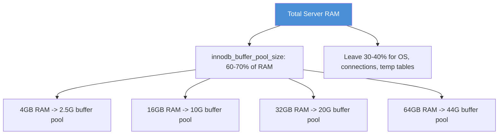

# How to Use Ansible to Configure MySQL

Author: [nawazdhandala](https://www.github.com/nawazdhandala)

Tags: Ansible, MySQL, Database Configuration, Performance Tuning

Description: Automate MySQL configuration with Ansible including my.cnf management, performance tuning, and security hardening for production workloads.

---

The default MySQL configuration is built for minimal resource usage and compatibility, not for performance. A production MySQL server with 16GB or 32GB of RAM will waste most of it unless you tune the configuration. Ansible lets you template the `my.cnf` file and push optimized settings to every server in your fleet, keeping them consistent and version-controlled.

This post covers creating an Ansible role for MySQL configuration, including InnoDB tuning, connection management, logging, and security settings.

## Role Structure

```
roles/mysql_config/
  defaults/main.yml
  tasks/main.yml
  templates/my.cnf.j2
  handlers/main.yml
```

## Default Variables

These defaults cover the most impactful MySQL settings. Override them based on your server's hardware and workload.

```yaml
# roles/mysql_config/defaults/main.yml
# Sensible defaults for MySQL configuration
---
mysql_config_file: /etc/mysql/mysql.conf.d/mysqld.cnf
mysql_socket: /var/run/mysqld/mysqld.sock
mysql_port: 3306
mysql_bind_address: "127.0.0.1"
mysql_datadir: /var/lib/mysql

# InnoDB settings (tune based on available RAM)
mysql_innodb_buffer_pool_size: "256M"
mysql_innodb_buffer_pool_instances: 1
mysql_innodb_log_file_size: "64M"
mysql_innodb_log_buffer_size: "16M"
mysql_innodb_flush_log_at_trx_commit: 1
mysql_innodb_flush_method: "O_DIRECT"
mysql_innodb_file_per_table: 1
mysql_innodb_io_capacity: 200
mysql_innodb_io_capacity_max: 2000

# Connection settings
mysql_max_connections: 151
mysql_max_connect_errors: 100000
mysql_wait_timeout: 28800
mysql_interactive_timeout: 28800
mysql_thread_cache_size: 16

# Query cache (disabled in MySQL 8.0+)
mysql_query_cache_type: 0
mysql_query_cache_size: 0

# Temp tables and sort buffers
mysql_tmp_table_size: "64M"
mysql_max_heap_table_size: "64M"
mysql_sort_buffer_size: "2M"
mysql_join_buffer_size: "2M"
mysql_read_buffer_size: "256K"
mysql_read_rnd_buffer_size: "512K"

# Logging
mysql_slow_query_log: 1
mysql_slow_query_log_file: "/var/log/mysql/mysql-slow.log"
mysql_long_query_time: 2
mysql_log_queries_not_using_indexes: 0
mysql_general_log: 0
mysql_log_error: "/var/log/mysql/error.log"

# Security
mysql_local_infile: 0
mysql_symbolic_links: 0
```

## The my.cnf Template

```ini
# roles/mysql_config/templates/my.cnf.j2
# MySQL configuration managed by Ansible
# Do not edit manually - changes will be overwritten on next playbook run

[mysqld]
# Basic Settings
user            = mysql
pid-file        = /var/run/mysqld/mysqld.pid
socket          = {{ mysql_socket }}
port            = {{ mysql_port }}
basedir         = /usr
datadir         = {{ mysql_datadir }}
bind-address    = {{ mysql_bind_address }}

# Character Set
character-set-server = utf8mb4
collation-server = utf8mb4_unicode_ci

# InnoDB Settings
innodb_buffer_pool_size = {{ mysql_innodb_buffer_pool_size }}
innodb_buffer_pool_instances = {{ mysql_innodb_buffer_pool_instances }}
innodb_log_file_size = {{ mysql_innodb_log_file_size }}
innodb_log_buffer_size = {{ mysql_innodb_log_buffer_size }}
innodb_flush_log_at_trx_commit = {{ mysql_innodb_flush_log_at_trx_commit }}
innodb_flush_method = {{ mysql_innodb_flush_method }}
innodb_file_per_table = {{ mysql_innodb_file_per_table }}
innodb_io_capacity = {{ mysql_innodb_io_capacity }}
innodb_io_capacity_max = {{ mysql_innodb_io_capacity_max }}

# Connection Settings
max_connections = {{ mysql_max_connections }}
max_connect_errors = {{ mysql_max_connect_errors }}
wait_timeout = {{ mysql_wait_timeout }}
interactive_timeout = {{ mysql_interactive_timeout }}
thread_cache_size = {{ mysql_thread_cache_size }}

# Temp Tables and Buffers
tmp_table_size = {{ mysql_tmp_table_size }}
max_heap_table_size = {{ mysql_max_heap_table_size }}
sort_buffer_size = {{ mysql_sort_buffer_size }}
join_buffer_size = {{ mysql_join_buffer_size }}
read_buffer_size = {{ mysql_read_buffer_size }}
read_rnd_buffer_size = {{ mysql_read_rnd_buffer_size }}

# Logging
slow_query_log = {{ mysql_slow_query_log }}
slow_query_log_file = {{ mysql_slow_query_log_file }}
long_query_time = {{ mysql_long_query_time }}
log_queries_not_using_indexes = {{ mysql_log_queries_not_using_indexes }}
general_log = {{ mysql_general_log }}
log_error = {{ mysql_log_error }}

# Security
local_infile = {{ mysql_local_infile }}
symbolic-links = {{ mysql_symbolic_links }}


# Additional custom settings

{{ key }} = {{ value }}



[mysqldump]
quick
quote-names
max_allowed_packet = 64M

[mysql]
default-character-set = utf8mb4
```

## Configuration Tasks

```yaml
# roles/mysql_config/tasks/main.yml
# Deploy MySQL configuration and validate before restart
---
- name: Detect MySQL config file path
  set_fact:
    _mysql_config_path: "{{ mysql_config_file }}"
    _mysql_service: "{{ 'mysql' if ansible_os_family == 'Debian' else 'mysqld' }}"

- name: Ensure log directory exists
  file:
    path: /var/log/mysql
    state: directory
    owner: mysql
    group: mysql
    mode: '0755'

- name: Deploy MySQL configuration
  template:
    src: my.cnf.j2
    dest: "{{ _mysql_config_path }}"
    owner: root
    group: root
    mode: '0644'
    backup: true
  register: mysql_config_changed
  notify: restart mysql

- name: Validate MySQL configuration syntax
  command: mysqld --validate-config
  changed_when: false
  when: mysql_config_changed.changed
```

## Handlers

```yaml
# roles/mysql_config/handlers/main.yml
# Handlers for MySQL service management
---
- name: restart mysql
  systemd:
    name: "{{ _mysql_service }}"
    state: restarted

- name: reload mysql
  systemd:
    name: "{{ _mysql_service }}"
    state: reloaded
```

## Environment-Specific Tuning

Use inventory variables to tune MySQL differently per environment.

```yaml
# inventory/production/group_vars/databases.yml
# Production MySQL tuning for servers with 32GB RAM and SSDs
---
mysql_innodb_buffer_pool_size: "20G"
mysql_innodb_buffer_pool_instances: 8
mysql_innodb_log_file_size: "1G"
mysql_innodb_log_buffer_size: "64M"
mysql_innodb_io_capacity: 2000
mysql_innodb_io_capacity_max: 4000
mysql_max_connections: 500
mysql_thread_cache_size: 64
mysql_tmp_table_size: "256M"
mysql_max_heap_table_size: "256M"
mysql_bind_address: "0.0.0.0"
```

```yaml
# inventory/staging/group_vars/databases.yml
# Staging MySQL tuning for servers with 8GB RAM
---
mysql_innodb_buffer_pool_size: "4G"
mysql_innodb_buffer_pool_instances: 4
mysql_innodb_log_file_size: "256M"
mysql_max_connections: 100
mysql_bind_address: "0.0.0.0"
```

## InnoDB Buffer Pool Tuning Guide

The `innodb_buffer_pool_size` is the single most impactful MySQL setting. Here is a rule of thumb.



## Running the Configuration

```bash
# Apply MySQL config to all database servers
ansible-playbook playbooks/configure-mysql.yml \
  -i inventory/production/

# Preview changes without applying
ansible-playbook playbooks/configure-mysql.yml \
  -i inventory/production/ \
  --check --diff
```

## Validating After Configuration

```yaml
# Verify MySQL is running with expected settings
- name: Check InnoDB buffer pool size
  community.mysql.mysql_query:
    query: "SHOW VARIABLES LIKE 'innodb_buffer_pool_size'"
    login_unix_socket: "{{ mysql_socket }}"
  register: buffer_pool

- name: Display current buffer pool size
  debug:
    msg: "InnoDB buffer pool: {{ (buffer_pool.query_result[0][0].Value | int / 1073741824) | round(1) }}GB"

- name: Check max connections
  community.mysql.mysql_query:
    query: "SHOW VARIABLES LIKE 'max_connections'"
    login_unix_socket: "{{ mysql_socket }}"
  register: max_conn

- name: Display max connections
  debug:
    msg: "Max connections: {{ max_conn.query_result[0][0].Value }}"

- name: Check slow query log status
  community.mysql.mysql_query:
    query: "SHOW VARIABLES LIKE 'slow_query_log'"
    login_unix_socket: "{{ mysql_socket }}"
  register: slow_log

- name: Confirm slow query log is enabled
  assert:
    that:
      - slow_log.query_result[0][0].Value == "ON"
    fail_msg: "Slow query log is not enabled"
```

## Conclusion

MySQL configuration management with Ansible ensures every server in your fleet runs with the same optimized settings. The template approach gives you full control over the configuration file while keeping it parameterized for different environments and hardware specs. Always use `--check --diff` before applying changes to production, validate the configuration syntax before restarting, and verify the settings took effect afterward. This disciplined approach prevents the configuration drift that causes mysterious performance problems across a growing fleet.
