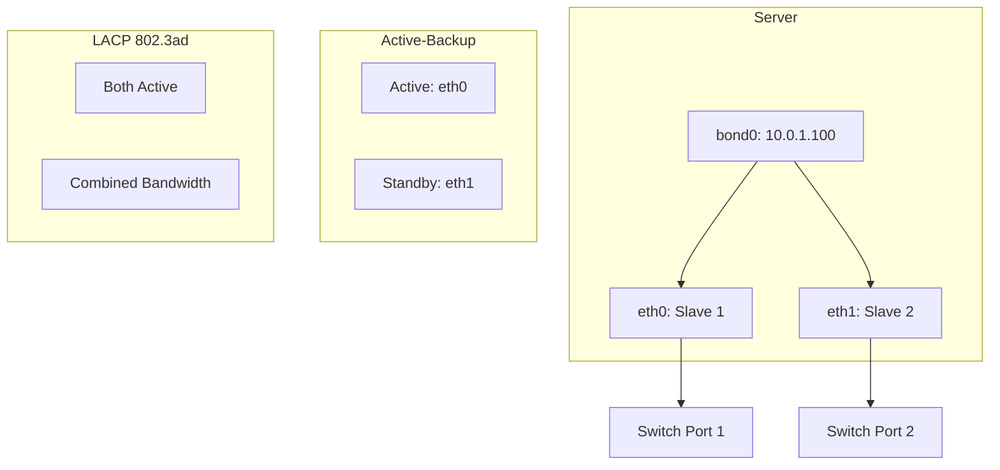

# How to Use Ansible to Configure Network Bonding

Author: [nawazdhandala](https://www.github.com/nawazdhandala)

Tags: Ansible, Network Bonding, Linux, Networking, High Availability

Description: Automate Linux network bonding configuration using Ansible for link aggregation, failover, and increased bandwidth across your server infrastructure.

---

Network bonding (also called NIC bonding or link aggregation) combines multiple network interfaces into a single logical interface. This gives you either redundancy (if one link fails, traffic continues on the other) or increased bandwidth (traffic is spread across multiple links). For production servers, bonding is not optional; it is a requirement for high availability. Ansible makes bonding configuration consistent and reproducible across your fleet.

## Bonding Modes Explained

Linux supports seven bonding modes, but most people use one of three:

- **Mode 0 (balance-rr)**: Round-robin across all interfaces. Good for bandwidth but can cause out-of-order packet delivery.
- **Mode 1 (active-backup)**: Only one interface is active. If it fails, another takes over. Simplest and most reliable.
- **Mode 4 (802.3ad / LACP)**: Uses Link Aggregation Control Protocol. Requires switch support but gives both redundancy and bandwidth.

For most production setups, Mode 1 (active-backup) is the safest choice if your switches do not support LACP. Mode 4 is ideal when your switches support it.

## Prerequisites

Before configuring bonding, the `bonding` kernel module needs to be available and the necessary tools installed.

This playbook ensures bonding prerequisites are met:

```yaml
# configure-network-bonding.yml - Set up network bonding
---
- name: Configure Network Bonding
  hosts: all
  become: true
  vars:
    bond_name: bond0
    bond_mode: 802.3ad
    bond_miimon: 100
    bond_lacp_rate: fast
    bond_xmit_hash_policy: layer3+4
    bond_slaves:
      - eth0
      - eth1
    bond_ip: "10.0.1.100"
    bond_netmask: "255.255.255.0"
    bond_gateway: "10.0.1.1"
    bond_dns:
      - "10.0.0.2"
      - "10.0.0.3"

  tasks:
    - name: Install bonding prerequisites
      ansible.builtin.apt:
        name:
          - ifenslave
          - net-tools
        state: present
        update_cache: true
      when: ansible_os_family == "Debian"

    - name: Load bonding kernel module
      community.general.modprobe:
        name: bonding
        state: present

    - name: Persist bonding module
      ansible.builtin.copy:
        dest: /etc/modules-load.d/bonding.conf
        mode: '0644'
        content: "bonding\n"
```

## Configuring Bonding with Netplan (Ubuntu 18.04+)

Modern Ubuntu uses Netplan for network configuration.

This playbook configures network bonding through Netplan:

```yaml
    - name: Deploy Netplan bonding configuration
      ansible.builtin.copy:
        dest: /etc/netplan/01-bonding.yaml
        mode: '0600'
        content: |
          # Network bonding configuration - managed by Ansible
          network:
            version: 2
            renderer: networkd
            ethernets:
              {{ bond_slaves[0] }}:
                dhcp4: false
                dhcp6: false
              {{ bond_slaves[1] }}:
                dhcp4: false
                dhcp6: false
            bonds:
              {{ bond_name }}:
                interfaces:
                  
                  - {{ slave }}
                  
                addresses:
                  - {{ bond_ip }}/{{ bond_netmask | ansible.utils.ipaddr('prefix') | default('24') }}
                routes:
                  - to: default
                    via: {{ bond_gateway }}
                nameservers:
                  addresses:
                    
                    - {{ dns }}
                    
                parameters:
                  mode: {{ bond_mode }}
                  mii-monitor-interval: {{ bond_miimon }}
                  lacp-rate: {{ bond_lacp_rate }}
                  transmit-hash-policy: {{ bond_xmit_hash_policy }}
      notify: Apply Netplan
      when: ansible_os_family == "Debian"

  handlers:
    - name: Apply Netplan
      ansible.builtin.command: netplan apply
```

## Configuring Bonding with NetworkManager (RHEL/CentOS)

RHEL-based systems use NetworkManager. Here is how to configure bonding with `nmcli`.

This playbook configures bonding using NetworkManager:

```yaml
# configure-bonding-nmcli.yml - Bonding with NetworkManager
---
- name: Configure Network Bonding with nmcli
  hosts: rhel_servers
  become: true
  vars:
    bond_name: bond0
    bond_mode: 802.3ad
    bond_miimon: 100
    bond_slaves:
      - ens3
      - ens4
    bond_ip: "10.0.1.100/24"
    bond_gateway: "10.0.1.1"
    bond_dns: "10.0.0.2"

  tasks:
    - name: Create bond interface
      community.general.nmcli:
        conn_name: "{{ bond_name }}"
        type: bond
        ip4: "{{ bond_ip }}"
        gw4: "{{ bond_gateway }}"
        dns4: "{{ bond_dns }}"
        mode: "{{ bond_mode }}"
        state: present
        autoconnect: true

    - name: Add slave interfaces to bond
      community.general.nmcli:
        conn_name: "bond-slave-{{ item }}"
        ifname: "{{ item }}"
        type: bond-slave
        master: "{{ bond_name }}"
        state: present
        autoconnect: true
      loop: "{{ bond_slaves }}"

    - name: Set bonding parameters
      ansible.builtin.command: >
        nmcli connection modify {{ bond_name }}
        bond.options "mode={{ bond_mode }},miimon={{ bond_miimon }},lacp_rate=fast,xmit_hash_policy=layer3+4"
      changed_when: true

    - name: Bring up the bond interface
      ansible.builtin.command: "nmcli connection up {{ bond_name }}"
      changed_when: true
      failed_when: false
```

## Configuring Bonding with ifupdown (Older Debian/Ubuntu)

For older systems still using /etc/network/interfaces:

```yaml
# configure-bonding-ifupdown.yml - Traditional bonding config
---
- name: Configure Bonding with ifupdown
  hosts: legacy_servers
  become: true
  vars:
    bond_name: bond0
    bond_slaves:
      - eth0
      - eth1
    bond_mode: "active-backup"
    bond_primary: eth0
    bond_ip: "10.0.1.100"
    bond_netmask: "255.255.255.0"
    bond_gateway: "10.0.1.1"

  tasks:
    - name: Deploy network interfaces configuration
      ansible.builtin.copy:
        dest: /etc/network/interfaces
        mode: '0644'
        backup: true
        content: |
          # Network interfaces - managed by Ansible
          # Loopback
          auto lo
          iface lo inet loopback

          # Slave interface 1
          auto {{ bond_slaves[0] }}
          iface {{ bond_slaves[0] }} inet manual
              bond-master {{ bond_name }}

          # Slave interface 2
          auto {{ bond_slaves[1] }}
          iface {{ bond_slaves[1] }} inet manual
              bond-master {{ bond_name }}

          # Bond interface
          auto {{ bond_name }}
          iface {{ bond_name }} inet static
              address {{ bond_ip }}
              netmask {{ bond_netmask }}
              gateway {{ bond_gateway }}
              dns-nameservers 10.0.0.2 10.0.0.3
              bond-slaves none
              bond-mode {{ bond_mode }}
              bond-miimon 100
              bond-primary {{ bond_primary }}
              bond-downdelay 200
              bond-updelay 200
      notify: Restart networking

  handlers:
    - name: Restart networking
      ansible.builtin.systemd:
        name: networking
        state: restarted
```

## Active-Backup Bonding for Simple Failover

If you just need failover without LACP (the simplest and safest option):

```yaml
# configure-active-backup.yml - Simple failover bonding
---
- name: Configure Active-Backup Bonding
  hosts: all
  become: true
  vars:
    bond_name: bond0
    bond_slaves:
      - eth0
      - eth1
    bond_primary: eth0

  tasks:
    - name: Configure bonding module parameters
      ansible.builtin.copy:
        dest: /etc/modprobe.d/bonding.conf
        mode: '0644'
        content: |
          # Bonding module options - managed by Ansible
          options bonding mode=active-backup miimon=100 primary={{ bond_primary }} fail_over_mac=active

    - name: Load bonding module with parameters
      community.general.modprobe:
        name: bonding
        state: present
```

## Verifying Bond Configuration

After setting up bonding, verify it is working correctly.

This playbook checks bond status and reports issues:

```yaml
# verify-bonding.yml - Check bond status
---
- name: Verify Network Bonding
  hosts: all
  become: true
  tasks:
    - name: Check if bond interface exists
      ansible.builtin.stat:
        path: "/proc/net/bonding/bond0"
      register: bond_proc

    - name: Read bond status
      ansible.builtin.command: cat /proc/net/bonding/bond0
      register: bond_status
      changed_when: false
      when: bond_proc.stat.exists

    - name: Display bond status
      ansible.builtin.debug:
        msg: "{{ bond_status.stdout_lines }}"
      when: bond_proc.stat.exists

    - name: Check slave interface status
      ansible.builtin.shell: |
        cat /proc/net/bonding/bond0 | grep -A1 "Slave Interface"
      register: slave_status
      changed_when: false
      when: bond_proc.stat.exists

    - name: Verify all slaves are up
      ansible.builtin.shell: |
        grep -c "MII Status: up" /proc/net/bonding/bond0
      register: up_count
      changed_when: false
      when: bond_proc.stat.exists

    - name: Alert if not all slaves are up
      ansible.builtin.debug:
        msg: "WARNING: Only {{ up_count.stdout }} interfaces are up on {{ inventory_hostname }}"
      when:
        - bond_proc.stat.exists
        - up_count.stdout | int < 2

    - name: Check bond throughput with ethtool
      ansible.builtin.command: "ethtool bond0"
      register: ethtool_output
      changed_when: false
      failed_when: false

    - name: Display bond link speed
      ansible.builtin.debug:
        msg: "{{ ethtool_output.stdout_lines | select('search', 'Speed') | list }}"
      when: ethtool_output.rc == 0
```

## Bonding Architecture



## Monitoring Bond Health

This playbook sets up ongoing bond monitoring:

```yaml
# monitor-bonding.yml - Continuous bond health checks
---
- name: Monitor Bond Health
  hosts: all
  become: true
  tasks:
    - name: Create bond monitoring script
      ansible.builtin.copy:
        dest: /usr/local/bin/check-bond.sh
        mode: '0755'
        content: |
          #!/bin/bash
          # Bond health check - managed by Ansible
          BOND="bond0"
          EXPECTED_SLAVES=2

          if [ ! -f "/proc/net/bonding/$BOND" ]; then
            echo "CRITICAL: Bond $BOND does not exist"
            exit 2
          fi

          UP_COUNT=$(grep -c "MII Status: up" /proc/net/bonding/$BOND)
          TOTAL_SLAVES=$(grep -c "Slave Interface" /proc/net/bonding/$BOND)

          if [ "$UP_COUNT" -lt "$EXPECTED_SLAVES" ]; then
            echo "WARNING: Bond $BOND has $UP_COUNT/$TOTAL_SLAVES slaves up"
            exit 1
          fi

          echo "OK: Bond $BOND has $UP_COUNT/$TOTAL_SLAVES slaves up"
          exit 0

    - name: Schedule bond health check via cron
      ansible.builtin.cron:
        name: "Check bond health"
        minute: "*/5"
        job: "/usr/local/bin/check-bond.sh >> /var/log/bond-health.log 2>&1"
```

## Troubleshooting

**Bond not coming up after reboot**: Check that the bonding module is loaded (`lsmod | grep bonding`) and that the network configuration persists. Netplan requires `netplan apply` to write the final configuration.

**Only one slave active in LACP mode**: Verify your switch is configured for LACP on the corresponding ports. Without switch-side LACP configuration, Mode 4 will not work.

**Intermittent connectivity**: Check `miimon` interval. If set too high, failover is slow. 100ms is a good default. Also check that both cables are connected to the same switch (for active-backup) or to an LACP-capable switch pair (for 802.3ad).

Network bonding is a critical piece of server infrastructure that Ansible manages beautifully. Define your bonding configuration in code, push it consistently, and know that every server has the redundancy it needs.
