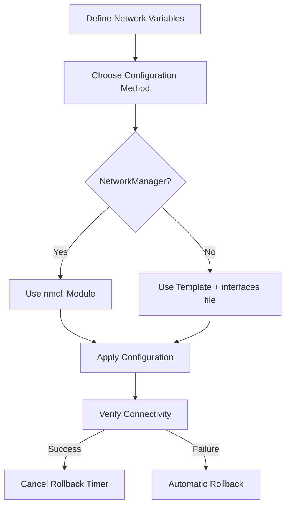

# How to Use Ansible to Configure Network Interfaces

Author: [nawazdhandala](https://www.github.com/nawazdhandala)

Tags: Ansible, Networking, Linux, DevOps, Infrastructure

Description: Learn how to use Ansible to configure network interfaces on Linux servers, including static IPs, DHCP, DNS, and multi-interface setups.

---

Managing network interfaces across a fleet of servers by hand is painful and error-prone. One typo in a config file and you lose connectivity to the machine. Ansible lets you define network configurations as code, apply them consistently, and roll them out across hundreds of nodes at once. In this post, I will walk through practical examples of configuring network interfaces using Ansible.

## Prerequisites

Before diving in, make sure you have:

- Ansible 2.9 or later installed on your control node
- SSH access to target hosts
- Root or sudo privileges on target hosts
- A basic understanding of Linux networking concepts (IP addresses, subnets, gateways)

## Understanding Network Configuration on Linux

Linux systems typically manage network interfaces through one of several backends: NetworkManager (common on RHEL/CentOS/Fedora), systemd-networkd (common on Ubuntu Server), or plain ifupdown config files. Ansible has modules that work with each of these, but the most versatile approach uses the `nmcli` module for NetworkManager or template-based approaches for other systems.

## Using the nmcli Module

The `ansible.builtin.nmcli` module is the go-to choice for systems running NetworkManager. It wraps the `nmcli` command-line tool and lets you manage connections declaratively.

Here is a playbook that configures a static IP address on an Ethernet interface:

```yaml
# configure_static_ip.yml - Sets a static IP on eth0 using NetworkManager
---
- name: Configure network interfaces
  hosts: webservers
  become: true
  tasks:
    - name: Configure eth0 with static IP
      community.general.nmcli:
        conn_name: eth0-static
        ifname: eth0
        type: ethernet
        ip4: 192.168.1.100/24
        gw4: 192.168.1.1
        dns4:
          - 8.8.8.8
          - 8.8.4.4
        dns4_search:
          - example.com
        state: present
        autoconnect: true

    - name: Bring up the connection
      community.general.nmcli:
        conn_name: eth0-static
        state: present
        autoconnect: true
```

If your servers use DHCP instead, the configuration is simpler:

```yaml
# configure_dhcp.yml - Sets eth0 to use DHCP
---
- name: Configure DHCP on network interface
  hosts: all
  become: true
  tasks:
    - name: Configure eth0 with DHCP
      community.general.nmcli:
        conn_name: eth0-dhcp
        ifname: eth0
        type: ethernet
        method4: auto
        state: present
        autoconnect: true
```

## Configuring Multiple Interfaces

Production servers often have multiple NICs. You might have one for public traffic, another for a private backend network, and a third for management. Using Ansible variables makes this clean:

```yaml
# multi_interface.yml - Configure multiple network interfaces from variables
---
- name: Configure multiple network interfaces
  hosts: database_servers
  become: true
  vars:
    network_interfaces:
      - conn_name: public
        ifname: eth0
        ip4: "{{ public_ip }}/24"
        gw4: "{{ public_gateway }}"
        dns4:
          - 8.8.8.8
        autoconnect: true
      - conn_name: private-backend
        ifname: eth1
        ip4: "{{ private_ip }}/16"
        gw4: ""
        dns4: []
        autoconnect: true
      - conn_name: management
        ifname: eth2
        ip4: "{{ mgmt_ip }}/24"
        gw4: ""
        dns4: []
        autoconnect: true
  tasks:
    - name: Configure each network interface
      community.general.nmcli:
        conn_name: "{{ item.conn_name }}"
        ifname: "{{ item.ifname }}"
        type: ethernet
        ip4: "{{ item.ip4 }}"
        gw4: "{{ item.gw4 | default(omit) }}"
        dns4: "{{ item.dns4 | default(omit) }}"
        state: present
        autoconnect: "{{ item.autoconnect }}"
      loop: "{{ network_interfaces }}"
```

The corresponding host_vars file for a specific server might look like this:

```yaml
# host_vars/db01.yml - Per-host network configuration
public_ip: 203.0.113.10
public_gateway: 203.0.113.1
private_ip: 10.0.1.10
mgmt_ip: 172.16.0.10
```

## Template-Based Approach for Non-NetworkManager Systems

Some minimal server installations do not run NetworkManager. For Debian/Ubuntu systems using `/etc/network/interfaces`, you can use a Jinja2 template:

```yaml
# configure_interfaces_template.yml - Template-based network config for Debian
---
- name: Configure network via interfaces file
  hosts: debian_servers
  become: true
  vars:
    primary_interface: eth0
    ip_address: 192.168.1.50
    netmask: 255.255.255.0
    gateway: 192.168.1.1
    dns_servers:
      - 8.8.8.8
      - 1.1.1.1
  tasks:
    - name: Deploy network interfaces configuration
      ansible.builtin.template:
        src: templates/interfaces.j2
        dest: /etc/network/interfaces
        owner: root
        group: root
        mode: '0644'
        backup: true
      notify: Restart networking

  handlers:
    - name: Restart networking
      ansible.builtin.service:
        name: networking
        state: restarted
```

The corresponding Jinja2 template:

```jinja2
# templates/interfaces.j2 - Network interfaces configuration
# Managed by Ansible - do not edit manually
auto lo
iface lo inet loopback

auto {{ primary_interface }}
iface {{ primary_interface }} inet static
    address {{ ip_address }}
    netmask {{ netmask }}
    gateway {{ gateway }}

    dns-nameserver {{ dns }}

```

## Configuring DNS Resolution

Beyond interface-level DNS settings, you may want to manage `/etc/resolv.conf` directly. This is especially useful when you run your own internal DNS servers:

```yaml
# configure_resolv.yml - Manage DNS resolver configuration
---
- name: Configure DNS resolution
  hosts: all
  become: true
  vars:
    dns_nameservers:
      - 10.0.0.2
      - 10.0.0.3
    dns_search_domains:
      - internal.example.com
      - example.com
  tasks:
    - name: Configure resolv.conf
      ansible.builtin.template:
        src: templates/resolv.conf.j2
        dest: /etc/resolv.conf
        owner: root
        group: root
        mode: '0644'

    - name: Prevent resolv.conf from being overwritten by DHCP
      ansible.builtin.lineinfile:
        path: /etc/dhcp/dhclient.conf
        line: 'supersede domain-name-servers {{ dns_nameservers | join(", ") }};'
        create: true
        mode: '0644'
```

## Verifying Network Configuration

After applying changes, you should verify them. Here is a task that gathers and displays the resulting network state:

```yaml
# verify_network.yml - Verify network interface configuration
---
- name: Verify network configuration
  hosts: all
  become: true
  tasks:
    - name: Get IP address information
      ansible.builtin.command: ip addr show
      register: ip_info
      changed_when: false

    - name: Display current IP configuration
      ansible.builtin.debug:
        var: ip_info.stdout_lines

    - name: Check default route
      ansible.builtin.command: ip route show default
      register: route_info
      changed_when: false

    - name: Display default route
      ansible.builtin.debug:
        var: route_info.stdout_lines

    - name: Verify DNS resolution works
      ansible.builtin.command: nslookup google.com
      register: dns_check
      changed_when: false
      failed_when: dns_check.rc != 0

    - name: Display DNS check result
      ansible.builtin.debug:
        msg: "DNS resolution is working correctly"
```

## Handling Network Restarts Safely

One real concern with network configuration changes is losing connectivity to the host you are configuring. If Ansible pushes a bad config and restarts networking, you may lock yourself out. A good safety pattern is to use `at` to schedule a rollback:

```yaml
# safe_network_change.yml - Apply network changes with automatic rollback
---
- name: Safely apply network changes
  hosts: all
  become: true
  tasks:
    - name: Backup current network config
      ansible.builtin.copy:
        src: /etc/network/interfaces
        dest: /etc/network/interfaces.backup
        remote_src: true
        mode: '0644'

    - name: Schedule automatic rollback in 5 minutes
      ansible.builtin.command: >
        at now + 5 minutes -f /usr/local/bin/network-rollback.sh
      changed_when: true

    - name: Apply new network configuration
      ansible.builtin.template:
        src: templates/interfaces.j2
        dest: /etc/network/interfaces
        mode: '0644'
      notify: Restart networking

    - name: Wait for network to come back
      ansible.builtin.wait_for_connection:
        delay: 5
        timeout: 60

    - name: Cancel the rollback since we are still connected
      ansible.builtin.command: atrm $(atq | awk '{print $1}')
      changed_when: true

  handlers:
    - name: Restart networking
      ansible.builtin.service:
        name: networking
        state: restarted
```

## Workflow Overview

Here is the overall workflow for network configuration management with Ansible:



## Tips for Production Use

First, always use `backup: true` when modifying config files so Ansible creates a timestamped backup. Second, test changes on a single host before rolling out to the entire fleet by using `--limit` or serial execution. Third, keep network variables in host_vars or group_vars so each server gets its correct configuration. Finally, consider using Ansible's `wait_for_connection` module after network changes to confirm the host is still reachable before continuing with the rest of your playbook.

Network configuration is one of those areas where automation pays off quickly. Once you have your playbooks and templates dialed in, provisioning a new server's network stack takes seconds instead of minutes, and you eliminate the risk of fat-fingering an IP address at 2 AM.
