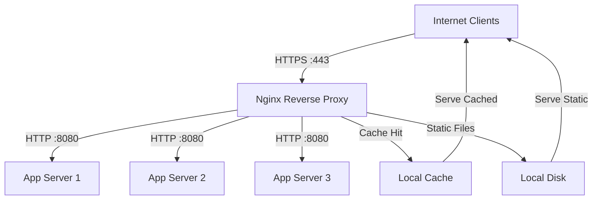

# How to Use Ansible to Configure Nginx Reverse Proxy

Author: [nawazdhandala](https://www.github.com/nawazdhandala)

Tags: Ansible, Nginx, Reverse Proxy, Load Balancing, DevOps

Description: Learn how to configure Nginx as a reverse proxy using Ansible with upstream backends, SSL termination, caching, and WebSocket support.

---

Nginx is a popular choice for reverse proxying because it is fast, lightweight, and handles a massive number of concurrent connections. Whether you are putting Nginx in front of a Node.js application, a Python API, or a cluster of backend servers, Ansible makes the setup repeatable and consistent. This post covers the common reverse proxy patterns you will encounter in production.

## Prerequisites

- Ansible 2.9+ on your control node
- Ubuntu/Debian or RHEL/CentOS target hosts
- Root or sudo access
- Backend application servers running behind the proxy

## Installing Nginx

First, install Nginx from the official repository for the latest stable version:

```yaml
# install_nginx.yml - Install Nginx from official repo
---
- name: Install Nginx
  hosts: proxy_servers
  become: true
  tasks:
    - name: Install Nginx on Debian/Ubuntu
      ansible.builtin.apt:
        name: nginx
        state: present
        update_cache: true
      when: ansible_os_family == "Debian"

    - name: Install Nginx on RHEL/CentOS
      ansible.builtin.yum:
        name: nginx
        state: present
      when: ansible_os_family == "RedHat"

    - name: Start and enable Nginx
      ansible.builtin.service:
        name: nginx
        state: started
        enabled: true
```

## Basic Reverse Proxy Configuration

The simplest reverse proxy setup forwards all traffic to a single backend:

```yaml
# basic_reverse_proxy.yml - Configure basic Nginx reverse proxy
---
- name: Configure Nginx reverse proxy
  hosts: proxy_servers
  become: true
  vars:
    server_name: api.example.com
    backend_server: 10.0.1.20
    backend_port: 3000
  tasks:
    - name: Remove default Nginx site
      ansible.builtin.file:
        path: /etc/nginx/sites-enabled/default
        state: absent
      notify: Reload Nginx

    - name: Deploy reverse proxy configuration
      ansible.builtin.template:
        src: templates/reverse-proxy.conf.j2
        dest: /etc/nginx/sites-available/{{ server_name }}.conf
        owner: root
        group: root
        mode: '0644'
      notify: Reload Nginx

    - name: Enable site
      ansible.builtin.file:
        src: /etc/nginx/sites-available/{{ server_name }}.conf
        dest: /etc/nginx/sites-enabled/{{ server_name }}.conf
        state: link
      notify: Reload Nginx

  handlers:
    - name: Reload Nginx
      ansible.builtin.service:
        name: nginx
        state: reloaded
```

The reverse proxy template:

```jinja2
# templates/reverse-proxy.conf.j2 - Basic Nginx reverse proxy
# Managed by Ansible - do not edit manually

server {
    listen 80;
    server_name {{ server_name }};

    location / {
        proxy_pass http://{{ backend_server }}:{{ backend_port }};
        proxy_set_header Host $host;
        proxy_set_header X-Real-IP $remote_addr;
        proxy_set_header X-Forwarded-For $proxy_add_x_forwarded_for;
        proxy_set_header X-Forwarded-Proto $scheme;

        # Timeouts
        proxy_connect_timeout 60s;
        proxy_send_timeout 60s;
        proxy_read_timeout 60s;
    }
}
```

## Upstream Load Balancing

When you have multiple backend servers, Nginx can distribute traffic across them:

```yaml
# upstream_proxy.yml - Configure Nginx with upstream load balancing
---
- name: Configure Nginx upstream proxy
  hosts: proxy_servers
  become: true
  vars:
    server_name: app.example.com
    upstream_name: app_backends
    backend_servers:
      - { address: 10.0.1.10, port: 8080, weight: 3 }
      - { address: 10.0.1.11, port: 8080, weight: 2 }
      - { address: 10.0.1.12, port: 8080, weight: 1 }
    load_balance_method: least_conn
  tasks:
    - name: Deploy upstream proxy configuration
      ansible.builtin.template:
        src: templates/upstream-proxy.conf.j2
        dest: /etc/nginx/sites-available/{{ server_name }}.conf
        mode: '0644'
      notify: Reload Nginx

    - name: Enable site
      ansible.builtin.file:
        src: /etc/nginx/sites-available/{{ server_name }}.conf
        dest: /etc/nginx/sites-enabled/{{ server_name }}.conf
        state: link
      notify: Reload Nginx

  handlers:
    - name: Reload Nginx
      ansible.builtin.service:
        name: nginx
        state: reloaded
```

```jinja2
# templates/upstream-proxy.conf.j2 - Nginx upstream load balancing
# Managed by Ansible

upstream {{ upstream_name }} {
    {{ load_balance_method }};

    server {{ server.address }}:{{ server.port }} weight={{ server.weight }};


    # Keep connections alive to backends
    keepalive 32;
}

server {
    listen 80;
    server_name {{ server_name }};

    location / {
        proxy_pass http://{{ upstream_name }};
        proxy_set_header Host $host;
        proxy_set_header X-Real-IP $remote_addr;
        proxy_set_header X-Forwarded-For $proxy_add_x_forwarded_for;
        proxy_set_header X-Forwarded-Proto $scheme;

        # Use HTTP/1.1 for keepalive connections to upstream
        proxy_http_version 1.1;
        proxy_set_header Connection "";
    }

    # Health check endpoint
    location /nginx-health {
        access_log off;
        return 200 "healthy\n";
        add_header Content-Type text/plain;
    }
}
```

## SSL Termination with Reverse Proxy

Add SSL termination to handle HTTPS at the proxy layer:

```yaml
# ssl_reverse_proxy.yml - Configure Nginx SSL reverse proxy
---
- name: Configure Nginx SSL reverse proxy
  hosts: proxy_servers
  become: true
  vars:
    server_name: secure.example.com
    ssl_cert: /etc/nginx/ssl/{{ server_name }}.crt
    ssl_key: /etc/nginx/ssl/{{ server_name }}.key
    backend_server: 10.0.1.20
    backend_port: 3000
  tasks:
    - name: Create SSL directory
      ansible.builtin.file:
        path: /etc/nginx/ssl
        state: directory
        mode: '0700'

    - name: Deploy SSL certificate
      ansible.builtin.copy:
        src: "files/certs/{{ server_name }}.crt"
        dest: "{{ ssl_cert }}"
        mode: '0644'
      notify: Reload Nginx

    - name: Deploy SSL key
      ansible.builtin.copy:
        src: "files/certs/{{ server_name }}.key"
        dest: "{{ ssl_key }}"
        mode: '0600'
      notify: Reload Nginx

    - name: Deploy SSL proxy configuration
      ansible.builtin.template:
        src: templates/ssl-reverse-proxy.conf.j2
        dest: /etc/nginx/sites-available/{{ server_name }}.conf
        mode: '0644'
      notify: Reload Nginx

    - name: Enable site
      ansible.builtin.file:
        src: /etc/nginx/sites-available/{{ server_name }}.conf
        dest: /etc/nginx/sites-enabled/{{ server_name }}.conf
        state: link
      notify: Reload Nginx

  handlers:
    - name: Reload Nginx
      ansible.builtin.service:
        name: nginx
        state: reloaded
```

```jinja2
# templates/ssl-reverse-proxy.conf.j2 - Nginx SSL reverse proxy
# Managed by Ansible

# Redirect HTTP to HTTPS
server {
    listen 80;
    server_name {{ server_name }};
    return 301 https://$host$request_uri;
}

server {
    listen 443 ssl http2;
    server_name {{ server_name }};

    ssl_certificate {{ ssl_cert }};
    ssl_certificate_key {{ ssl_key }};
    ssl_protocols TLSv1.2 TLSv1.3;
    ssl_ciphers HIGH:!aNULL:!MD5;
    ssl_prefer_server_ciphers on;
    ssl_session_cache shared:SSL:10m;
    ssl_session_timeout 10m;

    # Security headers
    add_header Strict-Transport-Security "max-age=31536000; includeSubDomains" always;
    add_header X-Frame-Options DENY always;
    add_header X-Content-Type-Options nosniff always;

    location / {
        proxy_pass http://{{ backend_server }}:{{ backend_port }};
        proxy_set_header Host $host;
        proxy_set_header X-Real-IP $remote_addr;
        proxy_set_header X-Forwarded-For $proxy_add_x_forwarded_for;
        proxy_set_header X-Forwarded-Proto https;
    }
}
```

## WebSocket Proxy Support

Many modern applications use WebSockets. Here is how to configure Nginx to proxy WebSocket connections:

```yaml
# websocket_proxy.yml - Configure Nginx for WebSocket proxying
---
- name: Configure Nginx WebSocket proxy
  hosts: proxy_servers
  become: true
  vars:
    server_name: ws.example.com
    backend_server: 10.0.1.20
    backend_port: 3000
  tasks:
    - name: Deploy WebSocket proxy configuration
      ansible.builtin.template:
        src: templates/websocket-proxy.conf.j2
        dest: /etc/nginx/sites-available/{{ server_name }}.conf
        mode: '0644'
      notify: Reload Nginx

    - name: Enable site
      ansible.builtin.file:
        src: /etc/nginx/sites-available/{{ server_name }}.conf
        dest: /etc/nginx/sites-enabled/{{ server_name }}.conf
        state: link
      notify: Reload Nginx

  handlers:
    - name: Reload Nginx
      ansible.builtin.service:
        name: nginx
        state: reloaded
```

```jinja2
# templates/websocket-proxy.conf.j2 - WebSocket reverse proxy
# Managed by Ansible

map $http_upgrade $connection_upgrade {
    default upgrade;
    ''      close;
}

server {
    listen 80;
    server_name {{ server_name }};

    location / {
        proxy_pass http://{{ backend_server }}:{{ backend_port }};
        proxy_http_version 1.1;
        proxy_set_header Upgrade $http_upgrade;
        proxy_set_header Connection $connection_upgrade;
        proxy_set_header Host $host;
        proxy_set_header X-Real-IP $remote_addr;
        proxy_set_header X-Forwarded-For $proxy_add_x_forwarded_for;

        # Increase timeouts for long-lived WebSocket connections
        proxy_read_timeout 86400s;
        proxy_send_timeout 86400s;
    }
}
```

## Caching Proxy

Nginx can cache backend responses to reduce load:

```yaml
# caching_proxy.yml - Configure Nginx caching reverse proxy
---
- name: Configure Nginx caching proxy
  hosts: proxy_servers
  become: true
  vars:
    cache_path: /var/cache/nginx
    cache_size: 1g
    cache_inactive: 60m
  tasks:
    - name: Create cache directory
      ansible.builtin.file:
        path: "{{ cache_path }}"
        state: directory
        owner: www-data
        group: www-data
        mode: '0755'

    - name: Deploy caching configuration
      ansible.builtin.template:
        src: templates/caching-proxy.conf.j2
        dest: /etc/nginx/conf.d/caching.conf
        mode: '0644'
      notify: Reload Nginx

  handlers:
    - name: Reload Nginx
      ansible.builtin.service:
        name: nginx
        state: reloaded
```

```jinja2
# templates/caching-proxy.conf.j2 - Caching configuration
# Managed by Ansible

proxy_cache_path {{ cache_path }} levels=1:2
    keys_zone=app_cache:10m
    max_size={{ cache_size }}
    inactive={{ cache_inactive }}
    use_temp_path=off;

server {
    listen 80;
    server_name cache.example.com;

    location / {
        proxy_pass http://10.0.1.20:3000;
        proxy_cache app_cache;
        proxy_cache_valid 200 10m;
        proxy_cache_valid 404 1m;
        proxy_cache_use_stale error timeout updating http_500 http_502 http_503;
        add_header X-Cache-Status $upstream_cache_status;

        proxy_set_header Host $host;
        proxy_set_header X-Real-IP $remote_addr;
    }

    # Bypass cache for specific paths
    location /api/ {
        proxy_pass http://10.0.1.20:3000;
        proxy_cache off;
        proxy_set_header Host $host;
        proxy_set_header X-Real-IP $remote_addr;
    }
}
```

## Reverse Proxy Architecture



## Configuration Validation

Always validate your Nginx configuration before applying it:

```yaml
# validate_nginx.yml - Validate and test Nginx configuration
---
- name: Validate Nginx configuration
  hosts: proxy_servers
  become: true
  tasks:
    - name: Test Nginx configuration syntax
      ansible.builtin.command: nginx -t
      register: nginx_test
      changed_when: false

    - name: Show test result
      ansible.builtin.debug:
        var: nginx_test.stderr_lines

    - name: Test backend connectivity
      ansible.builtin.uri:
        url: "http://localhost"
        follow_redirects: none
        status_code: [200, 301, 302]
      register: proxy_test
      ignore_errors: true

    - name: Show proxy test result
      ansible.builtin.debug:
        msg: "Proxy responded with status: {{ proxy_test.status }}"
      when: proxy_test is not failed
```

Nginx as a reverse proxy is a battle-tested pattern used by companies of every size. With Ansible managing the configuration, you get consistent deployments, easy rollbacks (thanks to template versioning in your playbook repo), and the ability to update backend server lists across all your proxy instances with a single command.
