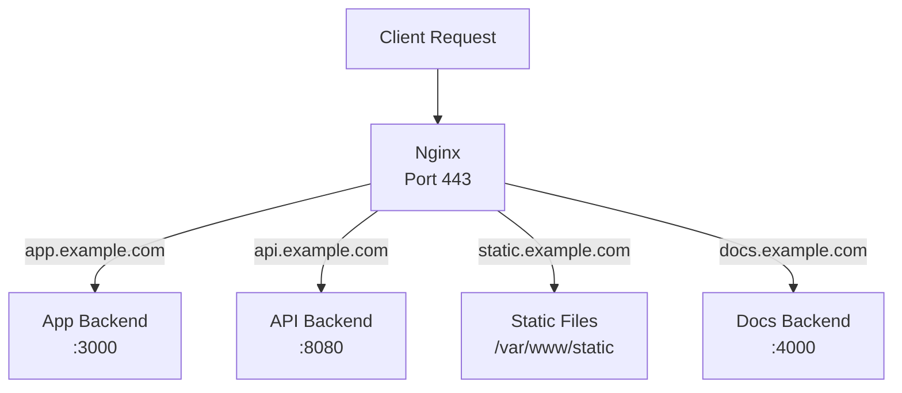
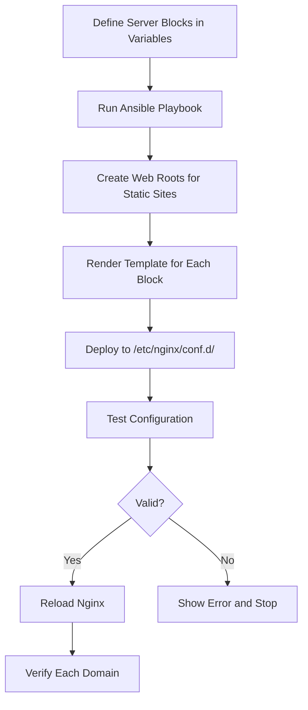

# How to Use Ansible to Configure Nginx Server Blocks

Author: [nawazdhandala](https://www.github.com/nawazdhandala)

Tags: Ansible, Nginx, Virtual Hosts, Web Server Configuration

Description: Learn how to manage multiple Nginx server blocks for different websites and applications using Ansible templates and variables.

---

A single Nginx instance can serve dozens of different websites and applications through server blocks (what Apache calls virtual hosts). Each server block listens for requests to a specific domain name and routes them accordingly. Managing server blocks by hand works for one or two sites, but when you are running a fleet of web servers serving multiple applications, Ansible keeps everything consistent and auditable.

This guide covers managing Nginx server blocks with Ansible, including templates for static sites, reverse proxies, and load-balanced applications.

## Server Block Architecture



## Defining Server Blocks as Variables

The key to managing multiple server blocks with Ansible is defining them as a list of variables. Each entry describes one server block with all its settings.

```yaml
# group_vars/webservers.yml
---
nginx_server_blocks:
  - name: webapp
    domain: app.example.com
    type: reverse_proxy
    backend: "http://10.0.1.20:3000"
    ssl: true
    ssl_cert: /etc/letsencrypt/live/app.example.com/fullchain.pem
    ssl_key: /etc/letsencrypt/live/app.example.com/privkey.pem
    client_max_body_size: "50m"
    rate_limit_zone: api
    extra_locations:
      - path: /api/v1
        backend: "http://10.0.1.25:8080"
      - path: /ws
        backend: "http://10.0.1.20:3000"
        websocket: true

  - name: static-site
    domain: static.example.com
    type: static
    root: /var/www/static.example.com
    ssl: true
    ssl_cert: /etc/letsencrypt/live/static.example.com/fullchain.pem
    ssl_key: /etc/letsencrypt/live/static.example.com/privkey.pem
    cache_static_files: true

  - name: api-gateway
    domain: api.example.com
    type: load_balanced
    backends:
      - "10.0.1.30:8080"
      - "10.0.1.31:8080"
      - "10.0.1.32:8080"
    ssl: true
    ssl_cert: /etc/letsencrypt/live/api.example.com/fullchain.pem
    ssl_key: /etc/letsencrypt/live/api.example.com/privkey.pem
    health_check_path: /health

  - name: docs
    domain: docs.example.com
    type: reverse_proxy
    backend: "http://10.0.1.40:4000"
    ssl: true
    ssl_cert: /etc/letsencrypt/live/docs.example.com/fullchain.pem
    ssl_key: /etc/letsencrypt/live/docs.example.com/privkey.pem
```

## The Playbook

```yaml
# playbooks/configure-server-blocks.yml
---
- name: Configure Nginx server blocks
  hosts: webservers
  become: true

  tasks:
    - name: Create web root directories for static sites
      ansible.builtin.file:
        path: "{{ item.root }}"
        state: directory
        owner: www-data
        group: www-data
        mode: "0755"
      loop: "{{ nginx_server_blocks | selectattr('type', 'equalto', 'static') | list }}"
      loop_control:
        label: "{{ item.domain }}"

    - name: Deploy each server block configuration
      ansible.builtin.template:
        src: ../templates/server-block.conf.j2
        dest: "/etc/nginx/conf.d/{{ item.name }}.conf"
        mode: "0644"
      loop: "{{ nginx_server_blocks }}"
      loop_control:
        label: "{{ item.domain }}"
      notify: Test and reload Nginx

    - name: Remove server blocks that are not in the variable list
      ansible.builtin.find:
        paths: /etc/nginx/conf.d
        patterns: "*.conf"
        excludes: "{{ nginx_server_blocks | map(attribute='name') | map('regex_replace', '$', '.conf') | list }}"
      register: extra_configs

    - name: Display any unmanaged config files found
      ansible.builtin.debug:
        msg: "Found unmanaged configs: {{ extra_configs.files | map(attribute='path') | list }}"
      when: extra_configs.files | length > 0

  handlers:
    - name: Test and reload Nginx
      ansible.builtin.command:
        cmd: nginx -t
      changed_when: false
      notify: Reload Nginx service

    - name: Reload Nginx service
      ansible.builtin.systemd:
        name: nginx
        state: reloaded
```

## The Universal Server Block Template

This single Jinja2 template handles all server block types: static, reverse proxy, and load balanced.

```jinja2
# templates/server-block.conf.j2
# Server block for {{ item.domain }} - managed by Ansible
# Type: {{ item.type }}


upstream {{ item.name }}_backends {

    server {{ backend }};

    keepalive 32;
}


# Redirect HTTP to HTTPS
server {
    listen 80;
    server_name {{ item.domain }};

    return 301 https://$server_name$request_uri;

    # No SSL configured, serving on HTTP


    root {{ item.root }};
    index index.html;

    location / {
        try_files $uri $uri/ =404;
    }

    location / {
        proxy_pass {{ item.backend }};
        proxy_set_header Host $host;
        proxy_set_header X-Real-IP $remote_addr;
        proxy_set_header X-Forwarded-For $proxy_add_x_forwarded_for;
        proxy_set_header X-Forwarded-Proto $scheme;
    }


}


server {
    listen 443 ssl http2;
    server_name {{ item.domain }};

    # SSL
    ssl_certificate {{ item.ssl_cert }};
    ssl_certificate_key {{ item.ssl_key }};
    include /etc/nginx/snippets/ssl-params.conf;
    include /etc/nginx/snippets/security-headers.conf;

    # Client body size
    client_max_body_size {{ item.client_max_body_size | default('10m') }};

    # Logging
    access_log /var/log/nginx/{{ item.name }}_access.log main;
    error_log /var/log/nginx/{{ item.name }}_error.log warn;


    # Rate limiting
    limit_req zone={{ item.rate_limit_zone }} burst=20 nodelay;



    root {{ item.root }};
    index index.html;

    location / {
        try_files $uri $uri/ =404;
    }


    # Cache static assets
    location ~* \.(jpg|jpeg|png|gif|ico|css|js|woff2|svg)$ {
        expires 30d;
        add_header Cache-Control "public, immutable";
    }



    location / {
        proxy_pass {{ item.backend }};
        proxy_http_version 1.1;
        proxy_set_header Host $host;
        proxy_set_header X-Real-IP $remote_addr;
        proxy_set_header X-Forwarded-For $proxy_add_x_forwarded_for;
        proxy_set_header X-Forwarded-Proto $scheme;
        proxy_connect_timeout 60s;
        proxy_send_timeout 60s;
        proxy_read_timeout 60s;
    }


    location {{ loc.path }} {
        proxy_pass {{ loc.backend }};
        proxy_http_version 1.1;

        proxy_set_header Upgrade $http_upgrade;
        proxy_set_header Connection "upgrade";

        proxy_set_header Host $host;
        proxy_set_header X-Real-IP $remote_addr;
        proxy_set_header X-Forwarded-For $proxy_add_x_forwarded_for;
        proxy_set_header X-Forwarded-Proto $scheme;
    }



    location / {
        proxy_pass http://{{ item.name }}_backends;
        proxy_http_version 1.1;
        proxy_set_header Connection "";
        proxy_set_header Host $host;
        proxy_set_header X-Real-IP $remote_addr;
        proxy_set_header X-Forwarded-For $proxy_add_x_forwarded_for;
        proxy_set_header X-Forwarded-Proto $scheme;
    }


    location {{ item.health_check_path }} {
        limit_req off;
        proxy_pass http://{{ item.name }}_backends{{ item.health_check_path }};
    }


}

```

## Adding and Removing Server Blocks

To add a new site, just add an entry to the `nginx_server_blocks` variable and run the playbook. To remove a site, remove the entry.

```yaml
# To disable a specific server block without removing from variables
- name: disable-site
  domain: old-site.example.com
  type: static
  root: /var/www/old-site
  enabled: false  # Custom flag
```

Then in the playbook:

```yaml
    - name: Deploy only enabled server blocks
      ansible.builtin.template:
        src: ../templates/server-block.conf.j2
        dest: "/etc/nginx/conf.d/{{ item.name }}.conf"
        mode: "0644"
      loop: "{{ nginx_server_blocks | selectattr('enabled', 'undefined') | list + nginx_server_blocks | selectattr('enabled', 'equalto', true) | list }}"
      loop_control:
        label: "{{ item.domain }}"
```

## Testing Server Blocks

```yaml
# playbooks/test-server-blocks.yml
---
- name: Test all configured server blocks
  hosts: webservers[0]
  become: true

  tasks:
    - name: Verify Nginx configuration syntax
      ansible.builtin.command:
        cmd: nginx -t
      register: config_test
      changed_when: false

    - name: Test HTTP redirect for each domain
      ansible.builtin.uri:
        url: "http://{{ item.domain }}"
        follow_redirects: none
        status_code:
          - 301
          - 200
      loop: "{{ nginx_server_blocks }}"
      loop_control:
        label: "{{ item.domain }}"
      register: http_tests
      ignore_errors: true

    - name: Test HTTPS endpoint for each SSL-enabled domain
      ansible.builtin.uri:
        url: "https://{{ item.domain }}"
        validate_certs: true
        status_code:
          - 200
          - 301
          - 302
      loop: "{{ nginx_server_blocks | selectattr('ssl', 'equalto', true) | list }}"
      loop_control:
        label: "{{ item.domain }}"
      register: https_tests
      ignore_errors: true

    - name: Display test results
      ansible.builtin.debug:
        msg: "{{ item.item.domain }}: {{ item.status | default('FAILED') }}"
      loop: "{{ https_tests.results }}"
      loop_control:
        label: "{{ item.item.domain }}"
```

## Log Rotation

Configure log rotation for all server blocks.

```yaml
    - name: Deploy logrotate configuration for Nginx
      ansible.builtin.copy:
        dest: /etc/logrotate.d/nginx-sites
        content: |
          /var/log/nginx/*_access.log /var/log/nginx/*_error.log {
              daily
              missingok
              rotate 30
              compress
              delaycompress
              notifempty
              create 0640 www-data adm
              sharedscripts
              postrotate
                  [ -f /var/run/nginx.pid ] && kill -USR1 $(cat /var/run/nginx.pid)
              endscript
          }
        mode: "0644"
```

## Server Block Management Flow



## Production Tips

1. **Use one file per server block.** Putting all configurations in a single file makes it hard to manage. The `conf.d` directory pattern with one file per site is cleaner and lets Ansible manage individual files.

2. **Always include a catch-all server block.** Add a default server that returns 444 (close connection) for requests that do not match any configured domain. This prevents unexpected behavior with IP-based access.

3. **Template once, configure many.** Use a single Jinja2 template with conditionals rather than separate templates for each site type. This reduces maintenance overhead.

4. **Test before you reload.** The handler chain in the playbook runs `nginx -t` before reloading. If the config is broken, Nginx keeps running with the old configuration.

5. **Monitor each server block independently.** Use separate log files per site and set up alerts for 5xx error rates on each domain.

## Conclusion

Managing Nginx server blocks with Ansible transforms a manual, error-prone process into a data-driven workflow. Define your sites as variables, use a universal template to render configurations, and let Ansible handle deployment and validation. Adding a new site is as simple as adding an entry to your variables file and running the playbook. This approach scales from a handful of sites to hundreds without increasing complexity.
