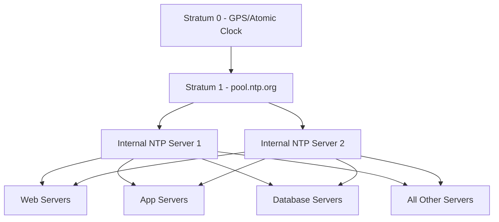

# How to Use Ansible to Configure NTP Servers

Author: [nawazdhandala](https://www.github.com/nawazdhandala)

Tags: Ansible, NTP, Time Synchronization, Linux, Chrony

Description: Learn how to configure NTP time synchronization on Linux servers using Ansible with chrony and ntpd for accurate and consistent timekeeping.

---

Time synchronization is one of those things that nobody thinks about until it breaks. And when it breaks, the consequences range from annoying (log timestamps are wrong) to catastrophic (Kerberos authentication fails, TLS certificates appear invalid, distributed databases get confused). Every server in your infrastructure needs accurate time, and Ansible makes it straightforward to configure NTP consistently.

## Prerequisites

- Ansible 2.9+ on your control node
- Linux target hosts with root or sudo access
- NTP servers accessible from your network (public or internal)

## Choosing Between chrony and ntpd

Modern Linux distributions have largely moved from the classic ntpd to chrony. chrony handles intermittent network connections better, synchronizes faster after boot, and works well in virtualized environments where the system clock can drift significantly. RHEL 8+, CentOS 8+, Ubuntu 18.04+, and Fedora all default to chrony.

If you are running older systems, ntpd is still perfectly functional. This post covers both.

## Configuring chrony

Here is a playbook that installs and configures chrony:

```yaml
# configure_chrony.yml - Install and configure chrony time synchronization
---
- name: Configure chrony NTP
  hosts: all
  become: true
  vars:
    ntp_servers:
      - 0.pool.ntp.org
      - 1.pool.ntp.org
      - 2.pool.ntp.org
      - 3.pool.ntp.org
    ntp_timezone: UTC
  tasks:
    - name: Install chrony
      ansible.builtin.package:
        name: chrony
        state: present

    - name: Set timezone
      community.general.timezone:
        name: "{{ ntp_timezone }}"

    - name: Deploy chrony configuration
      ansible.builtin.template:
        src: templates/chrony.conf.j2
        dest: /etc/chrony.conf
        owner: root
        group: root
        mode: '0644'
        backup: true
      notify: Restart chrony

    - name: Enable and start chrony
      ansible.builtin.service:
        name: chronyd
        state: started
        enabled: true

  handlers:
    - name: Restart chrony
      ansible.builtin.service:
        name: chronyd
        state: restarted
```

The chrony configuration template:

```jinja2
# templates/chrony.conf.j2 - Chrony NTP configuration
# Managed by Ansible - do not edit manually

# NTP servers

server {{ server }} iburst


# Record the rate at which the system clock gains/losses time
driftfile /var/lib/chrony/drift

# Allow the system clock to be stepped in the first three updates
# if its offset is larger than 1 second
makestep 1.0 3

# Enable kernel synchronization of the real-time clock (RTC)
rtcsync

# Enable hardware timestamping on all interfaces that support it
#hwtimestamp *

# Specify directory for log files
logdir /var/log/chrony

# Select which information is logged
#log measurements statistics tracking
```

## Using Internal NTP Servers

In enterprise environments, you typically run internal NTP servers that sync with external sources, and all other servers sync from those internal servers. This reduces external dependencies and provides consistent time across your infrastructure:

```yaml
# internal_ntp.yml - Configure NTP with internal time servers
---
- name: Configure internal NTP hierarchy
  hosts: all
  become: true
  vars:
    internal_ntp_servers:
      - ntp1.internal.example.com
      - ntp2.internal.example.com
  tasks:
    - name: Deploy chrony config for internal NTP
      ansible.builtin.template:
        src: templates/chrony-internal.conf.j2
        dest: /etc/chrony.conf
        owner: root
        group: root
        mode: '0644'
      notify: Restart chrony

    - name: Ensure chrony is running
      ansible.builtin.service:
        name: chronyd
        state: started
        enabled: true

  handlers:
    - name: Restart chrony
      ansible.builtin.service:
        name: chronyd
        state: restarted
```

```jinja2
# templates/chrony-internal.conf.j2 - Chrony config for internal NTP
# Managed by Ansible

# Internal NTP servers - preferred

server {{ server }} iburst prefer


# Fallback to public NTP if internal servers are unreachable
server 0.pool.ntp.org iburst
server 1.pool.ntp.org iburst

driftfile /var/lib/chrony/drift
makestep 1.0 3
rtcsync
logdir /var/log/chrony
```

## Setting Up an NTP Server

Some servers need to act as NTP servers for the rest of your infrastructure:

```yaml
# ntp_server.yml - Configure a host as an NTP server
---
- name: Configure NTP server
  hosts: ntp_servers
  become: true
  vars:
    upstream_ntp_servers:
      - 0.pool.ntp.org
      - 1.pool.ntp.org
      - 2.pool.ntp.org
      - 3.pool.ntp.org
    allowed_ntp_clients:
      - 10.0.0.0/8
      - 172.16.0.0/12
  tasks:
    - name: Install chrony
      ansible.builtin.package:
        name: chrony
        state: present

    - name: Deploy NTP server configuration
      ansible.builtin.template:
        src: templates/chrony-server.conf.j2
        dest: /etc/chrony.conf
        owner: root
        group: root
        mode: '0644'
      notify: Restart chrony

    - name: Open NTP port in firewall
      ansible.posix.firewalld:
        service: ntp
        permanent: true
        immediate: true
        state: enabled
      when: ansible_os_family == "RedHat"

    - name: Enable and start chrony
      ansible.builtin.service:
        name: chronyd
        state: started
        enabled: true

  handlers:
    - name: Restart chrony
      ansible.builtin.service:
        name: chronyd
        state: restarted
```

```jinja2
# templates/chrony-server.conf.j2 - NTP server configuration
# Managed by Ansible

# Upstream time sources

server {{ server }} iburst


# Allow NTP client access from internal networks

allow {{ network }}


# Serve time even when not synchronized to a time source
local stratum 10

driftfile /var/lib/chrony/drift
makestep 1.0 3
rtcsync
logdir /var/log/chrony
log measurements statistics tracking
```

## Configuring ntpd (Legacy Systems)

For older systems still running ntpd:

```yaml
# configure_ntpd.yml - Configure classic ntpd
---
- name: Configure ntpd
  hosts: legacy_servers
  become: true
  vars:
    ntp_servers:
      - 0.pool.ntp.org
      - 1.pool.ntp.org
      - 2.pool.ntp.org
  tasks:
    - name: Install ntp package
      ansible.builtin.package:
        name: ntp
        state: present

    - name: Deploy ntp.conf
      ansible.builtin.template:
        src: templates/ntp.conf.j2
        dest: /etc/ntp.conf
        owner: root
        group: root
        mode: '0644'
        backup: true
      notify: Restart ntpd

    - name: Enable and start ntpd
      ansible.builtin.service:
        name: ntpd
        state: started
        enabled: true

  handlers:
    - name: Restart ntpd
      ansible.builtin.service:
        name: ntpd
        state: restarted
```

```jinja2
# templates/ntp.conf.j2 - Classic ntpd configuration
# Managed by Ansible

driftfile /var/lib/ntp/drift

# Restrict default access
restrict default nomodify notrap nopeer noquery
restrict 127.0.0.1
restrict ::1

# NTP servers

server {{ server }} iburst


# Enable logging
statsdir /var/log/ntpstats/
statistics loopstats peerstats clockstats
```

## Verifying Time Synchronization

After configuring NTP, verify it is working:

```yaml
# verify_ntp.yml - Verify NTP synchronization status
---
- name: Verify time synchronization
  hosts: all
  become: true
  tasks:
    - name: Check chrony sources
      ansible.builtin.command: chronyc sources -v
      register: chrony_sources
      changed_when: false
      ignore_errors: true

    - name: Display chrony sources
      ansible.builtin.debug:
        var: chrony_sources.stdout_lines
      when: chrony_sources is not failed

    - name: Check chrony tracking
      ansible.builtin.command: chronyc tracking
      register: chrony_tracking
      changed_when: false
      ignore_errors: true

    - name: Display tracking info
      ansible.builtin.debug:
        var: chrony_tracking.stdout_lines
      when: chrony_tracking is not failed

    - name: Check system time offset
      ansible.builtin.command: timedatectl status
      register: time_status
      changed_when: false

    - name: Display time status
      ansible.builtin.debug:
        var: time_status.stdout_lines

    - name: Fail if clock offset is too large
      ansible.builtin.command: chronyc tracking
      register: offset_check
      changed_when: false
      failed_when: >
        offset_check.stdout is search('System time\s+:\s+(\d+\.\d+)') and
        (offset_check.stdout | regex_search('System time\s+:\s+(\d+\.\d+)', '\\1') | first | float) > 0.1
      ignore_errors: true
```

## NTP Hierarchy



## Handling Time Zones

Besides NTP, you often need to set the correct timezone:

```yaml
# set_timezone.yml - Configure timezone across all servers
---
- name: Set timezone
  hosts: all
  become: true
  vars:
    server_timezone: UTC
  tasks:
    - name: Set system timezone
      community.general.timezone:
        name: "{{ server_timezone }}"

    - name: Verify timezone
      ansible.builtin.command: timedatectl show --property=Timezone
      register: tz_check
      changed_when: false

    - name: Display timezone
      ansible.builtin.debug:
        var: tz_check.stdout
```

## Tips for Production Environments

Always use at least three NTP sources. With only one or two, chrony cannot detect if a server is providing bad time. The `iburst` option on server lines speeds up initial synchronization from minutes to seconds. The `makestep` directive allows large initial corrections but prevents them during normal operation, which is important for applications that break with large clock jumps.

For databases and distributed systems, time accuracy is critical. Set up dedicated internal NTP servers, monitor their synchronization status, and alert if any server's offset exceeds your tolerance threshold. Ansible gives you the tools to configure this consistently and verify it across your entire fleet.
