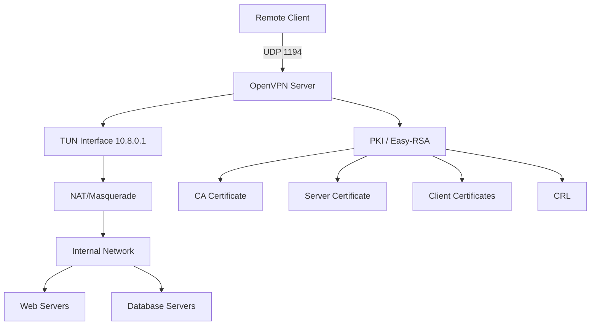

# How to Use Ansible to Configure OpenVPN

Author: [nawazdhandala](https://www.github.com/nawazdhandala)

Tags: Ansible, OpenVPN, VPN, Security, Networking

Description: Learn how to deploy and configure OpenVPN server and clients using Ansible with certificate management and automated client provisioning.

---

OpenVPN has been the standard open-source VPN solution for over two decades. While WireGuard is gaining popularity for its simplicity, OpenVPN remains the practical choice in many environments because of its mature ecosystem, wide client support (Windows, macOS, Linux, iOS, Android), and flexibility with authentication methods. Setting up an OpenVPN server involves generating a PKI, configuring the server, creating client certificates, and distributing configurations. Ansible automates every step.

## Prerequisites

- Ansible 2.9+ on your control node
- Ubuntu/Debian or RHEL/CentOS target hosts
- Root or sudo access
- Public IP address on the VPN server
- Port 1194/UDP accessible from the internet

## Installing OpenVPN and Easy-RSA

```yaml
# install_openvpn.yml - Install OpenVPN and PKI tools
---
- name: Install OpenVPN
  hosts: vpn_server
  become: true
  tasks:
    - name: Install OpenVPN on Debian/Ubuntu
      ansible.builtin.apt:
        name:
          - openvpn
          - easy-rsa
          - iptables-persistent
        state: present
        update_cache: true
      when: ansible_os_family == "Debian"

    - name: Install OpenVPN on RHEL/CentOS
      ansible.builtin.yum:
        name:
          - openvpn
          - easy-rsa
        state: present
      when: ansible_os_family == "RedHat"

    - name: Enable IP forwarding
      ansible.posix.sysctl:
        name: net.ipv4.ip_forward
        value: '1'
        sysctl_set: true
        state: present
        reload: true
```

## Setting Up the PKI (Public Key Infrastructure)

OpenVPN uses TLS certificates for authentication. Easy-RSA manages the CA and certificate generation:

```yaml
# setup_pki.yml - Initialize PKI for OpenVPN
---
- name: Set up PKI with Easy-RSA
  hosts: vpn_server
  become: true
  vars:
    easyrsa_dir: /etc/openvpn/easy-rsa
    ca_common_name: "OpenVPN CA"
    server_name: vpn-server
  tasks:
    - name: Create Easy-RSA directory
      ansible.builtin.command: make-cadir {{ easyrsa_dir }}
      args:
        creates: "{{ easyrsa_dir }}/easyrsa"

    - name: Configure Easy-RSA vars
      ansible.builtin.copy:
        dest: "{{ easyrsa_dir }}/vars"
        content: |
          set_var EASYRSA_ALGO         ec
          set_var EASYRSA_DIGEST       "sha512"
          set_var EASYRSA_CURVE        secp384r1
          set_var EASYRSA_CA_EXPIRE    3650
          set_var EASYRSA_CERT_EXPIRE  365
          set_var EASYRSA_REQ_CN       "{{ ca_common_name }}"
        mode: '0644'

    - name: Initialize PKI
      ansible.builtin.command: ./easyrsa init-pki
      args:
        chdir: "{{ easyrsa_dir }}"
        creates: "{{ easyrsa_dir }}/pki"

    - name: Build CA (non-interactive)
      ansible.builtin.command: ./easyrsa --batch build-ca nopass
      args:
        chdir: "{{ easyrsa_dir }}"
        creates: "{{ easyrsa_dir }}/pki/ca.crt"
      environment:
        EASYRSA_REQ_CN: "{{ ca_common_name }}"

    - name: Generate server certificate
      ansible.builtin.command: "./easyrsa --batch build-server-full {{ server_name }} nopass"
      args:
        chdir: "{{ easyrsa_dir }}"
        creates: "{{ easyrsa_dir }}/pki/issued/{{ server_name }}.crt"

    - name: Generate DH parameters
      ansible.builtin.command: ./easyrsa gen-dh
      args:
        chdir: "{{ easyrsa_dir }}"
        creates: "{{ easyrsa_dir }}/pki/dh.pem"

    - name: Generate TLS auth key
      ansible.builtin.command: openvpn --genkey secret /etc/openvpn/ta.key
      args:
        creates: /etc/openvpn/ta.key
```

## Configuring the OpenVPN Server

```yaml
# configure_server.yml - Configure OpenVPN server
---
- name: Configure OpenVPN server
  hosts: vpn_server
  become: true
  vars:
    easyrsa_dir: /etc/openvpn/easy-rsa
    server_name: vpn-server
    vpn_network: 10.8.0.0
    vpn_netmask: 255.255.255.0
    vpn_port: 1194
    vpn_proto: udp
    vpn_dns:
      - 8.8.8.8
      - 8.8.4.4
    server_public_interface: eth0
  tasks:
    - name: Copy certificates to OpenVPN directory
      ansible.builtin.copy:
        src: "{{ item.src }}"
        dest: "{{ item.dest }}"
        remote_src: true
        mode: "{{ item.mode }}"
      loop:
        - src: "{{ easyrsa_dir }}/pki/ca.crt"
          dest: /etc/openvpn/server/ca.crt
          mode: '0644'
        - src: "{{ easyrsa_dir }}/pki/issued/{{ server_name }}.crt"
          dest: /etc/openvpn/server/server.crt
          mode: '0644'
        - src: "{{ easyrsa_dir }}/pki/private/{{ server_name }}.key"
          dest: /etc/openvpn/server/server.key
          mode: '0600'
        - src: "{{ easyrsa_dir }}/pki/dh.pem"
          dest: /etc/openvpn/server/dh.pem
          mode: '0644'

    - name: Deploy OpenVPN server configuration
      ansible.builtin.template:
        src: templates/openvpn-server.conf.j2
        dest: /etc/openvpn/server/server.conf
        owner: root
        group: root
        mode: '0644'
      notify: Restart OpenVPN

    - name: Copy TLS auth key
      ansible.builtin.copy:
        src: /etc/openvpn/ta.key
        dest: /etc/openvpn/server/ta.key
        remote_src: true
        mode: '0600'

    - name: Configure NAT for VPN clients
      ansible.builtin.iptables:
        table: nat
        chain: POSTROUTING
        source: "{{ vpn_network }}/24"
        out_interface: "{{ server_public_interface }}"
        jump: MASQUERADE
        comment: "OpenVPN NAT"

    - name: Enable and start OpenVPN
      ansible.builtin.systemd:
        name: openvpn-server@server
        state: started
        enabled: true

  handlers:
    - name: Restart OpenVPN
      ansible.builtin.systemd:
        name: openvpn-server@server
        state: restarted
```

```jinja2
# templates/openvpn-server.conf.j2 - OpenVPN server configuration
# Managed by Ansible - do not edit manually

port {{ vpn_port }}
proto {{ vpn_proto }}
dev tun

ca ca.crt
cert server.crt
key server.key
dh dh.pem
tls-auth ta.key 0

server {{ vpn_network }} {{ vpn_netmask }}

# Maintain a record of client-to-virtual-IP associations
ifconfig-pool-persist /var/log/openvpn/ipp.txt

# Push routes and DNS to clients

push "dhcp-option DNS {{ dns }}"

push "redirect-gateway def1 bypass-dhcp"

# Keep connections alive
keepalive 10 120

# Encryption settings
cipher AES-256-GCM
auth SHA256

# Run as unprivileged user
user nobody
group nogroup

# Persist key and tunnel across restarts
persist-key
persist-tun

# Status and logging
status /var/log/openvpn/openvpn-status.log
log-append /var/log/openvpn/openvpn.log
verb 3
mute 20

# Allow multiple clients with same certificate (not recommended for production)
# duplicate-cn

# Maximum number of connected clients
max-clients 100
```

## Generating Client Certificates

Automate client certificate creation:

```yaml
# create_client.yml - Generate OpenVPN client certificate and config
---
- name: Create OpenVPN client
  hosts: vpn_server
  become: true
  vars:
    easyrsa_dir: /etc/openvpn/easy-rsa
    client_name: john_doe
    vpn_server_address: vpn.example.com
    vpn_port: 1194
    client_output_dir: /etc/openvpn/clients
  tasks:
    - name: Create client output directory
      ansible.builtin.file:
        path: "{{ client_output_dir }}"
        state: directory
        mode: '0700'

    - name: Generate client certificate
      ansible.builtin.command: "./easyrsa --batch build-client-full {{ client_name }} nopass"
      args:
        chdir: "{{ easyrsa_dir }}"
        creates: "{{ easyrsa_dir }}/pki/issued/{{ client_name }}.crt"

    - name: Read CA certificate
      ansible.builtin.slurp:
        src: "{{ easyrsa_dir }}/pki/ca.crt"
      register: ca_cert

    - name: Read client certificate
      ansible.builtin.slurp:
        src: "{{ easyrsa_dir }}/pki/issued/{{ client_name }}.crt"
      register: client_cert

    - name: Read client key
      ansible.builtin.slurp:
        src: "{{ easyrsa_dir }}/pki/private/{{ client_name }}.key"
      register: client_key

    - name: Read TLS auth key
      ansible.builtin.slurp:
        src: /etc/openvpn/ta.key
      register: ta_key

    - name: Generate unified client configuration
      ansible.builtin.template:
        src: templates/client.ovpn.j2
        dest: "{{ client_output_dir }}/{{ client_name }}.ovpn"
        mode: '0600'
```

```jinja2
# templates/client.ovpn.j2 - OpenVPN client configuration with embedded certs
# Managed by Ansible
client
dev tun
proto udp
remote {{ vpn_server_address }} {{ vpn_port }}
resolv-retry infinite
nobind
persist-key
persist-tun
remote-cert-tls server
cipher AES-256-GCM
auth SHA256
key-direction 1
verb 3

<ca>
{{ ca_cert.content | b64decode }}
</ca>

<cert>
{{ client_cert.content | b64decode }}
</cert>

<key>
{{ client_key.content | b64decode }}
</key>

<tls-auth>
{{ ta_key.content | b64decode }}
</tls-auth>
```

## Revoking Client Certificates

When a user leaves or a device is compromised:

```yaml
# revoke_client.yml - Revoke an OpenVPN client certificate
---
- name: Revoke OpenVPN client
  hosts: vpn_server
  become: true
  vars:
    easyrsa_dir: /etc/openvpn/easy-rsa
    client_name: former_employee
  tasks:
    - name: Revoke client certificate
      ansible.builtin.command: "./easyrsa --batch revoke {{ client_name }}"
      args:
        chdir: "{{ easyrsa_dir }}"
      changed_when: true

    - name: Generate updated CRL
      ansible.builtin.command: ./easyrsa gen-crl
      args:
        chdir: "{{ easyrsa_dir }}"
      changed_when: true

    - name: Copy CRL to OpenVPN directory
      ansible.builtin.copy:
        src: "{{ easyrsa_dir }}/pki/crl.pem"
        dest: /etc/openvpn/server/crl.pem
        remote_src: true
        mode: '0644'
      notify: Restart OpenVPN

  handlers:
    - name: Restart OpenVPN
      ansible.builtin.systemd:
        name: openvpn-server@server
        state: restarted
```

## OpenVPN Architecture



## Monitoring OpenVPN

```yaml
# monitor_openvpn.yml - Monitor OpenVPN server status
---
- name: Monitor OpenVPN
  hosts: vpn_server
  become: true
  tasks:
    - name: Check OpenVPN service status
      ansible.builtin.systemd:
        name: openvpn-server@server
      register: openvpn_service

    - name: Show service status
      ansible.builtin.debug:
        msg: "OpenVPN is {{ openvpn_service.status.ActiveState }}"

    - name: Read status file
      ansible.builtin.command: cat /var/log/openvpn/openvpn-status.log
      register: vpn_status
      changed_when: false

    - name: Show connected clients
      ansible.builtin.debug:
        var: vpn_status.stdout_lines

    - name: Count connected clients
      ansible.builtin.shell: grep -c "^10.8" /var/log/openvpn/openvpn-status.log || echo 0
      register: client_count
      changed_when: false

    - name: Report client count
      ansible.builtin.debug:
        msg: "Connected clients: {{ client_count.stdout }}"
```

OpenVPN is battle-tested and remains the right choice when you need broad client platform support, certificate-based authentication, or integration with existing PKI infrastructure. Ansible takes the pain out of the initial setup and ongoing certificate management, turning what could be an hour of manual work per client into a single playbook run.
