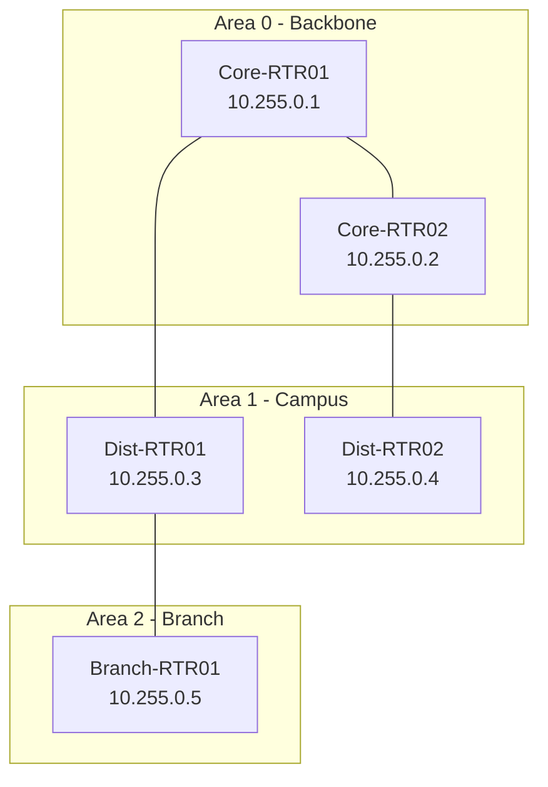

# How to Use Ansible to Configure OSPF on Network Devices

Author: [nawazdhandala](https://www.github.com/nawazdhandala)

Tags: Ansible, OSPF, Routing, Network Automation

Description: Automate OSPF deployment and management on network devices using Ansible resource modules with practical multi-area and verification examples.

---

OSPF is the workhorse of enterprise interior routing. It scales well, converges quickly, and supports hierarchical designs through multi-area configurations. But deploying OSPF across a network with dozens of routers means configuring the same process on every device, making sure areas are consistent, and verifying that adjacencies form correctly. That is where Ansible comes in.

This post shows you how to deploy and manage OSPF on Cisco IOS routers using Ansible, from single-area setups to multi-area designs with route summarization.

## OSPF Architecture Overview

Before jumping into playbooks, here is the topology we will automate.



## Inventory Setup

Define router groups that map to OSPF areas.

```yaml
# inventory/network.yml - Router inventory organized by OSPF area
---
all:
  children:
    ospf_routers:
      children:
        area0_routers:
          hosts:
            core-rtr01:
              ansible_host: 10.1.1.1
              router_id: 10.255.0.1
              ospf_role: abr
            core-rtr02:
              ansible_host: 10.1.1.2
              router_id: 10.255.0.2
              ospf_role: abr
        area1_routers:
          hosts:
            dist-rtr01:
              ansible_host: 10.1.2.1
              router_id: 10.255.0.3
              ospf_role: internal
            dist-rtr02:
              ansible_host: 10.1.2.2
              router_id: 10.255.0.4
              ospf_role: internal
        area2_routers:
          hosts:
            branch-rtr01:
              ansible_host: 10.1.3.1
              router_id: 10.255.0.5
              ospf_role: internal
      vars:
        ansible_connection: ansible.netcommon.network_cli
        ansible_network_os: cisco.ios.ios
        ansible_user: admin
        ansible_password: "{{ vault_password }}"
        ansible_become: true
        ansible_become_method: enable
```

## Basic OSPF Configuration with Resource Modules

The `ios_ospfv2` resource module handles the OSPF process configuration.

```yaml
# deploy_ospf.yml - Configure OSPF process on all routers
---
- name: Deploy OSPF configuration
  hosts: ospf_routers
  gather_facts: false
  connection: network_cli

  tasks:
    - name: Configure OSPF process
      cisco.ios.ios_ospfv2:
        config:
          processes:
            - process_id: 1
              router_id: "{{ router_id }}"
              auto_cost:
                reference_bandwidth: 10000
              log_adjacency_changes:
                detail: true
              passive_interfaces:
                default: true
                set_interface: false
        state: merged
      register: ospf_result

    - name: Show OSPF changes
      ansible.builtin.debug:
        var: ospf_result.commands
      when: ospf_result.changed
```

## Configuring OSPF Network Statements Per Area

Network statements need to be area-specific. Use host variables to define which networks belong to which area on each router.

```yaml
# host_vars/core-rtr01.yml - OSPF networks for core router 1
---
ospf_networks:
  # Backbone links in Area 0
  - network: 10.0.0.0
    wildcard: 0.0.0.3
    area: 0
  - network: 10.0.0.4
    wildcard: 0.0.0.3
    area: 0
  # Loopback in Area 0
  - network: 10.255.0.1
    wildcard: 0.0.0.0
    area: 0
  # Link to Area 1 (ABR)
  - network: 10.1.0.0
    wildcard: 0.0.0.3
    area: 1

ospf_interfaces:
  # Only these interfaces should form adjacencies (not passive)
  active_interfaces:
    - GigabitEthernet0/0
    - GigabitEthernet0/1
    - GigabitEthernet0/2
```

```yaml
# configure_ospf_networks.yml - Add OSPF network statements per router
---
- name: Configure OSPF network statements
  hosts: ospf_routers
  gather_facts: false
  connection: network_cli

  tasks:
    # Add network statements to the OSPF process
    - name: Configure OSPF networks
      cisco.ios.ios_config:
        lines:
          - "network {{ item.network }} {{ item.wildcard }} area {{ item.area }}"
        parents: router ospf 1
      loop: "{{ ospf_networks }}"

    # Remove passive-interface from links that need to form adjacencies
    - name: Enable OSPF on active interfaces
      cisco.ios.ios_config:
        lines:
          - "no passive-interface {{ item }}"
        parents: router ospf 1
      loop: "{{ ospf_interfaces.active_interfaces }}"
```

## OSPF Interface-Level Configuration

Interface-level OSPF settings control timers, network type, cost, and authentication.

```yaml
# ospf_interface_config.yml - Set OSPF parameters on individual interfaces
---
- name: Configure OSPF interface parameters
  hosts: ospf_routers
  gather_facts: false
  connection: network_cli

  tasks:
    # Configure point-to-point WAN links
    - name: Set point-to-point network type on WAN interfaces
      cisco.ios.ios_config:
        lines:
          - ip ospf network point-to-point
          - ip ospf cost 100
        parents: "interface {{ item }}"
      loop: "{{ ospf_interfaces.active_interfaces }}"
      when: ospf_role == 'abr'

    # Configure OSPF authentication on backbone links
    - name: Enable OSPF MD5 authentication on Area 0 links
      cisco.ios.ios_config:
        lines:
          - ip ospf authentication message-digest
          - ip ospf message-digest-key 1 md5 {{ vault_ospf_key }}
        parents: "interface {{ item }}"
      loop: "{{ ospf_interfaces.active_interfaces }}"

    # Tune OSPF timers for faster convergence
    - name: Set OSPF hello and dead timers
      cisco.ios.ios_config:
        lines:
          - ip ospf hello-interval 5
          - ip ospf dead-interval 20
        parents: "interface {{ item }}"
      loop: "{{ ospf_interfaces.active_interfaces }}"
```

## Multi-Area OSPF with Route Summarization

Area Border Routers (ABRs) should summarize routes between areas to keep routing tables small.

```yaml
# ospf_summarization.yml - Configure route summarization on ABR routers
---
- name: Configure OSPF area summarization on ABRs
  hosts: area0_routers
  gather_facts: false
  connection: network_cli

  tasks:
    # Summarize Area 1 routes into Area 0
    - name: Configure Area 1 summary
      cisco.ios.ios_config:
        lines:
          - area 1 range 10.1.0.0 255.255.0.0
        parents: router ospf 1

    # Summarize Area 2 routes into Area 0
    - name: Configure Area 2 summary
      cisco.ios.ios_config:
        lines:
          - area 2 range 10.2.0.0 255.255.0.0
        parents: router ospf 1

    # Configure Area 2 as a stub area to reduce LSA flooding
    - name: Set Area 2 as stub
      cisco.ios.ios_config:
        lines:
          - area 2 stub
        parents: router ospf 1

- name: Configure stub area on branch routers
  hosts: area2_routers
  gather_facts: false
  connection: network_cli

  tasks:
    - name: Configure Area 2 stub on branch router
      cisco.ios.ios_config:
        lines:
          - area 2 stub
        parents: router ospf 1
```

## OSPF Redistribution

When you need to inject routes from other sources into OSPF, redistribution must be configured carefully with route maps.

```yaml
# ospf_redistribution.yml - Redistribute routes into OSPF with filtering
---
- name: Configure OSPF redistribution
  hosts: edge_routers
  gather_facts: false
  connection: network_cli

  tasks:
    # Create prefix list to control what gets redistributed
    - name: Create redistribution prefix list
      cisco.ios.ios_config:
        lines:
          - ip prefix-list REDIST_TO_OSPF seq 10 permit 192.168.0.0/16 le 24
          - ip prefix-list REDIST_TO_OSPF seq 20 deny 0.0.0.0/0 le 32

    # Create route map for redistribution
    - name: Create redistribution route map
      cisco.ios.ios_config:
        lines:
          - match ip address prefix-list REDIST_TO_OSPF
          - set metric 500
          - set metric-type type-2
        parents: route-map STATIC_TO_OSPF permit 10

    # Apply redistribution under the OSPF process
    - name: Redistribute static routes into OSPF
      cisco.ios.ios_config:
        lines:
          - redistribute static subnets route-map STATIC_TO_OSPF
          - redistribute connected subnets
        parents: router ospf 1
```

## OSPF Verification Playbook

After deploying OSPF, run verification checks to make sure everything is working.

```yaml
# verify_ospf.yml - Comprehensive OSPF verification checks
---
- name: Verify OSPF deployment
  hosts: ospf_routers
  gather_facts: false
  connection: network_cli

  tasks:
    - name: Check OSPF neighbor status
      cisco.ios.ios_command:
        commands:
          - show ip ospf neighbor
      register: ospf_neighbors

    - name: Display OSPF neighbors
      ansible.builtin.debug:
        var: ospf_neighbors.stdout_lines[0]

    # Verify expected number of neighbors
    - name: Count OSPF neighbors
      ansible.builtin.set_fact:
        neighbor_count: "{{ ospf_neighbors.stdout[0] | regex_findall('FULL') | length }}"

    - name: Verify neighbor count
      ansible.builtin.assert:
        that:
          - neighbor_count | int >= expected_neighbor_count | int
        fail_msg: "Expected {{ expected_neighbor_count }} OSPF neighbors but found {{ neighbor_count }}"
        success_msg: "OSPF neighbor count is correct: {{ neighbor_count }}"

    - name: Check OSPF interface status
      cisco.ios.ios_command:
        commands:
          - show ip ospf interface brief
      register: ospf_interfaces

    - name: Display OSPF interfaces
      ansible.builtin.debug:
        var: ospf_interfaces.stdout_lines[0]

    - name: Check OSPF database
      cisco.ios.ios_command:
        commands:
          - show ip ospf database | include Link States
      register: ospf_db

    - name: Display OSPF database summary
      ansible.builtin.debug:
        var: ospf_db.stdout_lines[0]

    # Check that specific routes are present
    - name: Verify critical routes
      cisco.ios.ios_command:
        commands:
          - "show ip route ospf | include {{ item }}"
      register: route_check
      loop:
        - "10.255.0"
        - "10.1.0"
        - "10.2.0"

    - name: Report route verification
      ansible.builtin.debug:
        msg: "Route check for {{ item.item }}: {{ 'FOUND' if item.stdout[0] | length > 0 else 'MISSING' }}"
      loop: "{{ route_check.results }}"
```

## Gathering OSPF State

Use the `gathered` state to pull the current OSPF configuration for documentation or comparison.

```yaml
# gather_ospf.yml - Capture current OSPF config for documentation
---
- name: Gather OSPF configuration
  hosts: ospf_routers
  gather_facts: false
  connection: network_cli

  tasks:
    - name: Gather OSPF config
      cisco.ios.ios_ospfv2:
        state: gathered
      register: ospf_state

    - name: Save OSPF state to file
      ansible.builtin.copy:
        content: "{{ ospf_state.gathered | to_nice_json }}"
        dest: "state/{{ inventory_hostname }}_ospf.json"
      delegate_to: localhost
```

OSPF automation with Ansible brings consistency to your routing infrastructure. Every router gets the same timers, the same authentication keys, the same area configuration. Changes are tracked in version control, tested in check mode, and verified automatically. That is a massive improvement over logging into each router and typing commands by hand.
