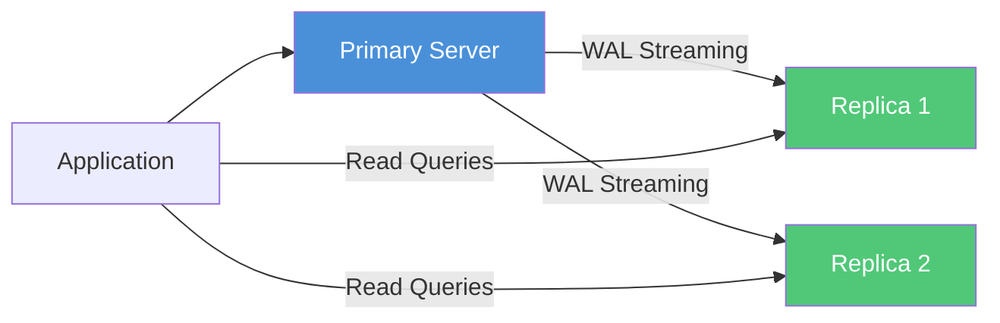
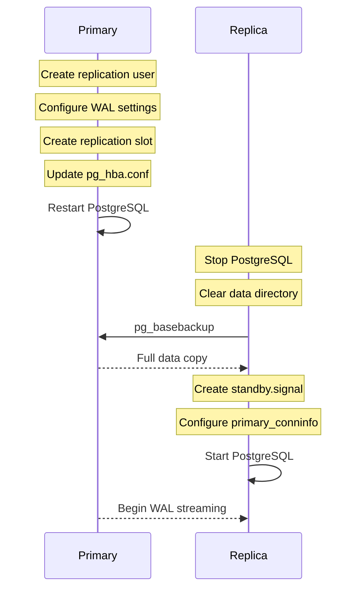

# How to Use Ansible to Configure PostgreSQL Replication

Author: [nawazdhandala](https://www.github.com/nawazdhandala)

Tags: Ansible, PostgreSQL, Replication, High Availability

Description: Set up PostgreSQL streaming replication with Ansible to build a primary-replica database cluster with automatic failover preparation.

---

Running a single PostgreSQL server is fine for development, but production workloads need replication for high availability and read scaling. PostgreSQL's built-in streaming replication sends WAL (Write-Ahead Log) records from a primary server to one or more replicas in near real-time. Setting this up by hand involves editing configs on multiple servers, creating replication users, taking base backups, and configuring recovery. Ansible automates all of it.

This post walks through configuring PostgreSQL streaming replication with Ansible, from primary server setup to replica initialization and monitoring.

## Replication Architecture



The primary handles all writes. Replicas receive WAL records and can serve read queries. If the primary fails, a replica can be promoted.

## Inventory Setup

Define your primary and replica servers in the inventory.

```yaml
# inventory/production/hosts.yml
# Database cluster with primary and replicas
all:
  children:
    postgresql_primary:
      hosts:
        db-primary:
          ansible_host: 10.0.2.10
    postgresql_replicas:
      hosts:
        db-replica-01:
          ansible_host: 10.0.2.11
        db-replica-02:
          ansible_host: 10.0.2.12
    postgresql_cluster:
      children:
        postgresql_primary:
        postgresql_replicas:
      vars:
        postgresql_version: "16"
        replication_user: replicator
        replication_password: "{{ vault_replication_password }}"
```

## Configuring the Primary Server

The primary needs to allow replication connections and configure WAL shipping.

```yaml
# roles/postgresql_primary/tasks/main.yml
# Configure the primary PostgreSQL server for streaming replication
---
- name: Create replication user
  community.postgresql.postgresql_user:
    name: "{{ replication_user }}"
    password: "{{ replication_password }}"
    role_attr_flags: REPLICATION,LOGIN
    state: present
  become: true
  become_user: postgres
  no_log: true

- name: Configure postgresql.conf for replication
  lineinfile:
    path: "{{ postgresql_config_dir }}/postgresql.conf"
    regexp: "^#?{{ item.key }}\\s*="
    line: "{{ item.key }} = {{ item.value }}"
    state: present
  loop:
    - { key: "listen_addresses", value: "'0.0.0.0'" }
    - { key: "wal_level", value: "replica" }
    - { key: "max_wal_senders", value: "10" }
    - { key: "max_replication_slots", value: "10" }
    - { key: "wal_keep_size", value: "'1GB'" }
    - { key: "hot_standby", value: "on" }
    - { key: "synchronous_commit", value: "on" }
    - { key: "archive_mode", value: "on" }
    - { key: "archive_command", value: "'cp %p /var/lib/postgresql/wal_archive/%f'" }
  notify: restart postgresql

- name: Create WAL archive directory
  file:
    path: /var/lib/postgresql/wal_archive
    state: directory
    owner: postgres
    group: postgres
    mode: '0700'

- name: Add replication entries to pg_hba.conf
  lineinfile:
    path: "{{ postgresql_config_dir }}/pg_hba.conf"
    line: "host    replication    {{ replication_user }}    {{ hostvars[item].ansible_host }}/32    scram-sha-256"
    state: present
  loop: "{{ groups['postgresql_replicas'] }}"
  notify: reload postgresql

- name: Create replication slots for each replica
  community.postgresql.postgresql_slot:
    name: "{{ item | replace('-', '_') }}_slot"
    slot_type: physical
    state: present
  loop: "{{ groups['postgresql_replicas'] }}"
  become: true
  become_user: postgres
```

## Configuring the Replica Servers

Replicas need to be initialized with a base backup from the primary and then configured to stream WAL.

```yaml
# roles/postgresql_replica/tasks/main.yml
# Set up PostgreSQL replica with streaming replication
---
- name: Stop PostgreSQL on replica
  systemd:
    name: "{{ postgresql_service_name }}"
    state: stopped

- name: Check if replica is already initialized
  stat:
    path: "{{ postgresql_data_dir }}/standby.signal"
  register: standby_signal

- name: Remove existing data directory for fresh base backup
  file:
    path: "{{ postgresql_data_dir }}"
    state: absent
  when: not standby_signal.stat.exists

- name: Create empty data directory
  file:
    path: "{{ postgresql_data_dir }}"
    state: directory
    owner: postgres
    group: postgres
    mode: '0700'
  when: not standby_signal.stat.exists

- name: Take base backup from primary
  command: >
    pg_basebackup
    -h {{ hostvars[groups['postgresql_primary'][0]].ansible_host }}
    -U {{ replication_user }}
    -D {{ postgresql_data_dir }}
    -Fp -Xs -P -R
    -S {{ inventory_hostname | replace('-', '_') }}_slot
  become: true
  become_user: postgres
  environment:
    PGPASSWORD: "{{ replication_password }}"
  when: not standby_signal.stat.exists
  no_log: true

- name: Configure replica connection settings
  lineinfile:
    path: "{{ postgresql_data_dir }}/postgresql.auto.conf"
    regexp: "^#?{{ item.key }}\\s*="
    line: "{{ item.key }} = '{{ item.value }}'"
    create: true
    owner: postgres
    group: postgres
  loop:
    - key: primary_conninfo
      value: "host={{ hostvars[groups['postgresql_primary'][0]].ansible_host }} port=5432 user={{ replication_user }} password={{ replication_password }} application_name={{ inventory_hostname }}"
    - key: primary_slot_name
      value: "{{ inventory_hostname | replace('-', '_') }}_slot"
  no_log: true

- name: Ensure standby.signal file exists
  file:
    path: "{{ postgresql_data_dir }}/standby.signal"
    state: touch
    owner: postgres
    group: postgres
    mode: '0600'

- name: Configure hot standby settings
  lineinfile:
    path: "{{ postgresql_data_dir }}/postgresql.auto.conf"
    regexp: "^#?{{ item.key }}\\s*="
    line: "{{ item.key }} = {{ item.value }}"
  loop:
    - { key: "hot_standby", value: "on" }
    - { key: "hot_standby_feedback", value: "on" }

- name: Start PostgreSQL replica
  systemd:
    name: "{{ postgresql_service_name }}"
    state: started
    enabled: true
```

## The Main Replication Playbook

```yaml
# playbooks/setup-replication.yml
# Configure PostgreSQL streaming replication cluster
---
- name: Configure primary server
  hosts: postgresql_primary
  become: true
  vars:
    postgresql_config_dir: "/etc/postgresql/{{ postgresql_version }}/main"
    postgresql_service_name: postgresql
  roles:
    - postgresql_primary
  handlers:
    - name: restart postgresql
      systemd:
        name: "{{ postgresql_service_name }}"
        state: restarted
    - name: reload postgresql
      systemd:
        name: "{{ postgresql_service_name }}"
        state: reloaded

- name: Configure replica servers
  hosts: postgresql_replicas
  become: true
  serial: 1
  vars:
    postgresql_data_dir: "/var/lib/postgresql/{{ postgresql_version }}/main"
    postgresql_service_name: postgresql
  roles:
    - postgresql_replica
```

The `serial: 1` on the replica play ensures replicas are set up one at a time, which avoids overloading the primary with multiple simultaneous base backups.

## Monitoring Replication Status

After setup, verify that replication is working.

```yaml
# playbooks/check-replication.yml
# Verify replication status on primary and replicas
---
- name: Check replication on primary
  hosts: postgresql_primary
  become: true
  become_user: postgres

  tasks:
    - name: Query replication status
      community.postgresql.postgresql_query:
        query: |
          SELECT client_addr, state, sent_lsn, write_lsn,
                 flush_lsn, replay_lsn,
                 (sent_lsn - replay_lsn) AS replay_lag
          FROM pg_stat_replication;
      register: repl_status

    - name: Display replication status
      debug:
        msg: "{{ repl_status.query_result }}"

    - name: Check replication slot status
      community.postgresql.postgresql_query:
        query: "SELECT slot_name, active, restart_lsn FROM pg_replication_slots;"
      register: slot_status

    - name: Display slot status
      debug:
        msg: "{{ slot_status.query_result }}"

- name: Check replica status
  hosts: postgresql_replicas
  become: true
  become_user: postgres

  tasks:
    - name: Check if in recovery mode
      community.postgresql.postgresql_query:
        query: "SELECT pg_is_in_recovery();"
      register: recovery_status

    - name: Verify replica is in recovery
      assert:
        that:
          - recovery_status.query_result[0].pg_is_in_recovery == true
        fail_msg: "Server {{ inventory_hostname }} is NOT in recovery mode"

    - name: Check replication lag
      community.postgresql.postgresql_query:
        query: |
          SELECT CASE
            WHEN pg_last_wal_receive_lsn() = pg_last_wal_replay_lsn() THEN 0
            ELSE EXTRACT(EPOCH FROM now() - pg_last_xact_replay_timestamp())
          END AS lag_seconds;
      register: lag_info

    - name: Display replication lag
      debug:
        msg: "Replication lag on {{ inventory_hostname }}: {{ lag_info.query_result[0].lag_seconds }} seconds"

    - name: Alert if lag is too high
      assert:
        that:
          - lag_info.query_result[0].lag_seconds | float < 30
        fail_msg: "Replication lag on {{ inventory_hostname }} is {{ lag_info.query_result[0].lag_seconds }}s - exceeds 30s threshold"
```

## Replication Setup Flow



## Running the Setup

```bash
# Set up replication for the entire cluster
ansible-playbook playbooks/setup-replication.yml \
  -i inventory/production/ \
  --ask-vault-pass

# Check replication health
ansible-playbook playbooks/check-replication.yml \
  -i inventory/production/
```

## Conclusion

PostgreSQL streaming replication with Ansible gives you a reproducible, version-controlled database cluster setup. The primary server is configured for WAL shipping and replication slots, and each replica is bootstrapped with `pg_basebackup` and pointed at the primary for streaming. Add monitoring tasks to track replication lag, and you have a solid foundation for high availability. From here, you can add tools like Patroni or repmgr for automatic failover, but the replication layer managed by Ansible remains the same.
