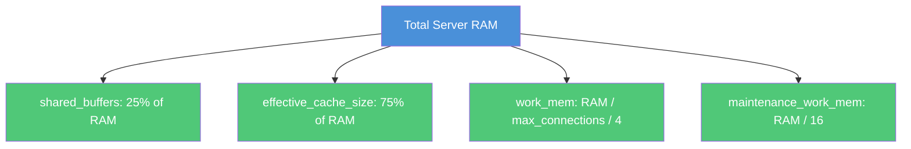

# How to Use Ansible to Configure PostgreSQL

Author: [nawazdhandala](https://www.github.com/nawazdhandala)

Tags: Ansible, PostgreSQL, Database Configuration, DevOps

Description: Automate PostgreSQL configuration with Ansible including postgresql.conf tuning, pg_hba.conf management, and performance optimization.

---

Installing PostgreSQL is only the first step. The real work is in tuning it for your workload. PostgreSQL ships with conservative defaults that are designed to run on minimal hardware. On a server with 16GB of RAM and fast SSDs, those defaults leave performance on the table. Ansible lets you manage `postgresql.conf` and `pg_hba.conf` across your entire fleet, ensuring every database server has the same tuned configuration.

This post covers a complete Ansible role for PostgreSQL configuration, including performance tuning, connection security, and logging.

## Role Structure

```
roles/postgresql_config/
  defaults/main.yml
  tasks/main.yml
  templates/
    postgresql.conf.j2
    pg_hba.conf.j2
  handlers/main.yml
```

## Default Variables

These defaults cover the most important PostgreSQL settings. Override them per-host or per-group based on your hardware.

```yaml
# roles/postgresql_config/defaults/main.yml
# Sensible defaults for PostgreSQL configuration
---
postgresql_version: "16"
postgresql_config_dir: "/etc/postgresql/{{ postgresql_version }}/main"

# Connection settings
postgresql_listen_addresses: "localhost"
postgresql_port: 5432
postgresql_max_connections: 100
postgresql_superuser_reserved_connections: 3

# Memory settings (tune based on available RAM)
postgresql_shared_buffers: "256MB"
postgresql_effective_cache_size: "768MB"
postgresql_work_mem: "4MB"
postgresql_maintenance_work_mem: "64MB"

# WAL settings
postgresql_wal_buffers: "16MB"
postgresql_min_wal_size: "1GB"
postgresql_max_wal_size: "4GB"
postgresql_checkpoint_completion_target: 0.9

# Query planner
postgresql_random_page_cost: 1.1
postgresql_effective_io_concurrency: 200
postgresql_default_statistics_target: 100

# Logging
postgresql_log_destination: "stderr"
postgresql_logging_collector: "on"
postgresql_log_directory: "log"
postgresql_log_filename: "postgresql-%Y-%m-%d_%H%M%S.log"
postgresql_log_min_duration_statement: 1000
postgresql_log_line_prefix: "%t [%p]: [%l-1] user=%u,db=%d,app=%a,client=%h "
postgresql_log_checkpoints: "on"
postgresql_log_connections: "on"
postgresql_log_disconnections: "on"
postgresql_log_lock_waits: "on"
postgresql_log_temp_files: 0

# pg_hba.conf entries
postgresql_hba_entries:
  - type: local
    database: all
    user: postgres
    method: peer
  - type: local
    database: all
    user: all
    method: peer
  - type: host
    database: all
    user: all
    address: "127.0.0.1/32"
    method: scram-sha-256
  - type: host
    database: all
    user: all
    address: "::1/128"
    method: scram-sha-256
```

## The postgresql.conf Template

```ini
# roles/postgresql_config/templates/postgresql.conf.j2
# PostgreSQL configuration managed by Ansible
# Do not edit manually - changes will be overwritten

# Connection Settings
listen_addresses = '{{ postgresql_listen_addresses }}'
port = {{ postgresql_port }}
max_connections = {{ postgresql_max_connections }}
superuser_reserved_connections = {{ postgresql_superuser_reserved_connections }}

# Memory
shared_buffers = {{ postgresql_shared_buffers }}
effective_cache_size = {{ postgresql_effective_cache_size }}
work_mem = {{ postgresql_work_mem }}
maintenance_work_mem = {{ postgresql_maintenance_work_mem }}

# WAL
wal_buffers = {{ postgresql_wal_buffers }}
min_wal_size = {{ postgresql_min_wal_size }}
max_wal_size = {{ postgresql_max_wal_size }}
checkpoint_completion_target = {{ postgresql_checkpoint_completion_target }}

# Query Planner
random_page_cost = {{ postgresql_random_page_cost }}
effective_io_concurrency = {{ postgresql_effective_io_concurrency }}
default_statistics_target = {{ postgresql_default_statistics_target }}

# Logging
log_destination = '{{ postgresql_log_destination }}'
logging_collector = {{ postgresql_logging_collector }}
log_directory = '{{ postgresql_log_directory }}'
log_filename = '{{ postgresql_log_filename }}'
log_min_duration_statement = {{ postgresql_log_min_duration_statement }}
log_line_prefix = '{{ postgresql_log_line_prefix }}'
log_checkpoints = {{ postgresql_log_checkpoints }}
log_connections = {{ postgresql_log_connections }}
log_disconnections = {{ postgresql_log_disconnections }}
log_lock_waits = {{ postgresql_log_lock_waits }}
log_temp_files = {{ postgresql_log_temp_files }}

# Locale
lc_messages = 'en_US.UTF-8'
lc_monetary = 'en_US.UTF-8'
lc_numeric = 'en_US.UTF-8'
lc_time = 'en_US.UTF-8'


# Additional custom settings

{{ key }} = {{ value }}


```

## The pg_hba.conf Template

```
# roles/postgresql_config/templates/pg_hba.conf.j2
# PostgreSQL Client Authentication Configuration
# Managed by Ansible - do not edit manually

# TYPE  DATABASE        USER            ADDRESS                 METHOD

{{ entry.type }}    {{ entry.database }}    {{ entry.user }}    {{ entry.address | default('') }}    {{ entry.method }}

```

## Configuration Tasks

```yaml
# roles/postgresql_config/tasks/main.yml
# Apply PostgreSQL configuration files and restart if needed
---
- name: Set OS-specific variables
  set_fact:
    _pg_config_dir: "{{ postgresql_config_dir }}"
    _pg_service: "{{ 'postgresql' if ansible_os_family == 'Debian' else 'postgresql-' + postgresql_version }}"

- name: Deploy postgresql.conf
  template:
    src: postgresql.conf.j2
    dest: "{{ _pg_config_dir }}/postgresql.conf"
    owner: postgres
    group: postgres
    mode: '0644'
    backup: true
  notify: restart postgresql

- name: Deploy pg_hba.conf
  template:
    src: pg_hba.conf.j2
    dest: "{{ _pg_config_dir }}/pg_hba.conf"
    owner: postgres
    group: postgres
    mode: '0640'
    backup: true
  notify: reload postgresql

- name: Verify PostgreSQL configuration is valid
  become: true
  become_user: postgres
  command: "pg_lscluster {{ postgresql_version }} main"
  register: pg_cluster
  changed_when: false
  when: ansible_os_family == "Debian"
```

## Handlers

```yaml
# roles/postgresql_config/handlers/main.yml
# Handlers for PostgreSQL service management
---
- name: restart postgresql
  systemd:
    name: "{{ _pg_service }}"
    state: restarted

- name: reload postgresql
  systemd:
    name: "{{ _pg_service }}"
    state: reloaded
```

## Using the Role with Hardware-Specific Tuning

Different servers have different hardware. Use inventory variables to tune PostgreSQL per server.

```yaml
# inventory/production/group_vars/databases.yml
# Tune PostgreSQL for production servers with 32GB RAM and SSDs
---
postgresql_shared_buffers: "8GB"
postgresql_effective_cache_size: "24GB"
postgresql_work_mem: "32MB"
postgresql_maintenance_work_mem: "512MB"
postgresql_max_connections: 200
postgresql_random_page_cost: 1.1
postgresql_effective_io_concurrency: 200
postgresql_listen_addresses: "0.0.0.0"

postgresql_hba_entries:
  - type: local
    database: all
    user: postgres
    method: peer
  - type: local
    database: all
    user: all
    method: peer
  - type: host
    database: all
    user: all
    address: "10.0.0.0/8"
    method: scram-sha-256
  - type: host
    database: all
    user: all
    address: "127.0.0.1/32"
    method: scram-sha-256
```

## Memory Tuning Guidelines

Here is a quick reference for tuning memory settings based on available RAM.



For a server with 32GB of RAM:
- `shared_buffers` = 8GB
- `effective_cache_size` = 24GB
- `work_mem` = 32MB (assuming 200 connections)
- `maintenance_work_mem` = 2GB

## Running Configuration Changes

```bash
# Apply PostgreSQL configuration to all database servers
ansible-playbook playbooks/configure-postgresql.yml -i inventory/production/

# Preview changes without applying (check mode)
ansible-playbook playbooks/configure-postgresql.yml -i inventory/production/ --check --diff
```

The `--check --diff` flags are extremely useful for PostgreSQL configuration. They show you exactly what will change without actually modifying anything. Always run this first in production.

## Validating Configuration After Apply

```yaml
# tasks/validate.yml
# Verify PostgreSQL is running with the expected configuration
---
- name: Check current shared_buffers setting
  become: true
  become_user: postgres
  command: psql -t -c "SHOW shared_buffers;"
  register: current_shared_buffers
  changed_when: false

- name: Verify shared_buffers matches expected value
  assert:
    that:
      - postgresql_shared_buffers in current_shared_buffers.stdout
    fail_msg: "shared_buffers is {{ current_shared_buffers.stdout | trim }}, expected {{ postgresql_shared_buffers }}"

- name: Check max_connections
  become: true
  become_user: postgres
  command: psql -t -c "SHOW max_connections;"
  register: current_max_conn
  changed_when: false

- name: Verify max_connections
  assert:
    that:
      - current_max_conn.stdout | trim | int == postgresql_max_connections
    fail_msg: "max_connections is {{ current_max_conn.stdout | trim }}, expected {{ postgresql_max_connections }}"
```

## Conclusion

Managing PostgreSQL configuration with Ansible templates gives you version-controlled, reproducible database settings across your entire fleet. The key is to parameterize everything in `postgresql.conf` and `pg_hba.conf`, use sensible defaults, and override per-environment or per-host based on hardware specs. Always use `--check --diff` before applying changes to production, and include validation tasks to confirm the settings took effect. With this approach, tuning a new database server is just a matter of adding it to your inventory and running the playbook.
