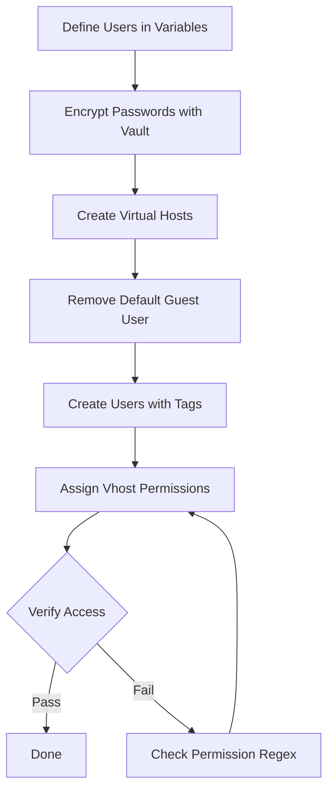

# How to Use Ansible to Configure RabbitMQ Users and Vhosts

Author: [nawazdhandala](https://www.github.com/nawazdhandala)

Tags: Ansible, RabbitMQ, Access Control, Message Queue

Description: Automate RabbitMQ user creation, virtual host management, and permission assignment using Ansible for secure multi-tenant messaging.

---

RabbitMQ supports multi-tenancy through virtual hosts (vhosts) and fine-grained user permissions. Each vhost acts as an isolated messaging environment with its own exchanges, queues, and bindings. Users can be granted different levels of access to different vhosts. Managing this by hand works when you have two services. When you have twenty services across multiple environments, you need automation.

This guide covers using Ansible to manage RabbitMQ users, virtual hosts, and permissions.

## How RabbitMQ Access Control Works

RabbitMQ has a simple but effective permission model:

- **Users** authenticate with a username and password
- **Virtual hosts** provide namespace isolation
- **Permissions** grant configure, write, and read access within a vhost, matched by regex patterns against resource names

The three permission types control:
- **Configure**: create/delete exchanges and queues
- **Write**: publish messages to exchanges, bind queues
- **Read**: consume messages from queues, get messages, purge queues

## Prerequisites

Install the `community.rabbitmq` collection for native Ansible modules.

```bash
# Install the RabbitMQ collection from Galaxy
ansible-galaxy collection install community.rabbitmq
```

## Inventory

```ini
# inventory/rabbitmq.ini
[rabbitmq_servers]
rabbit-1 ansible_host=10.0.7.10

[rabbitmq_servers:vars]
ansible_user=ubuntu
```

## Defining Users and Vhosts as Variables

Keep your user and vhost definitions in a clean variable file so they are easy to review and update.

```yaml
# group_vars/rabbitmq_servers.yml
---
# Virtual hosts to create
rabbitmq_vhosts:
  - name: /production
    description: "Production application messaging"
  - name: /staging
    description: "Staging environment messaging"
  - name: /monitoring
    description: "Monitoring and alerting events"

# Users and their permissions
rabbitmq_users:
  - name: order_service
    password: "{{ vault_order_service_password }}"
    tags: []
    permissions:
      - vhost: /production
        configure: "^order\\..*"
        write: "^order\\..*"
        read: "^order\\..*|^notification\\..*"

  - name: notification_service
    password: "{{ vault_notification_service_password }}"
    tags: []
    permissions:
      - vhost: /production
        configure: "^notification\\..*"
        write: "^notification\\..*"
        read: "^notification\\..*"

  - name: monitoring_agent
    password: "{{ vault_monitoring_password }}"
    tags: ["monitoring"]
    permissions:
      - vhost: /production
        configure: ""
        write: ""
        read: ".*"
      - vhost: /monitoring
        configure: ".*"
        write: ".*"
        read: ".*"

  - name: admin_user
    password: "{{ vault_admin_password }}"
    tags: ["administrator"]
    permissions:
      - vhost: /production
        configure: ".*"
        write: ".*"
        read: ".*"
      - vhost: /staging
        configure: ".*"
        write: ".*"
        read: ".*"
      - vhost: /monitoring
        configure: ".*"
        write: ".*"
        read: ".*"
```

## Creating Virtual Hosts

```yaml
# playbooks/create-vhosts.yml
---
- name: Create RabbitMQ virtual hosts
  hosts: rabbitmq_servers
  become: true

  tasks:
    - name: Create each virtual host
      community.rabbitmq.rabbitmq_vhost:
        name: "{{ item.name }}"
        state: present
      loop: "{{ rabbitmq_vhosts }}"
      loop_control:
        label: "{{ item.name }}"

    - name: List all virtual hosts to confirm
      ansible.builtin.command:
        cmd: rabbitmqctl list_vhosts
      register: vhost_list
      changed_when: false

    - name: Display virtual hosts
      ansible.builtin.debug:
        msg: "{{ vhost_list.stdout_lines }}"
```

## Creating Users

```yaml
# playbooks/create-users.yml
---
- name: Create RabbitMQ users
  hosts: rabbitmq_servers
  become: true
  vars_files:
    - ../vault/rabbitmq-secrets.yml

  tasks:
    - name: Remove the default guest user
      community.rabbitmq.rabbitmq_user:
        user: guest
        state: absent

    - name: Create each application user
      community.rabbitmq.rabbitmq_user:
        user: "{{ item.name }}"
        password: "{{ item.password }}"
        tags: "{{ item.tags | join(',') }}"
        state: present
        update_password: always
      loop: "{{ rabbitmq_users }}"
      loop_control:
        label: "{{ item.name }}"
      no_log: true
```

## Assigning Permissions

Permissions are the most important part. Each user gets specific access patterns for each vhost.

```yaml
# playbooks/assign-permissions.yml
---
- name: Assign RabbitMQ permissions
  hosts: rabbitmq_servers
  become: true
  vars_files:
    - ../vault/rabbitmq-secrets.yml

  tasks:
    - name: Set permissions for each user on each vhost
      community.rabbitmq.rabbitmq_user:
        user: "{{ item.0.name }}"
        password: "{{ item.0.password }}"
        vhost: "{{ item.1.vhost }}"
        configure_priv: "{{ item.1.configure }}"
        write_priv: "{{ item.1.write }}"
        read_priv: "{{ item.1.read }}"
        state: present
      loop: "{{ rabbitmq_users | subelements('permissions') }}"
      loop_control:
        label: "{{ item.0.name }} -> {{ item.1.vhost }}"
      no_log: true
```

The `subelements` filter is key here. It flattens the nested structure so each user-permission pair becomes a separate loop iteration.

## Combined Playbook

Here is a single playbook that does everything in the right order.

```yaml
# playbooks/configure-rabbitmq-access.yml
---
- name: Configure RabbitMQ users and virtual hosts
  hosts: rabbitmq_servers
  become: true
  vars_files:
    - ../vault/rabbitmq-secrets.yml

  tasks:
    - name: Create virtual hosts
      community.rabbitmq.rabbitmq_vhost:
        name: "{{ item.name }}"
        state: present
      loop: "{{ rabbitmq_vhosts }}"
      loop_control:
        label: "{{ item.name }}"

    - name: Remove the default guest user
      community.rabbitmq.rabbitmq_user:
        user: guest
        state: absent

    - name: Create users and assign permissions
      community.rabbitmq.rabbitmq_user:
        user: "{{ item.0.name }}"
        password: "{{ item.0.password }}"
        tags: "{{ item.0.tags | join(',') }}"
        vhost: "{{ item.1.vhost }}"
        configure_priv: "{{ item.1.configure }}"
        write_priv: "{{ item.1.write }}"
        read_priv: "{{ item.1.read }}"
        state: present
      loop: "{{ rabbitmq_users | subelements('permissions') }}"
      loop_control:
        label: "{{ item.0.name }} -> {{ item.1.vhost }}"
      no_log: true
```

## Permission Pattern Examples

Understanding the regex patterns is crucial. Here are common patterns.

```yaml
# Full access to everything in the vhost
configure: ".*"
write: ".*"
read: ".*"

# Read-only access (monitoring, auditing)
configure: ""   # Empty string means no access
write: ""
read: ".*"

# Access only to resources prefixed with the service name
configure: "^myservice\\..*"
write: "^myservice\\..*"
read: "^myservice\\..*"

# Write to one exchange, read from a specific queue
configure: ""
write: "^events\\.exchange$"
read: "^myservice\\.queue$"
```

## Permission Flow



## Verifying Permissions

After setting permissions, verify they are correct.

```yaml
# playbooks/verify-rabbitmq-access.yml
---
- name: Verify RabbitMQ user permissions
  hosts: rabbitmq_servers
  become: true

  tasks:
    - name: List all users
      ansible.builtin.command:
        cmd: rabbitmqctl list_users
      register: user_list
      changed_when: false

    - name: Display all users
      ansible.builtin.debug:
        msg: "{{ user_list.stdout_lines }}"

    - name: Check permissions for each vhost
      ansible.builtin.command:
        cmd: "rabbitmqctl list_permissions -p {{ item.name }}"
      register: perm_list
      changed_when: false
      loop: "{{ rabbitmq_vhosts }}"
      loop_control:
        label: "{{ item.name }}"

    - name: Display permissions per vhost
      ansible.builtin.debug:
        msg: "{{ item.stdout_lines }}"
      loop: "{{ perm_list.results }}"
      loop_control:
        label: "{{ item.item.name }}"

    - name: Verify a specific user can authenticate
      ansible.builtin.uri:
        url: "http://{{ ansible_host }}:15672/api/whoami"
        method: GET
        user: admin_user
        password: "{{ vault_admin_password }}"
        status_code: 200
      no_log: true
```

## Removing Users and Vhosts

When decommissioning services, clean up their RabbitMQ resources.

```yaml
# playbooks/cleanup-rabbitmq-access.yml
---
- name: Remove decommissioned RabbitMQ users and vhosts
  hosts: rabbitmq_servers
  become: true
  vars:
    users_to_remove:
      - old_service_user
      - temp_debug_user
    vhosts_to_remove:
      - /deprecated-app

  tasks:
    - name: Remove users
      community.rabbitmq.rabbitmq_user:
        user: "{{ item }}"
        state: absent
      loop: "{{ users_to_remove }}"

    - name: Remove virtual hosts (and all their resources)
      community.rabbitmq.rabbitmq_vhost:
        name: "{{ item }}"
        state: absent
      loop: "{{ vhosts_to_remove }}"
```

## Using Topic Permissions for Fine-Grained Control

If you use topic exchanges, RabbitMQ supports topic-level permissions that control which routing keys a user can publish or consume.

```yaml
    - name: Set topic permissions for the order service
      ansible.builtin.command:
        cmd: >
          rabbitmqctl set_topic_permissions -p /production
          order_service
          "amq.topic"
          "^order\\..*"
          "^order\\..*"
      changed_when: true
```

## Best Practices

1. **Use the principle of least privilege.** Give each service only the permissions it needs. An order service should not be able to read from the notification queue.

2. **Prefix resources with service names.** Use naming conventions like `order.exchange`, `order.queue.new`, `notification.queue.email`. This makes regex-based permissions clean and predictable.

3. **Never use the guest account in production.** Remove it immediately. It is a known target for automated attacks on exposed RabbitMQ instances.

4. **Store passwords in Ansible Vault.** Never commit plaintext passwords to version control. Use `no_log: true` on every task that handles credentials.

5. **Audit permissions regularly.** Run the verification playbook as part of your CI/CD pipeline. When services are decommissioned, make sure their users are cleaned up.

## Conclusion

Managing RabbitMQ users and virtual hosts with Ansible gives you a centralized, version-controlled way to handle access control. By defining users and permissions as variables, encrypting passwords with Vault, and using the `community.rabbitmq` modules, you get consistent access control across every RabbitMQ instance in your infrastructure. The regex-based permission system is powerful once you establish naming conventions for your exchanges and queues.
