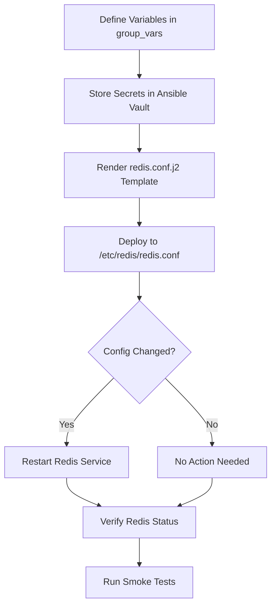

# How to Use Ansible to Configure Redis

Author: [nawazdhandala](https://www.github.com/nawazdhandala)

Tags: Ansible, Redis, Configuration Management, Performance Tuning

Description: Step-by-step guide to configuring Redis settings, persistence, security, and performance using Ansible automation.

---

Installing Redis is the easy part. Getting the configuration right for your workload is where it gets interesting. Redis ships with a default config that works for development but falls short in production. Memory limits, persistence strategy, security settings, and performance tuning all need attention. Doing this by hand across multiple servers leads to drift and mistakes. Ansible lets you template your Redis configuration and push it consistently to every node.

This guide covers how to use Ansible to configure Redis for real production workloads.

## The Redis Configuration File

Redis uses a single configuration file, typically at `/etc/redis/redis.conf`. It is a flat key-value format that is easy to template with Jinja2. The strategy is simple: maintain a Jinja2 template for `redis.conf`, define your settings as Ansible variables, and push the rendered config to every Redis server.

## Project Structure

Organize your Ansible project like this.

```
redis-config/
  inventory/
    redis.ini
  group_vars/
    redis_servers.yml
  templates/
    redis.conf.j2
  playbooks/
    configure-redis.yml
  vault/
    redis-secrets.yml
```

## Defining Configuration Variables

Put your Redis configuration parameters in group variables so they are easy to override per environment.

```yaml
# group_vars/redis_servers.yml
---
# Network settings
redis_bind_address: "127.0.0.1"
redis_port: 6379
redis_protected_mode: "yes"
redis_tcp_backlog: 511
redis_timeout: 300
redis_tcp_keepalive: 300

# Memory settings
redis_maxmemory: "512mb"
redis_maxmemory_policy: "allkeys-lru"
redis_maxmemory_samples: 5

# Persistence - RDB snapshots
redis_save_rules:
  - "900 1"    # Save if at least 1 key changed in 900 seconds
  - "300 10"   # Save if at least 10 keys changed in 300 seconds
  - "60 10000" # Save if at least 10000 keys changed in 60 seconds
redis_rdb_filename: "dump.rdb"
redis_rdb_dir: "/var/lib/redis"

# Persistence - AOF
redis_aof_enabled: true
redis_aof_filename: "appendonly.aof"
redis_aof_fsync: "everysec"

# Logging
redis_loglevel: "notice"
redis_logfile: "/var/log/redis/redis-server.log"

# Security
redis_require_password: true

# Performance
redis_hz: 10
redis_dynamic_hz: true
redis_lazyfree_lazy_eviction: true
redis_lazyfree_lazy_expire: true
redis_lazyfree_lazy_server_del: true
```

## Creating the Jinja2 Template

This is the core of the configuration management. The template renders a complete `redis.conf` from your variables.

```jinja2
# templates/redis.conf.j2
# Redis configuration - managed by Ansible
# Do not edit manually. Changes will be overwritten.

# Network
bind {{ redis_bind_address }}
port {{ redis_port }}
protected-mode {{ redis_protected_mode }}
tcp-backlog {{ redis_tcp_backlog }}
timeout {{ redis_timeout }}
tcp-keepalive {{ redis_tcp_keepalive }}

# General
daemonize no
supervised systemd
pidfile /var/run/redis/redis-server.pid
loglevel {{ redis_loglevel }}
logfile {{ redis_logfile }}
databases 16

# Snapshotting (RDB)

save {{ rule }}

stop-writes-on-bgsave-error yes
rdbcompression yes
rdbchecksum yes
dbfilename {{ redis_rdb_filename }}
dir {{ redis_rdb_dir }}

# Replication

replicaof {{ redis_replica_of.host }} {{ redis_replica_of.port }}


replica-read-only {{ redis_replica_read_only | lower }}


# Security

requirepass {{ redis_password }}


masterauth {{ redis_masterauth }}


# Memory management
maxmemory {{ redis_maxmemory }}
maxmemory-policy {{ redis_maxmemory_policy }}
maxmemory-samples {{ redis_maxmemory_samples }}

# Lazy freeing
lazyfree-lazy-eviction {{ redis_lazyfree_lazy_eviction | lower }}
lazyfree-lazy-expire {{ redis_lazyfree_lazy_expire | lower }}
lazyfree-lazy-server-del {{ redis_lazyfree_lazy_server_del | lower }}

# Append Only File
appendonly {{ "yes" if redis_aof_enabled else "no" }}
appendfilename "{{ redis_aof_filename }}"
appendfsync {{ redis_aof_fsync }}
no-appendfsync-on-rewrite no
auto-aof-rewrite-percentage 100
auto-aof-rewrite-min-size 64mb

# Performance tuning
hz {{ redis_hz }}
dynamic-hz {{ "yes" if redis_dynamic_hz else "no" }}

# Slow log - captures commands taking longer than 10ms
slowlog-log-slower-than 10000
slowlog-max-len 128
```

## The Configuration Playbook

This playbook deploys the configuration and restarts Redis when changes are detected.

```yaml
# playbooks/configure-redis.yml
---
- name: Configure Redis servers
  hosts: redis_servers
  become: true
  vars_files:
    - ../vault/redis-secrets.yml

  tasks:
    - name: Create Redis log directory
      ansible.builtin.file:
        path: /var/log/redis
        state: directory
        owner: redis
        group: redis
        mode: "0750"

    - name: Create Redis data directory
      ansible.builtin.file:
        path: "{{ redis_rdb_dir }}"
        state: directory
        owner: redis
        group: redis
        mode: "0750"

    - name: Deploy the Redis configuration file
      ansible.builtin.template:
        src: ../templates/redis.conf.j2
        dest: /etc/redis/redis.conf
        owner: redis
        group: redis
        mode: "0640"
        backup: true
      notify: Restart Redis
      register: redis_config

    - name: Display config change status
      ansible.builtin.debug:
        msg: "Redis config was {{ 'updated' if redis_config.changed else 'unchanged' }}"

  handlers:
    - name: Restart Redis
      ansible.builtin.systemd:
        name: redis-server
        state: restarted
```

## Configuring Different Environments

Use host-specific or group-specific variables to customize Redis for different environments.

```yaml
# group_vars/production_redis.yml
---
redis_maxmemory: "4gb"
redis_maxmemory_policy: "volatile-lru"
redis_bind_address: "0.0.0.0"
redis_protected_mode: "no"  # Firewall handles access control
redis_aof_enabled: true
redis_aof_fsync: "everysec"
redis_loglevel: "warning"
redis_save_rules:
  - "900 1"
  - "300 10"
```

```yaml
# group_vars/development_redis.yml
---
redis_maxmemory: "256mb"
redis_maxmemory_policy: "allkeys-lru"
redis_bind_address: "0.0.0.0"
redis_protected_mode: "no"
redis_aof_enabled: false
redis_loglevel: "debug"
redis_save_rules: []  # No persistence in dev
```

## Runtime Configuration Changes

Sometimes you need to change a setting without restarting Redis. The `CONFIG SET` command lets you do this for most parameters.

```yaml
# playbooks/runtime-config-update.yml
---
- name: Apply runtime Redis configuration changes
  hosts: redis_servers
  become: true
  vars_files:
    - ../vault/redis-secrets.yml

  tasks:
    - name: Update maxmemory at runtime without restart
      ansible.builtin.command:
        cmd: >
          redis-cli -a {{ redis_password }}
          CONFIG SET maxmemory {{ redis_maxmemory }}
      changed_when: true
      no_log: true

    - name: Update maxmemory-policy at runtime
      ansible.builtin.command:
        cmd: >
          redis-cli -a {{ redis_password }}
          CONFIG SET maxmemory-policy {{ redis_maxmemory_policy }}
      changed_when: true
      no_log: true

    - name: Persist runtime changes to the config file
      ansible.builtin.command:
        cmd: redis-cli -a {{ redis_password }} CONFIG REWRITE
      changed_when: true
      no_log: true
```

## Configuration Flow Diagram



## Validating Configuration

After deploying config changes, verify everything is working.

```yaml
# playbooks/validate-redis-config.yml
---
- name: Validate Redis configuration
  hosts: redis_servers
  become: true
  vars_files:
    - ../vault/redis-secrets.yml

  tasks:
    - name: Check Redis is responding
      ansible.builtin.command:
        cmd: redis-cli -a {{ redis_password }} ping
      register: redis_ping
      changed_when: false
      no_log: true

    - name: Verify maxmemory setting
      ansible.builtin.command:
        cmd: redis-cli -a {{ redis_password }} CONFIG GET maxmemory
      register: maxmemory_check
      changed_when: false
      no_log: true

    - name: Verify persistence settings
      ansible.builtin.command:
        cmd: redis-cli -a {{ redis_password }} CONFIG GET appendonly
      register: aof_check
      changed_when: false
      no_log: true

    - name: Show configuration summary
      ansible.builtin.debug:
        msg:
          - "Ping: {{ redis_ping.stdout }}"
          - "Max Memory: {{ maxmemory_check.stdout_lines }}"
          - "AOF Enabled: {{ aof_check.stdout_lines }}"
```

## Common Configuration Mistakes

Here are some things I have seen go wrong in production:

1. **Setting `maxmemory` too high.** If Redis uses all system RAM, the OS starts swapping, and performance collapses. Leave at least 2GB for the OS and other processes.

2. **Using `allkeys-random` eviction.** This evicts keys randomly regardless of access patterns. Use `allkeys-lru` or `volatile-lru` instead so frequently accessed keys stay in memory.

3. **Enabling AOF with `always` fsync.** This forces a disk sync on every write and destroys throughput. Use `everysec` unless you absolutely cannot afford to lose even one second of writes.

4. **Binding to `0.0.0.0` without a password or firewall.** Redis has no built-in authentication that is resistant to brute force. If you expose it to the network, set a strong password and use firewall rules.

5. **Forgetting to set `tcp-keepalive`.** Without it, idle connections pile up and you run into file descriptor limits.

## Conclusion

Redis configuration with Ansible is all about templating. Build a solid Jinja2 template, define your settings as variables, and let Ansible handle the deployment. The key is to separate your base config from environment-specific overrides so you can reuse the same template everywhere. Combined with Ansible Vault for password management and handlers for service restarts, you get a configuration pipeline that is consistent, auditable, and easy to maintain.
