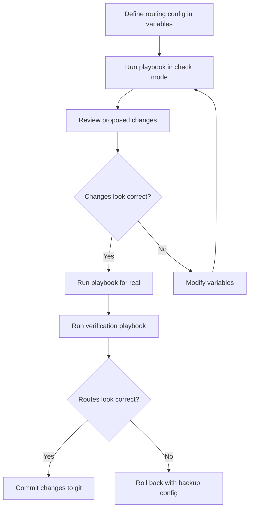

# How to Use Ansible to Configure Routing on Network Devices

Author: [nawazdhandala](https://www.github.com/nawazdhandala)

Tags: Ansible, Routing, Network Automation, Infrastructure

Description: Automate static and dynamic routing configuration on network devices using Ansible playbooks with practical examples for OSPF, BGP, and static routes.

---

Routing is the backbone of any network. Whether you are setting up static routes on a branch office router or deploying OSPF across a campus, getting the routing configuration right is critical. Mistakes here mean traffic does not flow, services go down, and phones start ringing.

Ansible lets you manage routing configuration as code. You define your routing topology in variables, push it to your routers with playbooks, and track changes in version control. This post covers static routes, OSPF, BGP, and some practical patterns for managing routing at scale.

## Static Route Configuration

Static routes are the simplest form of routing. They are perfect for stub networks, default routes, and specific traffic engineering paths. Ansible provides the `ios_static_routes` resource module for managing them declaratively.

```yaml
# static_routes.yml - Configure static routes on branch routers
---
- name: Configure static routes
  hosts: branch_routers
  gather_facts: false
  connection: network_cli

  tasks:
    - name: Set static routes
      cisco.ios.ios_static_routes:
        config:
          - address_families:
              - afi: ipv4
                routes:
                  # Default route to ISP
                  - dest: 0.0.0.0/0
                    next_hops:
                      - forward_router_address: 203.0.113.1
                        name: DEFAULT_TO_ISP
                        admin_distance: 1
                  # Route to data center network
                  - dest: 10.0.0.0/8
                    next_hops:
                      - forward_router_address: 10.1.1.1
                        name: TO_DATACENTER
                  # Null route for aggregate advertisement
                  - dest: 172.16.0.0/16
                    next_hops:
                      - interface: "Null0"
                        name: AGGREGATE_SUMMARY

              - afi: ipv6
                routes:
                  - dest: ::/0
                    next_hops:
                      - forward_router_address: "2001:db8::1"
                        name: DEFAULT_V6
        state: merged
```

## Managing Static Routes with Variables

For environments with many branch offices, define routes per site and loop over them.

```yaml
# host_vars/branch-rtr01.yml - Per-site route definitions
---
site_name: "Branch Office NYC"

static_routes_v4:
  - dest: 0.0.0.0/0
    next_hop: 203.0.113.1
    name: ISP_DEFAULT
    distance: 1
  - dest: 0.0.0.0/0
    next_hop: 203.0.113.5
    name: ISP_BACKUP
    distance: 10
  - dest: 10.0.0.0/8
    next_hop: 10.1.1.1
    name: MPLS_TO_DC
```

```yaml
# deploy_static_routes.yml - Apply site-specific routes from host_vars
---
- name: Deploy static routes to branch routers
  hosts: branch_routers
  gather_facts: false
  connection: network_cli

  tasks:
    - name: Configure static routes from variables
      cisco.ios.ios_config:
        lines:
          - "ip route {{ item.dest }} {{ item.next_hop }} name {{ item.name }} {{ item.distance | default('') }}"
      loop: "{{ static_routes_v4 }}"

    - name: Verify routes are in the routing table
      cisco.ios.ios_command:
        commands:
          - show ip route static
      register: route_table

    - name: Display static routes
      ansible.builtin.debug:
        var: route_table.stdout_lines[0]
```

## OSPF Configuration

OSPF is the most widely deployed interior gateway protocol. Ansible provides the `ios_ospfv2` resource module for managing OSPF configuration.

```yaml
# configure_ospf.yml - Deploy OSPF across campus routers
---
- name: Configure OSPF
  hosts: campus_routers
  gather_facts: false
  connection: network_cli

  tasks:
    - name: Configure OSPF process
      cisco.ios.ios_ospfv2:
        config:
          processes:
            - process_id: 1
              router_id: "{{ router_id }}"
              # Passive interface default - only enable OSPF on specific links
              passive_interfaces:
                default: true
                set_interface: false
                interface:
                  name:
                    - GigabitEthernet0/0
                    - GigabitEthernet0/1
              areas:
                - area_id: "0"
                  ranges:
                    - address: 10.0.0.0
                      netmask: 255.0.0.0
              # Redistribute connected and static routes
              redistribute:
                - connected:
                    set: true
                    route_map: CONNECTED_TO_OSPF
                - static:
                    set: true
                    route_map: STATIC_TO_OSPF
        state: merged
```

For the network statements, you often need to use `ios_config` for more granular control.

```yaml
# ospf_networks.yml - Configure OSPF network statements
---
- name: Configure OSPF network statements
  hosts: campus_routers
  gather_facts: false
  connection: network_cli

  vars:
    ospf_networks:
      - network: 10.1.0.0
        wildcard: 0.0.255.255
        area: 0
      - network: 10.2.0.0
        wildcard: 0.0.255.255
        area: 1
      - network: 10.255.0.0
        wildcard: 0.0.0.255
        area: 0

  tasks:
    - name: Add OSPF network statements
      cisco.ios.ios_config:
        lines:
          - "network {{ item.network }} {{ item.wildcard }} area {{ item.area }}"
        parents: router ospf 1
      loop: "{{ ospf_networks }}"

    # Set OSPF interface-level parameters
    - name: Configure OSPF on point-to-point WAN links
      cisco.ios.ios_config:
        lines:
          - ip ospf network point-to-point
          - ip ospf cost 100
          - ip ospf hello-interval 10
          - ip ospf dead-interval 40
        parents: "interface {{ item }}"
      loop:
        - GigabitEthernet0/0
        - GigabitEthernet0/1
```

## BGP Configuration

BGP is used for inter-AS routing, connections to ISPs, and increasingly within data centers (eBGP-based fabrics). The `ios_bgp_global` and `ios_bgp_address_family` modules handle BGP configuration.

```yaml
# configure_bgp.yml - Set up BGP peering and route advertisements
---
- name: Configure BGP
  hosts: edge_routers
  gather_facts: false
  connection: network_cli

  tasks:
    - name: Configure BGP global settings
      cisco.ios.ios_bgp_global:
        config:
          as_number: "65001"
          router_id: "{{ router_id }}"
          log_neighbor_changes: true
          neighbors:
            # eBGP peer to ISP
            - neighbor_address: 203.0.113.1
              remote_as: "64512"
              description: "ISP-PRIMARY"
              timers:
                keepalive: 30
                holdtime: 90
            # iBGP peer to other edge router
            - neighbor_address: 10.255.0.2
              remote_as: "65001"
              description: "EDGE-RTR02"
              update_source: Loopback0
        state: merged

    - name: Configure BGP address family
      cisco.ios.ios_bgp_address_family:
        config:
          as_number: "65001"
          address_family:
            - afi: ipv4
              safi: unicast
              neighbors:
                - neighbor_address: 203.0.113.1
                  activate: true
                  route_map:
                    name: ISP_INBOUND
                    in: true
                - neighbor_address: 203.0.113.1
                  route_map:
                    name: ISP_OUTBOUND
                    out: true
              networks:
                - address: 10.0.0.0
                  mask: 255.0.0.0
                - address: 172.16.0.0
                  mask: 255.255.0.0
        state: merged
```

## Route Maps and Prefix Lists

Route maps and prefix lists control route redistribution and filtering. Configure them with `ios_config`.

```yaml
# route_policy.yml - Create prefix lists and route maps for route filtering
---
- name: Configure routing policy
  hosts: routers
  gather_facts: false
  connection: network_cli

  tasks:
    # Create prefix lists to match routes
    - name: Configure prefix lists
      cisco.ios.ios_config:
        lines:
          - ip prefix-list INTERNAL_NETS seq 10 permit 10.0.0.0/8 le 24
          - ip prefix-list INTERNAL_NETS seq 20 permit 172.16.0.0/12 le 24
          - ip prefix-list INTERNAL_NETS seq 30 permit 192.168.0.0/16 le 24
          - ip prefix-list DEFAULT_ONLY seq 10 permit 0.0.0.0/0

    # Create route maps for redistribution control
    - name: Configure route maps
      cisco.ios.ios_config:
        lines:
          - match ip address prefix-list INTERNAL_NETS
          - set metric 100
        parents: route-map CONNECTED_TO_OSPF permit 10

    - name: Configure inbound route filtering from ISP
      cisco.ios.ios_config:
        lines:
          - match ip address prefix-list DEFAULT_ONLY
        parents: route-map ISP_INBOUND permit 10

    # Deny everything else implicitly
    - name: Configure outbound route map to ISP
      cisco.ios.ios_config:
        lines:
          - match ip address prefix-list INTERNAL_NETS
        parents: route-map ISP_OUTBOUND permit 10
```

## Verifying Routing Configuration

After deploying routing changes, always verify that routes are being learned and traffic paths are correct.

```yaml
# verify_routing.yml - Check that routing is working after deployment
---
- name: Verify routing deployment
  hosts: routers
  gather_facts: false
  connection: network_cli

  tasks:
    - name: Check routing table
      cisco.ios.ios_command:
        commands:
          - show ip route summary
      register: route_summary

    - name: Display route summary
      ansible.builtin.debug:
        var: route_summary.stdout_lines[0]

    - name: Check OSPF neighbors
      cisco.ios.ios_command:
        commands:
          - show ip ospf neighbor
      register: ospf_neighbors

    - name: Verify all OSPF neighbors are FULL
      ansible.builtin.debug:
        msg: "OSPF neighbors: {{ ospf_neighbors.stdout[0] }}"

    - name: Check BGP summary
      cisco.ios.ios_command:
        commands:
          - show ip bgp summary
      register: bgp_summary

    - name: Display BGP peer status
      ansible.builtin.debug:
        var: bgp_summary.stdout_lines[0]

    # Test reachability to critical destinations
    - name: Ping data center gateway
      cisco.ios.ios_command:
        commands:
          - ping 10.0.0.1 repeat 5
      register: ping_result

    - name: Verify ping success
      ansible.builtin.assert:
        that:
          - "'Success rate is 100 percent' in ping_result.stdout[0]"
        fail_msg: "Ping to data center gateway failed!"
        success_msg: "Data center reachability confirmed"
```

## Routing Configuration Workflow

Here is the workflow I recommend for routing changes in production.



Managing routing with Ansible brings consistency and auditability to one of the most critical parts of your network. Every change is tracked in version control, every deployment is repeatable, and verification is automated. Start with static routes to get comfortable, then move into OSPF and BGP as your confidence grows.
