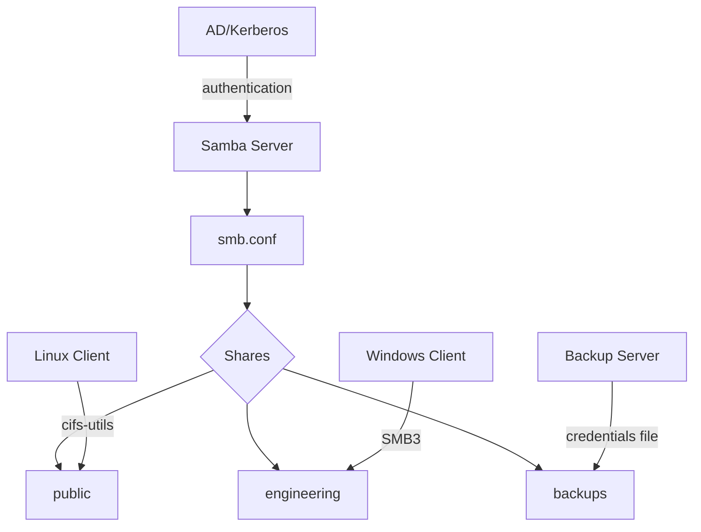

# How to Use Ansible to Configure SMB/CIFS Mounts

Author: [nawazdhandala](https://www.github.com/nawazdhandala)

Tags: Ansible, SMB, CIFS, Samba, File Sharing

Description: Automate SMB/CIFS share mounting and Samba server configuration on Linux using Ansible for cross-platform file sharing with Windows and other systems.

---

If you work in a mixed Linux and Windows environment, SMB/CIFS is unavoidable. It is the protocol Windows uses for file sharing, and Linux has solid support for it through both Samba (server) and cifs-utils (client). Managing SMB mounts across a fleet of Linux servers is a common task that Ansible handles well, including the tricky parts like credential management and persistent mounts.

## Installing SMB/CIFS Client Tools

Before mounting any SMB shares, the client packages need to be in place.

This playbook installs the necessary SMB/CIFS client packages:

```yaml
# install-smb-client.yml - Install CIFS/SMB client tools
---
- name: Install SMB Client Tools
  hosts: all
  become: true
  tasks:
    - name: Install CIFS utilities on Debian
      ansible.builtin.apt:
        name:
          - cifs-utils
          - smbclient
        state: present
        update_cache: true
      when: ansible_os_family == "Debian"

    - name: Install CIFS utilities on RHEL
      ansible.builtin.yum:
        name:
          - cifs-utils
          - samba-client
        state: present
      when: ansible_os_family == "RedHat"
```

## Mounting SMB Shares with Credentials

The most common scenario is mounting a Windows file share on a Linux server. Credentials need to be stored securely.

This playbook mounts SMB shares using a credentials file:

```yaml
# mount-smb-shares.yml - Mount SMB/CIFS shares
---
- name: Mount SMB Shares
  hosts: app_servers
  become: true
  vars:
    smb_mounts:
      - name: shared_data
        src: "//fileserver.example.com/shared"
        path: /mnt/smb/shared
        username: "{{ vault_smb_username }}"
        password: "{{ vault_smb_password }}"
        domain: EXAMPLE
        uid: 1000
        gid: 1000
        file_mode: "0664"
        dir_mode: "0775"
      - name: app_config
        src: "//fileserver.example.com/appconfig"
        path: /mnt/smb/appconfig
        username: "{{ vault_smb_username }}"
        password: "{{ vault_smb_password }}"
        domain: EXAMPLE
        uid: 1000
        gid: 1000
        file_mode: "0644"
        dir_mode: "0755"

  tasks:
    - name: Create credentials directory
      ansible.builtin.file:
        path: /etc/samba/credentials
        state: directory
        owner: root
        group: root
        mode: '0700'

    - name: Create credentials file for each mount
      ansible.builtin.copy:
        dest: "/etc/samba/credentials/{{ item.name }}"
        owner: root
        group: root
        mode: '0600'
        content: |
          username={{ item.username }}
          password={{ item.password }}
          domain={{ item.domain }}
      loop: "{{ smb_mounts }}"
      loop_control:
        label: "{{ item.name }}"
      no_log: true

    - name: Create mount point directories
      ansible.builtin.file:
        path: "{{ item.path }}"
        state: directory
        mode: '0755'
      loop: "{{ smb_mounts }}"
      loop_control:
        label: "{{ item.path }}"

    - name: Mount SMB shares and add to fstab
      ansible.posix.mount:
        path: "{{ item.path }}"
        src: "{{ item.src }}"
        fstype: cifs
        opts: "credentials=/etc/samba/credentials/{{ item.name }},uid={{ item.uid }},gid={{ item.gid }},file_mode={{ item.file_mode }},dir_mode={{ item.dir_mode }},vers=3.0,_netdev,nofail"
        state: mounted
      loop: "{{ smb_mounts }}"
      loop_control:
        label: "{{ item.path }}"
```

## Setting Up a Samba Server

Sometimes you need Linux to serve files over SMB to Windows clients. Here is a complete Samba server setup.

This playbook installs and configures a Samba file server:

```yaml
# configure-samba-server.yml - Set up Samba file server
---
- name: Configure Samba Server
  hosts: file_servers
  become: true
  vars:
    samba_workgroup: WORKGROUP
    samba_server_string: "File Server managed by Ansible"
    samba_shares:
      - name: public
        path: /srv/samba/public
        comment: "Public share - read/write for all"
        browseable: "yes"
        writable: "yes"
        guest_ok: "yes"
        create_mask: "0664"
        directory_mask: "0775"
      - name: engineering
        path: /srv/samba/engineering
        comment: "Engineering team files"
        browseable: "yes"
        writable: "yes"
        guest_ok: "no"
        valid_users: "@engineering"
        create_mask: "0660"
        directory_mask: "0770"
      - name: backups
        path: /srv/samba/backups
        comment: "Backup storage"
        browseable: "no"
        writable: "yes"
        guest_ok: "no"
        valid_users: "backup_user"
        create_mask: "0600"
        directory_mask: "0700"

  tasks:
    - name: Install Samba packages
      ansible.builtin.apt:
        name:
          - samba
          - samba-common
          - samba-common-bin
        state: present
        update_cache: true
      when: ansible_os_family == "Debian"

    - name: Create share directories
      ansible.builtin.file:
        path: "{{ item.path }}"
        state: directory
        mode: "{{ item.directory_mask }}"
        owner: root
        group: "{{ item.valid_users | default('root') | regex_replace('^@', '') }}"
      loop: "{{ samba_shares }}"
      loop_control:
        label: "{{ item.name }}"
      failed_when: false

    - name: Deploy Samba configuration
      ansible.builtin.template:
        src: smb.conf.j2
        dest: /etc/samba/smb.conf
        owner: root
        group: root
        mode: '0644'
        backup: true
        validate: 'testparm -s %s'
      notify: Restart Samba

    - name: Enable and start Samba services
      ansible.builtin.systemd:
        name: "{{ item }}"
        enabled: true
        state: started
      loop:
        - smbd
        - nmbd

  handlers:
    - name: Restart Samba
      ansible.builtin.systemd:
        name: smbd
        state: restarted
```

The Samba configuration template:

```jinja2
# smb.conf.j2 - Samba configuration
# Managed by Ansible - do not edit manually

[global]
   workgroup = {{ samba_workgroup }}
   server string = {{ samba_server_string }}
   security = user
   map to guest = Bad User
   dns proxy = no

   # Logging
   log file = /var/log/samba/log.%m
   max log size = 1000
   logging = file

   # Performance
   socket options = TCP_NODELAY IPTOS_LOWDELAY
   read raw = yes
   write raw = yes
   use sendfile = yes
   aio read size = 16384
   aio write size = 16384

   # Protocol versions
   server min protocol = SMB2
   server max protocol = SMB3

   # Disable printing (not needed on file servers)
   load printers = no
   printing = bsd
   printcap name = /dev/null
   disable spoolss = yes


[{{ share.name }}]
   comment = {{ share.comment }}
   path = {{ share.path }}
   browseable = {{ share.browseable }}
   writable = {{ share.writable }}
   guest ok = {{ share.guest_ok }}

   valid users = {{ share.valid_users }}

   create mask = {{ share.create_mask }}
   directory mask = {{ share.directory_mask }}


```

## Managing Samba Users

Samba maintains its own user database separate from Linux users. You need to add users to both.

This playbook creates Linux users and adds them to Samba:

```yaml
# manage-samba-users.yml - Create Samba users
---
- name: Manage Samba Users
  hosts: file_servers
  become: true
  vars:
    samba_users:
      - name: john
        password: "{{ vault_samba_john_password }}"
        groups:
          - engineering
      - name: jane
        password: "{{ vault_samba_jane_password }}"
        groups:
          - engineering
      - name: backup_user
        password: "{{ vault_samba_backup_password }}"
        groups: []

  tasks:
    - name: Create groups for Samba shares
      ansible.builtin.group:
        name: engineering
        state: present

    - name: Create Linux user accounts
      ansible.builtin.user:
        name: "{{ item.name }}"
        groups: "{{ item.groups }}"
        shell: /usr/sbin/nologin
        create_home: false
      loop: "{{ samba_users }}"
      loop_control:
        label: "{{ item.name }}"

    - name: Set Samba passwords
      ansible.builtin.shell: |
        echo -e "{{ item.password }}\n{{ item.password }}" | smbpasswd -a -s {{ item.name }}
      loop: "{{ samba_users }}"
      loop_control:
        label: "{{ item.name }}"
      no_log: true
      changed_when: true

    - name: Enable Samba users
      ansible.builtin.command:
        cmd: "smbpasswd -e {{ item.name }}"
      loop: "{{ samba_users }}"
      loop_control:
        label: "{{ item.name }}"
      changed_when: true
```

## Using Kerberos Authentication for SMB

In Active Directory environments, Kerberos authentication is preferred over password-based auth.

This playbook configures Kerberos-authenticated SMB mounts:

```yaml
# mount-smb-kerberos.yml - Kerberos-authenticated SMB
---
- name: Configure Kerberos SMB Mounts
  hosts: app_servers
  become: true
  vars:
    ad_domain: EXAMPLE.COM
    smb_share: "//fileserver.example.com/shared"
    smb_mount_point: /mnt/smb/shared

  tasks:
    - name: Install Kerberos and CIFS packages
      ansible.builtin.apt:
        name:
          - cifs-utils
          - krb5-user
          - keyutils
        state: present

    - name: Create mount point
      ansible.builtin.file:
        path: "{{ smb_mount_point }}"
        state: directory
        mode: '0755'

    - name: Mount with Kerberos authentication
      ansible.posix.mount:
        path: "{{ smb_mount_point }}"
        src: "{{ smb_share }}"
        fstype: cifs
        opts: "sec=krb5,cruid=1000,vers=3.0,_netdev,nofail"
        state: mounted

    - name: Create request-key configuration for CIFS
      ansible.builtin.copy:
        dest: /etc/request-key.d/cifs.idmap.conf
        mode: '0644'
        content: |
          create cifs.idmap * * /usr/sbin/cifs.idmap %k
          create dns_resolver * * /usr/sbin/cifs.upcall %k
```

## SMB Mount Health Check

This playbook verifies SMB mounts are working correctly:

```yaml
# check-smb-mounts.yml - Verify SMB mount health
---
- name: Check SMB Mount Health
  hosts: all
  become: true
  tasks:
    - name: List all CIFS mounts
      ansible.builtin.shell: |
        mount | grep cifs | awk '{print $3, $6}'
      register: cifs_mounts
      changed_when: false

    - name: Display CIFS mounts
      ansible.builtin.debug:
        msg: "CIFS mounts on {{ inventory_hostname }}: {{ cifs_mounts.stdout_lines }}"
      when: cifs_mounts.stdout_lines | length > 0

    - name: Test write access to mounted shares
      ansible.builtin.shell: |
        timeout 10 touch {{ item.path }}/.ansible-test && rm -f {{ item.path }}/.ansible-test && echo "OK" || echo "FAILED"
      register: write_test
      changed_when: false
      loop: "{{ smb_mounts | default([]) }}"
      loop_control:
        label: "{{ item.path }}"

    - name: Report mount status
      ansible.builtin.debug:
        msg: "{{ item.item.path }}: {{ item.stdout }}"
      loop: "{{ write_test.results | default([]) }}"
      loop_control:
        label: "{{ item.item.path | default('N/A') }}"
```

## SMB Architecture



## Troubleshooting Common Issues

**Permission denied on mount**: Check that the credentials file has the right username, password, and domain. Also verify the SMB protocol version matches what the server supports. Try adding `vers=3.0` or `vers=2.1` to your mount options.

**Mount hangs on boot**: Always use `_netdev` and `nofail` in your mount options. `_netdev` waits for networking, and `nofail` prevents the boot from stalling if the mount fails.

**Slow performance**: Bump up the SMB protocol version to 3.0 or higher. Also try adding `cache=loose` for read-heavy workloads, and ensure the read/write buffer sizes are adequate.

**Credential file permissions**: The credentials file must be owned by root with mode 0600. If it is world-readable, you have a security problem, and some CIFS implementations will refuse to use it.

SMB/CIFS integration with Ansible bridges the gap between Linux and Windows storage. Whether you are mounting Windows shares on Linux or serving files from Linux to Windows clients, these playbooks give you a solid, repeatable foundation.
