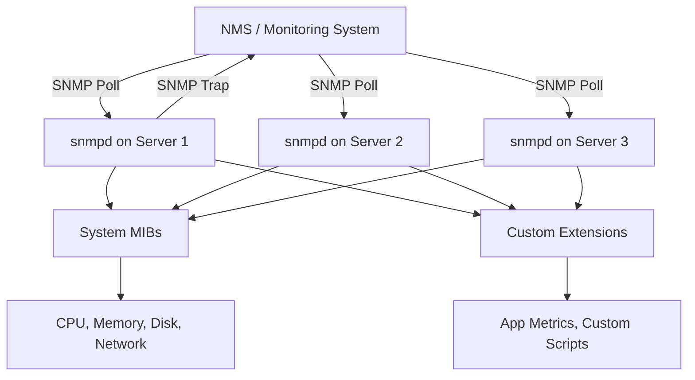

# How to Use Ansible to Configure SNMP

Author: [nawazdhandala](https://www.github.com/nawazdhandala)

Tags: Ansible, SNMP, Monitoring, Linux, Network Management

Description: Learn how to install and configure SNMP agents on Linux servers using Ansible for network monitoring and infrastructure management.

---

SNMP (Simple Network Management Protocol) has been the backbone of network monitoring for decades. While modern monitoring tools like Prometheus have gained popularity, SNMP remains essential in many environments, especially where you have a mix of network equipment, servers, and legacy systems. Ansible lets you deploy and configure SNMP agents (snmpd) across your entire fleet consistently, ensuring every host is discoverable and monitorable by your NMS (Network Management System).

## Prerequisites

- Ansible 2.9+ on your control node
- Linux target hosts with root or sudo access
- An NMS or monitoring system that polls SNMP (like Nagios, Zabbix, LibreNMS, or PRTG)
- Basic understanding of SNMP concepts (communities, OIDs, versions)

## Installing SNMP Packages

The first step is getting the SNMP daemon installed on all target hosts:

```yaml
# install_snmp.yml - Install SNMP packages on Debian and RHEL systems
---
- name: Install SNMP packages
  hosts: all
  become: true
  tasks:
    - name: Install SNMP on Debian/Ubuntu
      ansible.builtin.apt:
        name:
          - snmpd
          - snmp
          - snmp-mibs-downloader
        state: present
        update_cache: true
      when: ansible_os_family == "Debian"

    - name: Install SNMP on RHEL/CentOS
      ansible.builtin.yum:
        name:
          - net-snmp
          - net-snmp-utils
        state: present
      when: ansible_os_family == "RedHat"
```

## Basic SNMPv2c Configuration

SNMPv2c is the most commonly deployed version. It uses community strings (essentially passwords) for authentication. Here is a basic setup:

```yaml
# snmpv2_config.yml - Configure SNMPv2c agent
---
- name: Configure SNMPv2c
  hosts: all
  become: true
  vars:
    snmp_community: mySecretCommunity
    snmp_location: "Data Center 1, Rack A3"
    snmp_contact: "ops@example.com"
    snmp_allowed_hosts:
      - 10.0.5.10
      - 10.0.5.11
  tasks:
    - name: Deploy snmpd.conf
      ansible.builtin.template:
        src: templates/snmpd.conf.j2
        dest: /etc/snmp/snmpd.conf
        owner: root
        group: root
        mode: '0600'
        backup: true
      notify: Restart snmpd

    - name: Enable and start snmpd
      ansible.builtin.service:
        name: snmpd
        state: started
        enabled: true

    - name: Open SNMP port in firewall
      ansible.posix.firewalld:
        port: 161/udp
        permanent: true
        immediate: true
        state: enabled
      when: ansible_os_family == "RedHat"
      ignore_errors: true

  handlers:
    - name: Restart snmpd
      ansible.builtin.service:
        name: snmpd
        state: restarted
```

The snmpd.conf template for SNMPv2c:

```jinja2
# templates/snmpd.conf.j2 - SNMP agent configuration
# Managed by Ansible - do not edit manually

# System information
sysLocation    {{ snmp_location }}
sysContact     {{ snmp_contact }}
sysServices    72

# Access control - restrict to monitoring servers

com2sec monitoring {{ host }}/32 {{ snmp_community }}


# Map the security name to a group
group MonitoringGroup v2c monitoring

# Define what the group can access
view all included .1
access MonitoringGroup "" any noauth exact all none none

# Listen on all interfaces, UDP port 161
agentAddress udp:161

# Disk monitoring
disk / 10%
disk /var 10%

# Load average monitoring
load 12 10 5

# Process monitoring
# proc httpd
# proc sshd
```

## SNMPv3 Configuration (Recommended)

SNMPv3 adds authentication and encryption, making it much more secure than v2c. In production environments, SNMPv3 should be preferred:

```yaml
# snmpv3_config.yml - Configure SNMPv3 with authentication and encryption
---
- name: Configure SNMPv3
  hosts: all
  become: true
  vars:
    snmpv3_user: monitoruser
    snmpv3_auth_pass: "{{ vault_snmpv3_auth_pass }}"
    snmpv3_priv_pass: "{{ vault_snmpv3_priv_pass }}"
    snmpv3_auth_proto: SHA
    snmpv3_priv_proto: AES
    snmp_location: "Data Center 1"
    snmp_contact: "ops@example.com"
  tasks:
    - name: Stop snmpd before creating user
      ansible.builtin.service:
        name: snmpd
        state: stopped

    - name: Deploy base snmpd.conf for v3
      ansible.builtin.template:
        src: templates/snmpd-v3.conf.j2
        dest: /etc/snmp/snmpd.conf
        owner: root
        group: root
        mode: '0600'

    - name: Remove existing SNMPv3 users file
      ansible.builtin.file:
        path: /var/lib/snmp/snmpd.conf
        state: absent

    - name: Start snmpd to initialize
      ansible.builtin.service:
        name: snmpd
        state: started

    - name: Create SNMPv3 user
      ansible.builtin.command: >
        snmpusm -v3 -u initial -n "" -l noAuthNoPriv localhost
        create {{ snmpv3_user }} initial
      changed_when: true
      ignore_errors: true

    - name: Set SNMPv3 user authentication password
      ansible.builtin.command: >
        snmpusm -v3 -u {{ snmpv3_user }} -n "" -l noAuthNoPriv localhost
        passwd "" "{{ snmpv3_auth_pass }}" -Ca
      changed_when: true
      ignore_errors: true

    - name: Create SNMPv3 user using net-snmp-create-v3-user
      ansible.builtin.command: >
        net-snmp-create-v3-user
        -ro
        -a {{ snmpv3_auth_proto }}
        -A "{{ snmpv3_auth_pass }}"
        -x {{ snmpv3_priv_proto }}
        -X "{{ snmpv3_priv_pass }}"
        {{ snmpv3_user }}
      changed_when: true
      notify: Restart snmpd

  handlers:
    - name: Restart snmpd
      ansible.builtin.service:
        name: snmpd
        state: restarted
```

```jinja2
# templates/snmpd-v3.conf.j2 - SNMPv3 agent configuration
# Managed by Ansible

sysLocation    {{ snmp_location }}
sysContact     {{ snmp_contact }}
sysServices    72

agentAddress udp:161

# SNMPv3 read-only user
rouser {{ snmpv3_user }} priv

# Views
view all included .1

# Disk monitoring
disk / 10%
disk /var 10%

# Disable SNMPv1 and v2c
# (no com2sec or community definitions)
```

## Extending SNMP with Custom Scripts

You can extend SNMP with custom scripts that expose application-specific metrics:

```yaml
# snmp_extend.yml - Add custom SNMP extensions
---
- name: Configure SNMP extensions
  hosts: all
  become: true
  tasks:
    - name: Create custom SNMP scripts directory
      ansible.builtin.file:
        path: /usr/local/bin/snmp-scripts
        state: directory
        mode: '0755'

    - name: Deploy custom monitoring scripts
      ansible.builtin.copy:
        dest: "/usr/local/bin/snmp-scripts/{{ item.name }}"
        content: "{{ item.content }}"
        mode: '0755'
      loop:
        - name: check_disk_io.sh
          content: |
            #!/bin/bash
            # Returns disk I/O statistics
            iostat -d -k 1 2 | tail -n +4 | head -n 1 | awk '{print $2}'
        - name: check_connections.sh
          content: |
            #!/bin/bash
            # Returns number of established TCP connections
            ss -t state established | wc -l
        - name: check_memory_pct.sh
          content: |
            #!/bin/bash
            # Returns memory usage percentage
            free | awk '/Mem:/ {printf "%.0f", $3/$2 * 100}'
      notify: Restart snmpd

    - name: Add extend directives to snmpd.conf
      ansible.builtin.blockinfile:
        path: /etc/snmp/snmpd.conf
        marker: "# {mark} ANSIBLE MANAGED EXTENSIONS"
        block: |
          extend disk_io /usr/local/bin/snmp-scripts/check_disk_io.sh
          extend tcp_connections /usr/local/bin/snmp-scripts/check_connections.sh
          extend memory_pct /usr/local/bin/snmp-scripts/check_memory_pct.sh
      notify: Restart snmpd

  handlers:
    - name: Restart snmpd
      ansible.builtin.service:
        name: snmpd
        state: restarted
```

## Verification Playbook

Test that SNMP is working correctly after configuration:

```yaml
# verify_snmp.yml - Verify SNMP agent is responding correctly
---
- name: Verify SNMP configuration
  hosts: all
  become: true
  tasks:
    - name: Check snmpd service status
      ansible.builtin.service_facts:

    - name: Verify snmpd is running
      ansible.builtin.assert:
        that:
          - "'snmpd.service' in ansible_facts.services"
          - "ansible_facts.services['snmpd.service'].state == 'running'"
        fail_msg: "snmpd is not running!"
        success_msg: "snmpd is running"

    - name: Test SNMPv2c walk on localhost
      ansible.builtin.command: >
        snmpwalk -v2c -c {{ snmp_community }} localhost system
      register: snmp_test
      changed_when: false
      when: snmp_community is defined

    - name: Show SNMP test result
      ansible.builtin.debug:
        var: snmp_test.stdout_lines
      when: snmp_test is not skipped

    - name: Verify system description is returned
      ansible.builtin.command: >
        snmpget -v2c -c {{ snmp_community }} localhost sysDescr.0
      register: sys_descr
      changed_when: false
      when: snmp_community is defined

    - name: Show system description
      ansible.builtin.debug:
        var: sys_descr.stdout
      when: sys_descr is not skipped
```

## SNMP Architecture



## SNMP Trap Configuration

Besides polling, SNMP also supports traps (push-based notifications). Configure snmpd to send traps when certain conditions are met:

```yaml
# snmp_traps.yml - Configure SNMP trap destinations
---
- name: Configure SNMP traps
  hosts: all
  become: true
  vars:
    trap_receiver: 10.0.5.10
    trap_community: trapCommunity
  tasks:
    - name: Add trap sink configuration
      ansible.builtin.blockinfile:
        path: /etc/snmp/snmpd.conf
        marker: "# {mark} ANSIBLE MANAGED TRAP CONFIG"
        block: |
          # Send traps to monitoring server
          trap2sink {{ trap_receiver }} {{ trap_community }}

          # Authentication failure traps
          authtrapenable 1

          # Monitor disk usage and send trap if over threshold
          monitor -r 60 -o dskPath -o dskTotal -o dskAvail dskPercent dskPercent < 90
        mode: '0600'
      notify: Restart snmpd

  handlers:
    - name: Restart snmpd
      ansible.builtin.service:
        name: snmpd
        state: restarted
```

SNMP might feel old-school compared to newer monitoring approaches, but it remains incredibly useful in heterogeneous environments. With Ansible handling the configuration, you can ensure every server exposes the same set of metrics through SNMP, making your monitoring coverage consistent and reliable.
