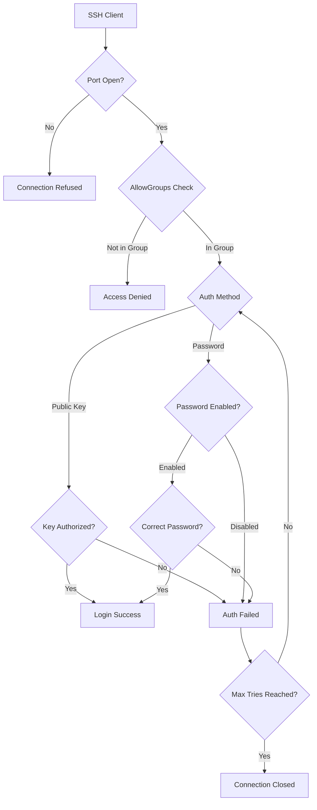

# How to Use Ansible to Configure SSH Server Settings

Author: [nawazdhandala](https://www.github.com/nawazdhandala)

Tags: Ansible, SSH, Security, Linux, Server Configuration

Description: Learn how to manage SSH server configuration with Ansible including authentication settings, access control, and key management.

---

SSH is the primary way you manage Linux servers, and it is also the primary way attackers try to break in. Configuring SSH properly across your fleet is essential for security, and doing it manually on every server is a recipe for inconsistency. Ansible is a natural fit here since it uses SSH itself to connect, so you are literally using SSH to configure SSH. This post covers practical patterns for managing sshd_config and related settings.

## Prerequisites

- Ansible 2.9+ on your control node
- Linux target hosts with SSH access
- Root or sudo privileges
- A fallback access method (console access) in case SSH configuration goes wrong

## Basic SSH Configuration

Here is a playbook that configures the most common SSH server settings:

```yaml
# configure_sshd.yml - Configure SSH server settings
---
- name: Configure SSH server
  hosts: all
  become: true
  vars:
    ssh_port: 22
    ssh_permit_root_login: "no"
    ssh_password_authentication: "no"
    ssh_pubkey_authentication: "yes"
    ssh_max_auth_tries: 3
    ssh_max_sessions: 5
    ssh_client_alive_interval: 300
    ssh_client_alive_count_max: 2
    ssh_login_grace_time: 30
  tasks:
    - name: Backup original sshd_config
      ansible.builtin.copy:
        src: /etc/ssh/sshd_config
        dest: /etc/ssh/sshd_config.backup
        remote_src: true
        mode: '0600'
        force: false

    - name: Deploy SSH server configuration
      ansible.builtin.template:
        src: templates/sshd_config.j2
        dest: /etc/ssh/sshd_config
        owner: root
        group: root
        mode: '0600'
        validate: 'sshd -t -f %s'
      notify: Restart sshd

    - name: Ensure SSH service is running
      ansible.builtin.service:
        name: sshd
        state: started
        enabled: true

  handlers:
    - name: Restart sshd
      ansible.builtin.service:
        name: sshd
        state: restarted
```

The sshd_config template:

```jinja2
# templates/sshd_config.j2 - SSH server configuration
# Managed by Ansible - do not edit manually

# Network
Port {{ ssh_port }}
AddressFamily any
ListenAddress 0.0.0.0
ListenAddress ::

# Host keys
HostKey /etc/ssh/ssh_host_rsa_key
HostKey /etc/ssh/ssh_host_ecdsa_key
HostKey /etc/ssh/ssh_host_ed25519_key

# Authentication
PermitRootLogin {{ ssh_permit_root_login }}
PubkeyAuthentication {{ ssh_pubkey_authentication }}
PasswordAuthentication {{ ssh_password_authentication }}
ChallengeResponseAuthentication no
MaxAuthTries {{ ssh_max_auth_tries }}
MaxSessions {{ ssh_max_sessions }}
LoginGraceTime {{ ssh_login_grace_time }}

# Disable unused auth methods
KerberosAuthentication no
GSSAPIAuthentication no
HostbasedAuthentication no
PermitEmptyPasswords no

# Session settings
ClientAliveInterval {{ ssh_client_alive_interval }}
ClientAliveCountMax {{ ssh_client_alive_count_max }}

# Logging
SyslogFacility AUTH
LogLevel INFO

# Subsystems
Subsystem sftp /usr/lib/openssh/sftp-server

# Misc
PrintMotd no
PrintLastLog yes
TCPKeepAlive yes
UseDNS no
```

## Using lineinfile for Targeted Changes

Sometimes you do not want to manage the entire sshd_config file. The `lineinfile` module lets you change specific settings without touching the rest:

```yaml
# targeted_ssh.yml - Make targeted SSH configuration changes
---
- name: Apply targeted SSH settings
  hosts: all
  become: true
  tasks:
    - name: Disable root login
      ansible.builtin.lineinfile:
        path: /etc/ssh/sshd_config
        regexp: '^#?PermitRootLogin'
        line: 'PermitRootLogin no'
        validate: 'sshd -t -f %s'
      notify: Restart sshd

    - name: Disable password authentication
      ansible.builtin.lineinfile:
        path: /etc/ssh/sshd_config
        regexp: '^#?PasswordAuthentication'
        line: 'PasswordAuthentication no'
        validate: 'sshd -t -f %s'
      notify: Restart sshd

    - name: Set max auth tries
      ansible.builtin.lineinfile:
        path: /etc/ssh/sshd_config
        regexp: '^#?MaxAuthTries'
        line: 'MaxAuthTries 3'
        validate: 'sshd -t -f %s'
      notify: Restart sshd

    - name: Disable X11 forwarding
      ansible.builtin.lineinfile:
        path: /etc/ssh/sshd_config
        regexp: '^#?X11Forwarding'
        line: 'X11Forwarding no'
        validate: 'sshd -t -f %s'
      notify: Restart sshd

  handlers:
    - name: Restart sshd
      ansible.builtin.service:
        name: sshd
        state: restarted
```

## Managing SSH Keys

Deploying authorized SSH keys is one of the most common Ansible tasks:

```yaml
# manage_ssh_keys.yml - Manage SSH authorized keys
---
- name: Manage SSH authorized keys
  hosts: all
  become: true
  vars:
    ssh_users:
      - username: deploy
        keys:
          - "ssh-ed25519 AAAAC3... deploy@laptop"
          - "ssh-ed25519 AAAAC3... deploy@workstation"
        state: present
      - username: admin
        keys:
          - "ssh-ed25519 AAAAC3... admin@office"
        state: present
      - username: former_employee
        keys:
          - "ssh-ed25519 AAAAC3... former@laptop"
        state: absent
  tasks:
    - name: Create user accounts
      ansible.builtin.user:
        name: "{{ item.username }}"
        shell: /bin/bash
        state: "{{ item.state }}"
      loop: "{{ ssh_users }}"
      when: item.state == 'present'

    - name: Deploy authorized keys for active users
      ansible.posix.authorized_key:
        user: "{{ item.0.username }}"
        key: "{{ item.1 }}"
        state: "{{ item.0.state }}"
        exclusive: false
      loop: "{{ ssh_users | subelements('keys') }}"
      when: item.0.state == 'present'

    - name: Remove former employee accounts
      ansible.builtin.user:
        name: "{{ item.username }}"
        state: absent
        remove: true
      loop: "{{ ssh_users }}"
      when: item.state == 'absent'
```

## Restricting SSH Access by Group

Limit SSH access to members of specific groups:

```yaml
# ssh_access_control.yml - Restrict SSH access by group
---
- name: Configure SSH access control
  hosts: all
  become: true
  vars:
    ssh_allowed_groups:
      - sshusers
      - admins
  tasks:
    - name: Create SSH access group
      ansible.builtin.group:
        name: "{{ item }}"
        state: present
      loop: "{{ ssh_allowed_groups }}"

    - name: Add admin users to SSH group
      ansible.builtin.user:
        name: "{{ item }}"
        groups: sshusers
        append: true
      loop:
        - deploy
        - admin

    - name: Restrict SSH to allowed groups
      ansible.builtin.lineinfile:
        path: /etc/ssh/sshd_config
        regexp: '^#?AllowGroups'
        line: "AllowGroups {{ ssh_allowed_groups | join(' ') }}"
        validate: 'sshd -t -f %s'
      notify: Restart sshd

  handlers:
    - name: Restart sshd
      ansible.builtin.service:
        name: sshd
        state: restarted
```

## Custom SSH Port

Changing the SSH port is not real security (it is security through obscurity), but it does reduce log noise from automated scanners:

```yaml
# custom_ssh_port.yml - Change SSH port safely
---
- name: Change SSH port
  hosts: all
  become: true
  vars:
    new_ssh_port: 2222
  tasks:
    - name: Allow new SSH port in firewall first
      community.general.ufw:
        rule: allow
        port: "{{ new_ssh_port }}"
        proto: tcp
        comment: "SSH on custom port"
      ignore_errors: true

    - name: Change SSH port in sshd_config
      ansible.builtin.lineinfile:
        path: /etc/ssh/sshd_config
        regexp: '^#?Port '
        line: "Port {{ new_ssh_port }}"
        validate: 'sshd -t -f %s'
      notify: Restart sshd

    - name: Update SELinux SSH port if applicable
      community.general.seport:
        ports: "{{ new_ssh_port }}"
        proto: tcp
        setype: ssh_port_t
        state: present
      when: ansible_selinux.status == "enabled"
      ignore_errors: true

  handlers:
    - name: Restart sshd
      ansible.builtin.service:
        name: sshd
        state: restarted
```

After changing the port, update your Ansible inventory to use the new port:

```ini
# inventory.ini - Updated inventory with custom SSH port
[webservers]
web01 ansible_host=10.0.1.10 ansible_port=2222
web02 ansible_host=10.0.1.11 ansible_port=2222
```

## SSH Banner and MOTD

Display a legal notice or system information when users log in:

```yaml
# ssh_banner.yml - Configure SSH login banner
---
- name: Configure SSH banner
  hosts: all
  become: true
  tasks:
    - name: Deploy SSH banner
      ansible.builtin.copy:
        dest: /etc/ssh/banner
        content: |
          ================================================================
          WARNING: Unauthorized access to this system is prohibited.
          All activity is monitored and logged.
          ================================================================
        owner: root
        group: root
        mode: '0644'

    - name: Enable banner in sshd_config
      ansible.builtin.lineinfile:
        path: /etc/ssh/sshd_config
        regexp: '^#?Banner'
        line: 'Banner /etc/ssh/banner'
        validate: 'sshd -t -f %s'
      notify: Restart sshd

    - name: Deploy MOTD with system info
      ansible.builtin.template:
        src: templates/motd.j2
        dest: /etc/motd
        mode: '0644'

  handlers:
    - name: Restart sshd
      ansible.builtin.service:
        name: sshd
        state: restarted
```

## SSH Access Flow



## Verifying SSH Configuration

```yaml
# verify_ssh.yml - Verify SSH configuration
---
- name: Verify SSH settings
  hosts: all
  become: true
  tasks:
    - name: Test SSH configuration syntax
      ansible.builtin.command: sshd -t
      register: sshd_test
      changed_when: false

    - name: Show sshd test result
      ansible.builtin.debug:
        msg: "SSH config: {{ 'VALID' if sshd_test.rc == 0 else 'INVALID' }}"

    - name: Get active SSH settings
      ansible.builtin.command: sshd -T
      register: sshd_settings
      changed_when: false

    - name: Check critical settings
      ansible.builtin.debug:
        msg: "{{ item }}"
      loop: "{{ sshd_settings.stdout_lines | select('match', '^(permitrootlogin|passwordauthentication|pubkeyauthentication|maxauthtries|port)') | list }}"
```

The most important thing when managing SSH with Ansible is the `validate` parameter on the template and lineinfile tasks. It runs `sshd -t -f` against the new config file before committing the change. A bad SSH config can lock you out of the server entirely, so this validation step is not optional.
