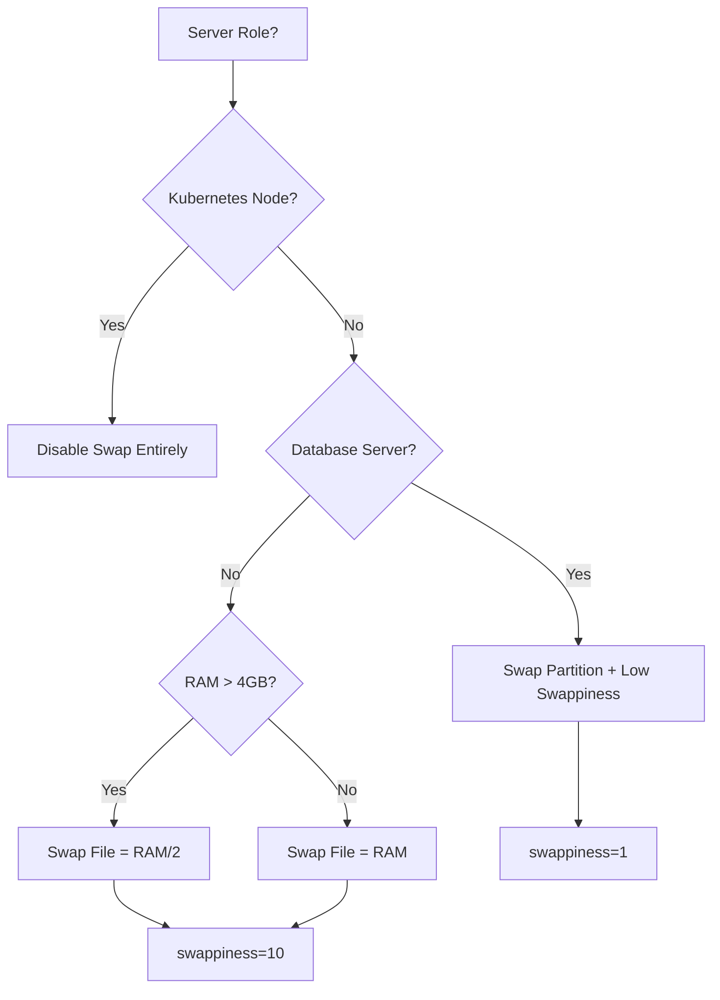

# How to Use Ansible to Configure Swap Space

Author: [nawazdhandala](https://www.github.com/nawazdhandala)

Tags: Ansible, Swap, Linux, Memory Management, DevOps

Description: Automate swap space configuration on Linux servers using Ansible playbooks to create swap files, swap partitions, and tune swappiness for optimal performance.

---

Swap space is that part of your disk that Linux uses as overflow when physical RAM runs out. Getting the swap configuration right matters more than most people think. Too little swap and your OOM killer starts murdering processes. Too much and your server might swap heavily instead of alerting you that it needs more RAM. With Ansible, you can set up swap consistently across all your servers and tune it for your specific workloads.

## Swap File vs Swap Partition

There are two ways to provide swap space:

- **Swap file**: Easier to create and resize, lives on an existing filesystem. Works on most modern kernels (4.0+).
- **Swap partition**: Slightly better performance, dedicated partition. Harder to resize but no filesystem overhead.

For most use cases today, swap files are the way to go. Swap partitions make sense for high-performance database servers where every bit of I/O latency matters.

## Creating a Swap File with Ansible

This is the most common scenario. Let us create a swap file on servers that need one.

This playbook creates a swap file and activates it:

```yaml
# configure-swap-file.yml - Create and enable swap file
---
- name: Configure Swap File
  hosts: all
  become: true
  vars:
    swap_file_path: /swapfile
    # Size in MB. Common rule: equal to RAM for servers with <= 4GB,
    # half of RAM for servers with > 4GB
    swap_file_size_mb: "{{ (ansible_memtotal_mb <= 4096) | ternary(ansible_memtotal_mb, (ansible_memtotal_mb / 2) | int) }}"
    swappiness: 10
    vfs_cache_pressure: 50

  tasks:
    - name: Check if swap file already exists
      ansible.builtin.stat:
        path: "{{ swap_file_path }}"
      register: swap_check

    - name: Check current swap usage
      ansible.builtin.command: swapon --show
      register: current_swap
      changed_when: false

    - name: Display current swap status
      ansible.builtin.debug:
        msg: "Current swap: {{ current_swap.stdout | default('No swap configured') }}"

    - name: Create swap file using dd
      ansible.builtin.command:
        cmd: "dd if=/dev/zero of={{ swap_file_path }} bs=1M count={{ swap_file_size_mb }}"
      when: not swap_check.stat.exists
      register: dd_result

    - name: Set correct permissions on swap file
      ansible.builtin.file:
        path: "{{ swap_file_path }}"
        mode: '0600'
        owner: root
        group: root

    - name: Format the file as swap space
      ansible.builtin.command:
        cmd: "mkswap {{ swap_file_path }}"
      when: not swap_check.stat.exists

    - name: Enable the swap file
      ansible.builtin.command:
        cmd: "swapon {{ swap_file_path }}"
      when: swap_file_path not in current_swap.stdout

    - name: Add swap file to fstab for persistence
      ansible.posix.mount:
        path: none
        src: "{{ swap_file_path }}"
        fstype: swap
        opts: sw
        state: present

    - name: Set swappiness value
      ansible.posix.sysctl:
        name: vm.swappiness
        value: "{{ swappiness }}"
        sysctl_set: true
        state: present
        reload: true

    - name: Set vfs_cache_pressure
      ansible.posix.sysctl:
        name: vm.vfs_cache_pressure
        value: "{{ vfs_cache_pressure }}"
        sysctl_set: true
        state: present
        reload: true
```

## Understanding Swappiness

The `vm.swappiness` parameter controls how aggressively the kernel swaps memory pages to disk. It ranges from 0 to 100:

- **0**: The kernel avoids swapping almost entirely (still swaps to prevent OOM)
- **10**: Good for database servers and performance-sensitive workloads
- **60**: Default on most distributions, balanced approach
- **100**: Aggressive swapping, rarely what you want

Here is how to set swappiness based on the server role:

```yaml
# group_vars/database_servers.yml
swappiness: 1
vfs_cache_pressure: 50

# group_vars/webservers.yml
swappiness: 10
vfs_cache_pressure: 50

# group_vars/build_servers.yml
swappiness: 60
vfs_cache_pressure: 100
```

## Creating a Swap Partition

For servers where swap performance is critical, here is how to create a dedicated swap partition.

This playbook creates a swap partition on a dedicated disk:

```yaml
# configure-swap-partition.yml - Create swap partition
---
- name: Configure Swap Partition
  hosts: database_servers
  become: true
  vars:
    swap_disk: /dev/sdb
    swap_partition: /dev/sdb1
    swap_label: SWAP

  tasks:
    - name: Check if swap partition already exists
      ansible.builtin.command: "blkid {{ swap_partition }}"
      register: blkid_check
      changed_when: false
      failed_when: false

    - name: Create GPT partition table on swap disk
      community.general.parted:
        device: "{{ swap_disk }}"
        label: gpt
        state: present
      when: blkid_check.rc != 0

    - name: Create swap partition spanning entire disk
      community.general.parted:
        device: "{{ swap_disk }}"
        number: 1
        name: swap
        part_start: 0%
        part_end: 100%
        state: present
      when: blkid_check.rc != 0

    - name: Format partition as swap
      ansible.builtin.command:
        cmd: "mkswap -L {{ swap_label }} {{ swap_partition }}"
      when: blkid_check.rc != 0 or 'swap' not in blkid_check.stdout

    - name: Enable swap partition
      ansible.builtin.command:
        cmd: "swapon {{ swap_partition }}"
      when: blkid_check.rc != 0
      failed_when: false

    - name: Add swap partition to fstab
      ansible.posix.mount:
        path: none
        src: "LABEL={{ swap_label }}"
        fstype: swap
        opts: sw,pri=10
        state: present
```

## Managing Multiple Swap Entries with Priorities

You can have both a swap partition and a swap file, with the partition getting higher priority.

This playbook configures multiple swap sources with different priorities:

```yaml
# configure-multi-swap.yml - Multiple swap with priorities
---
- name: Configure Multiple Swap Sources
  hosts: database_servers
  become: true
  tasks:
    - name: Ensure swap partition is active with high priority
      ansible.builtin.command:
        cmd: "swapon -p 100 /dev/sdb1"
      register: swapon_part
      changed_when: swapon_part.rc == 0
      failed_when: false

    - name: Ensure swap file is active with lower priority
      ansible.builtin.command:
        cmd: "swapon -p 10 /swapfile"
      register: swapon_file
      changed_when: swapon_file.rc == 0
      failed_when: false

    - name: Configure fstab with priorities
      ansible.builtin.blockinfile:
        path: /etc/fstab
        marker: "# {mark} ANSIBLE MANAGED SWAP"
        block: |
          /dev/sdb1  none  swap  sw,pri=100  0  0
          /swapfile  none  swap  sw,pri=10   0  0

    - name: Verify swap configuration
      ansible.builtin.command: swapon --show
      register: swap_status
      changed_when: false

    - name: Display swap status
      ansible.builtin.debug:
        msg: "{{ swap_status.stdout_lines }}"
```

## Resizing an Existing Swap File

When a server needs more swap, you can resize the swap file without a reboot.

This playbook resizes an existing swap file:

```yaml
# resize-swap.yml - Increase swap file size
---
- name: Resize Swap File
  hosts: all
  become: true
  vars:
    swap_file_path: /swapfile
    new_size_mb: 4096

  tasks:
    - name: Get current swap file size
      ansible.builtin.stat:
        path: "{{ swap_file_path }}"
      register: current_swap_file

    - name: Calculate current size in MB
      ansible.builtin.set_fact:
        current_size_mb: "{{ (current_swap_file.stat.size / 1048576) | int }}"
      when: current_swap_file.stat.exists

    - name: Skip if already at desired size
      ansible.builtin.debug:
        msg: "Swap file already at {{ current_size_mb }}MB, requested {{ new_size_mb }}MB"
      when:
        - current_swap_file.stat.exists
        - current_size_mb | int >= new_size_mb | int

    - name: Disable current swap file
      ansible.builtin.command:
        cmd: "swapoff {{ swap_file_path }}"
      when: current_size_mb | int < new_size_mb | int

    - name: Resize swap file
      ansible.builtin.command:
        cmd: "dd if=/dev/zero of={{ swap_file_path }} bs=1M count={{ new_size_mb }}"
      when: current_size_mb | int < new_size_mb | int

    - name: Set permissions on resized swap file
      ansible.builtin.file:
        path: "{{ swap_file_path }}"
        mode: '0600'
      when: current_size_mb | int < new_size_mb | int

    - name: Reformat as swap
      ansible.builtin.command:
        cmd: "mkswap {{ swap_file_path }}"
      when: current_size_mb | int < new_size_mb | int

    - name: Re-enable swap
      ansible.builtin.command:
        cmd: "swapon {{ swap_file_path }}"
      when: current_size_mb | int < new_size_mb | int
```

## Removing Swap (For Kubernetes Nodes)

Kubernetes requires swap to be disabled. Here is how to handle that.

This playbook disables and removes swap for Kubernetes nodes:

```yaml
# disable-swap.yml - Remove swap for K8s nodes
---
- name: Disable Swap for Kubernetes
  hosts: k8s_nodes
  become: true
  tasks:
    - name: Disable all active swap
      ansible.builtin.command: swapoff -a
      changed_when: false

    - name: Remove swap entries from fstab
      ansible.builtin.lineinfile:
        path: /etc/fstab
        regexp: '\sswap\s'
        state: absent
        backup: true

    - name: Remove swap file if it exists
      ansible.builtin.file:
        path: /swapfile
        state: absent

    - name: Verify swap is disabled
      ansible.builtin.command: swapon --show
      register: swap_verify
      changed_when: false

    - name: Confirm no swap is active
      ansible.builtin.assert:
        that:
          - swap_verify.stdout == ""
        fail_msg: "Swap is still active on {{ inventory_hostname }}"
        success_msg: "Swap successfully disabled"
```

## Swap Configuration Decision Flow



Getting swap right is about understanding your workload. A database server that swaps is a database server that is slow. A build server that runs out of memory kills your CI pipeline. Use Ansible to encode these decisions and apply them consistently, and you will avoid those 3 AM pages about OOM kills.
