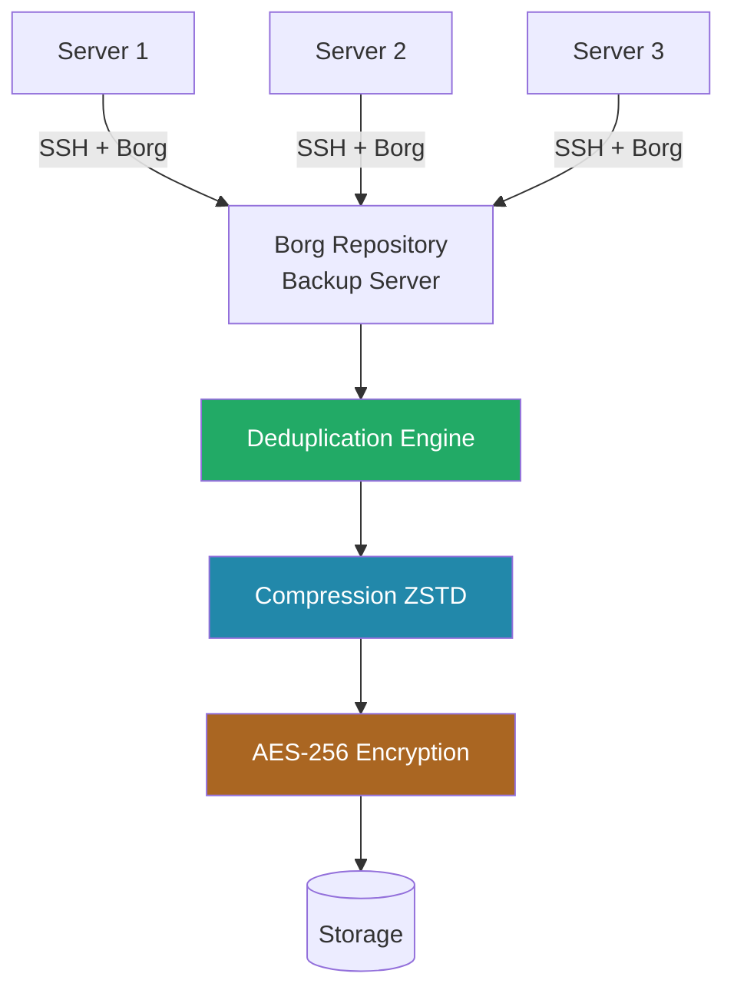

# How to Use Ansible to Configure System Backup (borgbackup)

Author: [nawazdhandala](https://www.github.com/nawazdhandala)

Tags: Ansible, Backup, BorgBackup, Linux

Description: Deploy and configure BorgBackup for deduplicated, compressed, and encrypted system backups using Ansible automation.

---

BorgBackup (often just called Borg) is a deduplicating backup program that supports compression and encryption. It is one of the best backup tools available for Linux systems because of how efficiently it handles storage. Borg deduplicates at the chunk level, meaning if the same block of data appears in multiple files or multiple backup runs, it is stored only once. This makes it significantly more space-efficient than traditional backup tools.

Deploying Borg across a fleet of servers with Ansible ensures every machine has consistent backup policies, schedules, and retention settings. This guide covers everything from installation to automated backup jobs with monitoring.

## Why BorgBackup Over Other Tools

The key advantages that make Borg worth the setup effort:

- Chunk-level deduplication across all archives in a repository
- AES-256 encryption with authenticated encryption modes
- LZ4, ZSTD, and LZMA compression options
- Fast backup and restore operations
- Supports remote repositories over SSH
- Append-only mode for protection against ransomware

## Installing BorgBackup

```yaml
# install-borg.yml - Install BorgBackup on all servers
---
- name: Install BorgBackup
  hosts: backup_clients
  become: true

  tasks:
    # Install Borg from system packages
    - name: Install BorgBackup (RedHat)
      ansible.builtin.yum:
        name:
          - borgbackup
        state: present
      when: ansible_os_family == "RedHat"

    - name: Install BorgBackup (Debian)
      ansible.builtin.apt:
        name:
          - borgbackup
        state: present
        update_cache: true
      when: ansible_os_family == "Debian"

    # If system packages are too old, install from pip
    - name: Check Borg version
      ansible.builtin.command:
        cmd: borg --version
      register: borg_version
      changed_when: false

    - name: Display Borg version
      ansible.builtin.debug:
        msg: "BorgBackup version: {{ borg_version.stdout }}"
```

## Initializing Borg Repositories

Before backing up, you need to create a Borg repository. Here is how to handle both local and remote repositories:

```yaml
# init-borg-repo.yml - Initialize BorgBackup repositories
---
- name: Initialize BorgBackup repositories
  hosts: backup_clients
  become: true

  vars:
    # Use repokey-blake2 for authenticated encryption
    borg_encryption: repokey-blake2
    # Passphrase stored in Ansible Vault
    borg_passphrase: "{{ vault_borg_passphrase }}"
    # Local repo path
    borg_local_repo: /backup/borg
    # Remote repo (optional)
    borg_remote_repo: "backup@10.0.1.50:/backup/repos/{{ inventory_hostname }}"

  environment:
    BORG_PASSPHRASE: "{{ borg_passphrase }}"

  tasks:
    # Create local backup directory
    - name: Create local Borg repository directory
      ansible.builtin.file:
        path: "{{ borg_local_repo }}"
        state: directory
        owner: root
        group: root
        mode: '0700'

    # Check if repo is already initialized
    - name: Check if local repo exists
      ansible.builtin.command:
        cmd: "borg info {{ borg_local_repo }}"
      register: repo_check
      changed_when: false
      failed_when: false

    # Initialize the local repository
    - name: Initialize local Borg repository
      ansible.builtin.command:
        cmd: "borg init --encryption={{ borg_encryption }} {{ borg_local_repo }}"
      when: repo_check.rc != 0
      environment:
        BORG_PASSPHRASE: "{{ borg_passphrase }}"

    # Initialize remote repository if configured
    - name: Check if remote repo exists
      ansible.builtin.command:
        cmd: "borg info {{ borg_remote_repo }}"
      register: remote_check
      changed_when: false
      failed_when: false
      when: borg_remote_repo is defined

    - name: Initialize remote Borg repository
      ansible.builtin.command:
        cmd: "borg init --encryption={{ borg_encryption }} {{ borg_remote_repo }}"
      when:
        - borg_remote_repo is defined
        - remote_check.rc != 0
      environment:
        BORG_PASSPHRASE: "{{ borg_passphrase }}"
```

## Creating the Backup Script

Rather than putting complex Borg commands directly in cron, it is better to deploy a backup script that handles the full workflow:

```yaml
# deploy-borg-script.yml - Deploy the BorgBackup script
---
- name: Deploy BorgBackup automation script
  hosts: backup_clients
  become: true

  vars:
    borg_repo: /backup/borg
    borg_passphrase: "{{ vault_borg_passphrase }}"
    borg_compression: zstd,3
    borg_backup_paths:
      - /etc
      - /home
      - /var/www
      - /opt
      - /var/log
    borg_exclude_patterns:
      - "*/cache/*"
      - "*/tmp/*"
      - "*/.cache/*"
      - "*.pyc"
      - "/var/log/journal/*"
      - "/home/*/.local/share/Trash/*"
    # Retention policy
    borg_keep_hourly: 24
    borg_keep_daily: 7
    borg_keep_weekly: 4
    borg_keep_monthly: 6
    borg_keep_yearly: 2

  tasks:
    # Deploy the backup script
    - name: Deploy Borg backup script
      ansible.builtin.template:
        src: borg-backup.sh.j2
        dest: /usr/local/bin/borg-backup.sh
        owner: root
        group: root
        mode: '0700'

    # Deploy the passphrase file (secured with strict permissions)
    - name: Deploy Borg passphrase file
      ansible.builtin.copy:
        content: "{{ borg_passphrase }}"
        dest: /root/.borg-passphrase
        owner: root
        group: root
        mode: '0400'

    # Deploy the exclude patterns file
    - name: Deploy exclude patterns
      ansible.builtin.template:
        src: borg-exclude.j2
        dest: /etc/borg-exclude.txt
        owner: root
        group: root
        mode: '0644'
```

The backup script template:

```jinja2
#!/bin/bash
# borg-backup.sh - BorgBackup automation script
# Managed by Ansible - Do not edit manually

set -euo pipefail

# Configuration
export BORG_REPO="{{ borg_repo }}"
export BORG_PASSPHRASE=$(cat /root/.borg-passphrase)
BACKUP_NAME="{{ inventory_hostname }}-{now:%Y-%m-%d_%H:%M}"
LOG_FILE="/var/log/borg-backup.log"
LOCK_FILE="/var/run/borg-backup.lock"

# Logging function
log() {
    echo "$(date '+%Y-%m-%d %H:%M:%S') $1" >> "$LOG_FILE"
    echo "$1"
}

# Check for existing lock
if [ -f "$LOCK_FILE" ]; then
    log "ERROR: Lock file exists. Another backup may be running."
    exit 1
fi

trap "rm -f $LOCK_FILE" EXIT
echo $$ > "$LOCK_FILE"

log "Starting backup: $BACKUP_NAME"

# Create the backup archive
borg create \
    --verbose \
    --stats \
    --show-rc \
    --compression {{ borg_compression }} \
    --exclude-from /etc/borg-exclude.txt \
    --exclude-caches \
    "::$BACKUP_NAME" \

    {{ path }} \


    2>> "$LOG_FILE"

CREATE_EXIT=$?

if [ $CREATE_EXIT -eq 0 ]; then
    log "Backup created successfully"
elif [ $CREATE_EXIT -eq 1 ]; then
    log "WARNING: Backup completed with warnings"
else
    log "ERROR: Backup failed with exit code $CREATE_EXIT"
    exit $CREATE_EXIT
fi

# Prune old backups according to retention policy
log "Pruning old backups..."
borg prune \
    --verbose \
    --list \
    --show-rc \
    --keep-hourly {{ borg_keep_hourly }} \
    --keep-daily {{ borg_keep_daily }} \
    --keep-weekly {{ borg_keep_weekly }} \
    --keep-monthly {{ borg_keep_monthly }} \
    --keep-yearly {{ borg_keep_yearly }} \
    2>> "$LOG_FILE"

PRUNE_EXIT=$?

# Compact the repository to free space
log "Compacting repository..."
borg compact 2>> "$LOG_FILE"

log "Backup complete. Create: $CREATE_EXIT, Prune: $PRUNE_EXIT"
```

## Scheduling Backups

```yaml
# schedule-borg.yml - Set up cron jobs for BorgBackup
---
- name: Schedule BorgBackup jobs
  hosts: backup_clients
  become: true

  tasks:
    # Run backup every 6 hours
    - name: Schedule regular Borg backup
      ansible.builtin.cron:
        name: "BorgBackup regular"
        minute: "15"
        hour: "*/6"
        job: "/usr/local/bin/borg-backup.sh >> /var/log/borg-cron.log 2>&1"
        user: root

    # Log rotation for backup logs
    - name: Configure log rotation for Borg logs
      ansible.builtin.copy:
        dest: /etc/logrotate.d/borgbackup
        mode: '0644'
        content: |
          /var/log/borg-backup.log /var/log/borg-cron.log {
              weekly
              rotate 8
              compress
              delaycompress
              missingok
              notifempty
          }
```

## Monitoring Backup Health

Regular verification of backup integrity and freshness is critical:

```yaml
# monitor-borg.yml - Check BorgBackup health and integrity
---
- name: Monitor BorgBackup health
  hosts: backup_clients
  become: true

  vars:
    borg_repo: /backup/borg
    borg_passphrase: "{{ vault_borg_passphrase }}"
    max_backup_age_hours: 8

  environment:
    BORG_PASSPHRASE: "{{ borg_passphrase }}"
    BORG_REPO: "{{ borg_repo }}"

  tasks:
    # Get repository information
    - name: Get Borg repo info
      ansible.builtin.command:
        cmd: borg info --json
      register: repo_info_raw
      changed_when: false

    - name: Parse repo info
      ansible.builtin.set_fact:
        repo_info: "{{ repo_info_raw.stdout | from_json }}"

    - name: Display repository stats
      ansible.builtin.debug:
        msg:
          - "Repository: {{ borg_repo }}"
          - "Total size: {{ (repo_info.cache.stats.total_size / 1073741824) | round(2) }} GB"
          - "Deduplicated size: {{ (repo_info.cache.stats.unique_size / 1073741824) | round(2) }} GB"
          - "Total archives: {{ repo_info.cache.stats.total_chunks }}"

    # List recent archives
    - name: List recent archives
      ansible.builtin.command:
        cmd: borg list --last 5 --format "{archive}{TAB}{time}{TAB}{NEWLINE}"
      register: recent_archives
      changed_when: false

    - name: Display recent archives
      ansible.builtin.debug:
        var: recent_archives.stdout_lines

    # Verify the latest archive integrity
    - name: Verify latest backup integrity
      ansible.builtin.command:
        cmd: borg check --last 1 --verify-data
      register: verify_result
      changed_when: false
      failed_when: false

    - name: Report verification result
      ansible.builtin.debug:
        msg: "{{ 'Backup verification PASSED' if verify_result.rc == 0 else 'Backup verification FAILED!' }}"

    # Check backup freshness
    - name: Get latest archive info
      ansible.builtin.command:
        cmd: borg list --last 1 --format "{time}"
      register: latest_time
      changed_when: false

    - name: Alert on stale backup
      ansible.builtin.debug:
        msg: "WARNING: Latest backup on {{ inventory_hostname }} may be stale. Last: {{ latest_time.stdout }}"
      when: latest_time.stdout | length == 0
```

## Restoring from BorgBackup

Borg makes restoration flexible. You can restore entire archives, specific directories, or individual files:

```yaml
# restore-borg.yml - Restore data from BorgBackup archives
---
- name: Restore from BorgBackup
  hosts: "{{ target_host }}"
  become: true

  vars:
    borg_repo: /backup/borg
    borg_passphrase: "{{ vault_borg_passphrase }}"
    restore_archive: ""  # Set via --extra-vars
    restore_path: ""     # Set via --extra-vars
    restore_dest: /tmp/borg-restore

  environment:
    BORG_PASSPHRASE: "{{ borg_passphrase }}"
    BORG_REPO: "{{ borg_repo }}"

  tasks:
    # List available archives to choose from
    - name: List available archives
      ansible.builtin.command:
        cmd: borg list --format "{archive}{TAB}{time}{TAB}{NEWLINE}"
      register: archive_list
      changed_when: false
      when: restore_archive == ""

    - name: Display available archives
      ansible.builtin.debug:
        var: archive_list.stdout_lines
      when: restore_archive == ""

    # Create restore destination
    - name: Create restore directory
      ansible.builtin.file:
        path: "{{ restore_dest }}"
        state: directory
        mode: '0700'
      when: restore_archive != ""

    # Restore specific path from archive
    - name: Restore from archive
      ansible.builtin.command:
        cmd: "borg extract ::{{ restore_archive }} {{ restore_path }}"
        chdir: "{{ restore_dest }}"
      when:
        - restore_archive != ""
        - restore_path != ""

    # Restore entire archive
    - name: Restore full archive
      ansible.builtin.command:
        cmd: "borg extract ::{{ restore_archive }}"
        chdir: "{{ restore_dest }}"
      when:
        - restore_archive != ""
        - restore_path == ""

    - name: Display restore location
      ansible.builtin.debug:
        msg: "Files restored to {{ restore_dest }}"
      when: restore_archive != ""
```

## Backup Architecture



## Production Tips

Lessons from running BorgBackup in production environments:

1. Always use encryption. Even if your backup storage is on a trusted network, encryption protects against unauthorized access if the storage device is stolen or decommissioned improperly. The `repokey-blake2` mode is the recommended choice for new repositories.

2. Store the Borg passphrase in multiple secure locations. If you lose the passphrase, you lose access to all your encrypted backups. Keep it in your Ansible Vault, your team password manager, and printed in a sealed envelope in a physical safe.

3. Use the `--compression zstd,3` flag for a good balance between compression ratio and speed. ZSTD at level 3 provides meaningful compression without significantly slowing down the backup process.

4. Run `borg check --verify-data` periodically (weekly is reasonable), not just after every backup. This reads back data from the repository and verifies checksums, catching corruption that might otherwise go unnoticed until restore time.

5. Consider append-only mode for remote repositories. If a server is compromised, an attacker with access to the Borg passphrase could delete backups. Append-only mode on the repository server prevents deletion, even with valid credentials.

6. The deduplication ratio improves over time. Your first backup is always a full backup. After that, Borg only stores new or changed data chunks. For typical servers, I see 3:1 to 10:1 deduplication ratios after a month of daily backups.

BorgBackup is one of those tools that makes you wonder why backup software used to be so complicated. With Ansible handling the deployment and scheduling, you get a robust, encrypted, deduplicated backup system across your entire fleet.
